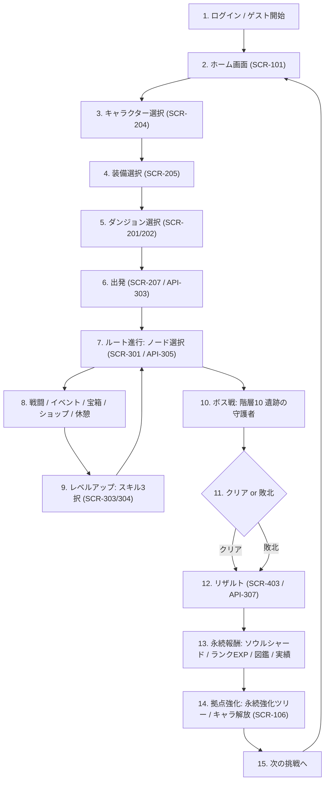
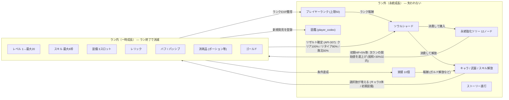

# 01. ゲームコンセプト書 — Rogue Chronicle

- **文書ID**: DOC-01
- **目的**: 本作の「面白さの中核」を定義し、ゲームサイクルの構造・問題点・改善策を明文化して以降の全設計の判断基準とする
- **関連文書**: CORE_SPEC、00_Project_Overview.md、05_Game_Design.md

---

## 1. コンセプト

### 1.1 コンセプト文
> **「15分の挑戦が、永遠の年代記になる。」**
> 毎回姿を変えるダンジョンに挑み、その一回限りのビルドで駆け抜ける。
> 敗北しても挑戦の記録（ソウルシャード・図鑑・実績）は必ず年代記に刻まれ、次の挑戦者を強くする。

### 1.2 コアファンタジー
プレイヤーが体験する感情の中核は次の3つ。

1. **「今回のビルドは俺が作った」** — レベルアップ3択・レリック・装備の選択が毎回異なるキャラクターを作る。攻略の主役は永続強化ではなく**ラン内の選択**（CORE_SPEC §5.9 バランス方針）
2. **「読み切って勝つ」** — 全敵に行動予告（intent）が表示されるターン制戦闘（DEC-002）。運ではなく計算で死線を越える詰将棋的快感
3. **「敗北すら記録になる」** — 挑戦の結果は必ずソウルシャード・ランクEXP・図鑑登録として残る。「無駄なラン」が存在しない

### 1.3 他ローグライトとの差別化ポイント

| 比較軸 | Slay the Spire | Hades | 本作 Rogue Chronicle |
|---|---|---|---|
| 戦闘 | デッキ構築カード | リアルタイムアクション | **ターン制コマンドRPG**（DEC-002）。カードでもアクションでもなく「RPGの文法」で遊べる |
| 成長の主役 | ラン内のみ（永続はほぼ解放） | 永続強化が強い | **ラン内成長が主役、永続は+30%以内**に制限（§5.9）。SpireとHadesの中間で「腕前と積み上げの両立」 |
| プレイ環境 | 買い切りアプリ | 買い切りアプリ | **ブラウザで即プレイ**。インストール不要、ゲスト開始で10秒後に1ラン目（DEC-006） |
| 1プレイ | 45〜90分 | 20〜40分 | **15〜30分 + 途中保存・再開**（run_state永続化 DEC-011）。スマホのスキマ時間に最適化 |
| 情報開示 | 敵intent表示 | なし | intent表示に加え**計算式を隠さない**（ヘルプで公開）。理詰め派（ペルソナB）に応える |
| マネタイズ | 買い切り | 買い切り | **無料・ガチャなし・課金なし**（DEC-016）。バランスを課金で歪めない設計保証 |
| 記録要素 | 実績・統計 | 物語進行 | **図鑑（スキル/レリック/敵/装備/キャラ, DEC-018）＝年代記**が中核。収集自体が永続報酬 |

**一言でいうと**: 「Slay the Spireのマップとビルド性を、コマンドRPGの文法とスマホブラウザの手軽さで再構成し、敗北を必ず報酬に変えるゲーム」。

---

## 2. ゲームサイクル（15ステップ）

### 2.1 サイクル図

※ ステップ8で敗北（HP0）した場合もS11経由でS12リザルトへ合流する。リタイア（SCR-314 / API-306）も同様にS12へ。

### 2.2 このサイクルの【問題点の分析】

| # | 問題点 | 詳細 |
|---|---|---|
| P1 | **出発までのステップが長い**（S02→S06で4画面） | スキマ時間プレイヤー（ペルソナA）は「今すぐ潜りたい」。毎回キャラ・装備・ダンジョンを選ぶのは、選択肢が少ないMVP（キャラ3・ダンジョン1）では特に冗長 |
| P2 | **S07↔S08↔S09のループが単調化しやすい** | 10階層×2〜4ノードで1ランあたり戦闘中心に10〜13ノード。BATTLEばかり引くと「同じ作業」感が出る |
| P3 | **敗北時の徒労感** | 序盤プレイヤーはボス（HP×4.0, ATK×1.5補正）到達前に落ちる。積み上げたビルドが全消失する喪失感が離脱要因になる |
| P4 | **S13〜S14が「作業」になりうる** | リザルト→拠点強化が毎回同じ演出だと、報酬受け取りがスキップ対象のノイズになる |
| P5 | **サイクル外に目標がない** | 15ステップは1ラン単位の閉ループ。10ラン・50ラン先の長期目標が構造上見えない |
| P6 | **中断復帰の位置が不明瞭** | 15〜30分のランでも、スマホでは数分で中断される。復帰時に「どこから再開か」が曖昧だと再訪率が落ちる |

### 2.3 【改善案】

| 対応 | 改善案 | 実装 |
|---|---|---|
| P1 | **「前回の構成で再挑戦」ボタン**をホーム（SCR-101）とリザルト（SCR-403）に置き、S03〜S05をスキップして出撃確認（SCR-207）へ直行。1タップで次のランが始まる | API-303のリクエストに前回構成の再利用フラグ（`repeatLast: true`）を用意（仮決定 / ISSUE候補） |
| P2 | 生成制御（CORE_SPEC §5.6: 同一タイプ3連続禁止 / SHOP1〜2 / REST保証）に加え、**分岐の「見える価値差」**を作る: 危険ルート（ELITE経由）=報酬大、安全ルート=消耗小をマップ上でアイコン明示。SECRET(10%)が「今日は当たりマップ」感を生む | 07_Dungeon_Design.md |
| P3 | 敗北してもソウルシャード50%＋ランクEXP＋図鑑更新は**必ず**持ち帰る（§5.6）。敗北画面（SCR-402）では喪失ではなく「今回の獲得」を先に表示する | API-307 / SCR-402 |
| P4 | リザルトに**毎回変化する要素**を出す: 新図鑑登録のNEWバッジ、実績進捗バー（「累計ラン10回: 7/10」）、ランクEXPゲージのアニメ。永続強化は「買えるノードが光る」導線でS14へ自然に誘導 | SCR-403/405/407 |
| P5 | **実績10個（05_Game_Design.md §5.7）とキャラ解放を長期目標の柱**にする: ガルド解放=累計ラン10回、リリア解放=シャード300。ホームに「次の解放まであとN」を常設表示 | SCR-101 / API-106 |
| P6 | run_stateサーバー保存（DEC-011）により、**アプリを開いた瞬間に「冒険を再開する」モーダル**を最優先表示（API-304）。再開位置はノード単位で正確 | SCR-101 / 15_Save_Data_Design.md |

### 2.4 【中毒性を高める仕組み】

1. **「あと1回」設計（短いラン＋即再挑戦）**
   - 1ラン15〜30分＋P1改善の1タップ再挑戦で、敗北直後の「今度こそ」を逃さない
   - リザルト最下部のプライマリボタンは「もう一度挑戦」（「ホームへ」はセカンダリ）
2. **可変報酬（バリアブル・リワード）**
   - スキル3択（common60/rare30/epic10）: epicが出た瞬間の当たり演出
   - 宝箱・SECRET(10%)・レリック抽選・装備レア度（common/rare/epic）と、乱数はサーバーPRNG（DEC-019）で公正に
3. **ビルドの「当たり回」体験**
   - スキル×レリックの明示的シナジー（例: 火傷付与スキル×「火傷ダメージ2倍」レリック）を意図的にマスタへ仕込む（18_Skill_Design.md / 17_Equipment_Relic_Design.md）
   - 当たり回の記録が図鑑・実績に残り、「再現したい」動機を作る
4. **未解放要素の見せ方**
   - キャラ一覧（SCR-104）でリリア・ガルドを**シルエット＋解放条件つき**で最初から表示
   - 永続強化ツリー（SCR-106）は12ノード全体を見せ、届かないノードは「あとNシャード」を表示
   - 図鑑は「??? （未発見）」行を見せて総数を明示（例: レリック 4/10）
5. **リザルトでの成長可視化**
   - 今回ランのグラフ: 到達階層 / 撃破数 / 獲得シャード / 過去自己ベスト比較
   - ランクEXPバーが**その場で伸びる**演出（SCR-406のランクアップモーダルは全画面で祝う）
6. **毎日変わる「今日の初回ボーナス」は導入しない**（仮決定）
   - デイリー義務はペルソナAの疲弊要因（§1.3）でありDEC-016の思想に反するため、ログインボーナス型の中毒装置は採用しない。中毒性は上記1〜5の「プレイ内在的な報酬」で作る

### 2.5 【初心者が離脱しにくい仕組み】

1. **初回チュートリアルラン**: 初回起動時は短縮ダンジョン（3階層: 戦闘→休憩→ボス風強敵）を固定シードで実施。行動予告・SP・3択の3点だけ教える。スキップ可（設定でフラグ管理、LocalStorage＋サーバー両持ち）
2. **敗北しても必ず永続報酬**: 敗北=シャード50%（§5.6）。「初敗北」を実績化し（05_Game_Design.md ACH-002）、初めての敗北を祝う文言で喪失感を反転させる
3. **短い1ラン＋途中保存**: 15〜30分＋ノード単位の再開（API-304）。「時間がないから始めない」を潰す
4. **なだらかな難易度曲線**: 敵ステは floor係数 1+0.12×(floor−1)（§5.4）で線形成長。階層1は必ず単体通常戦闘（ノード1個=開始戦闘）、階層5・9にREST保証で立て直し地点を約束
5. **復帰導線**: 起動時の「冒険を再開」モーダル（P6改善）と、ホームの「次の解放まであとN」表示。中断がペナルティにならないことをUI文言で明示（「いつでも戻れます」）
6. **理不尽の排除**: 完全ランダムAI禁止（§5.7）、行動予告必須、命中率下限50%（§5.4 clamp）、ダメージ乱数±10%のみ。初心者の敗北が「学べる敗北」になる

---

## 3. 一時成長と永続成長

### 3.1 関係図

**設計原則（CORE_SPEC §5.9）**: 永続強化の総和はステータス+30%以内。永続成長は「次のランの**開始点と選択肢**を広げる」ものであり、ラン内成長（レベル・ビルド）の主役性を奪わない。

### 3.2 敗北時に失うもの / 残るもの

| 分類 | 項目 | 敗北時 | 補足 |
|---|---|---|---|
| 失うもの | レベル・EXP（ラン内） | ✕ 消滅 | 次ランはLv1から（expToNext(L)=floor(20×L^1.5)） |
| 失うもの | 取得スキル（8枠） | ✕ 消滅 | ただし**図鑑への「発見」登録は残る** |
| 失うもの | ラン内装備（3スロット） | ✕ 消滅 | 永続解放装備は「初期装備候補」として残る（§5.8） |
| 失うもの | レリック | ✕ 消滅 | 図鑑登録は残る |
| 失うもの | バフ・パッシブ・状態 | ✕ 消滅 | |
| 失うもの | 消耗品（ポーション等3種） | ✕ 消滅 | |
| 失うもの | ゴールド | ✕ 消滅 | ラン内通貨（§5.9）。将来: 永続強化「換金」で一部持ち帰り |
| 失うもの | マップ進行状況 | ✕ 消滅 | seedごと破棄。次ランは新規生成 |
| 残るもの | ソウルシャード | ○ **獲得分の50%** | クリア100% / リタイア80% / 敗北50%（§5.6） |
| 残るもの | プレイヤーランクEXP | ○ 全額 | 敗北でも減額しない（仮決定: 到達階層に応じた獲得量で差を付ける） |
| 残るもの | 図鑑登録（スキル/レリック/敵/装備/キャラ） | ○ | 初遭遇・初取得は敗北ランでも記録（DEC-018） |
| 残るもの | 実績進捗 | ○ | 「累計ラン10回」等は敗北ランもカウント |
| 残るもの | 永続強化・キャラ/武器/スキル解放 | ○ | ラン結果に関わらず不変 |
| 残るもの | ストーリー進行 | ○ | STORYノード閲覧分（player_story_progress） |
| 残るもの | 統計（総撃破数・最深到達など） | ○ | player_progress に加算 |

**リタイア（API-306）との差**: リタイアはシャード80%持ち帰り。「勝てない盤面から損切りする」判断をプレイヤースキルとして肯定する（敗北50%より有利、クリア100%より不利）。

---

## 未決事項
- ISSUE-006: 「前回の構成で再挑戦」フラグ（API-303拡張）の正式仕様化（13_API_Design.mdへ反映要）
- ISSUE-007: チュートリアルラン（3階層・固定シード）をdungeonsマスタの別レコードにするか、forgotten_ruinsの特殊モードにするか
- ISSUE-008: 敗北時ランクEXPを全額とするか到達階層で逓減させるか（本書は全額を仮決定）
- ISSUE-009: リザルトの自己ベスト比較に使う統計項目の確定（到達階層/撃破数/所要ターン等、player_progressの列設計に影響）
- ISSUE-010: スキル×レリックの明示的シナジーを何組仕込むか（最低3組を提案。18/17設計書で確定）

## 実装時の注意点
- 「敗北しても必ず永続報酬」はリザルト確定API（API-307）の**サーバー側で保証**すること。クライアント離脱時も finalize 未実行のランは次回 API-304 で回収する導線を実装（ERR_REWARD_ALREADY_CLAIMED で二重付与を防止）
- 用語は CORE_SPEC §4 に厳守: 設計用語「ラン」/UI表記「挑戦」、「ノード」「階層」「ソウルシャード」「レリック」「SP」の揺れ禁止
- Mermaid図のノードIDは英数字のみ（S01等）。ラベル内のみ日本語可
- 中毒性施策のうちデイリーボーナス型は不採用（仮決定）。将来モード追加時もDEC-016（課金・ガチャなし）の思想に反する装置を入れない
- チュートリアルはスキップ可能にし、フラグはLocalStorage（即時性）とuser_settings（機種変更耐性）の両方に保存

## 関連設計書
- 00_Project_Overview.md（ペルソナ・MVP範囲）
- 05_Game_Design.md（一時/永続成長の詳細・経済試算・実績表）
- 07_Dungeon_Design.md（マップ生成・分岐の価値差）
- 15_Save_Data_Design.md（途中保存・再開）
- 16_UIUX_Design.md（リザルト演出・NEWバッジ・再挑戦導線）
