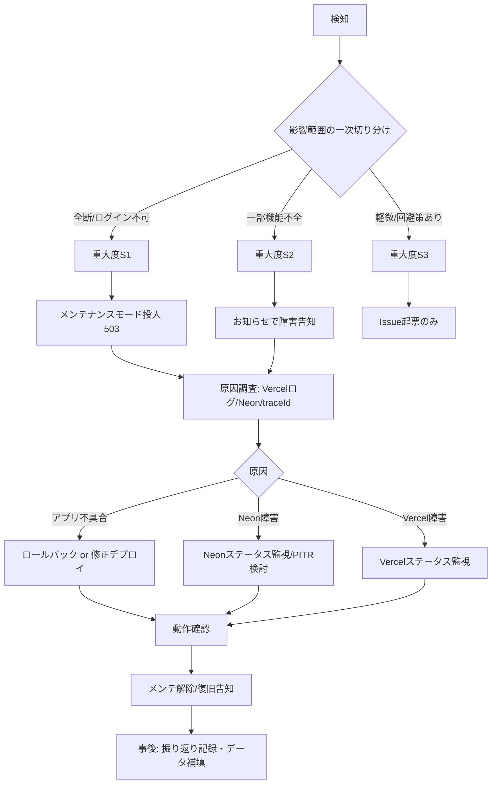

# 02. システム要件定義書 — Rogue Chronicle

## 文書情報

- 文書名: システム要件定義書
- 対象システム: Rogue Chronicle（ろーぐくろにくる / DEC-001（仮決定））
- 目的: 本システムが実現すべき業務要件・利用者定義・権限設計・システム化範囲・前提条件を定義し、機能要件（03）・非機能要件（04）以降の設計書の上位入力とする
- 関連文書: CORE_SPEC（設計共通仕様）、docs/00_Project_Overview.md、docs/03_Functional_Requirements.md、docs/04_Non_Functional_Requirements.md、docs/12_Database_Design.md

---

## 1. システムの目的

### 1.1 ゲームとしての目的

Rogue Chronicle は、1ラン15〜30分で完結するローグライトRPGである。プレイヤーは以下のループを繰り返す。

1. 拠点（ホーム）でキャラクター・永続強化・初期装備を整える
2. ダンジョン「忘却の遺跡」（`forgotten_ruins`、全10階層）に挑戦（＝ラン）する
3. ノード選択型マップ（DEC-003）を進み、ターン制コマンドバトル（DEC-002）で敵を倒す
4. ラン中に一時成長（レベル・スキル3択・装備・レリック・ゴールド）を積み上げる
5. クリア/敗北/リタイアのいずれかでランを終え、永続成長（ソウルシャード・プレイヤーランクEXP・図鑑・実績）を持ち帰る
6. ソウルシャードでキャラクター解放・永続強化（upgrade_nodes、MVP 12ノード）を行い、次のランに再挑戦する

### 1.2 システムとしての目的

| 観点 | 目的 |
|---|---|
| プレイ体験 | PC/スマホのブラウザで、インストール不要・短時間で遊べるランループを提供する |
| 公平性 | 戦闘計算・報酬抽選・乱数を全てサーバー側で実行し（DEC-007）、チートによる不正な永続成長を防止する |
| 継続性 | ラン途中保存・再開（dungeon_runs.run_state JSONB、DEC-011）により、中断・通信断・端末切替に耐える |
| 低運用コスト | 個人開発を前提に、Vercel + Neon のマネージド構成で運用作業を最小化する |
| 拡張性 | MVP後の段階拡張（キャラ・ダンジョン・難易度・管理画面・PWA）を見据えたID体系・DB構造・API名前空間を最初から確保する |

### 1.3 収益方針

課金・ガチャは恒久的に導入しない（DEC-016）。買い切り・広告も当面導入しない。MVPは収益ゼロ前提の個人開発プロダクトである。

---

## 2. 業務要件

### 2.1 プレイヤーが行う操作一覧

| # | 操作 | 内容 | 関連画面 | 関連API |
|---|---|---|---|---|
| P-01 | ゲスト開始 | アカウント登録なしで即プレイ開始（端末Cookieに紐づくゲストユーザー作成） | SCR-005 | API-005 |
| P-02 | 新規登録 | メールアドレス+パスワードで正式アカウント作成 | SCR-004 | API-001 |
| P-03 | ログイン / ログアウト | メール+パスワードでの認証、セッション破棄 | SCR-003, SCR-116 | API-002, API-003 |
| P-04 | データ引き継ぎ | ゲストアカウントを正式アカウントへ昇格（メール+パスワード付与） | SCR-006 | API-006 |
| P-05 | 退会 | アカウント削除申請（30日後に物理削除） | SCR-116 | API-008 |
| P-06 | ホーム閲覧 | 通貨・ランク・お知らせ・現在ラン有無の確認 | SCR-101, SCR-102, SCR-115 | API-101〜104 |
| P-07 | キャラクター管理 | 一覧・詳細閲覧、ソウルシャードによる解放 | SCR-104, SCR-105 | API-201〜203 |
| P-08 | 永続強化 | ソウルシャードで upgrade_nodes を段階購入 | SCR-106 | API-204 |
| P-09 | 武器一覧閲覧 | 永続解放装備（player_equipment）の確認 | SCR-107 | API-102 |
| P-10 | 出撃準備 | ダンジョン選択→キャラ選択→初期装備選択→出撃確認 | SCR-201〜207 | API-301〜303 |
| P-11 | ラン進行 | ノード選択、宝箱・ショップ・休憩・イベント・装備変更・レリック取得 | SCR-301, SCR-305〜312 | API-304〜305, API-503〜508 |
| P-12 | 戦闘 | 攻撃/スキル/防御/アイテム/逃走の行動選択（計算は全てサーバー） | SCR-302 | API-401, API-402 |
| P-13 | レベルアップ | スキル3択の選択/リロール/スキップ | SCR-303, SCR-304 | API-501, API-502 |
| P-14 | ラン終了 | リタイア、クリア/敗北後のリザルト確定・報酬受領 | SCR-314, SCR-401〜407 | API-306, API-307 |
| P-15 | 図鑑・実績閲覧 | スキル/レリック/敵図鑑、実績一覧の確認 | SCR-108〜111 | API-601, API-106 |
| P-16 | 設定変更 | 音量・演出簡略化・表示設定等の取得/更新 | SCR-116 | API-602, API-603 |
| P-17 | 問い合わせ | メールでの問い合わせ送信（設定画面から mailto リンク） | SCR-116, SCR-117 | なし（メール） |

### 2.2 運営者が行う操作一覧

MVPでは管理画面UIを提供しない（DEC-013）。運営操作は「シードスクリプト実行」「SQL実行（Neonコンソール）」「Vercel環境変数/ダッシュボード操作」で行う。全ての変更系運営操作は audit_logs に手動または移行スクリプト経由で記録する。

| # | 操作 | MVPでの実施方法 | 将来（管理画面導入後） |
|---|---|---|---|
| O-01 | マスタデータ投入・更新 | `scripts/seed/` のシードスクリプトを実行（§2.3） | /api/v1/admin/master 系API + 管理画面 |
| O-02 | お知らせ登録・更新・公開/非公開 | announcements テーブルへシード/SQLで投入（§2.5） | /api/v1/admin/announcements |
| O-03 | メンテナンス開始・終了 | maintenance_settings テーブルの更新SQL（§2.6） | /api/v1/admin/maintenance |
| O-04 | 問い合わせ対応 | サポート用メールボックスで受信・返信（§2.7） | 問い合わせ管理画面 |
| O-05 | 障害対応 | §2.8 の障害対応フローに従う | 同左 + アラート自動通知 |
| O-06 | ユーザー個別対応（データ調査・補填） | SQLで調査。補填は currency_transactions に理由付きで記録の上、SQL実行 | 管理画面のユーザー詳細 + 補填機能 |
| O-07 | バックアップ・リストア | Neon PITR + 日次 `pg_dump`（04章 §11） | 同左 |
| O-08 | 不正ユーザー対応 | users.status を SQL で `banned` に更新し audit_logs に記録 | 管理画面のBAN機能 |
| O-09 | リリース・ロールバック | GitHub Actions + Vercel のデプロイ/Instant Rollback | 同左 |

### 2.3 マスタデータ管理（シードスクリプト運用、DEC-013）

管理画面はMVP非対象のため、マスタデータは**シードスクリプトを単一情報源**として管理する。

- 対象テーブル: characters, equipment（DEC-017）, skills, skill_effects, relics, enemies, enemy_actions, enemy_ai_rules, dungeons, dungeon_difficulties, dungeon_node_types, random_events, random_event_choices, reward_tables, upgrade_nodes, achievements, stories, master_data_versions
- 運用ルール:
  1. マスタ定義は `scripts/seed/data/*.ts`（TypeScriptの型付き定数）としてGit管理する。直接SQLでのマスタ変更は禁止（緊急時除く。実施したら必ずシードへ反映）
  2. 投入は `pnpm seed`（開発）/ `pnpm seed:prod`（本番、確認プロンプト付き）で実行。upsert方式（code列をキー）で冪等に動作させる
  3. 投入のたびに master_data_versions に `version`（例: `2026.07.12-1`）・適用日時・差分概要を1行追加する
  4. マスタ変更は必ずPR経由でレビューし、本番適用は原則メンテナンス中（§2.6）またはユーザー影響のない追加のみ許可
  5. 削除は物理削除せず `is_active = false` の論理無効化とする（進行中ランが旧マスタを参照するため）
- 進行中ランとの整合: dungeon_runs.run_state はラン開始時点のマスタ参照（code + 必要な数値のスナップショット）を保持し、ラン中のマスタ更新の影響を受けない

### 2.4 ゲームデータ管理（ユーザーデータ）

| データ区分 | 主なテーブル | 管理方針 |
|---|---|---|
| アカウント | users, user_profiles, user_settings, auth_sessions | メールアドレスとパスワードハッシュのみ保持（本名・住所等は収集しない）。退会は論理削除→30日後物理削除 |
| 永続進行 | player_progress, player_currencies, player_characters, player_equipment, player_upgrades, player_codex（DEC-018）, player_achievements, player_story_progress | 全てサーバー側で更新。クライアントからの直接値指定は受け付けない（DEC-007） |
| 通貨監査 | currency_transactions | ソウルシャード・ゴールド（永続分）の全増減を理由コード付きで記録。補填・不正調査の根拠とする |
| ラン一時 | dungeon_runs, dungeon_run_snapshots, battle_logs | run_state JSONB + version 楽観ロック（DEC-011）。スナップショットは直近3世代。battle_logs は30日で削除 |
| ローカル | LocalStorage | 音量・チュートリアルフラグ等の非重要データのみ。ゲーム進行データは必ずサーバー保存 |

### 2.5 お知らせ管理

- テーブル: announcements（title, body(Markdown), category(info/maintenance/update/event), published_at, expires_at, is_published）
- 配信: API-104（GET /api/v1/announcements、認証不要）で `is_published = true` かつ公開期間内のものを新しい順に最大20件返す
- 運用: MVPでは運営者がシード/SQLで登録（O-02）。ホーム画面（SCR-101）に未読バッジ、SCR-115で一覧表示
- 必須運用ケース: メンテナンス告知（開始24時間前まで）、アップデート告知、障害告知・復旧報告（§2.8）

### 2.6 メンテナンス管理

- テーブル: maintenance_settings（id, is_maintenance, starts_at, ends_at, message, allowed_roles(JSONB、例: ["developer"]), updated_by, updated_at）
- 動作仕様:
  1. 全 /api/v1 リクエストはミドルウェアで maintenance_settings を確認（60秒キャッシュ）し、メンテナンス中は **HTTP 503 + `ERR_MAINTENANCE`**（エラー共通形式 `{ errorCode, message, details, traceId, timestamp }`、details に ends_at）を返す
  2. クライアントは503+ERR_MAINTENANCEを受けたら SCR-009（メンテナンス画面）へ遷移し、終了予定時刻とお知らせリンクを表示する
  3. allowed_roles に含まれるロール（動作確認用に developer）はメンテナンス中もアクセス可
  4. メンテ突入時、進行中ランは run_state が保存済みのため影響なし。復帰後 API-304 で再開できる
- 運用手順: 告知（announcements）→ 開始SQL（is_maintenance=true）→ 作業 → developerロールで動作確認 → 終了SQL → 復旧告知

### 2.7 問い合わせ対応（MVPはメールのみ）

- 窓口: サポート用メールアドレス1つ（例: support@<ドメイン>。ドメイン確定後に決定、ISSUE参照）。SCR-116/SCR-117 に mailto リンクと記載事項（ユーザーID・発生日時・画面・traceId）を案内
- SLA目標（個人開発のため努力目標）: 一次返信 3営業日以内 / 解決またはめどの回答 7営業日以内
- 分類: 不具合報告 / データ補填依頼 / 退会・引き継ぎ相談 / その他。データ補填は currency_transactions に理由コード `support_grant` で記録
- 問い合わせフォーム・チケット管理システムはMVP非対象（将来）

### 2.8 障害対応フロー

- 検知手段: ヘルスチェック外形監視（UptimeRobot等の無料枠、5分間隔）、Vercelログのエラー率確認、ユーザー問い合わせ
- 重大度と目標: S1（サービス全断・データ破損）= 4時間以内復旧目標（RTO 4h）/ S2 = 24時間以内 / S3 = 次回リリース
- データ破損時: Neon PITR（7日）または日次論理バックアップから復元。RPO 24時間（04章 §11 と一致）
- 事後対応: 発生時刻・影響・原因・対処・再発防止を docs/incidents/ に記録し、必要ならソウルシャード補填（O-06）

---

## 3. 利用者定義と権限設計

### 3.1 ロール定義（5ロール）

users.role 列で管理する。MVPで実際に発行されるのは guest / user のみで、admin / operator / developer は列挙値としてDB・型定義に予約する（§3.4）。

| ロール | role値 | 定義 | MVPでの存在 |
|---|---|---|---|
| ゲストユーザー | guest | 登録なしで開始したユーザー。users.is_guest = true | ○ |
| 一般ユーザー | user | メール+パスワード登録済みユーザー（ゲスト昇格含む） | ○ |
| 管理者 | admin | サービス全権限。マスタ・メンテ・ユーザー対応の最終責任 | 予約のみ（実運用は開発者=管理者を兼務） |
| 運営担当者 | operator | お知らせ・メンテ・問い合わせ・軽微なユーザー対応を行う。マスタ変更・BAN不可 | 予約のみ |
| 開発者 | developer | システム保守者。メンテ中アクセス可・デバッグAPI利用可。ユーザーデータの閲覧は調査時のみ | ○（自分のアカウントに手動付与） |

### 3.2 ロール×機能 権限マトリクス

凡例: ○=可 / △=条件付き可 / ×=不可

| 機能 | ゲスト | 一般 | 管理者 | 運営担当 | 開発者 |
|---|---|---|---|---|---|
| ゲームプレイ全般（ラン・戦闘・報酬） | ○ | ○ | ○ | ○ | ○ |
| キャラ解放・永続強化 | ○ | ○ | ○ | ○ | ○ |
| 図鑑・実績・設定の閲覧/更新 | ○ | ○ | ○ | ○ | ○ |
| お知らせ閲覧 | ○ | ○ | ○ | ○ | ○ |
| データ引き継ぎ（API-006） | ○（自身の昇格のみ） | ×（対象外） | × | × | × |
| 複数端末での同一アカウント利用 | ×（端末依存、§3.3） | ○ | ○ | ○ | ○ |
| パスワード変更・再設定 | ×（パスワード未設定） | △（将来 API-007） | △ | △ | △ |
| 退会（API-008） | ×（§3.3） | ○ | ○ | ○ | ○ |
| 問い合わせ（メール） | △（ユーザーID提示が必要） | ○ | ○ | ○ | ○ |
| メンテナンス中のアクセス | × | × | ○ | ×（将来△） | ○ |
| お知らせの登録・編集 | × | × | ○ | ○ | △（依頼ベース） |
| メンテナンスの開始・終了 | × | × | ○ | ○ | ○（緊急時） |
| マスタデータ投入・変更 | × | × | ○ | × | ○（PR経由） |
| ユーザーデータ調査（SQL閲覧） | × | × | ○ | △（個人情報除く） | △（障害調査時のみ） |
| 通貨補填・データ修正 | × | × | ○ | △（管理者承認後） | × |
| ユーザーBAN・凍結 | × | × | ○ | × | × |
| audit_logs の閲覧 | × | × | ○ | △（自分の操作分） | ○ |
| デプロイ・ロールバック | × | × | ○ | × | ○ |
| DBバックアップ・リストア | × | × | ○ | × | ○ |
| /api/v1/admin 名前空間の呼び出し（将来） | × | × | ○ | △（許可された一部） | △（デバッグ系のみ） |

### 3.3 ゲストユーザーの制限

| 制限 | 内容 | 理由 |
|---|---|---|
| 端末依存 | セッションCookieを失うと（Cookie削除・端末変更・ブラウザ変更）アカウントに再アクセスできない。復旧手段は提供しない | 認証情報を持たないため本人確認が不可能 |
| 引き継ぎ前警告 | ホーム（SCR-101）と設定（SCR-116）に「データ消失リスク」バナーを常時表示し、SCR-006 への導線を置く | 消失トラブルの予防 |
| 退会不可 | API-008 はゲストに対して ERR_FORBIDDEN(403)。退会したい場合は放置で足りる（90日間ログインなしのゲストは削除対象とする運用。（仮決定）） | 本人確認不可のため誤削除防止 |
| パスワード操作不可 | パスワード未設定のため変更・再設定は対象外 | 同上 |
| 問い合わせ対応の限定 | メールアドレスを保持しないため、ユーザーID（プロフィール画面に表示）を自己申告できる範囲でのみ対応 | 本人確認の限界 |
| 引き継ぎは一方向 | ゲスト→正式のみ（API-006）。正式→ゲストへの降格、ゲスト同士の統合は不可 | データ整合性の単純化 |

ゲームプレイ機能自体には一切の制限を設けない（体験差別はしない方針）。

### 3.4 管理機能の将来拡張方針（MVPで仕込む土台）

管理画面はMVP非対象（DEC-013）だが、後から追加しやすいよう以下をMVP時点で実装する。

1. **users.role 列**: `guest | user | admin | operator | developer` のenumをMVPのマイグレーションに含める。認可ミドルウェアは role ベースのガード関数（`requireRole(['admin'])`）を最初から用意する
2. **audit_logs テーブル**: `id, actor_user_id, actor_role, action(例: maintenance.start / master.seed / support.grant), target_type, target_id, before(JSONB), after(JSONB), ip, created_at` をMVPで作成。MVPではシードスクリプト・メンテSQL・補填SQLが書き込む（保持1年）
3. **/api/v1/admin 名前空間の予約**: ルーティング上 `/api/v1/admin/*` を予約し、MVPでは全パスが `requireRole(['admin','operator','developer'])` チェックの上で 404（未実装）を返すスタブを置く。一般APIとハンドラ・ミドルウェアを分離しておく
4. **マスタのAPI化を見据えた構造**: シードスクリプトの投入ロジックを `server/usecases/master/` のユースケース関数として実装し、将来 admin API から同一関数を呼べるようにする（MasterDataModule / AdminModule（将来・土台のみ））
5. **maintenance_settings / announcements をテーブル駆動**にしておく（環境変数駆動にしない）ことで、将来の管理画面から即操作可能にする

---

## 4. システム化範囲

### 4.1 システム化する範囲（MVP）

CORE_SPEC §11 に完全に従う。

- キャラクター3体（swordsman_rain / mage_lilia / rogue_gald）、ダンジョン1種（forgotten_ruins、難易度Normalのみ、10階層）
- 敵: 通常5・エリート2・ボス1 / スキル20 / レリック10 / 武器10（防具・アクセは各3程度） / ランダムイベント10
- ターン制戦闘、ノード型マップ、スキル3択、途中保存・再開、クリアと敗北、リタイア
- 永続強化12ノード、ユーザー登録+ゲスト認証、実績10個、図鑑、スマホ+PC レスポンシブ対応
- 運用系: お知らせ配信、メンテナンスモード、シード運用、監査ログ、日次バックアップ

### 4.2 システム化しない範囲（将来 / 対象外）

| 区分 | 項目 |
|---|---|
| 将来拡張 | PvP / ギルド / チャット / シーズン / リアルタイムマルチ / ランキング / 管理画面UI / ミッション / デイリー・ウィークリー / エンドレス・タイムアタック・ボスラッシュ / 高難易度（Hard/Nightmare） / 固定シード共有 / Google・GitHub・Appleログイン / パスワード再設定（メール基盤要） / PWA（準備のみ） / ネイティブアプリ / BGM（効果音は最小限△） |
| 恒久対象外 | ガチャ / 課金（DEC-016） |
| システム外業務 | 問い合わせメールの受信基盤（既存メールサービスを利用）、SNS運用、素材制作管理 |

### 4.3 外部接続

| 接続先 | 用途 | MVP |
|---|---|---|
| Vercel | ホスティング・サーバーレス実行・ログ | ○ |
| Neon | PostgreSQL（本番/開発ブランチ） | ○ |
| GitHub / GitHub Actions | ソース管理・CI/CD・Dependabot | ○ |
| メール送信基盤（Resend等） | パスワード再設定・通知メール | ×（将来。API-007の前提） |
| Sentry | エラートラッキング | ×（将来、DEC-020） |

---

## 5. 前提条件・制約

### 5.1 技術的前提

- Next.js（App Router）+ TypeScript strict + React（DEC-004）、REST /api/v1（DEC-014）、PostgreSQL(Neon) + Prisma（DEC-005）、Auth.js JWTセッションCookie（DEC-006）
- 演出はCSS Animation + Framer Motionのみ（DEC-009）。UIは Tailwind CSS + shadcn/ui（DEC-010）

### 5.2 制約

| 制約 | 内容 | 設計への影響 |
|---|---|---|
| Vercelサーバーレス | 常駐プロセス不可・関数実行時間上限あり・インスタンスは都度起動 | APIタイムアウト10秒以内で完結する処理設計。バッチはVercel Cron（日次削除・バックアップ起動）。WebSocket不採用（REST + ポーリングで足りる設計） |
| Neon | サーバーレスPostgreSQL。コールドスタート・接続数制限あり | Prisma + 接続プーリング（Neon pooler）必須。p95目標にコールドスタート影響を織り込む（04章） |
| 個人開発 | 開発・運用ともに1名。24時間監視は不可能 | 稼働率目標99.5%（99.9%は将来）。障害一次対応は非同期前提。運用操作は全て手順書化 |
| 無料/低コスト枠優先 | Vercel Hobby/Pro、Neon Free/Launch の範囲で運用 | 同時接続想定100人・データ保持期間の明確化（battle_logs 30日等）でストレージ・転送量を抑制 |
| ブラウザ対応 | 最新版の Chrome / Safari / Edge / Firefox（PC・iOS・Android）。IE非対応 | Baseline widely available のWeb APIのみ使用 |
| 法令・規約 | 利用規約（SCR-007）・プライバシーポリシー（SCR-008）を提供。保持個人情報はメールアドレスのみ | 04章 §14（個人情報保護）と一致させる |

### 5.3 運用前提

- リリース: GitHub mainブランチへのマージでVercel自動デプロイ。DBマイグレーションはデプロイ前に手動実行（手順書化）
- 環境: production / preview（PRごと）/ development（ローカル + Neonブランチ）の3系統
- 運用時間帯: メンテナンスは原則 平日深夜（JST 2:00〜6:00）に実施し、24時間前までに告知する

---

## 未決事項

| ID | 内容 | 影響 | 期限目安 |
|---|---|---|---|
| ISSUE-001 | 独自ドメインとサポートメールアドレスの確定（§2.7） | 利用規約・問い合わせ導線の文面 | 公開告知前 |
| ISSUE-002 | 放置ゲストアカウントの削除基準「90日間ログインなし」（§3.3、（仮決定））の最終確定 | 削除バッチ仕様（FN-711） | DB設計確定まで |
| ISSUE-003 | 外形監視サービスの選定（UptimeRobot / Better Stack 等の無料枠） | 監視要件（04章 §12）の具体化 | リリース前 |
| ISSUE-004 | admin / operator ロールの実発行タイミング（管理画面導入時か、運用協力者参加時か） | 権限マトリクスの運用開始時期 | 管理画面着手時 |

## 実装時の注意点

1. メンテナンス判定ミドルウェアはヘルスチェックエンドポイントを除外すること（メンテ中も外形監視は生かす）。maintenance_settings の参照は60秒キャッシュとし、Neon障害時はフェイルオープン（メンテ扱いにしない）でERR_INTERNALを返す
2. users.role・audit_logs・/api/v1/admin スタブはMVPの最初のマイグレーション/ルーティングに含める（後付けにするとゲスト昇格やセッション設計と競合しやすい）
3. シードスクリプトは upsert + 論理無効化（is_active=false）で実装し、進行中ラン（run_state内スナップショット）を壊さないこと。master_data_versions への記録を忘れない
4. ゲストの「データ消失リスク」バナーは初回だけでなく常時表示とし、非表示にする設定を設けない（消失問い合わせは補填不可能なため予防最優先）
5. 補填・BAN等の手動SQL運用は必ず audit_logs と currency_transactions への記録をセットにしたSQLテンプレートを scripts/ops/ に用意して使うこと

## 関連設計書

- CORE_SPEC（設計共通仕様）— 全ID・数式・一覧の単一情報源
- docs/00_Project_Overview.md — プロジェクト概要・名称候補
- docs/03_Functional_Requirements.md — 本書の業務要件を機能ID（FN-NNN）に展開
- docs/04_Non_Functional_Requirements.md — 性能・可用性・セキュリティ・運用の数値目標
- docs/05_Game_Design.md — ゲームバランス詳細
- docs/12_Database_Design.md — users.role / audit_logs / maintenance_settings の物理設計
- docs/13_API_Design.md — /api/v1 各API・/api/v1/admin 予約の詳細
