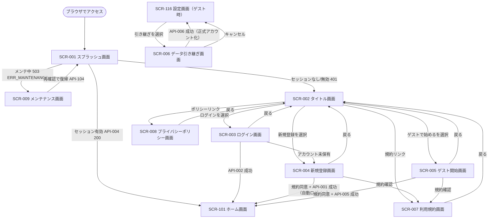
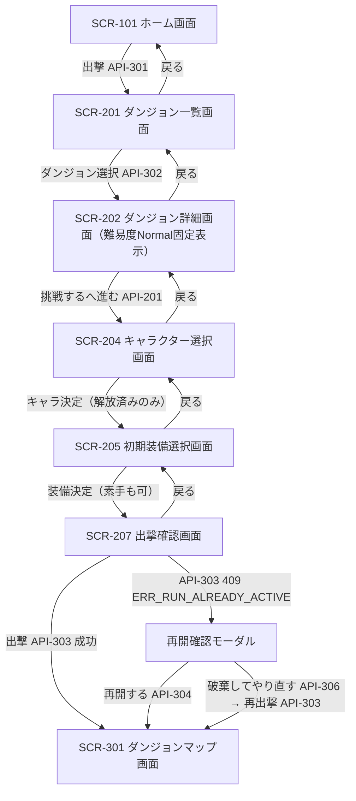
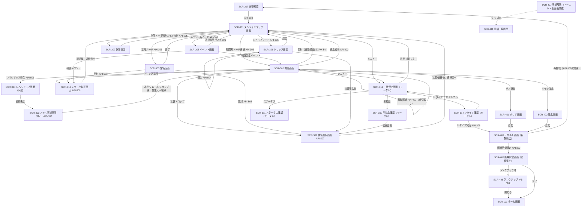
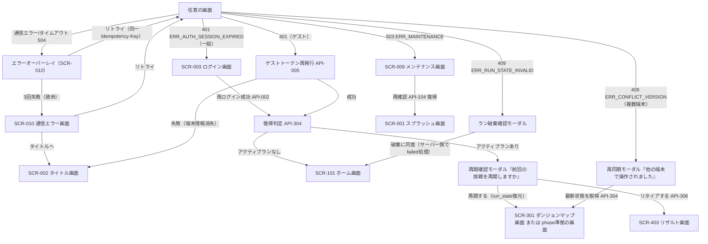

# 07. 画面遷移設計書（Screen Transition）

- 対象プロダクト: Rogue Chronicle（ローグライトRPG / DEC-001（仮決定））
- 目的: MVP対象50画面（06_Screen_List.md参照）の遷移経路・遷移条件・使用APIを定義し、異常系（通信・セッション・状態不整合）の挙動を確定する
- 関連文書: CORE_SPEC §6・§7、docs/06_Screen_List.md

遷移図は1枚に詰め込まず、(a)起動・認証 / (b)ホーム・拠点 / (c)出撃準備 / (d)ダンジョン内 / (e)異常系 の5図に分割する。MermaidのノードIDは英数字（SCR001等）とし、日本語はラベル内のみに記載する。

---

## 1. (a) 起動・認証フロー

### 1.1 遷移一覧表（起動・認証）

| No | 遷移元 | 遷移先 | トリガー | 遷移条件 | 使用API |
|---|---|---|---|---|---|
| A-01 | 起動 | SCR-001 | `/` アクセス | なし | — |
| A-02 | SCR-001 | SCR-009 | 自動 | メンテ判定が503（ERR_MAINTENANCE） | API-004（503応答） |
| A-03 | SCR-001 | SCR-101 | 自動 | API-004が200（セッション有効） | API-004 |
| A-04 | SCR-001 | SCR-002 | 自動 | API-004が401（セッションなし/期限切れ） | API-004 |
| A-05 | SCR-002 | SCR-003/004/005 | ボタン | なし | — |
| A-06 | SCR-002/003/004/005 | SCR-007/008 | リンク | なし | — |
| A-07 | SCR-003 | SCR-101 | ログイン実行 | API-002成功（失敗5回で15分ロック=ERR_AUTH_LOCKED表示） | API-002 |
| A-08 | SCR-004 | SCR-101 | 登録実行 | 規約同意チェックON + API-001成功（自動ログイン） | API-001 |
| A-09 | SCR-005 | SCR-101 | ゲスト開始実行 | 規約同意チェックON + API-005成功 | API-005 |
| A-10 | SCR-116 | SCR-006 | 引き継ぎボタン | ゲストアカウント（is_guest=true）のみ表示 | — |
| A-11 | SCR-006 | SCR-116 | 引き継ぎ実行 | API-006成功（以後は一般アカウント扱い） | API-006 |
| A-12 | SCR-101到達直後 | SCR-301等 | 再開モーダル | アクティブラン検知時（§4・§6参照） | API-304 |

---

## 2. (b) ホーム・拠点フロー

SCR-103（拠点画面）はSCR-101に統合済みのため本図には現れない（06 §3.1）。

```mermaid
flowchart TD
    SCR101["SCR-101 ホーム画面（拠点統合）"]

    SCR101 -->|"プロフィール"| SCR102["SCR-102 プロフィール画面"]
    SCR102 -->|"戻る"| SCR101
    SCR101 -->|"キャラクター"| SCR104["SCR-104 キャラ一覧画面"]
    SCR104 -->|"キャラ選択"| SCR105["SCR-105 キャラ詳細画面"]
    SCR105 -->|"戻る"| SCR104
    SCR104 -->|"戻る"| SCR101
    SCR101 -->|"永続強化"| SCR106["SCR-106 永続強化画面"]
    SCR106 -->|"戻る"| SCR101
    SCR101 -->|"武器一覧"| SCR107["SCR-107 武器一覧画面"]
    SCR107 -->|"戻る"| SCR101
    SCR101 -->|"図鑑"| SCR108["SCR-108 スキル図鑑画面"]
    SCR101 -->|"図鑑"| SCR109["SCR-109 レリック図鑑画面"]
    SCR101 -->|"図鑑"| SCR110["SCR-110 敵図鑑画面"]
    SCR108 -->|"戻る/タブ切替"| SCR101
    SCR109 -->|"戻る/タブ切替"| SCR101
    SCR110 -->|"戻る/タブ切替"| SCR101
    SCR101 -->|"実績"| SCR111["SCR-111 実績一覧画面"]
    SCR111 -->|"戻る"| SCR101
    SCR101 -->|"お知らせ"| SCR115["SCR-115 お知らせ画面"]
    SCR115 -->|"戻る"| SCR101
    SCR101 -->|"設定"| SCR116["SCR-116 設定画面"]
    SCR116 -->|"戻る"| SCR101
    SCR116 -->|"ヘルプ"| SCR117["SCR-117 ヘルプ画面"]
    SCR101 -->|"ヘルプ"| SCR117
    SCR117 -->|"戻る"| SCR116
    SCR116 -->|"クレジット"| SCR118["SCR-118 クレジット画面"]
    SCR118 -->|"戻る"| SCR116
    SCR116 -->|"規約/ポリシー"| SCR007["SCR-007/008 規約・ポリシー"]
    SCR007 -->|"戻る"| SCR116
    SCR116 -->|"引き継ぎ（ゲストのみ）"| SCR006["SCR-006 データ引き継ぎ画面"]
    SCR006 -->|"完了/キャンセル"| SCR116
    SCR116 -->|"ログアウト API-003 / 退会 API-008"| SCR002["SCR-002 タイトル画面"]
    SCR101 -->|"出撃（(c)へ）"| SCR201["SCR-201 ダンジョン一覧画面"]
    SCR101 -->|"挑戦を再開 API-304"| SCR301["SCR-301 ダンジョンマップ画面"]
```

### 2.1 遷移一覧表（ホーム・拠点）

| No | 遷移元 | 遷移先 | トリガー | 遷移条件 | 使用API |
|---|---|---|---|---|---|
| B-01 | SCR-101 | SCR-102 | プロフィールボタン | 認証済み | 表示時: API-102, API-103 |
| B-02 | SCR-101 | SCR-104 | キャラボタン | 認証済み | 表示時: API-201 |
| B-03 | SCR-104 | SCR-105 | キャラカード選択 | なし（未解放キャラも詳細閲覧可） | 表示時: API-202 |
| B-04 | SCR-105 | SCR-105（更新） | 解放ボタン | ソウルシャード残高≧解放コスト（不足時ERR_INSUFFICIENT_SHARDS） | API-203 |
| B-05 | SCR-101 | SCR-106 | 永続強化ボタン | 認証済み | 表示時: API-103 |
| B-06 | SCR-106 | SCR-106（更新） | ノード取得ボタン | 前提ノード取得済み + 残高≧コスト | API-204 |
| B-07 | SCR-101 | SCR-107〜110 | メニュー/図鑑タブ | 認証済み | 表示時: API-601 |
| B-08 | SCR-101 | SCR-111 | 実績ボタン | 認証済み | 表示時: API-106 |
| B-09 | SCR-101 | SCR-115 | お知らせボタン | 認証済み | 表示時: API-104 |
| B-10 | SCR-101 | SCR-116 | 設定ボタン | 認証済み | 表示時: API-602 / 保存時: API-603 |
| B-11 | SCR-116 | SCR-002 | ログアウトボタン | 確認ダイアログOK | API-003 |
| B-12 | SCR-116 | SCR-002 | 退会ボタン | 二段階確認（テキスト入力）OK | API-008 |
| B-13 | SCR-116 | SCR-006 | 引き継ぎボタン | ゲストのみ | API-006（実行時） |
| B-14 | SCR-101 | SCR-201 | 出撃ボタン | アクティブランなし（ありの場合は再開導線を表示） | API-304（判定） |
| B-15 | SCR-101 | SCR-301 | 「挑戦を再開」 | アクティブランあり（status=active） | API-304 |

---

## 3. (c) 出撃準備フロー

SCR-203（難易度選択）はSCR-202に統合済み（MVPはNormal固定）。SCR-206（初期能力選択）は将来対応のため本図に含めない。

### 3.1 遷移一覧表（出撃準備）

| No | 遷移元 | 遷移先 | トリガー | 遷移条件 | 使用API |
|---|---|---|---|---|---|
| C-01 | SCR-101 | SCR-201 | 出撃ボタン | 認証済み | 表示時: API-301 |
| C-02 | SCR-201 | SCR-202 | ダンジョンカード選択 | 解放済みダンジョン（MVPはforgotten_ruinsのみ） | 表示時: API-302 |
| C-03 | SCR-202 | SCR-204 | 「挑戦する」ボタン | 難易度=Normal（固定） | 表示時: API-201 |
| C-04 | SCR-204 | SCR-205 | キャラ決定ボタン | 解放済みキャラを1体選択済み（DEC-012） | 表示時: API-601（解放装備） |
| C-05 | SCR-205 | SCR-207 | 装備決定ボタン | 各スロット0〜1個選択（未選択可） | — |
| C-06 | SCR-207 | SCR-301 | 出撃ボタン | API-303成功（Idempotency-Key付与、二重押下無効化） | API-303 |
| C-07 | SCR-207 | 再開確認モーダル | 出撃ボタン | API-303が409 ERR_RUN_ALREADY_ACTIVE | API-303 |
| C-08 | 再開確認モーダル | SCR-301 | 「再開する」 | アクティブランを継続 | API-304 |
| C-09 | 再開確認モーダル | SCR-301 | 「破棄して出撃」 | 破棄の二重確認OK（リタイア扱い=シャード80%） | API-306 → API-307 → API-303 |
| C-10 | SCR-204/205/207 | SCR-202 | 直アクセスガード | 準備状態（Zustand）が欠落している場合 | — |

---

## 4. (d) ダンジョン内フロー（ラン中〜結果）

SCR-304はSCR-303と連続表示、SCR-404はSCR-403に統合、SCR-406はモーダル、SCR-407はトースト（06 §3.1）。

### 4.1 遷移一覧表（ダンジョン内・結果）

| No | 遷移元 | 遷移先 | トリガー | 遷移条件 | 使用API |
|---|---|---|---|---|---|
| D-01 | SCR-207 | SCR-301 | 出撃 | API-303成功（run_state生成、phase=map_select） | API-303 |
| D-02 | SCR-301 | SCR-302 | ノード選択 | 選択ノードがBATTLE/STRONG/ELITE/BOSS（接続済みノードのみ選択可） | API-305（応答に戦闘初期状態を含む。戦闘開始APIは独立させない） |
| D-03 | SCR-301 | SCR-305/306/307/308 | ノード選択 | 選択ノードがTREASURE/SHOP/REST/EVENT系（EVENT/BLESS/HEAL/CURSE/STORY/SECRETはSCR-308） | API-305 |
| D-04 | SCR-302 | SCR-302 | コマンド選択 | phase=battle。行動（攻撃/スキル/防御/アイテム/逃走）をサーバーへ送信（DEC-007） | API-402 |
| D-05 | SCR-302 | SCR-304→SCR-303 | 自動 | API-402応答でレベルアップ発生（獲得EXP≧expToNext） | API-501, API-502 |
| D-06 | SCR-303 | SCR-302/SCR-301 | スキル選択/リロール/スキップ | リロールは1回/ラン（永続強化で+）。選択後、レベルアップ発生元へ復帰 | API-502 |
| D-07 | SCR-302 | SCR-309 | 自動 | API-402応答に装備ドロップあり | API-507（装着時） |
| D-08 | SCR-302 | SCR-310 | 自動 | API-402応答にレリック獲得あり | API-508 |
| D-09 | SCR-302 | SCR-301 | 勝利/逃走成功 | 敵全滅（ボス以外）または逃走判定成功（ボス・エリートは逃走不可） | API-402 |
| D-10 | SCR-302 | SCR-401 | 自動 | API-402応答で階層10のボス撃破（status=cleared） | API-402 |
| D-11 | SCR-302 | SCR-402 | 自動 | API-402応答でプレイヤーHP0（status=failed） | API-402 |
| D-12 | SCR-305 | SCR-309/310/301 | 開封 | 内容が装備→SCR-309、レリック→SCR-310、ゴールド等→その場表示後SCR-301 | API-503 |
| D-13 | SCR-306 | SCR-306/309/301 | 購入/退店 | 残高≧価格（不足時ERR_INSUFFICIENT_GOLD） | API-504 |
| D-14 | SCR-307 | SCR-301 | 二択実行 | 「HP50%回復」or「スキル1つ強化」を選択 | API-505 |
| D-15 | SCR-308 | SCR-301/302/310 | 選択肢実行 | 選択肢の結果（報酬/戦闘/ステータス変化）に応じ分岐 | API-506 |
| D-16 | SCR-301/302 | SCR-313 | メニューボタン / ブラウザ戻る | ラン中は常時可（戦闘の行動送信中を除く） | — |
| D-17 | SCR-313 | SCR-311/312/314 | メニュー項目選択 | なし | — |
| D-18 | SCR-314 | SCR-403 | リタイア実行 | 二重確認OK。status=retired、シャード80%換算 | API-306 |
| D-19 | SCR-401/402 | SCR-403 | 進むボタン/自動 | phase=reward_pending | — |
| D-20 | SCR-403 | SCR-405 | 受領確定 | API-307成功（status=finalized。二重受領はERR_REWARD_ALREADY_CLAIMED） | API-307 |
| D-21 | SCR-405 | SCR-406 | 自動 | API-307応答にランクアップ情報あり | （API-307応答に包含） |
| D-22 | SCR-405/406 | SCR-101 | 完了/閉じる | なし | 表示時: API-101 |
| D-23 | SCR-403 | SCR-207 | 「再挑戦」ボタン | API-307確定後のみ活性。直前ランと同一のダンジョン/キャラ/初期装備をプリセット | API-307 → API-303（SCR-207で実行） |
| D-24 | 任意画面 | SCR-407 | 自動（トースト） | API応答に実績解除情報あり | （各API応答に包含） |

---

## 5. (e) 異常系フロー

### 5.1 異常系一覧表（必須網羅）

| No | 異常ケース | 検知方法 | 画面挙動・遷移 | 使用API |
|---|---|---|---|---|
| E-01 | 通信エラー | fetch失敗 / 5xx / 504 ERR_TIMEOUT | 画面内エラーオーバーレイ（SCR-010相当）を表示し「リトライ」「タイトルへ」を提示。リトライは同一Idempotency-Keyで再送 | 元画面のAPIを再実行 |
| E-02 | セッション切れ（一般） | 401 ERR_AUTH_SESSION_EXPIRED / ERR_AUTH_UNAUTHORIZED | 「セッションが切れました」通知→SCR-003へ。再ログイン成功後、API-304でアクティブラン有無を判定し復帰 | API-002 → API-304 |
| E-03 | セッション切れ（ゲスト） | 401（is_guestセッション） | ログイン画面へは飛ばさず、保持済みゲスト認証情報でトークン再発行を試行。成功で元画面へ復帰、失敗（端末データ消失）はSCR-002へ | API-005 → API-304 |
| E-04 | 不正データ検知 | 409 ERR_RUN_STATE_INVALID | 「挑戦データに問題が発生しました」モーダル→ラン破棄への同意を取得→サーバーがラン終了処理→SCR-101へ。traceIdを画面に表示 | API-304（再取得試行）→ 破棄確定 |
| E-05 | 戦闘途中のブラウザ終了→再訪 | 再ログイン後にAPI-304がstatus=activeを返す | SCR-001→（必要なら認証）→「前回の挑戦を再開しますか」モーダル→「再開」でrun_state.position.phaseに応じた画面（battleならSCR-302、map_selectならSCR-301）へ復元 | API-304 |
| E-06 | メンテナンス中 | 503 ERR_MAINTENANCE（全API共通） | 即時SCR-009へ。終了予定時刻とお知らせを表示。「再確認」でSCR-001から再判定 | API-104 |
| E-07 | データ保存失敗 | ラン系変更APIの失敗（5xx/timeout） | 同一Idempotency-Keyで自動リトライ最大3回（指数バックオフ1s/2s/4s）。3回失敗でSCR-010（致命）へ。「リトライ」「タイトルへ」を提示。ERR_DUPLICATE_REQUEST(409)は成功扱いで前回応答を採用 | 各ラン系API |
| E-08 | 二重操作 | ボタン連打・二重送信 | 送信中は全アクションボタンを無効化（ローディング表示）。加えてIdempotency-Keyで同一リクエストを冪等化（サーバーはERR_DUPLICATE_REQUESTか前回応答を返す） | API-303, 305, 306, 307, 402, 502〜508 |
| E-09 | ブラウザ戻る操作（ラン中） | popstateイベント | (run)レイアウトでhistory介入（ダミーエントリをpush）し、画面遷移させずSCR-313（一時停止モーダル）を表示。「再開」でモーダルを閉じる | — |
| E-10 | リロード（ラン中） | ページ再マウント | (run)レイアウトがAPI-304でrun_stateを復元し、phaseに一致するURLへリダイレクト（例: battle中に `/runs/current/map` を開いた場合は `/runs/current/battle` へ）。進行は失われない（DEC-011: サーバー保存が正） | API-304 |
| E-11 | 複数端末ログイン | 後発端末の操作は後勝ち。先行端末のラン系APIが409 ERR_CONFLICT_VERSION（versionによる楽観ロック、DEC-011） | 先行端末に再同期モーダル「他の端末で操作されました。最新の状態を取得します」→API-304で再同期し、phase準拠の画面へ | API-304 |
| E-12 | ラン不存在で `/runs/current/*` へ直アクセス | API-304がアクティブランなしを返す | SCR-101へリダイレクト（トーストで「進行中の挑戦はありません」） | API-304 |
| E-13 | レート制限 | 429 ERR_RATE_LIMITED | オーバーレイで「時間をおいて再試行してください」を表示。自動リトライはRetry-Afterに従う | — |
| E-14 | 不正な行動送信 | 422 ERR_INVALID_ACTION（SP不足・逃走不可等） | 画面遷移せず、戦闘画面内にエラーメッセージ表示（行動選択に戻す） | API-402 |
| E-15 | 報酬の二重受領 | 409 ERR_REWARD_ALREADY_CLAIMED | 受領済みとして扱い、API-304/API-101で最新状態を取得してSCR-101へ | API-307 |

### 5.2 エラーハンドリング共通方針

- 分類（仮決定）:
  - 回復可能（通信断・504・429・5xx初回）→ オーバーレイ+リトライ
  - 認証系（401・423）→ 認証フローへ誘導（E-02/E-03）
  - 状態競合（409系）→ 種別ごとにE-04/E-07/E-11/E-15の専用モーダル
  - 入力・行動不正（400/422）→ 画面内インラインエラー（遷移なし）
  - 致命（リトライ3回失敗・500継続）→ SCR-010へ。traceIdを表示し問い合わせ導線を置く
- エラー応答は共通形式 `{ errorCode, message, details, traceId, timestamp }`（CORE_SPEC §7）を前提に、errorCodeで分岐する共通ハンドラをTanStack QueryのグローバルonError（DEC-008）に実装する。

---

## 6. 遷移共通ルール

1. **認証ガード**: (main)(run)グループのlayoutでAPI-004を検証。401はE-02/E-03に従う。
2. **ラン存在ガード**: (run)グループのlayoutでAPI-304を検証。phaseとURLの不一致はphase準拠URLへリダイレクト（E-10）。
3. **離脱ガード**: ラン中（(run)グループ）は`beforeunload`で確認ダイアログ、popstateでSCR-313表示（E-09）。ホーム系ではガードしない。
4. **再開導線の優先**: SCR-101はAPI-304でアクティブランを検知した場合、出撃ボタンより優先して「挑戦を再開」を表示する（A-12/B-15）。
5. **二重送信防止**: ラン系変更APIは送信中ボタン無効化+Idempotency-Key必須（E-08）。
6. **戻る操作の設計**: ホーム系画面はブラウザ戻る=通常のルーティング戻り。準備フロー（SCR-204〜207）は戻るで1つ前の準備画面へ。ラン中はE-09。リザルト確定後（finalized）は戻るでSCR-101へ（ラン画面へは戻れない）。
7. **トースト（SCR-407）**: どのフローでも遷移を発生させない非モーダル通知とし、遷移図の主経路に含めない。

## 未決事項

- ISSUE-07-01: E-03ゲスト再発行の認証情報保持方式（HttpOnly Cookieの長期化か、クライアント保持のリカバリトークンか）。セキュリティ設計（DEC-006関連）とあわせて確定する。
- ISSUE-07-02: E-07自動リトライのバックオフ値（1s/2s/4s）は仮置き。戦闘系API p95 800ms目標（CORE_SPEC §12）とUX許容値から最終決定する。
- ISSUE-07-03: SCR-403「再挑戦」でプリセットする初期装備が退会・解放状態変化で無効になった場合のフォールバック仕様。
- ISSUE-07-04: E-04でラン破棄をユーザー同意なしにサーバー側で即failed化するか、同意必須とするか（現案は同意必須）。
- ISSUE-07-05: 複数端末の「後勝ち」を許容し続けるか、アクティブラン中は先行セッションを明示的に失効させるか（AntiCheatModuleの設計とあわせて検討）。
- ISSUE-07-06: SCR-308のSTORYノードをイベント画面と別レイアウト（会話ウィンドウ）にするかの判断。

## 実装時の注意点

- 遷移図・遷移表のAPI IDはCORE_SPEC §7と完全一致させること。戦闘開始APIは存在しない（API-305の応答に戦闘初期状態が含まれる）点をクライアント実装で誤らない。
- run_state.position.phase（map_select / node_action / battle / reward_pending）を唯一の真実としてURL整合を取り、クライアント側の画面状態から逆算しない（DEC-007・DEC-011）。
- E-09のhistory介入は、(run)レイアウトのマウント時にダミーエントリを1件pushし、popstateでモーダル表示+再pushする方式で実装する。実装はレイアウト1箇所に閉じ、各画面へ分散させない。
- Idempotency-Keyはリクエスト生成時にUUIDv4で採番し、リトライ時に再利用する。成功応答受領後に破棄する。キー管理はAPIクライアント層（lib/）に共通実装する。
- SCR-403のAPI-307は「表示時」ではなく「受領確定ボタン押下時」に呼ぶ（誤って表示時に呼ぶと戻る操作等での二重確定リスクが上がる）。応答内のランクアップ・新規解放・実績情報でSCR-405/406/407の表示を組み立てる。
- リザルト確定後はrun関連のTanStack Queryキャッシュ（runs/current系）をinvalidateし、ホーム系キャッシュ（API-101/103）を再取得する。
- Mermaid図を更新する際はノードIDを英数字のまま維持し、ラベルのみ日本語で編集すること（構文エラー防止）。

## 関連設計書

- CORE_SPEC.md（§6 画面一覧・§7 API一覧・§8 run_state構造）
- docs/06_Screen_List.md（画面一覧・URLルーティング）
- docs/08_Wireframes.md（詳細ワイヤーフレーム）
- docs/13_API_Design.md（APIリクエスト/レスポンス詳細・エラーコード）
- docs/15_Save_Data_Design.md（run_state・再開/復元仕様）
- docs/16_Security_Design.md（セッション管理・ゲスト再発行・冪等性）
