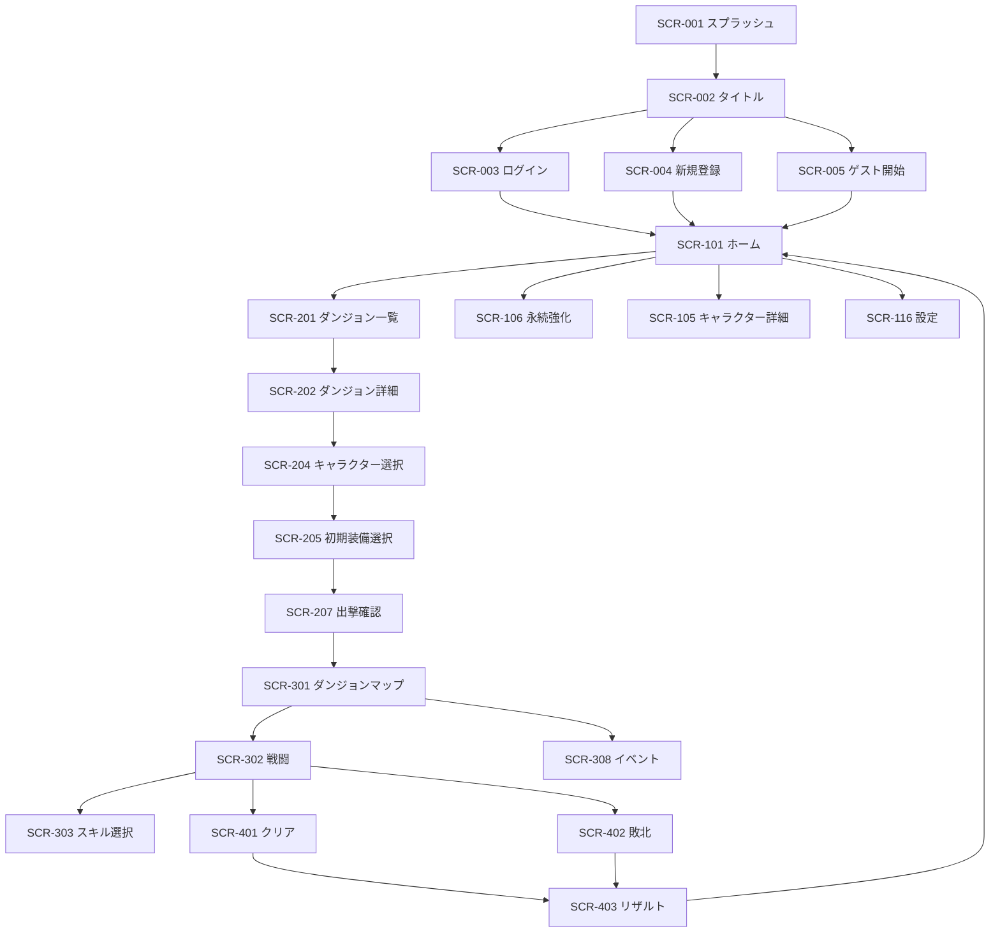

# 09. 画面設計書 — Rogue Chronicle

## 1. 本書について

- 目的: ローグライトRPG「Rogue Chronicle」の全画面（SCR-001〜SCR-407、計56画面）のUI設計を定義する。
- 対象: PCブラウザ / スマートフォンブラウザ（レスポンシブ、DEC-004/DEC-010準拠: Next.js + Tailwind CSS + shadcn/ui）。
- 記法: 画面IDはSCR-NNN、APIはAPI-NNN、用語はCORE SPEC §4に完全一致させる。
- 構成: §4で主要13画面をフル形式（ASCIIワイヤーフレーム付き）、§5で残り全画面を簡易形式で記載する。
- 関連文書: 05_Game_Design.md / 10_API_Design.md / 12_Database_Design.md / 15_Save_Data_Design.md / 18_Skill_Design.md

---

## 2. 画面共通仕様

### 2.1 レスポンシブブレークポイント（仮決定）

| 区分 | 幅 | レイアウト方針 |
|---|---|---|
| スマホ | 〜639px | 1カラム縦積み。基準幅375px。下部固定ナビ/アクションバー |
| タブレット | 640〜1023px | スマホレイアウトの拡大 + 一部2カラム |
| PC | 1024px〜 | 最大コンテンツ幅960px中央寄せ（仮決定）。ゲーム画面は中央固定+背景装飾。サイドに補助情報パネルを展開 |

- 縦向き（portrait）を主とする。PCでもゲームプレイ領域はアスペクト比を保った中央カラムで表示し、スマホとPCで操作体系を変えない（学習コスト削減）。

### 2.2 共通ヘッダ（ホーム系画面 SCR-101〜118 で表示）

```
┌─────────────────────────────────────┐
│ [←戻る] 画面タイトル   💎1,250  Rank12 │
└─────────────────────────────────────┘
```
- 💎=ソウルシャード所持数（API-103）、Rank=プレイヤーランク（API-102）。タップでSCR-102へ。
- ラン中画面（SCR-301〜314）ではヘッダを持たず、各画面固有のステータスバーを表示する。

### 2.3 ローディング表示（全画面共通）

| 種類 | 表示 | 適用 |
|---|---|---|
| 初期ロード | スケルトンスクリーン（カード形状のプレースホルダ、shimmerアニメーション） | GET系の初期表示 |
| 操作中 | ボタン内スピナー + ボタンdisabled | POST/PUT実行中 |
| 画面遷移 | 上部プログレスバー（Next.js遷移） | ページ間遷移 |
| 3秒超過 | 「通信中です…」テキスト追加表示。10秒でタイムアウト扱い（ERR_TIMEOUT相当のリトライUI） | 全通信 |

### 2.4 エラー表示（全画面共通の既定挙動。各画面はこの差分のみ記載）

| エラーコード | 既定挙動 |
|---|---|
| ERR_AUTH_UNAUTHORIZED / ERR_AUTH_SESSION_EXPIRED | トースト「セッションが切れました」→ SCR-002（タイトル）へ遷移 |
| ERR_AUTH_LOCKED | ログイン画面にインライン表示「試行回数超過。15分後に再試行してください」 |
| ERR_VALIDATION | フォーム項目下に赤字インラインメッセージ |
| ERR_NOT_FOUND | 画面内エラーパネル「データが見つかりません」+「ホームへ」ボタン |
| ERR_CONFLICT_VERSION | 「データが更新されています」ダイアログ → API-304で最新状態を再取得し画面再描画 |
| ERR_DUPLICATE_REQUEST | 成功扱い（前回結果をそのまま反映）。ユーザーには通知しない |
| ERR_RUN_STATE_INVALID | 「進行状態を同期します」ダイアログ → API-304再取得 → 該当フェーズの画面へ復帰 |
| ERR_RUN_ALREADY_ACTIVE | 「進行中の挑戦があります」ダイアログ →「再開する」(SCR-301)/「リタイアする」(SCR-314) |
| ERR_INVALID_ACTION | トースト「その行動は実行できません」+ 行動UIを再活性化 |
| ERR_INSUFFICIENT_GOLD / ERR_INSUFFICIENT_SHARDS | 購入ボタン付近にインライン「ゴールド（ソウルシャード）が不足しています」 |
| ERR_REWARD_ALREADY_CLAIMED | 受領済みとして次画面へ進める |
| ERR_RATE_LIMITED | トースト「操作が早すぎます。しばらく待ってください」 |
| ERR_MAINTENANCE | SCR-009（メンテナンス画面）へ強制遷移 |
| ERR_TIMEOUT / ネットワーク断 | SCR-010（通信エラー画面）またはインラインの「再試行」ボタン。ラン中はリトライ優先（画面遷移しない） |
| ERR_INTERNAL | トースト「エラーが発生しました (traceId: xxx)」+ 再試行導線 |

### 2.5 二重送信防止（全画面共通方針）

1. 送信ボタンはmutation実行中 disabled + スピナー表示（TanStack Query `isPending`）。
2. ラン系変更API（API-303/305/306/307/402/502〜508）はクライアント生成UUIDの `Idempotency-Key` ヘッダを必ず付与。リトライ時は同一キーを再送。
3. `run_state.version` を全ラン系リクエストに含め、楽観ロック（ERR_CONFLICT_VERSION時は§2.4の再同期）。
4. 連打対策として演出中（ダメージアニメーション等）は入力レイヤーを`pointer-events: none`にする。

### 2.6 アクセシビリティ共通方針

- 全インタラクティブ要素はキーボード操作可能（Tab/Enter/Space、モーダルはEscで閉じる+フォーカストラップ）。
- タッチターゲットは最小44×44px。
- コントラスト比はWCAG 2.1 AA（テキスト4.5:1以上）。ダークファンタジーテーマ（DEC-015）でも文字色`#E8E3D8`系/背景`#14121A`系で確保（仮決定）。
- 状態異常・属性は色だけで区別せず、必ずアイコン形状+テキストラベルを併用。
- `prefers-reduced-motion` 時は戦闘演出を簡略化（フェードのみ）。
- 動的な戦闘ログは `aria-live="polite"` で読み上げ。モーダルは `role="dialog"` + `aria-modal`。
- 画像・アイコンには `alt` / `aria-label` を必須とする。

### 2.7 共通モーダル部品

| 部品名 | 用途 |
|---|---|
| ConfirmDialog | 確認2択（破壊的操作は赤ボタン+ラベル明示） |
| ErrorDialog | §2.4のダイアログ系エラー |
| RewardToast | 実績解除（SCR-407）等の非モーダル通知。4秒で自動消滅、スタック最大3件 |
| LevelUpModal | SCR-304/303をラン中画面に重ねて表示 |

---

## 3. 画面遷移概要



---

## 4. 主要13画面 詳細設計（フル形式）

### 4.1 SCR-002 タイトル画面

| 項目 | 内容 |
|---|---|
| 画面ID | SCR-002 |
| 画面名 | タイトル画面 |
| 画面概要 | 起動後の入口。ロゴ表示とプレイ開始（ログイン/新規登録/ゲスト開始/続きから）への振り分けを行う |
| 利用者 | 全ユーザー（未認証含む） |
| 表示条件 | SCR-001の初期化完了後。メンテナンス中はSCR-009へ差し替え |
| 遷移元 | SCR-001 / ログアウト操作（SCR-116） / セッション失効時の各画面 |
| 遷移先 | SCR-003 / SCR-004 / SCR-005 / SCR-101（セッション有効時「つづきから」） / SCR-007 / SCR-008 / SCR-115 |

**ASCIIワイヤーフレーム（スマホ縦 375px）**

```
┌───────────────────────────────┐
│            (背景: 遺跡の扉)      │
│                               │
│      ██ ROGUE CHRONICLE ██    │
│        〜 忘却の遺跡へ 〜        │
│                               │
│   ┌─────────────────────┐     │
│   │  ▶ つづきから (Rank12) │     │←セッション有効時のみ
│   └─────────────────────┘     │
│   ┌─────────────────────┐     │
│   │     ログイン           │     │
│   └─────────────────────┘     │
│   ┌─────────────────────┐     │
│   │     新規登録           │     │
│   └─────────────────────┘     │
│   ┌─────────────────────┐     │
│   │  ゲストではじめる        │     │
│   └─────────────────────┘     │
│                               │
│  [お知らせ] [利用規約] [プライバシー]│
│           ver 0.1.0           │
└───────────────────────────────┘
```

- **レイアウト説明**: 背景全面にダークファンタジー調キービジュアル。中央にロゴ、下半分に縦積みボタン群（最大幅320px）。最下部にフッターリンクとバージョン表記。
- **表示項目**:

| 項目 | 取得元 |
|---|---|
| セッション有効判定・プレイヤーランク・表示名 | API-004（GET /auth/me） |
| 未読お知らせバッジ | API-104（GET /announcements） |
| アプリバージョン | ビルド時埋め込み定数 |

- **入力項目**: なし。
- **ボタン**:

| ラベル | 動作 | 活性条件 |
|---|---|---|
| つづきから | SCR-101へ遷移 | API-004成功（セッション有効）時のみ表示 |
| ログイン | SCR-003へ遷移 | 常時 |
| 新規登録 | SCR-004へ遷移 | 常時 |
| ゲストではじめる | SCR-005へ遷移 | 常時。ゲストセッション保持中は「つづきから」に統合 |
| お知らせ / 利用規約 / プライバシー | SCR-115 / SCR-007 / SCR-008へ | 常時 |

- **モーダル**: なし（お知らせ緊急告知がある場合のみ1回限りの告知モーダル表示、仮決定）。
- **バリデーション**: なし。
- **初期表示処理**: (1) API-004を呼びセッション判定（401は正常系として無視）→ (2) API-104でお知らせバッジ取得（失敗しても画面は表示継続）。
- **ユーザー操作一覧**: 各ボタンタップ / フッターリンクタップ。Enterキーで先頭ボタン実行。
- **API呼び出し**: API-004、API-104。
- **ローディング表示**: ボタン群はAPI-004応答までスケルトン表示（最大2秒、超過時は未ログイン扱いで表示）。
- **エラー表示**: API-004の401→未ログインUI表示（エラー通知なし）。ERR_MAINTENANCE→SCR-009。その他→§2.4既定。
- **空データ表示**: お知らせ0件時はバッジ非表示のみ。
- **レスポンシブ対応**: スマホ=上記。PC=背景を横長ビジュアルに差し替え、ボタン群は中央カラム維持。
- **スマートフォン時**: 縦1カラム、ボタン高さ52px。
- **PC時**: ロゴを大きく（幅480px）、ホバー時にボタン発光エフェクト。
- **アクセシビリティ**: ロゴに`alt="Rogue Chronicle"`。ボタンは`<button>`要素、フォーカスリング可視。背景動画・自動再生音は使用しない。
- **二重送信防止**: 遷移ボタンは押下後300msデバウンス+遷移中disabled。
- **備考**: BGMはMVP対象外（効果音は最小限△）。「つづきから」表示時はゲスト/正式の区別バッジを表示（仮決定）。

---

### 4.2 SCR-101 ホーム画面

| 項目 | 内容 |
|---|---|
| 画面ID | SCR-101 |
| 画面名 | ホーム画面 |
| 画面概要 | ログイン後のハブ。出撃導線、進行中ラン再開、通貨・ランク、各機能メニューを集約（SCR-103拠点画面の機能を統合、CORE SPEC §6注記） |
| 利用者 | 認証済みユーザー（ゲスト含む） |
| 表示条件 | セッション有効 |
| 遷移元 | SCR-002/003/004/005 / SCR-403 / 各ホーム系画面の戻る |
| 遷移先 | SCR-201 / SCR-301（再開） / SCR-102 / SCR-104 / SCR-106 / SCR-107〜111 / SCR-115 / SCR-116 / SCR-117 / SCR-118 |

**ASCIIワイヤーフレーム（スマホ縦 375px）**

```
┌───────────────────────────────┐
│ 👤レイン卿  Rank12 ▓▓▓░ 💎1,250 │←プロフィール/ランクEXP/シャード
│                        🔔(2)  │←お知らせバッジ
├───────────────────────────────┤
│ ┌───────────────────────────┐ │
│ │ ▶ 挑戦を再開する            │ │←進行中ランありの時のみ
│ │  忘却の遺跡・階層3 レイン Lv5 │ │
│ └───────────────────────────┘ │
│ ┌───────────────────────────┐ │
│ │      ⚔ ダンジョンへ出撃      │ │←メインCTA(大)
│ └───────────────────────────┘ │
│ ┌────────────┐ ┌────────────┐ │
│ │ 🛡 キャラクター │ │ ✦ 永続強化   │ │
│ └────────────┘ └────────────┘ │
│ ┌────────────┐ ┌────────────┐ │
│ │ 📖 図鑑      │ │ 🏆 実績      │ │
│ └────────────┘ └────────────┘ │
│ ┌───────────────────────────┐ │
│ │ 📜 お知らせ: メンテのお知らせ… │ │
│ └───────────────────────────┘ │
├───────────────────────────────┤
│ [ホーム] [キャラ] [強化] [図鑑] [設定]│←下部固定ナビ
└───────────────────────────────┘
```

- **レイアウト説明**: 上部にプレイヤーサマリーバー。中央に「挑戦再開」カード（進行中ランがある時のみ）→メインCTA「ダンジョンへ出撃」→2×2機能タイル→お知らせティッカー。下部固定ナビ5タブ（ホーム/キャラ/強化/図鑑/設定）。
- **表示項目**:

| 項目 | 取得元 |
|---|---|
| 表示名・プレイヤーランク・ランクEXPゲージ | API-101（GET /home、player_progress） |
| ソウルシャード所持数 | API-101（player_currencies。個別更新はAPI-103） |
| 進行中ラン概要（ダンジョン名/階層/キャラ/レベル/status=active） | API-101（dungeon_runs要約。詳細再開はAPI-304） |
| 未読お知らせ件数・最新1件タイトル | API-101（announcements要約） |
| 解放済みキャラ数/実績達成数（タイルのサブテキスト） | API-101 |

- **入力項目**: なし。
- **ボタン**:

| ラベル | 動作 | 活性条件 |
|---|---|---|
| 挑戦を再開する | API-304取得 → run_state.position.phaseに応じSCR-301/302等へ復帰 | 進行中ラン(status=active)がある時のみ表示 |
| ダンジョンへ出撃 | SCR-201へ | 進行中ランなし。ありの場合はERR_RUN_ALREADY_ACTIVE相当の確認ダイアログ（再開/リタイア） |
| キャラクター / 永続強化 / 図鑑 / 実績 | SCR-104 / SCR-106 / SCR-108(タブでSCR-109/110へ) / SCR-111へ | 常時 |
| お知らせティッカー | SCR-115へ | 常時 |
| 🔔 | SCR-115へ | 常時 |
| プロフィール（👤） | SCR-102へ | 常時 |
| 下部ナビ各タブ | 各画面へ | 常時（現在タブはハイライト） |

- **モーダル**: 進行中ランあり×「出撃」押下時のConfirmDialog（「進行中の挑戦があります。再開しますか？」再開/リタイアへ/キャンセル）。ゲストユーザーには初回のみ「データ引き継ぎのすすめ」モーダル（SCR-006導線、LocalStorageで表示済み管理、仮決定）。
- **バリデーション**: なし。
- **初期表示処理**: (1) API-101（ホーム集約情報を1リクエストで取得）→ (2) 失敗時のみAPI-102/API-103/API-104に分割フォールバック（仮決定）。
- **ユーザー操作一覧**: タイル/CTAタップ、下部ナビ切替、Pull-to-Refresh（API-101再取得）。
- **API呼び出し**: API-101（初期）、API-304（再開時）、API-103（リザルト帰還後の通貨再検証）。
- **ローディング表示**: サマリーバーとカード群をスケルトン表示。再開ボタン押下中はスピナー。
- **エラー表示**: §2.4既定。API-304がERR_NOT_FOUND（ラン消滅）→再開カードを非表示にしトースト「挑戦データが見つかりませんでした」。
- **空データ表示**: 進行中ランなし→再開カード非表示。お知らせ0件→ティッカー非表示。
- **レスポンシブ対応**: PCでは2カラム（左: 出撃CTA+再開カード、右: 機能タイル+お知らせ一覧5件）。下部ナビは左サイドナビに変形。
- **スマートフォン時**: 上記ワイヤーフレーム。片手操作を想定しCTAを画面下半分に配置。
- **PC時**: 背景に拠点イラスト。ホバーでタイル浮き上がり。
- **アクセシビリティ**: 下部ナビは`<nav>`+`aria-current="page"`。ランクゲージは`role="progressbar"`+`aria-valuenow`。
- **二重送信防止**: 再開ボタンはAPI-304完了までdisabled。出撃CTAは遷移中disabled。
- **備考**: SCR-103（拠点画面）はMVPでは本画面に統合（CORE SPEC §6の△に対応）。

---

### 4.3 SCR-201 ダンジョン一覧画面

| 項目 | 内容 |
|---|---|
| 画面ID | SCR-201 |
| 画面名 | ダンジョン一覧画面 |
| 画面概要 | 挑戦可能なダンジョンの一覧表示と選択。MVPは「忘却の遺跡」1種のみだが将来複数化を前提にリスト形式 |
| 利用者 | 認証済みユーザー |
| 表示条件 | セッション有効。進行中ラン(status=active)がないこと（ある場合は再開ダイアログ） |
| 遷移元 | SCR-101 |
| 遷移先 | SCR-202（ダンジョン詳細）/ SCR-101（戻る） |

**ASCIIワイヤーフレーム（スマホ縦 375px）**

```
┌───────────────────────────────┐
│ [←] ダンジョン選択    💎1,250    │
├───────────────────────────────┤
│ ┌───────────────────────────┐ │
│ │ (遺跡サムネイル)             │ │
│ │ 忘却の遺跡        [Normal]  │ │
│ │ 全10階層 / 推奨: 初心者〜     │ │
│ │ 挑戦12回 / クリア4回 ★最深10 │ │
│ │              [詳細を見る ▶] │ │
│ └───────────────────────────┘ │
│ ┌───────────────────────────┐ │
│ │ ？？？？？                   │ │
│ │ 🔒 今後のアップデートで解放    │ │
│ └───────────────────────────┘ │
│                               │
├───────────────────────────────┤
│ [ホーム] [キャラ] [強化] [図鑑] [設定]│
└───────────────────────────────┘
```

- **レイアウト説明**: 縦スクロールのカードリスト。各カード=サムネイル+ダンジョン名+難易度バッジ+階層数+個人統計。未解放枠はロック表示のティザーカード。
- **表示項目**:

| 項目 | 取得元 |
|---|---|
| ダンジョン名（忘却の遺跡）/ code / 階層数 / 難易度（Normal） | API-301（GET /dungeons） |
| 挑戦回数 / クリア回数 / 最深到達階層 | API-301（player_progress統計を含む応答、仮決定） |
| 解放状態 | API-301 |

- **入力項目**: なし。
- **ボタン**: 「詳細を見る」/カード全体タップ→SCR-202。「←」→SCR-101。ロックカードは非活性（タップでトースト「今後のアップデートで解放されます」）。
- **モーダル**: 進行中ラン検出時（API-301応答またはAPI-303のERR_RUN_ALREADY_ACTIVE）に再開確認ダイアログ。
- **バリデーション**: なし。
- **初期表示処理**: (1) API-301でダンジョン一覧+統計取得。
- **ユーザー操作一覧**: カードタップ / 戻る / Pull-to-Refresh。
- **API呼び出し**: API-301。
- **ローディング表示**: カード2枚分のスケルトン。
- **エラー表示**: §2.4既定。取得失敗時は画面中央に再試行パネル。
- **空データ表示**: 一覧0件は設計上発生しない（マスタ未投入時は「ダンジョン情報を取得できません」+再試行）。
- **レスポンシブ対応**: PCは2カラムグリッドのカード配置、カード幅448px。
- **スマートフォン時**: 1カラム、カードは全幅-32px。
- **PC時**: カードホバーでサムネイル拡大+枠発光。
- **アクセシビリティ**: カードは`<a role="link">`相当で全体がフォーカス対象。難易度バッジは色+文字。ロックカードは`aria-disabled="true"`。
- **二重送信防止**: 遷移のみのため遷移中disabledで足りる。
- **備考**: SCR-203（難易度選択）はMVPではSCR-202に統合（CORE SPEC §6の△に対応）。

---

### 4.4 SCR-204 キャラクター選択画面

| 項目 | 内容 |
|---|---|
| 画面ID | SCR-204 |
| 画面名 | キャラクター選択画面 |
| 画面概要 | 出撃するキャラクターを1体選択する（DEC-012: MVPは1キャラ編成）。未解放キャラの解放導線も持つ |
| 利用者 | 認証済みユーザー |
| 表示条件 | SCR-202で「挑戦する」選択後 |
| 遷移元 | SCR-202 / SCR-205（戻る） |
| 遷移先 | SCR-205（初期装備選択）/ SCR-202（戻る）/ SCR-105（詳細を見る） |

**ASCIIワイヤーフレーム（スマホ縦 375px）**

```
┌───────────────────────────────┐
│ [←] キャラクター選択  (2/4ステップ)│
├───────────────────────────────┤
│  ◀ ┌───────────────────┐ ▶   │←横スワイプカルーセル
│    │   (レイン立ち絵)     │     │
│    │  レイン  🔥火        │     │
│    │  剣士・バランス       │     │
│    │ HP100 ATK12 DEF10   │     │
│    │ SPD10 クリ5%        │     │
│    │ 固有:不屈(致死を1回   │     │
│    │  HP1で耐える)        │     │
│    │      [詳細を見る]    │     │
│    └───────────────────┘     │
│   ● ○ ○                      │←ページインジケータ
│ ┌─────┐ ┌─────┐ ┌─────┐      │
│ │レイン✓│ │リリア🔒│ │ガルド🔒│      │←サムネイル一覧
│ └─────┘ └─────┘ └─────┘      │
│ 🔒リリア: 💎300で解放 [解放する] │
├───────────────────────────────┤
│ │   このキャラクターで進む ▶   │  │←下部固定CTA
└───────────────────────────────┘
```

- **レイアウト説明**: 中央にキャラカードのカルーセル（スワイプ/矢印）。下にサムネイル行（選択中✓、未解放🔒）。未解放キャラ選択時はCTA位置に解放条件と解放ボタンを表示。最下部に固定CTA。
- **表示項目**:

| 項目 | 取得元 |
|---|---|
| キャラ一覧（code/名前/タイプ/属性/初期ステータス/固有能力/解放状態/解放条件） | API-201（GET /characters） |
| ソウルシャード所持数（解放可否判定） | API-103 |

- **入力項目**: なし（選択状態のみ、Zustandで保持）。
- **ボタン**:

| ラベル | 動作 | 活性条件 |
|---|---|---|
| このキャラクターで進む | 選択キャラをラン準備状態に保存しSCR-205へ | 解放済みキャラ選択中のみ |
| 解放する（💎300） | ConfirmDialog→API-203実行→カード解放演出 | 未解放（ソウルシャード条件）かつ所持数充足時。不足時disabled+「💎不足」表示 |
| 詳細を見る | SCR-105をモーダル/画面で表示（戻り先は本画面） | 常時 |
| ← | SCR-202へ | 常時 |

- **モーダル**: 解放確認ConfirmDialog（「ソウルシャード300を消費してリリアを解放しますか？」）。実績条件キャラ（ガルド: 累計ラン10回）は解放ボタンなし、進捗表示のみ（例「あと3回」）。
- **バリデーション**: 未解放キャラでCTA押下不可（disabled）。
- **初期表示処理**: (1) API-201 → (2) API-103（並列可）。前回使用キャラを初期選択（player_progress、なければ先頭の解放済み）。
- **ユーザー操作一覧**: カルーセルスワイプ/矢印/サムネイルタップ/解放/CTA/戻る。左右矢印キーでカルーセル移動。
- **API呼び出し**: API-201、API-103、API-203（解放時）。
- **ローディング表示**: カルーセル領域スケルトン。解放実行中はボタンスピナー。
- **エラー表示**: API-203のERR_INSUFFICIENT_SHARDS→ボタン下にインライン表示+API-103再取得。その他§2.4既定。
- **空データ表示**: 解放済み0体は発生しない（swordsman_rain初期解放）。マスタ不整合時はERR_NOT_FOUNDパネル。
- **レスポンシブ対応**: PCは3体を横並びカード表示（カルーセル廃止）、選択カードを拡大ハイライト。
- **スマートフォン時**: カルーセル+下部固定CTA（セーフエリア考慮 padding-bottom）。
- **PC時**: 立ち絵を大きく表示、右側にステータス表を常設。
- **アクセシビリティ**: カルーセルは`role="radiogroup"`、各キャラ`role="radio"`+`aria-checked`。解放条件はテキストで明示（アイコンのみ禁止）。
- **二重送信防止**: API-203はIdempotency-Key+実行中disabled。解放成功後はボタンを即座に「解放済み」へ差し替え。
- **備考**: 選択状態はクライアント保持（Zustand）であり、確定はSCR-207のAPI-303で行う。

---

### 4.5 SCR-207 出撃確認画面（出撃準備）

| 項目 | 内容 |
|---|---|
| 画面ID | SCR-207 |
| 画面名 | 出撃確認画面 |
| 画面概要 | ダンジョン/キャラ/初期装備/適用中の永続強化を最終確認し、ラン開始（API-303）を実行する |
| 利用者 | 認証済みユーザー |
| 表示条件 | SCR-204でキャラ選択済み、SCR-205で初期装備選択済み（装備なしも可） |
| 遷移元 | SCR-205 |
| 遷移先 | SCR-301（開始成功）/ SCR-205（戻る）/ SCR-204（キャラ変更） |

**ASCIIワイヤーフレーム（スマホ縦 375px）**

```
┌───────────────────────────────┐
│ [←] 出撃確認        (4/4ステップ)│
├───────────────────────────────┤
│ ▼ 挑戦先                       │
│ ┌───────────────────────────┐ │
│ │ 忘却の遺跡 [Normal] 全10階層 │ │
│ └───────────────────────────┘ │
│ ▼ キャラクター        [変更]   │
│ ┌───────────────────────────┐ │
│ │ (顔) レイン 🔥 剣士・バランス │ │
│ │ HP110 ATK13 DEF10 SPD10   │ │←永続強化適用後値
│ │ 固有: 不屈                  │ │
│ └───────────────────────────┘ │
│ ▼ 初期装備            [変更]   │
│ ┌───────────────────────────┐ │
│ │ 武器: アイアンソード ATK+3   │ │
│ │ 防具: なし / 装飾: なし      │ │
│ └───────────────────────────┘ │
│ ▼ 適用中の永続強化              │
│ │ ・初期HP+10% ・初期ゴールド+50 │
│ │ ・開始時レリック1個            │
├───────────────────────────────┤
│ │      ⚔ 出撃する！           │ │←固定CTA
└───────────────────────────────┘
```

- **レイアウト説明**: 確認セクションを縦積み（挑戦先/キャラ/装備/永続強化）。各セクションに「変更」リンク。最下部固定CTA「出撃する！」。
- **表示項目**:

| 項目 | 取得元 |
|---|---|
| ダンジョン名/難易度/階層数 | SCR-202取得済みデータ（API-302）をクライアント保持 |
| キャラ情報（永続強化適用後の初期ステータスプレビュー） | API-202（GET /characters/{characterId}、upgrades適用値を含む応答、仮決定） |
| 初期装備（武器/防具/装飾） | SCR-205の選択状態（マスタはAPI-201/302系で取得済み） |
| 適用中の永続強化一覧 | API-102（player_upgrades要約） |

- **入力項目**: なし。
- **ボタン**:

| ラベル | 動作 | 活性条件 |
|---|---|---|
| 出撃する！ | API-303（POST /runs）実行→成功でSCR-301へ | 常時（実行中disabled） |
| 変更（キャラ） | SCR-204へ戻る | 常時 |
| 変更（装備） | SCR-205へ戻る | 常時 |
| ← | SCR-205へ | 常時 |

- **モーダル**: ERR_RUN_ALREADY_ACTIVE時の再開/リタイア選択ダイアログ。
- **バリデーション**: キャラ未選択（直リンク等の状態欠落）時はSCR-204へリダイレクト。
- **初期表示処理**: (1) API-202で最終ステータスプレビュー取得 → (2) API-102で永続強化一覧（並列可）。
- **ユーザー操作一覧**: CTA/変更リンク/戻る。
- **API呼び出し**: API-202、API-102、API-303（body: dungeonCode, characterCode, 初期装備。Idempotency-Key必須）。
- **ローディング表示**: CTA押下後は全画面オーバーレイ「ダンジョン生成中…」（seed生成+マップ生成のためp95 800ms想定）。
- **エラー表示**: ERR_RUN_ALREADY_ACTIVE→再開ダイアログ。ERR_VALIDATION→トースト+前画面へ。他§2.4既定。
- **空データ表示**: 装備なしは「なし」表記（正常系）。
- **レスポンシブ対応**: PCは2カラム（左: キャラビジュアル、右: 確認リスト+CTA）。
- **スマートフォン時**: 縦積み+固定CTA。
- **PC時**: CTAはEnterキーでも実行可。
- **アクセシビリティ**: セクション見出しは`<h2>`。CTAは`aria-describedby`で「進行中データがある場合…」の注意文と関連付け。
- **二重送信防止**: API-303はIdempotency-Key必須+CTA disabled+オーバーレイで全操作遮断。成功後はブラウザバックでの再出撃を防ぐためhistory replace。
- **備考**: SCR-206（初期能力選択）は将来のため導線なし。ステップ表示は 202→204→205→207 の4段階。

---

### 4.6 SCR-301 ダンジョンマップ画面

| 項目 | 内容 |
|---|---|
| 画面ID | SCR-301 |
| 画面名 | ダンジョンマップ画面 |
| 画面概要 | ラン中のハブ。ノード選択型マップ（DEC-003: Slay the Spire型列グラフ）を縦スクロールで表示し、次ノードを選択して進行する |
| 利用者 | ラン中（dungeon_runs.status=active）のユーザー |
| 表示条件 | run_state.position.phase = map_select（他phaseでの流入時は該当画面へ自動遷移） |
| 遷移元 | SCR-207（開始直後）/ SCR-302〜310（ノード行動完了後）/ SCR-101（再開） |
| 遷移先 | SCR-302（戦闘系ノード）/ SCR-305/306/307/308（各ノード）/ SCR-311/312（確認系）/ SCR-313（一時停止） |

**ASCIIワイヤーフレーム（スマホ縦 375px、縦スクロール）**

```
┌───────────────────────────────┐
│ ❤ 74/110 ⚡SP10 💰230  [≡menu] │←ランステータスバー(固定)
│ レインLv5  忘却の遺跡  階層3/10   │
│ 👑 ボスまであと7階層              │
├───────────────────────────────┤
│        ▲ 上へスクロール ▲        │
│ F10 ─────────[👑BOSS]───────── │←最上部=階層10
│                │               │
│ F5  ──[🔥]───[🏕REST]───[💰]── │
│         ╲      │      ╱       │
│ F4  ──[⚔]────[❓]────[🛒]───  │←選択可能(発光)
│        ╲│╱     │       │      │
│ F3  ───[⚔̲]────────────[💎]   │← ⚔̲=現在地(枠点滅)
│          ╲      ╲       │     │
│ F2  ──[⚔]──────[🏕]───[⚔]──  │←通過済み(減光)
│           ╲     │     ╱       │
│ F1  ────────[⚔開始]─────────  │←最下部=階層1
├───────────────────────────────┤
│ 凡例: ⚔戦闘 ⚔+強敵 ☠エリート     │
│ 💰宝箱 🛒ショップ 🏕休憩 ❓イベント │
│ [ステータス] [所持品] [現在地へ]   │
└───────────────────────────────┘
```

- **レイアウト説明**:
  - **縦スクロールのノードグラフ**: 下端=階層1、上端=階層10（上に進む=深部へ）。各階層は水平の行で、行頭に階層番号ラベル（F1〜F10）。行内にノード2〜4個、ノード間はSVGパス（線）で次階層への接続を描画。
  - **現在地**: 現在ノードは金色の枠+脈動アニメーション+キャラ顔アイコンを重畳。
  - **選択可能ノード**: 現在ノードから接続された次階層ノードのみ発光ハイライト（緑グロー）+接続線を明色化。それ以外は通常色、通過済みは減光+チェックマーク、到達不能パスはグレーアウト。
  - **ノードタイプアイコン**: BATTLE=⚔ / STRONG=⚔+（赤縁）/ ELITE=☠ / BOSS=👑 / TREASURE=💰 / SHOP=🛒 / REST=🏕 / EVENT=❓ / BLESS=✨ / HEAL=➕ / CURSE=🕯 / STORY=📜 / SECRET=❔（実装はLucideアイコン+タイプ色、仮決定）。
  - **ボスまでの残り階層表示**: ステータスバー直下に「👑 ボスまであと N 階層」（N = 10 − 現在階層）。
  - 初期表示時は現在地が画面中央になるよう自動スクロール。「現在地へ」ボタンでいつでも復帰。
- **表示項目**:

| 項目 | 取得元 |
|---|---|
| マップ構造（floors/nodes/edges/ノードタイプ/訪問済み） | API-304（GET /runs/current → run_state.map） |
| 現在地（floor/nodeId） | API-304（run_state.position） |
| HP/maxHP、SP/maxSP、ゴールド、キャラ名、ラン内レベル | API-304（run_state.character / gold） |
| レリック所持（バー内ミニアイコン列、タップでSCR-312） | API-304（run_state.relics） |

- **入力項目**: なし。
- **ボタン**:

| ラベル | 動作 | 活性条件 |
|---|---|---|
| 選択可能ノード | タップ→確認ポップオーバー（タイプ名+「進む」）→API-305実行→結果phaseに応じてSCR-302/305/306/307/308へ | 現在地から接続された次階層ノードのみ |
| ≡menu | SCR-313（一時停止）を開く | 常時 |
| ステータス / 所持品 | SCR-311 / SCR-312（オーバーレイ表示） | 常時 |
| 現在地へ | 現在ノードへスクロール | 常時 |

- **モーダル**: ノード進入確認ポップオーバー（誤タップ防止、SECRETは「？？？」表記）。SECRET出現時は演出トースト「隠し部屋を発見した！」。
- **バリデーション**: 選択不可ノードのタップは無反応+微振動アニメーション（エラー通知なし）。
- **初期表示処理**: (1) API-304でrun_state取得 → (2) phase判定（map_select以外なら該当画面へリダイレクト）→ (3) マップ描画+現在地へスクロール。
- **ユーザー操作一覧**: 縦スクロール/ピンチズーム（0.75〜1.5倍、仮決定）/ノードタップ/メニュー/ステータス・所持品参照。矢印キーで選択可能ノードのフォーカス移動、Enterで進入。
- **API呼び出し**: API-304（初期・再同期）、API-305（POST /runs/current/select-node、body: nodeId + version、Idempotency-Key必須）。
- **ローディング表示**: 初期はマップ全体スケルトン。ノード選択中は選択ノード上にスピナー+他ノード入力遮断。
- **エラー表示**: ERR_CONFLICT_VERSION / ERR_RUN_STATE_INVALID→§2.4の再同期フロー。ERR_INVALID_ACTION（接続外ノード）→トースト+API-304再取得。通信断→インライン再試行（画面遷移しない、進行データはサーバー保存済みのため安全）。
- **空データ表示**: マップなし（run_state破損）はERR_RUN_STATE_INVALID扱い→再同期、復旧不能時は「ホームへ戻る」パネル。
- **レスポンシブ対応**: PCはマップを中央カラム（幅640px）表示、右サイドにステータス/レリック/スキル一覧を常設パネル化（SCR-311/312相当を埋め込み）。
- **スマートフォン時**: 上記。ステータスバーは上部固定、マップは慣性スクロール。
- **PC時**: マウスホイールでスクロール、ノードホバーでタイプ説明ツールチップ。
- **アクセシビリティ**: 各ノードは`<button>`+`aria-label`（例「階層4 強敵戦闘 選択可能」）。選択可能/不可は`aria-disabled`。接続線は装飾（`aria-hidden`）とし、DOM順は階層順に整列。
- **二重送信防止**: API-305実行中は全ノードdisabled+Idempotency-Key。応答受信前の再タップは同一キー再送に統一。
- **備考**: 生成制御（階層5・9にREST等）はサーバー責務。クライアントは受領したmapの描画のみ（DEC-007）。マップ状態はTanStack Queryのキャッシュキー`['run','current']`で単一管理。

---

### 4.7 SCR-302 戦闘画面（最重要）

| 項目 | 内容 |
|---|---|
| 画面ID | SCR-302 |
| 画面名 | 戦闘画面 |
| 画面概要 | ターン制コマンドバトル（DEC-002: 1キャラ vs 敵1〜3体）。行動選択を送信し、サーバー計算結果（DEC-007）を演出付きで再生する |
| 利用者 | ラン中ユーザー |
| 表示条件 | run_state.position.phase = battle（戦闘ノード進入後、API-305応答で戦闘状態生成済み） |
| 遷移元 | SCR-301（BATTLE/STRONG/ELITE/BOSSノード）/ SCR-308（イベント戦闘）/ SCR-101（戦闘中再開） |
| 遷移先 | 勝利→SCR-303/304（レベルアップ時）→報酬（SCR-309/310）→SCR-301 / 敗北→SCR-402 / ボス撃破→SCR-401 / 逃走成功→SCR-301 |

**ASCIIワイヤーフレーム（スマホ縦 375px）**

```
┌───────────────────────────────┐
│ ターン3  ⚔通常戦闘   [x1|x2] [≡]│←ターン数/倍速/メニュー
│ 行動順: [レ]→[ゴ]→[コ]          │←行動順キュー(spd降順)
├───────────────────────────────┤
│           敵エリア              │
│  ┌─────────┐  ┌─────────┐    │
│  │ ゴブリン   │  │ 洞窟コウモリ│    │
│  │ (敵画像)  │  │ (敵画像)   │    │
│  │HP▓▓▓▓░35 │  │HP▓▓░░ 18 │    │
│  │🗡攻撃予告  │  │🌀吸血予告  │    │←行動予告(intent)
│  │ 12dmg    │  │ 8dmg吸収  │    │
│  │ [毒3]     │  │           │    │←状態異常アイコン+残T
│  └─────────┘  └─────────┘    │
│      ⚡-14 (ダメージポップ)       │
├───────────────────────────────┤
│ ▼ログ                          │
│ │レインの攻撃！ゴブリンに14ダメージ │←戦闘ログ(2行+展開)
│ │ゴブリンの攻撃！レインに9ダメージ  │
├───────────────────────────────┤
│ レイン Lv5      [不屈●] [燃焼2] │←固有能力/状態異常
│ ❤HP ▓▓▓▓▓▓▓░░░ 74/110        │
│ ⚡SP ▓▓▓▓▓▓░░░░  6/10 (+2/T)  │
├───────────────────────────────┤
│ ┌──────────┐ ┌──────────┐    │
│ │ ⚔ 攻撃    │ │ ✦ スキル   │    │
│ └──────────┘ └──────────┘    │
│ ┌──────────┐ ┌──────────┐    │
│ │ 🛡 防御    │ │ 🎒 アイテム │    │
│ └──────────┘ └──────────┘    │
│         [🏃 逃走 (62%)]        │
└───────────────────────────────┘
```

**スキルパネル展開時（コマンド4ボタンの上にスライドイン）**

```
├───────────────────────────────┤
│ ▼ スキル選択          [閉じる ✕]│
│ ┌───────────────────────────┐ │
│ │🔥フレイムスラッシュ Lv2  SP3  │ │←活性
│ │ 敵単体に火180% + 20%火傷    │ │
│ ├───────────────────────────┤ │
│ │🌪ウィンドカッター Lv1   SP4  │ │←活性
│ ├───────────────────────────┤ │
│ │✨ヒール Lv1          SP7 ✖ │ │←SP不足: disabled+
│ │ (SPが不足しています)         │ │  グレーアウト+理由表示
│ └───────────────────────────┘ │
```

**対象選択モード（攻撃/単体スキル選択後）**

```
│  ┌─────────┐  ┌─────────┐    │
│  │▶ゴブリン◀ │  │ 洞窟コウモリ│    │←対象候補が点滅、
│  │ 予測:14〜17│  │           │    │  タップで確定
│  └─────────┘  └─────────┘    │
│   「対象を選択してください」 [キャンセル]│
```

- **レイアウト説明（上から）**:
  1. **戦闘ヘッダ**: ターン数、戦闘種別（通常/強敵/エリート/ボス）、**倍速ボタン[x1|x2]**（トグル。x2はアニメーション時間を50%に短縮し、タップでさらに演出スキップ=結果即時反映。設定はuser_settingsに保存、API-603）、メニュー（SCR-313）。
  2. **行動順キュー**: 今ターンの行動順をアイコン列で表示（spd降順、同値はプレイヤー優先）。行動済みは減光。
  3. **敵エリア**: 敵1〜3体を横並びカード表示。各カード=名前/属性アイコン/敵画像/HPバー（数値+バー、エリート・ボスは`?`表記なしで実数表示、仮決定）/**行動予告（intent）**=次行動のアイコン+概要（例「🗡攻撃 12dmg」「🛡防御」「💀weaken付与」。orc_championの強撃・ボスの全体攻撃予告を含む）/**状態異常アイコン**（毒/火傷/麻痺/スタン/弱体+残りターン数バッジ。タップで効果説明ツールチップ）。
  4. **ダメージポップ**: ダメージ・回復・「回避」「クリティカル！」を対象上にフロート表示。属性有利は「弱点!」、不利は「耐性…」を併記。
  5. **戦闘ログ**: 直近2行を常時表示、タップで直近30行のシートを展開。`aria-live="polite"`。
  6. **プレイヤーエリア**: キャラ名/ラン内レベル/固有能力チャージ表示（不屈●=未使用）/自分の状態異常・バフアイコン/**HPバー**（緑→黄50%→赤25%で色変化）/**SPバー**（青、「+2/T」の回復量表示。リリアは+3）。
  7. **コマンド4ボタン+逃走**: 2×2グリッド（攻撃/スキル/防御/アイテム）+下段中央に逃走ボタン（成功率%表示。式: clamp(50+(自spd−敵最速spd)×2, 20, 90)。**ボス・エリート戦は非表示**）。
- **表示項目**:

| 項目 | 取得元 |
|---|---|
| 戦闘状態（enemies: code/名前/HP/intent/状態異常、turnNo、actionQueue） | API-401（GET /runs/current/battle）またはAPI-305/402応答 |
| プレイヤーHP/SP/レベル/状態異常/バフ | 同上（run_state.character + battle.effects） |
| 所持スキル（code/名前/強化Lv/SPコスト/効果概要） | run_state.skills + スキルマスタ（API-304応答に解決済みで含める、仮決定） |
| アイテム（ポーション等、個数） | run_state.items |
| 逃走成功率 | API-401応答に含まれるサーバー計算値 |

- **入力項目**: なし（選択操作のみ）。
- **ボタン**:

| ラベル | 動作 | 活性条件 |
|---|---|---|
| ⚔ 攻撃 | 対象選択モードへ（敵1体なら即確定可、設定でワンタップ確定ON/OFF、仮決定）→API-402送信 | 自ターン入力待ちのみ |
| ✦ スキル | スキルパネル展開。項目タップ→（対象指定型は対象選択→）API-402送信 | 自ターン入力待ち。**SP不足スキルはdisabled+コスト赤字+「SPが不足しています」**。使用可能スキル0件時もパネルは開き全件理由表示 |
| 🛡 防御 | API-402送信（action: defend。被ダメージ50%減+SP+1、仮決定） | 自ターン入力待ち |
| 🎒 アイテム | アイテムパネル展開→使用対象選択→API-402送信 | 自ターン入力待ち。所持0件時はdisabled+「アイテムなし」 |
| 🏃 逃走 (NN%) | ConfirmDialog→API-402（action: flee）。成功→SCR-301、失敗→敵ターン進行 | 通常/強敵戦の自ターンのみ。ボス・エリート戦は非表示 |
| x1/x2 | 演出速度トグル。演出再生中のタップは残り演出を即時完了（スキップ） | 常時 |
| ≡ | SCR-313（一時停止。戦闘は入力待ちのまま保持） | 入力待ち中のみ（演出中は不可） |

- **モーダル**: 逃走確認 / 戦闘ログ全文シート / 状態異常説明ポップオーバー / 勝利・敗北の結果オーバーレイ（獲得EXP・ゴールド・ドロップ表示→レベルアップ時はSCR-303/304へ連続表示）。
- **バリデーション**: SP不足スキル・対象不正はクライアントで事前disabled。サーバーがERR_INVALID_ACTIONを返した場合はAPI-401で再同期。
- **初期表示処理**: (1) API-305応答（またはAPI-401）で戦闘状態取得 → (2) 敵出現演出（x2時は短縮）→ (3) actionQueue先頭が敵なら敵行動の自動再生 → (4) プレイヤー入力待ち。再開時（SCR-101→）はAPI-401で入力待ち状態から復元。
- **ユーザー操作一覧**: コマンド選択/対象選択/キャンセル/倍速切替/演出スキップ（画面タップ）/ログ展開/敵カード長押しで詳細（ステータス・耐性、図鑑登録済み情報のみ）。キーボード: 1〜4=コマンド、←→=対象、Enter=確定、Esc=キャンセル。
- **API呼び出し**: API-401（初期/再同期）、API-402（POST /runs/current/battle/actions、body: {action: attack|skill|defend|item|flee, skillCode?, itemCode?, targetIndex?, version}、Idempotency-Key必須）。**応答に行動結果イベント列（ダメージ/状態異常/敵行動/ターン終了処理/戦闘終了/報酬/獲得EXP/レベルアップ有無）が含まれ、クライアントは順次演出再生のみ行う**。
- **ローディング表示**: API-402送信中はコマンド群disabled+送信スピナー（演出が続くため体感遅延は小さい）。800ms超過で「通信中…」表示。
- **エラー表示**: ERR_INVALID_ACTION→トースト+API-401再同期。ERR_CONFLICT_VERSION/ERR_RUN_STATE_INVALID→§2.4再同期（戦闘状態ごと再取得）。通信断→「再接続中…」オーバーレイ+自動リトライ（3回、指数バックオフ）。**入力内容はサーバー到達まで確定しないため、失敗時は入力待ちに戻すだけでよい**。
- **空データ表示**: スキル0所持→スキルボタンdisabled+「習得スキルなし」。
- **レスポンシブ対応**: PCは中央カラム640pxに戦闘画面を維持し、左サイドに戦闘ログ常設・右サイドに敵詳細/自ステータス詳細を常設。
- **スマートフォン時**: 上記ワイヤーフレーム。コマンドは親指圏（下部1/3）に集約。横向きは非対応（縦固定を促すメッセージ、仮決定）。
- **PC時**: コマンドにキー番号を併記（「⚔ 攻撃 [1]」）。ホバーでスキル詳細ツールチップ。
- **アクセシビリティ**: HP/SPバーは`role="progressbar"`+数値テキスト併記。行動予告は`aria-label`（「ゴブリンの次の行動: 攻撃 予測12ダメージ」）。ダメージポップは装飾扱いでログ側を読み上げ源とする。`prefers-reduced-motion`時は演出を即時反映+ログ強調。
- **二重送信防止**: API-402はIdempotency-Key+実行中の全コマンドdisabled+演出中`pointer-events:none`。同一ターンの再送はERR_DUPLICATE_REQUESTで前回結果を再生。
- **備考**: 乱数・命中・クリティカル・報酬抽選は全てサーバー（DEC-007/DEC-019）。演出はCSS Animation+Framer Motionのみ（DEC-009）。ボス（ruin_guardian）はフェーズ移行時に全体攻撃予告バナーを敵エリア上部に表示。倍速設定はラン跨ぎで永続化（API-603）。

---

### 4.8 SCR-303 スキル選択画面（3択）

| 項目 | 内容 |
|---|---|
| 画面ID | SCR-303 |
| 画面名 | スキル選択画面(3択) |
| 画面概要 | レベルアップ時にサーバー抽選されたスキル候補3件から1つを選択（またはリロール/スキップ）する。SCR-304（レベルアップ画面）の直後に連続表示 |
| 利用者 | ラン中ユーザー |
| 表示条件 | レベルアップ発生（API-402応答のlevelUpフラグ）またはrun_state.pendingReward.type=skill_choice |
| 遷移元 | SCR-302（勝利後）/ SCR-304 / SCR-101（未受領のまま再開） |
| 遷移先 | 戦闘結果フローの続き（報酬→SCR-301）。複数レベルアップ時は本画面を回数分連続表示 |

**ASCIIワイヤーフレーム（スマホ縦 375px、オーバーレイモーダル）**

```
┌───────────────────────────────┐
│ ░░░░░(背景: 戦闘画面を暗転)░░░░░ │
│ ┌───────────────────────────┐ │
│ │  ✦ スキルを1つ選択  (Lv5→6) │ │
│ ├───────────────────────────┤ │
│ │ ┌───────────────────────┐ │ │
│ │ │🔥フレイムスラッシュ [rare]│ │ │
│ │ │ 敵単体 火180% +火傷20%  │ │ │
│ │ │ SP3   ★所持中→強化Lv2へ │ │ │←再取得=強化表示
│ │ └───────────────────────┘ │ │
│ │ ┌───────────────────────┐ │ │
│ │ │🛡アイアンウォール [common]│ │ │
│ │ │ 自身 def+50% 2ターン    │ │ │
│ │ │ SP2   ✚新規習得 (5/8枠) │ │ │←所持枠表示
│ │ └───────────────────────┘ │ │
│ │ ┌───────────────────────┐ │ │
│ │ │⚡ソウルドレイン   [epic] │ │ │
│ │ │ 敵単体 闇120%+SP+2吸収  │ │ │
│ │ └───────────────────────┘ │ │
│ ├───────────────────────────┤ │
│ │ [🎲リロール 残り1回] [スキップ]│ │
│ └───────────────────────────┘ │
└───────────────────────────────┘
```

- **レイアウト説明**: 戦闘画面上のフルスクリーンモーダル。候補3カード縦積み（レア度枠色: common=灰/rare=青/epic=紫+テキストラベル併記）。下部にリロール（残回数表示）とスキップ。
- **表示項目**:

| 項目 | 取得元 |
|---|---|
| 候補3件（code/名前/レア度/SPコスト/効果説明/所持中なら強化後効果） | API-501（GET /runs/current/level-up） |
| リロール残回数（基本1回/ラン+永続強化分） | API-501 |
| 所持スキル枠（N/8） | API-501（またはrun_state.skills） |

- **入力項目**: なし。
- **ボタン**: 候補カード（タップで選択確定確認なしの即決定、仮決定）→API-502。「リロール」→API-502(action:reroll)→候補再描画。「スキップ」→ConfirmDialog→API-502(action:skip)。
- **モーダル**: 本画面自体がモーダル。スキップ確認 / 所持8枠満杯で新規選択時は「入れ替えるスキルを選択」サブモーダル（既存8件から1件選び削除→習得）。
- **バリデーション**: リロール0回時はボタンdisabled。閉じる操作（背景タップ/Esc）は不可＝必ず選択・スキップのいずれかを送信。
- **初期表示処理**: (1) API-501で候補取得（pendingRewardから再開時も同一APIで復元）。
- **ユーザー操作一覧**: カード選択/リロール/スキップ/入れ替え選択。↑↓+Enterで選択可。
- **API呼び出し**: API-501、API-502（POST /runs/current/level-up/select、body: {action: select|reroll|skip, skillCode?, replaceSkillCode?, version}、Idempotency-Key必須）。
- **ローディング表示**: カード3枚スケルトン。リロール中はカードフリップアニメーション。
- **エラー表示**: ERR_INVALID_ACTION（リロール超過等）→トースト+API-501再取得。他§2.4既定。未受領のまま通信断→再開時にpendingRewardから復元されるため安全。
- **空データ表示**: 候補0件は設計上なし（プール枯渇時はサーバーが重複強化候補で充足）。
- **レスポンシブ対応**: PCは3カード横並び、幅288px×3。
- **スマートフォン時**: 縦積み、カード高さ96px。
- **PC時**: 1/2/3キーで選択、Rでリロール。
- **アクセシビリティ**: `role="dialog"`+`aria-labelledby`（見出し）。レア度は色+文字。フォーカス初期位置は先頭カード。
- **二重送信防止**: API-502実行中は全カード・ボタンdisabled。Idempotency-Keyで再送安全。選択確定後は即カード群を非活性化し結果演出。
- **備考**: SCR-304（レベルアップ画面）はステータス上昇表示（maxHp+8%等）を先に1秒演出し、本画面へ自動継続（CORE SPEC §6「SCR-303と連続表示」）。

---

### 4.9 SCR-308 イベント画面

| 項目 | 内容 |
|---|---|
| 画面ID | SCR-308 |
| 画面名 | イベント画面 |
| 画面概要 | EVENT/BLESS/HEAL/CURSE/STORY/SECRETノードのランダムイベントを表示し、選択肢を選んで結果を受け取る |
| 利用者 | ラン中ユーザー |
| 表示条件 | run_state.position.phase = node_action かつ 現在ノードがイベント系タイプ |
| 遷移元 | SCR-301（イベント系ノード選択時、API-305応答でイベント内容受領） |
| 遷移先 | SCR-301（完了後）/ SCR-302（戦闘発生選択肢）/ SCR-310（レリック獲得時） |

**ASCIIワイヤーフレーム（スマホ縦 375px）**

```
┌───────────────────────────────┐
│ ❤ 74/110 ⚡SP10 💰230  [≡]    │
├───────────────────────────────┤
│ ┌───────────────────────────┐ │
│ │     (イベント挿絵)          │ │
│ │   ❓ 朽ちた祭壇             │ │
│ ├───────────────────────────┤ │
│ │ 苔むした祭壇に古い金貨が      │ │
│ │ 供えられている。禍々しい      │ │
│ │ 気配も感じる……              │ │
│ ├───────────────────────────┤ │
│ │ ┌───────────────────────┐ │ │
│ │ │▶ 金貨を頂く (💰+80)     │ │ │
│ │ │  ⚠ 30%で呪いを受ける    │ │ │←リスク表示
│ │ ├───────────────────────┤ │ │
│ │ │▶ 祈りを捧げる           │ │ │
│ │ │  ❤HP30%回復            │ │ │
│ │ ├───────────────────────┤ │ │
│ │ │▶ 立ち去る (効果なし)     │ │ │
│ │ └───────────────────────┘ │ │
│ └───────────────────────────┘ │
│  (結果表示時)                  │
│ │ 💰+80！ しかし呪いを受けた…  │ │
│ │ [weaken 3ターン付与]  [進む▶]│ │
└───────────────────────────────┘
```

- **レイアウト説明**: カード型のイベントパネル（挿絵/タイトル/フレーバーテキスト/選択肢2〜3件）。選択後は同パネル内が結果表示（獲得・損失の明細+「進む」）に切り替わる。
- **表示項目**:

| 項目 | 取得元 |
|---|---|
| イベント（code/タイトル/本文/挿絵キー） | API-305応答（random_events。再開時はAPI-304のpendingReward/node_action状態） |
| 選択肢（テキスト/効果概要/リスク表記/選択可否と理由） | 同上（random_event_choices） |
| 結果（獲得ゴールド/HP変化/状態異常/レリック/戦闘発生等） | API-506応答 |

- **入力項目**: なし。
- **ボタン**: 選択肢ボタン（条件不足は disabled+理由。例「💰100必要」でゴールド不足）→API-506。「進む」→結果を閉じSCR-301へ（レリック獲得時はSCR-310経由、戦闘発生時はSCR-302へ）。
- **モーダル**: 不可逆で高リスクの選択肢（CURSE系）のみConfirmDialog（仮決定）。
- **バリデーション**: 選択済み後の再選択不可（結果表示に遷移済み）。
- **初期表示処理**: (1) API-305応答のイベントデータを描画（再入場時はAPI-304から復元）→ (2) テキストをフェードイン（タップで即全文表示）。
- **ユーザー操作一覧**: 選択肢タップ/結果確認/進む。↑↓+Enter対応。
- **API呼び出し**: API-506（POST /runs/current/event/choose、body: {choiceId, version}、Idempotency-Key必須）。
- **ローディング表示**: 選択肢押下後、選択肢群disabled+押下ボタンにスピナー。
- **エラー表示**: ERR_INSUFFICIENT_GOLD→選択肢下インライン。ERR_INVALID_ACTION/ERR_CONFLICT_VERSION→§2.4再同期。結果受領前の通信断→リトライ（同一Idempotency-Key）で結果再取得。
- **空データ表示**: なし（イベントは必ず選択肢1件以上。「立ち去る」を常備）。
- **レスポンシブ対応**: PCはパネル幅560px中央表示、挿絵を左、テキスト+選択肢を右の2カラム。
- **スマートフォン時**: 縦1カラム、選択肢高さ64px（2行表示対応）。
- **PC時**: 数字キー選択対応。
- **アクセシビリティ**: 本文は`<article>`。リスク表記（⚠）はテキスト必須。結果の増減は色（緑/赤）+符号（+/−）併記。
- **二重送信防止**: API-506はIdempotency-Key+選択後全選択肢disabled。「進む」も遷移中disabled。
- **備考**: SECRETノードは本画面のEVENT扱い上位報酬（CORE SPEC §5.6）。STORYノードは選択肢1件（「読む」）で図鑑（player_codex）へ記録。

---

### 4.10 SCR-403 リザルト画面

| 項目 | 内容 |
|---|---|
| 画面ID | SCR-403 |
| 画面名 | リザルト画面 |
| 画面概要 | ラン終了（クリア/敗北/リタイア）後の総括。獲得ソウルシャード・ランクEXP・統計を表示し、API-307で報酬を確定受領する。SCR-404（報酬獲得画面）を統合（CORE SPEC §6注記） |
| 利用者 | ラン終了直後のユーザー |
| 表示条件 | dungeon_runs.status = cleared/failed/retired（finalize未実行） |
| 遷移元 | SCR-401（クリア）/ SCR-402（敗北）/ SCR-314（リタイア確定）/ SCR-101（未確定リザルトの再開） |
| 遷移先 | SCR-101 / SCR-405（新規解放あり）/ SCR-406（ランクアップ時モーダル）/ SCR-407（実績解除トースト）/ SCR-201（もう一度挑戦） |

**ASCIIワイヤーフレーム（スマホ縦 375px）**

```
┌───────────────────────────────┐
│        ✦ RESULT ✦             │
│      🏆 ダンジョンクリア！       │←clear/failed/retiredで変化
├───────────────────────────────┤
│ 忘却の遺跡 [Normal]  レイン Lv12 │
│ 到達階層: 10/10  所要: 24分18秒  │
├───────────────────────────────┤
│ ▼ 獲得報酬                     │
│ ┌───────────────────────────┐ │
│ │ 💎 ソウルシャード  +142      │ │
│ │   (基礎118 ×クリア100%      │ │
│ │    +クリアボーナス24)        │ │←係数の内訳表示
│ │ ⭐ ランクEXP      +320      │ │
│ │ Rank12 ▓▓▓▓▓▓░░ → Rank13! │ │←ランクアップ時SCR-406
│ └───────────────────────────┘ │
│ ▼ 統計                         │
│ │ 撃破数24 / 与ダメ3,842       │
│ │ 被ダメ1,204 / 獲得💰630      │
│ │ 取得スキル7 / レリック3       │
│ ▼ 図鑑登録                     │
│ │ NEW: 遺跡の守護者 / 呪いの指輪 │
├───────────────────────────────┤
│ ┌───────────────────────────┐ │
│ │       ホームへ戻る           │ │
│ └───────────────────────────┘ │
│ │      もう一度挑戦する         │ │
└───────────────────────────────┘
```

- **レイアウト説明**: 結果バナー（クリア=金/敗北=青灰/リタイア=灰。「敗北…」「撤退した」）→ラン概要→獲得報酬カード（カウントアップ演出）→統計→図鑑NEW→アクション2ボタン。
- **表示項目**:

| 項目 | 取得元 |
|---|---|
| 結果種別/到達階層/所要時間/使用キャラ/最終レベル | API-307応答（POST /runs/current/finalize） |
| 獲得ソウルシャード（クリア100%/リタイア80%/敗北50%の係数内訳） | API-307応答 |
| 獲得ランクEXP・ランクアップ有無・新ランク | API-307応答 |
| 統計（撃破数/与被ダメ/獲得ゴールド/取得スキル・レリック数） | API-307応答（run_state.earned集計） |
| 図鑑NEW・新規解放（キャラ/装備）・実績解除 | API-307応答 |

- **入力項目**: なし。
- **ボタン**: 「ホームへ戻る」→SCR-101（API-101再取得）。「もう一度挑戦する」→SCR-201（同ダンジョンの詳細SCR-202を初期表示、仮決定）。
- **モーダル**: SCR-406ランクアップ演出モーダル（報酬カード表示後に自動表示）。SCR-407実績解除トースト（RewardToast、順次表示）。SCR-405新規解放画面（ガルド解放等、ホーム遷移前に割り込み表示）。
- **バリデーション**: なし。
- **初期表示処理**: (1) 画面表示と同時にAPI-307を自動実行（ユーザー操作を待たずに確定受領。二重実行はIdempotency-Keyで防止）→ (2) 応答値でカウントアップ演出 → (3) ランクアップ/実績/解放の順に演出キュー再生。
- **ユーザー操作一覧**: 演出スキップ（画面タップで数値即確定）/ボタン2種/統計セクション展開。
- **API呼び出し**: API-307（Idempotency-Key必須）。
- **ローディング表示**: API-307完了まで報酬カードをスケルトン+「報酬を計算中…」。
- **エラー表示**: ERR_REWARD_ALREADY_CLAIMED→受領済み値をAPI-304/API-102から表示（正常系扱い）。通信断→全画面リトライパネル（**報酬未確定のままホームへ戻さない**。戻る操作もブロックし再試行を促す）。他§2.4既定。
- **空データ表示**: 図鑑NEW 0件→セクション非表示。実績0件→トーストなし。
- **レスポンシブ対応**: PCは2カラム（左: 結果+報酬、右: 統計+図鑑NEW）。
- **スマートフォン時**: 縦積み+下部ボタン固定。
- **PC時**: 紙吹雪演出（クリア時のみ、reduced-motion時は省略）。
- **アクセシビリティ**: 結果種別は見出し`<h1>`で読み上げ最優先。カウントアップは最終値をaria-labelに即時設定。
- **二重送信防止**: API-307はIdempotency-Key+自動実行1回のみ（StrictMode二重発火対策としてrefガード）。ボタンは遷移中disabled。
- **備考**: SCR-401/402は結果演出のみの前段画面で、報酬処理は本画面に集約。battle_logsへの記録はサーバー側で完結。

<!-- CONT -->
