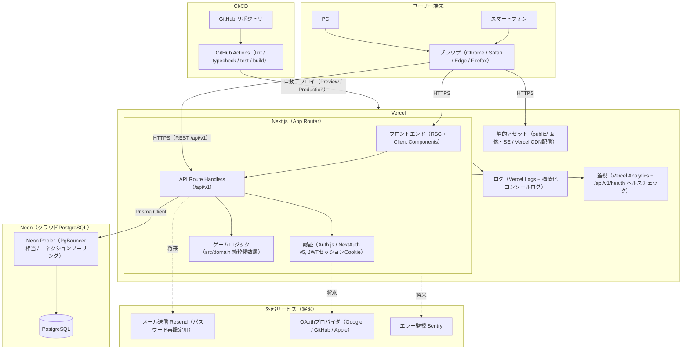
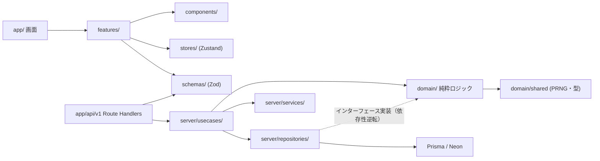

# 10. システム構成・技術選定書（System Architecture）

- 対象プロジェクト: Rogue Chronicle（ローグライトRPG / DEC-001）
- 目的: システム全体構成、技術スタックの選定理由、状態管理設計、ディレクトリ構成、サーバーレス制約への対処方針を定義し、実装時の技術判断の単一情報源とする
- 関連文書: CORE_SPEC（設計共通仕様）、11_Module_Design.md、12_Database_Design.md、13_API_Design.md、15_Save_Data_Design.md

---

## 1. システム構成図

### 1.1 全体構成



### 1.2 構成上の要点

| 項目 | 内容 |
|---|---|
| 配信 | Vercel Edge Network（CDN）でHTML/静的アセットを配信。日本リージョン（hnd1）を関数リージョンに指定 |
| API | REST（`/api/v1`、DEC-014）。Server Actionsは認証系フォーム（ログイン・登録）のみ限定利用可 |
| 認証 | Auth.js（NextAuth v5）JWT戦略。セッションCookieはHttpOnly + Secure + SameSite=Lax（DEC-006） |
| ゲームロジック | 戦闘計算・報酬抽選・乱数は全てサーバー側 `src/domain/` で実行（DEC-007）。クライアントは行動選択の送信と演出のみ |
| DB接続 | Prisma → Neon Pooler（pooled接続文字列）経由。マイグレーションのみdirect接続を使用 |
| デプロイ | GitHub push → GitHub Actions（CI）→ Vercel自動デプロイ。PRごとにPreview環境、mainブランチでProduction |
| 監視 | MVP: Vercel Analytics（Web Vitals）+ `/api/v1/health`（DBのSELECT 1確認）を外形監視（UptimeRobot無料枠を利用、仮決定 DEC-021）。将来Sentry導入（DEC-020） |
| ストレージ | 画像・効果音は `public/` に同梱しVercel CDN配信。外部オブジェクトストレージはMVPでは不要（アセット総量50MB以内を目安、仮決定 DEC-022） |

---

## 2. 技術選定表

各行は「採用理由 / 不採用とした代替 / 将来切り替える条件」を明記する。

| 技術 | 採用理由 | 不採用とした代替 | 将来切り替える条件 |
|---|---|---|---|
| Next.js（App Router）(DEC-004) | Vercelとの親和性が最高。RSCで初期表示を高速化（LCP 3秒以内目標）。API Route Handlersでフロント/APIを単一リポジトリ・単一デプロイに統合でき個人開発の運用コスト最小 | Remix（Vercel最適化が弱い）、SPA+Express分離（デプロイ2系統は個人開発では過剰）、SvelteKit（エコシステム規模） | Vercelから撤退する場合（コスト超過時）はNext.js standalone + Cloud Run等へ移行。App Router自体は継続 |
| TypeScript（strict） | ゲームロジック（ダメージ計算・run_state）の型安全が品質に直結。Prisma/Zodとの型連携 | JavaScript（型なしは戦闘計算の退行検知が不可能） | なし（恒久採用） |
| React | Next.js前提。エコシステム最大、shadcn/ui等の資産 | Vue/Svelte（Next.js採用により選択肢外） | なし（恒久採用） |
| Tailwind CSS (DEC-010) | ユーティリティファーストで画面数57（SCR-001〜407）を高速実装。ダークファンタジーテーマ（DEC-015）をtokenで一元管理 | CSS Modules（命名コスト）、styled-components（RSC非対応・ランタイムコスト） | なし。デザインシステム大規模化時もTailwind上で対応 |
| shadcn/ui (DEC-010) | コピー&オウン方式でゲームUI向けの深いカスタマイズが可能。Radix UIベースでアクセシビリティ担保 | MUI/Chakra（テーマ制約が強くゲームUIに不向き）、フルスクラッチ（ダイアログ・トースト等の再発明コスト） | なし |
| PostgreSQL (DEC-005) | JSONB（run_state, DEC-011）とトランザクション・行ロックが必須要件。Neonの無料枠 | MySQL（JSONB演算子・部分インデックスが弱い）、MongoDB（通貨処理でACID必須のため不採用）、SQLite（サーバーレス複数インスタンスと非互換 | なし |
| Prisma (DEC-005) | スキーマ駆動でマイグレーション管理が容易。型生成でrepository層の安全性確保。`$transaction`で楽観ロック実装が簡潔 | Drizzle（軽量だがマイグレーション運用実績で劣後）、生SQL+pg（保守コスト） | コールドスタート・バンドルサイズが問題化したらDrizzleへ移行（repository層に隔離済みのため影響局所） |
| Neon (DEC-005) | 下記2.1の比較参照。サーバーレスPostgreSQLでVercelと同世代のスケールtoゼロ・ブランチ機能。PITR 7日 | Supabase（下記比較）、PlanetScale（MySQL系・外部キー制約に難）、RDS（無料枠なし・運用重い） | 無料枠超過かつSupabaseの付加機能（Realtime等）が必要になった時。接続はDATABASE_URLのみ依存のため移行容易 |
| Auth.js（NextAuth v5）(DEC-006) | Next.js App Router公式対応。Credentials（メール/パスワード）+ ゲスト（匿名Credentials）をMVPで、将来OAuthを設定追加のみで拡張 | Clerk/Auth0（無料枠制限・ベンダーロック）、Lucia（開発終了アナウンス）、自作（セキュリティリスク） | Auth.jsのCredentials制約が障害になった場合のみ再検討 |
| Zustand (DEC-008) | 演出用クライアント状態に最適な軽量ストア（約1KB）。Provider不要でReduxより記述量1/3 | Redux Toolkit（本規模ではボイラープレート過剰）、Jotai（チーム学習コスト対効果）、React Contextのみ（再レンダリング制御困難） | 状態のタイムトラベルデバッグが必須になった場合Redux Toolkit（現時点で予定なし） |
| TanStack Query (DEC-008) | サーバー権威データ（run_state・戦闘状態）のキャッシュ・再検証・楽観更新を宣言的に管理。リトライ・エラーハンドリング内蔵 | SWR（mutation・楽観更新機能で劣後）、RSCのみ（ラン中のインタラクティブ更新に不足）、素のfetch+useEffect（キャッシュ整合の自作は事故源） | なし |
| Zod | APIの全入力をサーバー側検証（非機能要件）。スキーマからTS型を導出しフロント/API/domainで共有 | Yup（型推論が弱い）、valibot（エコシステム途上） | バンドルサイズが問題化したらvalibot検討 |
| React Hook Form (DEC-008) | 認証・設定フォームの検証をZod resolverで統合。非制御コンポーネントで再レンダリング最小 | Formik（メンテ停滞・性能）、自作 | なし（フォームは認証・設定のみで小規模） |
| Framer Motion (DEC-009) | 戦闘演出（ダメージ数値・HPバー・画面遷移）をReact宣言的に記述。spring物理・exitアニメが標準 | GSAP（ライセンス・React統合コスト）、react-spring（ドキュメント・機能面）、CSSのみ（シーケンス制御が困難） | 3章の切替条件参照（PixiJS部分導入） |
| Vitest | Vite互換で高速。domain層純粋関数のユニットテストに最適。Jest互換API | Jest（ESM対応・速度で劣後） | なし |
| Playwright | 主要フロー（登録→ラン→戦闘→リザルト）のE2E。スマホviewportエミュレーション対応 | Cypress（並列実行・複数タブで劣後） | なし |
| Vercel | Next.jsのゼロコンフィグデプロイ。Preview環境自動生成。無料Hobby枠でMVP運用可 | Cloudflare Pages（Next.js互換性が不完全）、AWS Amplify（設定コスト）、自前VPS（運用負荷） | Hobby枠超過（帯域100GB/月等）または商用化時にPro移行。コスト構造が合わなければCloud Run |
| GitHub Actions | GitHub一体でCI（lint/typecheck/test/build）。無料枠2,000分/月で十分 | CircleCI（別サービス管理コスト） | なし |
| Dependabot | 依存更新の自動PR。個人開発でのセキュリティ対応を省力化 | Renovate（設定柔軟だが本規模では過剰） | 更新PRのノイズが増えたらRenovateへ |

### 2.1 Neon vs Supabase 比較（DEC-005の根拠）

| 観点 | Neon | Supabase | 判定 |
|---|---|---|---|
| 本質 | 純粋なサーバーレスPostgreSQL | PostgreSQL + BaaS（Auth/Storage/Realtime同梱） | 本プロジェクトはAuth.js・Vercel CDNを採用済みでBaaS機能が重複 |
| コネクションプーリング | 内蔵Pooler（PgBouncer相当）をpooled接続文字列で提供 | Supavisor提供 | 同等 |
| スケールtoゼロ | あり（無料枠でアイドル時停止・コスト0） | 無料枠は1週間非アクティブでプロジェクト一時停止（復帰手動） | Neon優位（個人開発の低トラフィックに適合） |
| ブランチ機能 | DBブランチをPreviewデプロイごとに作成可能 | なし（別プロジェクトで代替） | Neon優位（Vercel Preview環境と連動） |
| バックアップ | PITR（無料枠で履歴保持、非機能要件の7日を満たす） | 日次バックアップ（無料枠は7日） | 同等 |
| ロックイン | 素のPostgreSQL。DATABASE_URL差し替えで移行可 | Auth/RLS/Edge Functionsに依存すると移行困難 | Neon優位 |
| 結論 | **採用** | 不採用 | Prisma+Auth.jsの構成ではNeonの「素のPostgres+サーバーレス特性」が最適（DEC-005） |

---

## 3. ゲーム演出技術の比較（DEC-009）

### 3.1 比較表

評価は個人開発観点の5段階（◎○△▲×）。

| 技術 | 個人開発難易度 | 性能 | 表現力 | React統合 | バンドル影響 | 評価 |
|---|---|---|---|---|---|---|
| CSS Animation | ◎ 学習コストほぼゼロ | ◎ GPU合成（transform/opacity）で60fps容易 | △ 単発の点滅・シェイク・フェード向き | ◎ classNameのみ | ◎ 0KB | **MVP採用** |
| Framer Motion | ○ React開発者なら1週間で習熟 | ○ transform中心なら60fps。大量要素同時は不利 | ○ シーケンス・spring・レイアウトアニメ・exit制御 | ◎ 宣言的コンポーネント | ○ 約30KB(gzip, LazyMotion使用時) | **MVP採用** |
| Canvas（2D素） | △ 描画ループ・座標計算を自作 | ○ 数百スプライトまで実用 | ○ パーティクル・軌跡可 | △ useRef+手動ループでReactと分断 | ◎ 0KB | 不採用 |
| PixiJS | △ シーングラフ学習要。@pixi/reactで緩和 | ◎ WebGLで数千パーティクル60fps | ◎ フィルタ・ブレンドモード・シェーダ | ○ @pixi/reactあり | △ 約100KB(gzip) | 不採用（**切替第一候補**） |
| Phaser | ▲ ゲームエンジン全体の学習が必要。シーン管理がReact/Next.jsと二重構造になる | ◎ WebGL | ◎ 物理・タイルマップ等フル機能 | ▲ Reactと状態同期が困難 | ▲ 約300KB(gzip) | 不採用 |
| Three.js | ▲ 3D数学・シーン構築の学習コスト大 | ○ 3D用途なら妥当 | ◎ 3D表現 | ○ react-three-fiberあり | △ 約150KB(gzip) | 不採用（3DはMVP除外範囲） |

### 3.2 MVPがCSS + Framer Motionで成立する根拠（DEC-009）

本作の演出要件を列挙し、全てCSS/Framer Motionで実現可能であることを確認した。

| 演出要件 | 実現手段 | 60fps成立根拠 |
|---|---|---|
| ダメージ数値ポップ | Framer Motion（y移動+フェード、AnimatePresence） | transform/opacityのみ＝コンポジタ処理 |
| HP/SPバー増減 | CSS transition（width→transformXスケール） | 同上 |
| 攻撃ヒット時の敵シェイク・点滅 | CSS keyframes（translate+filter: brightness） | 同時対象は敵最大3体（DEC-002）で負荷極小 |
| 画面遷移（マップ↔戦闘） | Framer Motion（フェード+スケール） | ページ単位1要素のみ |
| 状態異常アイコン・行動予告（intent）表示 | CSS Animation（pulse） | 同上 |
| カード（スキル3択）の出現・選択 | Framer Motion（stagger + spring） | 3要素のみ |
| ノードマップのスクロール・現在地強調 | CSS scroll-behavior + Framer Motion | 静的レイアウト |
| ボス怒りフェーズ演出 | CSSグラデーション+ vignette オーバーレイ | 1要素 |

ターン制コマンドバトル（DEC-002）は「常時描画ループ」を必要とせず、演出はユーザー操作起点の離散イベントである。したがってゲームエンジン級の描画基盤は過剰であり、DOMベースで成立する。またDOMベースであることでレスポンシブ対応・アクセシビリティ・テスト（Playwright）が通常のWeb技術で完結する。

### 3.3 切替条件と切替方針

| # | 切替条件（いずれか成立で発動） | 対応 |
|---|---|---|
| 1 | 実機（ミドルレンジAndroid）で戦闘演出が60fps未達（Chrome DevToolsのFPS計測で55fps未満が継続） | 演出簡略化を先に実施 → 改善しなければPixiJSを戦闘画面（SCR-302）の演出レイヤーにのみ部分導入 |
| 2 | パーティクル多用の演出（全体攻撃の火花・魔法陣等、同時100粒以上）が企画上必要になった時 | PixiJSを`features/battle/effects/`配下にCanvasオーバーレイとして部分導入。UI・ロジックはDOM/Reactのまま維持 |
| 3 | 3D表現が企画に入った時 | Three.js（react-three-fiber）を該当画面のみ導入。MVP除外範囲のため当面なし |

部分導入方式（DOMのUIレイヤー + Canvasの演出レイヤーを重ねる）とし、Phaserのような全面置換は行わない（仮決定 DEC-023）。domain層はレンダリング技術に非依存のため、切替の影響はfeatures層に限定される。

---

## 4. 状態管理設計（DEC-008）

### 4.1 状態の7分類と担当技術

| # | 分類 | 定義 | 担当技術 | 具体例 |
|---|---|---|---|---|
| 1 | サーバー状態 | DBが真実源のデータ。キャッシュとして保持 | TanStack Query（+初期表示はServer Components） | プレイヤー情報（API-102）、所持通貨（API-103）、キャラ一覧（API-201）、図鑑（API-601）、お知らせ（API-104） |
| 2 | クライアント状態 | 複数画面をまたぐUI設定・モード | Zustand（settingsStore） | 効果音ON/OFF・音量、演出スキップ設定、チュートリアル進行フラグ（LocalStorage永続化） |
| 3 | 画面状態 | 現在の画面・ナビゲーション文脈 | Next.js App Router（URL）+ URLパラメータ | `/dungeon/map`、`/codex?tab=relic`、キャラ詳細の選択ID |
| 4 | フォーム状態 | 入力中の値・検証エラー | React Hook Form + Zod | ログイン（SCR-003）、新規登録（SCR-004）、設定画面（SCR-116）の入力 |
| 5 | 戦闘状態 | 戦闘中の敵HP・ターン・行動キュー | **サーバー権威（DEC-007）**: TanStack Queryキャッシュ（API-401/402）。Zustandは演出用ローカルのみ（battlePresentationStore） | 敵HP・SP・状態異常（サーバー応答をキャッシュ）／ダメージポップ表示キュー・アニメ再生中フラグ（Zustand） |
| 6 | ダンジョン進行状態 | run_state（現在位置・所持品・ゴールド） | **サーバー権威（DEC-011）**: TanStack Queryキャッシュ（API-304）。Zustandはマップ表示位置等の演出用のみ | 現在階層・ノード位置・スキル・レリック・ゴールド（サーバー）／マップスクロール位置・ノード選択ホバー（Zustand） |
| 7 | 一時的UI状態 | 単一コンポーネント内で完結する短命状態 | React useState / useReducer | モーダル開閉、タブ選択、トースト表示、ボタン連打防止フラグ |

戦闘状態・ダンジョン進行状態の原則（DEC-007/DEC-011）:
- 真実源は常に `dungeon_runs.run_state`（サーバー）。クライアントはAPI-304/401の応答をTanStack Queryでキャッシュするだけで、独自に状態遷移を計算しない
- API-402（行動実行）等の変更系はmutation成功応答でキャッシュを`setQueryData`更新（楽観更新は行わない。仮決定 DEC-024。理由: 乱数を含む戦闘結果はクライアントで予測不能）
- Zustandの戦闘系ストアは「サーバー応答を演出として順次再生するためのキュー」のみを持ち、リロードで消えても整合性に影響しない

### 4.2 状態管理技術の比較表（DEC-008の根拠）

| 技術 | 得意領域 | 本プロジェクトでの役割 | 不採用/限定理由 |
|---|---|---|---|
| TanStack Query | サーバー状態のキャッシュ・再検証・mutation | **採用**: 分類1・5・6 | — |
| Zustand | 軽量グローバルクライアント状態 | **採用**: 分類2、5・6の演出用ローカル | — |
| React Context | 低頻度更新の依存注入 | 限定採用: テーマ・QueryClientProvider等のProvider類のみ | 高頻度更新（戦闘演出）で全子孫再レンダリング |
| Redux Toolkit | 大規模・厳格なフロー管理 | 不採用（CORE_SPEC §10） | 本規模ではボイラープレートが過剰。ZustandでDevTools連携も可能 |
| Server Components | 初期表示のサーバー取得 | 採用: ホーム・図鑑等の初期HTML | インタラクティブ更新は不可のためTanStack Queryと併用 |
| URLパラメータ | 共有・リロード耐性のある画面状態 | 採用: 分類3 | 秘匿データ・大容量データは不可 |
| LocalStorage | 端末ローカルの非重要データ永続化 | 限定採用: 4.3参照 | 改ざん可能なため進行データ禁止 |
| IndexedDB | 大容量ローカルデータ | 不採用（CORE_SPEC §10）: 将来PWAオフライン対応時に検討 | MVPにオフライン要件なし |

### 4.3 LocalStorage 保存可否の表

| 区分 | データ | 可否 | 理由 |
|---|---|---|---|
| 可 | 効果音ON/OFF・音量 | ○ | 端末固有の好み。失われても再設定のみ |
| 可 | 演出スキップ・アニメ速度設定 | ○ | 同上（サーバーのuser_settingsと併用、ログイン時にサーバー値を優先） |
| 可 | チュートリアル表示済みフラグ | ○ | 再表示されても実害なし |
| 可 | 最後に選択したキャラ・ダンジョンのcode（UI初期値） | ○ | 利便性のみ。真実源はサーバー |
| 可 | UIテーマ・文字サイズ | ○ | 表示設定 |
| **禁止** | run_state（ダンジョン進行・戦闘状態） | × | 改ざん・消失リスク。サーバー権威（DEC-007/011）に反する |
| **禁止** | 所持通貨（ゴールド・ソウルシャード）・所持品 | × | 改ざんで経済破壊。currency_transactionsで管理 |
| **禁止** | セッショントークン・パスワード | × | XSS時に窃取される。セッションはHttpOnly Cookieのみ |
| **禁止** | プレイヤーランク・実績・図鑑等の進行データ | × | 全てサーバー保存（CORE_SPEC §10） |

---

## 5. ディレクトリ構成（CORE_SPEC §9の詳細化）

### 5.1 ツリーと責務

```
src/
  app/                        # Next.js App Router。ルーティングとページ合成のみ（ロジック禁止）
    (auth)/                   #   認証系画面: login/ register/ guest/ → SCR-003〜006
    (home)/                   #   ホーム系画面: home/ characters/ upgrades/ codex/ settings/ → SCR-101〜118
    (run)/                    #   ラン系画面: dungeon/map/ dungeon/battle/ result/ → SCR-301〜407
    api/v1/                   #   Route Handlers。例: runs/current/battle/actions/route.ts (API-402)
      auth/ home/ player/ characters/ dungeons/ runs/ codex/ settings/ announcements/ achievements/ health/
    layout.tsx globals.css
  components/                 # 画面非依存の汎用UI。例: ui/(shadcn/ui生成物) Button, Dialog, Toast, StatBar
  features/                   # 画面単位のUIロジック（hooks + コンポーネント）。app/から参照される
    auth/ home/ character/ upgrade/ codex/
    dungeon-map/              #   例: NodeMapView.tsx, useSelectNode.ts
    battle/                   #   例: BattleScreen.tsx, useBattleActions.ts, effects/DamagePopup.tsx
    result/ settings/
  domain/                     # ★純粋ゲームロジック。Next.js/Prisma/React 非依存（5.2参照）
    battle/                   #   calculateDamage, determineTurnOrder, executePlayerAction, checkBattleEnd 等
    dungeon/                  #   generateDungeonMap, selectNextNode, validateRunState 等
    skill/                    #   generateSkillChoices, selectSkill 等
    enemy/                    #   selectEnemyAction, executeEnemyAction（敵AI）
    reward/                   #   calculateBattleReward, generateTreasureReward, generateShopItems 等
    progression/              #   gainExperience, levelUp, grantPersistentRewards 等
    shared/                   #   PRNG(mulberry32), 型定義(RunState, BattleState), 定数, Result型
  server/                     # サーバー専用コード（"server-only"パッケージでクライアント混入を防止）
    usecases/                 #   APIごとのユースケース＝トランザクション境界。例: executeBattleAction.ts (API-402)
    repositories/             #   Prismaアクセス実装。インターフェースはdomain側定義（依存性逆転）
    services/                 #   authService, rateLimitService, idempotencyService, loggingService
  lib/                        # 汎用ユーティリティ（apiClient, cn, date）
  hooks/                      # 汎用React hooks（useMediaQuery, useSound）
  stores/                     # Zustandストア（settingsStore, battlePresentationStore, mapViewStore）
  schemas/                    # Zodスキーマ（API入出力。server/とfeatures/の双方から参照）
  types/                      # 横断的な型（APIレスポンス型等。domain/shared由来の再export含む）
  constants/                  # 画面ID・ルート定数・エラーコード定数（ERR_*）
  config/                     # 環境変数の型付き読込（env.ts, Zodで検証）
prisma/                       # schema.prisma, migrations/, seed.ts（マスタデータ投入）
public/                       # 静的アセット（images/characters/, images/enemies/, se/）
tests/                        # unit/(Vitest, domain中心) e2e/(Playwright) fixtures/
docs/                         # 設計書（本書含む）
scripts/                      # 運用スクリプト（シード投入、マスタ検証）
```

### 5.2 domain層がNext.js/Prisma非依存である理由

1. **テスト容易性**: ダメージ計算式（CORE_SPEC §5.4）や敵AIはゲームの品質の核であり、DB・HTTPをモックせず純粋関数としてVitestで大量のケースを高速検証する必要がある
2. **サーバー権威の検証可能性（DEC-007/019）**: シード付きPRNGを入力に取る純粋関数にすることで、seed+rngCursorから戦闘結果を決定的に再現でき、チート検証・バグ再現が可能になる
3. **技術変更への耐性**: Prisma→Drizzle移行（2章）や演出技術切替（3章）が発生してもゲームロジックは無傷
4. **将来のネイティブ化（CORE_SPEC §1）**: domain層はランタイム非依存のため、将来のバランスシミュレータCLI・ネイティブアプリへ再利用可能

### 5.3 import制約ルール

| レイヤ | importしてよいもの | import禁止 |
|---|---|---|
| domain/ | domain/内、types/、constants/ | next/*, @prisma/client, react, server/*, features/*, zod（スキーマはschemas/に置きdomainは素の型のみ） |
| server/repositories/ | @prisma/client, domain/（インターフェース・型） | next/*（Request/Response不可）, features/*, components/* |
| server/usecases/ | domain/, server/repositories/, server/services/, schemas/ | react, features/*, components/* |
| app/api/ | server/usecases/, schemas/, server/services/ | domain/を直接呼ばない（必ずusecase経由。トランザクション・冪等性の漏れ防止） |
| features/, components/ | lib/, hooks/, stores/, schemas/, types/, constants/ | server/*, @prisma/client, domain/（表示用計算が必要な場合のみdomain/sharedの純粋関数を例外許可。仮決定 DEC-025） |

強制手段: ESLintの `import/no-restricted-paths`（eslint-plugin-import）+ `server-only` パッケージで機械的に検査し、CIのlintで違反を落とす。

### 5.4 依存方向図



矢印は「依存する側 → される側」。domain/はどのレイヤにも依存しない（shared除く）。循環依存はESLint（import/no-cycle）で禁止。

---

## 6. Vercelサーバーレス制約への対処

| 制約 | 内容 | 対処 |
|---|---|---|
| 関数実行時間 | Hobby枠は既定10秒（`maxDuration`設定上限60秒） | 全APIをタイムアウト10秒以内に設計（非機能要件）。重い処理は存在しない設計（1戦闘ターンの計算は数ms、マップ生成も10階層×最大4ノードで軽量）。バッチ的処理（図鑑一括更新等）はリザルト確定（API-307）1トランザクション内で完結する量に制限 |
| コールドスタート | アイドル後の初回リクエストで数百ms〜1秒超の遅延 | (1) Prisma Clientをモジュールスコープでシングルトン生成し再利用 (2) バンドル削減（Route Handlerごとに必要なusecaseのみimport）(3) ヘルスチェック外形監視（5分間隔）が実質的なウォームアップを兼ねる (4) p95 500ms目標はウォーム時基準とし、コールド時は操作応答1秒以内を許容ラインとする（仮決定 DEC-026） |
| DBコネクション枯渇 | サーバーレスは同時実行ごとに接続を張るためPostgreSQLの接続上限を突破しうる | **Neon Pooler（pooled接続文字列）を必ず使用**。Prismaの`DATABASE_URL`はpooled、`DIRECT_URL`（マイグレーション用）はdirect接続に分離。`connection_limit=1`を接続文字列に付与し関数あたり接続を最小化 |
| ステートレス | インスタンス間でメモリ共有不可 | セッションはJWT Cookie（DEC-006）、レート制限・冪等キーはDBテーブルで管理（インメモリ不可）。マスタデータキャッシュはインスタンスローカル+master_data_versionsで失効判定 |
| Neonのスケールtoゼロ | DBアイドル後の初回クエリに数百msの起動遅延 | 外形監視のヘルスチェック（DB疎通含む）が実質的にサスペンドを抑制。プレイ中は常時クエリがあるため影響は初回アクセスのみ |
| リージョン遅延 | 関数とDBのリージョン不一致でRTT増大 | Vercel関数リージョンを東京（hnd1）、Neonをap-southeast-1（シンガポール、東京提供時は東京へ移行）に固定し、関数↔DB間RTTを最小化（仮決定 DEC-027） |
| WebSocket不可 | サーバーレス関数で常時接続不可 | 本作はターン制でリアルタイム通信不要（リアルタイムマルチはMVP除外）。全てリクエスト/レスポンスで完結 |

---

## 未決事項

| ID | 内容 | 期限目安 |
|---|---|---|
| ISSUE-101 | Neonの東京リージョン提供状況の確認とリージョン最終決定（DEC-027の再確認） | 実装開始時 |
| ISSUE-102 | 外形監視サービスの最終選定（UptimeRobot無料枠 vs Vercel Cron自己監視、DEC-021） | MVPリリース前 |
| ISSUE-103 | 効果音アセットの配信方式（public同梱で50MB以内に収まるかの実測、DEC-022） | アセット制作時 |
| ISSUE-104 | Vercel Hobby→Pro移行の判断基準額（月間コスト上限）の設定 | MVPリリース後1ヶ月 |
| ISSUE-105 | features/からdomain/shared参照の例外許可（DEC-025）の範囲確定（表示用ダメージプレビュー等が本当に必要か） | UI実装時 |

## 実装時の注意点

1. Prismaの接続文字列は必ずpooled（Neon Pooler経由）を使用し、マイグレーションのみDIRECT_URLを使うこと。取り違えると本番で接続枯渇する
2. domain層に`import { PrismaClient }`や`next/server`が混入しないよう、ESLintルールを実装初日に設定する（後付けは違反の山になる）
3. 戦闘・ラン系mutationは楽観更新をしない（DEC-024）。TanStack Queryの`onSuccess`でサーバー応答をそのままキャッシュに反映する
4. LocalStorageへの書き込みは`stores/settingsStore.ts`のpersistミドルウェア経由に一元化し、4.3の禁止データが紛れ込む経路を作らない
5. Framer Motionは`LazyMotion + domAnimation`でバンドルを削減し、戦闘画面のアニメはtransform/opacityのみ使用（width/height/topアニメはレイアウト再計算で60fpsを壊す）
6. `/api/v1/health`はDB `SELECT 1`まで確認する実装とし、Vercel LogsでtraceId付き構造化ログ（JSON 1行）を出力する（DEC-020）
7. 環境変数は`src/config/env.ts`でZod検証してから使用する。未設定のままデプロイされる事故をビルド時に検出できる

## 関連設計書

- CORE_SPEC（設計共通仕様）— 用語・ID・数式の単一情報源
- 11_Module_Design.md — 本書のディレクトリ構成に配置されるモジュールの詳細
- 12_Database_Design.md — Neon/Prismaのスキーマ詳細・楽観ロック実装
- 13_API_Design.md — /api/v1 の各エンドポイント仕様・冪等性・レート制限
- 15_Save_Data_Design.md — run_state JSONBの構造とスナップショット世代管理
- 04_Non_Functional_Requirements.md — 性能・可用性目標値の詳細
