# 11. モジュール設計書（Module Design）

- 対象プロジェクト: Rogue Chronicle（ローグライトRPG / DEC-001）
- 目的: CORE_SPEC §9に定義された23モジュールの責務・インターフェース・依存関係を定義し、実装の分担単位とテスト単位を確定する
- 関連文書: CORE_SPEC（設計共通仕様）、10_System_Architecture.md、12_Database_Design.md、13_API_Design.md、15_Save_Data_Design.md

---

## 1. モジュール一覧と配置

モジュールは論理単位であり、物理配置は10_System_Architecture.md §5のレイヤ構成に従う。1モジュールは「domain/の純粋ロジック」「server/usecases/のユースケース」「server/repositories/の永続化」のいずれか、または複数レイヤの組で実装される（対応表は§4）。

| # | モジュール | 区分 | 主レイヤ | MVP |
|---|---|---|---|---|
| 1 | AuthModule | 認証 | server | ○ |
| 2 | UserModule | ユーザー | server | ○ |
| 3 | PlayerModule | プレイヤー | server | ○ |
| 4 | CharacterModule | マスタ+所持 | server + domain/shared | ○ |
| 5 | DungeonModule | ランライフサイクル | server + domain/dungeon | ○ |
| 6 | DungeonGenerationModule | マップ生成 | domain/dungeon | ○ |
| 7 | BattleModule | 戦闘 | domain/battle | ○ |
| 8 | EnemyAIModule | 敵AI | domain/enemy | ○ |
| 9 | SkillModule | スキル | domain/skill | ○ |
| 10 | EquipmentModule | 装備 | server + domain/shared | ○ |
| 11 | RelicModule | レリック | domain/battle 連携 | ○ |
| 12 | RewardModule | 報酬抽選 | domain/reward | ○ |
| 13 | EventModule | ランダムイベント | domain/dungeon | ○ |
| 14 | ProgressionModule | 成長（一時+永続） | domain/progression + server | ○ |
| 15 | AchievementModule | 実績 | server | ○ |
| 16 | MissionModule | ミッション | server | ×（将来・インターフェース予約のみ） |
| 17 | ShopModule | ショップ（ダンジョン内） | domain/reward + server | ○ |
| 18 | SaveModule | セーブ・再開 | server | ○ |
| 19 | MasterDataModule | マスタデータ | server | ○ |
| 20 | NotificationModule | お知らせ | server | ○ |
| 21 | AdminModule | 管理 | server | ×（将来・土台のみ、DEC-013） |
| 22 | LoggingModule | ロギング | server/services | ○ |
| 23 | AntiCheatModule | チート対策 | server/services + domain | ○ |

---

## 2. モジュール依存関係図

```mermaid
flowchart TB
    subgraph ApiLayer["app/api/v1（Route Handlers）"]
        RH["Route Handlers"]
    end

    subgraph ServerLayer["serverレイヤ（usecases / repositories / services）"]
        AuthM["AuthModule"]
        UserM["UserModule"]
        PlayerM["PlayerModule"]
        CharM["CharacterModule"]
        DungeonM["DungeonModule"]
        EquipM["EquipmentModule"]
        AchieveM["AchievementModule"]
        SaveM["SaveModule"]
        MasterM["MasterDataModule"]
        NotifyM["NotificationModule"]
        LogM["LoggingModule"]
        CheatM["AntiCheatModule"]
        MissionM["MissionModule（将来）"]
        AdminM["AdminModule（将来）"]
    end

    subgraph DomainLayer["domainレイヤ（純粋関数）"]
        GenM["DungeonGenerationModule"]
        BattleM["BattleModule"]
        AIM["EnemyAIModule"]
        SkillM["SkillModule"]
        RelicM["RelicModule"]
        RewardM["RewardModule"]
        EventM["EventModule"]
        ShopM["ShopModule（ロジック部）"]
        ProgM["ProgressionModule（ロジック部）"]
        SharedD["domain/shared（PRNG・型・Result）"]
    end

    RH --> AuthM
    RH --> UserM
    RH --> PlayerM
    RH --> CharM
    RH --> DungeonM
    RH --> AchieveM
    RH --> NotifyM

    DungeonM --> GenM
    DungeonM --> BattleM
    DungeonM --> RewardM
    DungeonM --> EventM
    DungeonM --> ShopM
    DungeonM --> SaveM
    DungeonM --> ProgM
    DungeonM --> EquipM
    DungeonM --> CheatM
    DungeonM --> MasterM

    BattleM --> AIM
    BattleM --> SkillM
    BattleM --> RelicM
    RewardM --> SkillM
    RewardM --> RelicM
    ProgM --> SkillM

    AuthM --> UserM
    PlayerM --> MasterM
    CharM --> MasterM
    EquipM --> MasterM
    AchieveM --> PlayerM
    UserM --> LogM
    AuthM --> LogM
    DungeonM --> LogM
    CheatM --> LogM
    MissionM -.-> PlayerM
    AdminM -.-> MasterM

    GenM --> SharedD
    BattleM --> SharedD
    AIM --> SharedD
    SkillM --> SharedD
    RelicM --> SharedD
    RewardM --> SharedD
    EventM --> SharedD
    ShopM --> SharedD
    ProgM --> SharedD
```



### 循環依存禁止のルール

1. 依存方向は必ず「api → server → domain → domain/shared」の一方向。逆流禁止
2. domainレイヤのモジュール間依存は上図の矢印のみ許可（BattleM→AIM/SkillM/RelicM、RewardM→SkillM/RelicM、ProgM→SkillM）。それ以外のdomain間参照が必要になった場合は共有ロジックをdomain/sharedへ降ろす
3. serverレイヤ内のモジュール間直接依存は禁止し、複数モジュールにまたがる処理はusecase（例: `finalizeRunUsecase`がDungeonM+ProgM+AchieveM+PlayerMを合成）が編成する。例外: 全モジュール→LoggingModule、認証必須usecase→AuthModuleのセッション検証
4. ESLint `import/no-cycle` + `import/no-restricted-paths` で機械検査し、CIで違反をブロック（10_System_Architecture.md §5.3）

---

## 3. モジュール詳細

各モジュールの記法: 公開インターフェースはTypeScript型シグネチャ。`Result<T, E>`は`{ ok: true, value: T } | { ok: false, error: E }`（domain/shared定義）。`Rng`はシード付きPRNG（mulberry32相当、DEC-019）のインターフェース `{ next(): number; cursor: number }`。

### 3.1 AuthModule

| 項目 | 内容 |
|---|---|
| 責務 | 登録・ログイン・ゲスト開始・ゲスト引き継ぎ・ログアウト・退会・セッション検証（Auth.js JWT戦略、DEC-006）。パスワードハッシュ（bcrypt）とログイン試行ロック（5回失敗で15分） |
| 入力 | メール/パスワード、ゲストトークン、セッションCookie |
| 出力 | セッション（JWT Cookie）、ユーザーID、認証エラー |
| 依存先 | UserModule（初期プロフィール作成）、LoggingModule |
| 使用テーブル | users, auth_sessions, password_reset_tokens（将来） |
| 関連API | API-001, API-002, API-003, API-004, API-005, API-006, API-007（将来）, API-008 |
| 発生エラー | ERR_AUTH_INVALID_CREDENTIALS, ERR_AUTH_UNAUTHORIZED, ERR_AUTH_SESSION_EXPIRED, ERR_AUTH_LOCKED, ERR_VALIDATION, ERR_RATE_LIMITED |

```ts
// server/usecases/auth/*, server/services/authService.ts
function registerUser(input: { email: string; password: string }): Promise<Result<{ userId: string }, AuthError>>;
function loginUser(input: { email: string; password: string; ip: string }): Promise<Result<Session, AuthError>>;
function startGuest(): Promise<Result<{ userId: string; session: Session }, AuthError>>; // users.is_guest=true
function linkGuestAccount(input: { guestUserId: string; email: string; password: string }): Promise<Result<{ userId: string }, AuthError>>;
function verifySession(cookie: string): Promise<Result<{ userId: string; isGuest: boolean }, AuthError>>;
function deleteAccount(userId: string): Promise<Result<void, AuthError>>; // 論理削除+個人情報匿名化
```

テスト観点: 誤パスワード5回で423ロック→15分後解除 / ゲスト引き継ぎ後に旧ゲストトークンが無効 / 退会後のセッションが401 / 重複メール登録の拒否 / セッション有効期限（24h/最大30日）。

### 3.2 UserModule

| 項目 | 内容 |
|---|---|
| 責務 | ユーザープロフィール（表示名等）と設定（音量・演出設定）のCRUD。退会時の関連データ削除の編成 |
| 入力 | userId、プロフィール/設定の更新値 |
| 出力 | プロフィール、設定オブジェクト |
| 依存先 | LoggingModule |
| 使用テーブル | user_profiles, user_settings, users |
| 関連API | API-004（プロフィール込みの自分情報）, API-602, API-603 |
| 発生エラー | ERR_AUTH_UNAUTHORIZED, ERR_VALIDATION, ERR_NOT_FOUND |

```ts
function getUserProfile(userId: string): Promise<Result<UserProfile, AppError>>;
function updateUserProfile(userId: string, patch: { displayName?: string; avatarCode?: string }): Promise<Result<UserProfile, AppError>>;
function getUserSettings(userId: string): Promise<Result<UserSettings, AppError>>;
function updateUserSettings(userId: string, patch: Partial<UserSettings>): Promise<Result<UserSettings, AppError>>;
function purgeUserData(userId: string): Promise<Result<void, AppError>>; // 退会時にAuthModuleから呼ばれる
```

テスト観点: 表示名のバリデーション（長さ・禁止文字）/ 設定の部分更新が他項目を壊さない / 他ユーザーの設定へアクセス不可（403）。

### 3.3 PlayerModule

| 項目 | 内容 |
|---|---|
| 責務 | プレイヤーランク・統計（player_progress）、通貨残高（player_currencies）、通貨増減の記録（currency_transactions）、図鑑（player_codex, DEC-018）の照会と更新。通貨のアトミックな加減算 |
| 入力 | userId、通貨増減要求（種別・量・理由）、図鑑登録要求 |
| 出力 | ランク/統計、通貨残高、図鑑エントリ一覧 |
| 依存先 | MasterDataModule（図鑑全件マスタ）、LoggingModule |
| 使用テーブル | player_progress, player_currencies, currency_transactions, player_codex |
| 関連API | API-101, API-102, API-103, API-601 |
| 発生エラー | ERR_AUTH_UNAUTHORIZED, ERR_INSUFFICIENT_SHARDS, ERR_NOT_FOUND, ERR_CONFLICT_VERSION |

```ts
function getPlayerSummary(userId: string): Promise<Result<PlayerSummary, AppError>>; // ランク・統計・通貨（API-101/102）
function getCurrencies(userId: string): Promise<Result<{ soulShards: number }, AppError>>;
function addSoulShards(tx: Tx, userId: string, amount: number, reason: TransactionReason): Promise<Result<number, AppError>>; // 残高返却+取引ログ
function spendSoulShards(tx: Tx, userId: string, amount: number, reason: TransactionReason): Promise<Result<number, AppError>>; // 不足時ERR_INSUFFICIENT_SHARDS
function getCodex(userId: string, entryType?: CodexEntryType): Promise<Result<CodexEntry[], AppError>>;
function registerCodexEntries(tx: Tx, userId: string, entries: { entryType: CodexEntryType; code: string }[]): Promise<Result<void, AppError>>; // 冪等（重複はスキップ）
```

テスト観点: 残高不足で422かつ残高不変 / 加減算とcurrency_transactionsが同一トランザクションで整合 / 図鑑重複登録が冪等 / 並行減算で残高が負にならない（行ロック）。

### 3.4 CharacterModule

| 項目 | 内容 |
|---|---|
| 責務 | キャラマスタ（characters）照会、所持状態（player_characters）管理、キャラ解放（ソウルシャード消費 or 実績条件、CORE_SPEC §5.5）。ラン開始時の初期ステータス組み立て |
| 入力 | userId、characterId、解放要求 |
| 出力 | キャラ一覧（解放状態付き）、初期ステータス |
| 依存先 | MasterDataModule、PlayerModule（シャード消費）、AchievementModule（解放条件判定の照会）、LoggingModule |
| 使用テーブル | characters, player_characters |
| 関連API | API-201, API-202, API-203 |
| 発生エラー | ERR_NOT_FOUND, ERR_INSUFFICIENT_SHARDS, ERR_VALIDATION（解放条件未達）, ERR_CONFLICT_VERSION（解放の二重実行） |

```ts
function listCharacters(userId: string): Promise<Result<CharacterListItem[], AppError>>; // 解放状態・解放条件込み
function getCharacterDetail(userId: string, characterCode: string): Promise<Result<CharacterDetail, AppError>>;
function unlockCharacter(userId: string, characterCode: string, idempotencyKey: string): Promise<Result<UnlockResult, AppError>>;
function buildInitialCharacterState(master: CharacterMaster, upgrades: AppliedUpgrade[]): RunCharacterState; // 純粋関数。永続強化補正を適用
```

テスト観点: 未解放キャラでのラン開始拒否 / 解放の二重リクエストが冪等 / 永続強化（初期HP+5%等）が初期ステータスへ正しく乗算 / 成長率係数0.8〜1.2の反映。

### 3.5 DungeonModule

| 項目 | 内容 |
|---|---|
| 責務 | ランのライフサイクル管理（開始・ノード選択・進行フェーズ遷移・リタイア・完了・リザルト確定）。run_state（DEC-011）の版管理と各domainモジュールの編成。ラン系usecaseのトランザクション境界を持つ |
| 入力 | userId、開始パラメータ（dungeonId, characterCode, 初期装備）、ノード選択、Idempotency-Key、version |
| 出力 | run_state（クライアント公開ビュー）、リザルト |
| 依存先 | DungeonGenerationModule, BattleModule, RewardModule, EventModule, ShopModule, EquipmentModule, ProgressionModule, SaveModule, AntiCheatModule, MasterDataModule, LoggingModule |
| 使用テーブル | dungeon_runs, dungeons, dungeon_difficulties, dungeon_node_types |
| 関連API | API-301, API-302, API-303, API-304, API-305, API-306, API-307 |
| 発生エラー | ERR_RUN_ALREADY_ACTIVE, ERR_RUN_STATE_INVALID, ERR_CONFLICT_VERSION, ERR_DUPLICATE_REQUEST, ERR_INVALID_ACTION, ERR_NOT_FOUND, ERR_REWARD_ALREADY_CLAIMED |

```ts
function startDungeonRun(userId: string, input: { dungeonCode: string; characterCode: string; equipment: InitialEquipment }, idemKey: string): Promise<Result<RunView, AppError>>; // seed生成→マップ生成→run_state初期化
function getCurrentRun(userId: string): Promise<Result<RunView | null, AppError>>; // API-304（再開兼用）
function selectNextNode(userId: string, input: { nodeId: string; version: number }, idemKey: string): Promise<Result<RunView, AppError>>; // 戦闘ノードなら戦闘状態を生成して返す（API仕様補足）
function retireRun(userId: string, version: number, idemKey: string): Promise<Result<RunResultView, AppError>>; // シャード80%
function finalizeRun(userId: string, version: number, idemKey: string): Promise<Result<FinalizeResult, AppError>>; // 報酬受領→player_*反映→status: finalized
function selectNextNodePure(runState: RunState, nodeId: string): Result<RunState, DomainError>; // domain/dungeon の純粋遷移関数
```

テスト観点: アクティブラン重複開始で409 / 到達不能ノード選択で422 / versionずれで409かつ状態不変 / 同一Idempotency-Keyの再送が初回応答を返す / リタイア80%・敗北50%・クリア100%のシャード係数 / finalize二重実行で ERR_REWARD_ALREADY_CLAIMED。

### 3.6 DungeonGenerationModule

| 項目 | 内容 |
|---|---|
| 責務 | シード付きPRNGによるノードマップ生成（DEC-003/019）。CORE_SPEC §5.6の生成制御（階層5・9にREST必須、SHOP1〜2個、ELITE階層3以降、同一タイプ3連続禁止、SECRET10%、常にボス到達可能）を保証する純粋関数群 |
| 入力 | seed、dungeons.generation_config（JSONB）、難易度 |
| 出力 | マップ構造（floors[], edges[]）＝run_state.mapの初期値 |
| 依存先 | domain/shared（Rng）のみ |
| 使用テーブル | なし（マスタはgeneration_configとして引数で受領） |
| 関連API | API-303（startDungeonRun内部で使用。単独APIなし） |
| 発生エラー | ERR_INTERNAL（生成制約が充足不能な場合。configの静的検証で通常は防止） |

```ts
// src/domain/dungeon/
function generateDungeonSeed(entropy: Uint32Array): number; // 32bit seed（サーバーのCSPRNG入力）
function generateDungeonMap(seed: number, config: GenerationConfig): Result<DungeonMap, DomainError>;
function validateMapConstraints(map: DungeonMap, config: GenerationConfig): Result<void, DomainError>; // 生成後の全制約検査
function listSelectableNodes(map: DungeonMap, position: RunPosition): NodeId[]; // 次階層の接続先
function rollSecretNode(rng: Rng, floorNo: number): boolean; // SECRET 10%
```

テスト観点: 同一seedで同一マップ（再現性）/ 1000シード生成で全制約（REST配置・SHOP数・ELITE階層・3連続禁止・ボス到達可能性）を満たす統計テスト / 階層1=1ノード・階層10=ボス1ノード / ノード数2〜4の範囲。

### 3.7 BattleModule

| 項目 | 内容 |
|---|---|
| 責務 | ターン制戦闘（DEC-002）の状態遷移を担う純粋関数群。行動順決定・ダメージ/クリティカル/回避計算（CORE_SPEC §5.4の式）・状態異常/バフ処理・SP管理・逃走判定・勝敗判定。全計算はサーバー側（DEC-007） |
| 入力 | BattleState（run_state.battle）、プレイヤー行動、Rng、マスタ（敵・スキル） |
| 出力 | 新BattleState + 演出用イベント列（BattleEvent[]）+ 終了時は戦闘結果 |
| 依存先 | EnemyAIModule, SkillModule, RelicModule, domain/shared |
| 使用テーブル | なし（純粋関数）。ログ永続化はDungeonModule経由でbattle_logs |
| 関連API | API-401, API-402（usecase: getBattleState / executeBattleAction） |
| 発生エラー | ERR_INVALID_ACTION（SP不足・対象不正・逃走不可戦闘での逃走等）, ERR_RUN_STATE_INVALID |

```ts
// src/domain/battle/
function startBattle(character: RunCharacterState, enemies: EnemyMaster[], context: BattleContext, rng: Rng): BattleState;
function determineTurnOrder(units: CombatUnit[]): CombatUnit[]; // spd降順・同値プレイヤー優先
function calculateDamage(attacker: CombatStats, defender: CombatStats, skillMult: number, element: Element, rng: Rng): DamageResult; // §5.4式そのまま
function executePlayerAction(state: BattleState, action: PlayerAction, masters: BattleMasters, rng: Rng): Result<BattleStepResult, DomainError>; // 攻撃/スキル/防御/アイテム/逃走
function executeEnemyTurns(state: BattleState, masters: BattleMasters, rng: Rng): BattleStepResult; // EnemyAIModuleで行動選択→実行→intent更新
function applyStatusEffect(target: CombatUnit, effect: StatusEffectInput, rng: Rng): StatusApplyResult; // 成功率×(100-statusRes)/100
function checkBattleEnd(state: BattleState): BattleEndCheck; // victory / defeat / escaped / ongoing
```

テスト観点: ダメージ式の境界（def0、最小ダメージ1、rand0.90〜1.10の範囲）/ 命中clamp(50,100) / 属性相性1.25/0.75/1.0と無属性等倍 / 麻痺30%・スタン1回の行動不能 / 同一seedで戦闘全体が再現 / ボス・エリート逃走不可 / 逃走成功率clamp(20,90) / 不屈（致死をHP1で1回耐える）。

### 3.8 EnemyAIModule

| 項目 | 内容 |
|---|---|
| 責務 | 「重み付き行動テーブル+条件ルール（優先評価）」方式の敵行動選択（CORE_SPEC §5.7、完全ランダム禁止）。次ターンの行動予告（intent）決定。ボスのフェーズ制御（HP50%怒り等） |
| 入力 | 敵の現在状態、戦闘状況（ターン数・味方/敵HP）、enemy_actions/enemy_ai_rulesマスタ、Rng |
| 出力 | 選択された行動（EnemyAction）とintent |
| 依存先 | domain/shared |
| 使用テーブル | なし（enemies, enemy_actions, enemy_ai_rulesのマスタを引数で受領） |
| 関連API | なし（API-402の内部でBattleModule経由） |
| 発生エラー | ERR_INTERNAL（行動テーブル空等のマスタ不整合。シード投入時検証で防止） |

```ts
// src/domain/enemy/
function selectEnemyAction(enemy: EnemyUnit, situation: BattleSituation, rules: EnemyAiRule[], actions: EnemyActionMaster[], rng: Rng): EnemyActionMaster; // ルール優先評価→残りは重み抽選
function decideIntent(enemy: EnemyUnit, nextAction: EnemyActionMaster): Intent; // 全敵に行動予告
function evaluateRuleCondition(rule: EnemyAiRule, situation: BattleSituation): boolean; // hp_below/every_n_turns/ally_count等
function updateBossPhase(boss: EnemyUnit, situation: BattleSituation): PhaseTransition | null; // 遺跡の守護者3フェーズ
```

テスト観点: 条件ルールが重み抽選より優先（オークチャンピオンの2ターンごと強撃）/ ボスHP50%でatk+30%の怒り発動が1回のみ / 重み抽選の分布検定（1万試行）/ intentが実際の行動と常に一致 / 召喚（dark_shaman→slime）の敵数上限3体。

### 3.9 SkillModule

| 項目 | 内容 |
|---|---|
| 責務 | スキルマスタ（skills+skill_effects、マスタ駆動）の効果解決、スキル3択候補生成（レア度重みcommon60/rare30/epic10）、リロール、スキル強化（同一再取得でLv+1、最大3）、所持上限8枠の管理 |
| 入力 | 所持スキル、レベルアップ文脈、skill_effectsマスタ、Rng |
| 出力 | スキル効果の適用結果、3択候補、更新後スキルリスト |
| 依存先 | domain/shared |
| 使用テーブル | なし（skills, skill_effectsのマスタを引数で受領） |
| 関連API | API-501, API-502（usecase側はProgressionModuleと合成） |
| 発生エラー | ERR_INVALID_ACTION（候補外選択・リロール回数超過・8枠超過で削除未指定）, ERR_VALIDATION |

```ts
// src/domain/skill/
function resolveSkillEffects(skill: SkillMaster, level: number, caster: CombatUnit, targets: CombatUnit[], rng: Rng): SkillEffectResult[]; // effect_type(damage/heal/buff/...)+params JSONBの解決
function generateSkillChoices(owned: OwnedSkill[], pool: SkillMaster[], characterCode: string, rng: Rng): SkillChoice[]; // 3件。レア度重み60/30/10
function selectSkill(owned: OwnedSkill[], choice: SkillChoice): Result<OwnedSkill[], DomainError>; // 新規追加 or 強化Lv+1（最大3）
function rerollChoices(state: LevelUpState, pool: SkillMaster[], rng: Rng): Result<LevelUpState, DomainError>; // 残回数チェック（基本1回/ラン+永続強化）
function removeSkill(owned: OwnedSkill[], skillCode: string): Result<OwnedSkill[], DomainError>; // 休憩/イベントでの削除
function getSkillSpCost(skill: SkillMaster, level: number): number;
```

テスト観点: 3択のレア度分布検定 / 所持済みスキルが候補に出た場合の強化表示 / 強化Lv3超過の候補除外 / 8枠上限 / リロール残0で422 / effect_typeごとのparams解決（damage_aoe対象数、shield値等）/ SP不足時の使用不可。

### 3.10 EquipmentModule

| 項目 | 内容 |
|---|---|
| 責務 | 装備マスタ（equipment 1テーブル+slot列、DEC-017）の照会、永続解放装備（player_equipment）管理、ラン内装備変更（weapon/armor/accessory各1枠）とステータス補正計算。MVPは固定値オプションのみ |
| 入力 | userId、装備変更要求、equipmentマスタ |
| 出力 | 装備一覧、装備適用後ステータス |
| 依存先 | MasterDataModule, LoggingModule |
| 使用テーブル | equipment, player_equipment |
| 関連API | API-507（ラン内変更）、API-303の初期装備選択、武器一覧はAPI-102/201系画面で使用 |
| 発生エラー | ERR_NOT_FOUND, ERR_INVALID_ACTION（未所持装備の指定・slot不一致）, ERR_VALIDATION |

```ts
function listUnlockedEquipment(userId: string, slot?: EquipmentSlot): Promise<Result<EquipmentItem[], AppError>>; // 初期装備候補（SCR-205）
function applyEquipmentStats(base: CombatStats, equipped: EquippedSet, masters: EquipmentMaster[]): CombatStats; // 純粋関数
function changeRunEquipment(runState: RunState, input: { slot: EquipmentSlot; equipmentCode: string | null }, masters: EquipmentMaster[]): Result<RunState, DomainError>; // ラン内所持品からのみ
function unlockEquipment(tx: Tx, userId: string, equipmentCode: string): Promise<Result<void, AppError>>; // 永続解放（冪等）
```

テスト観点: slot不一致（weaponをarmor枠）で422 / 装備解除（null）の可否 / 補正値の加算順序（基礎→装備→バフ）/ ラン内未所持装備の指定拒否 / 永続解放の冪等性。

### 3.11 RelicModule

| 項目 | 内容 |
|---|---|
| 責務 | レリックのtrigger（always/battle_start/turn_start/turn_end/on_low_hp/on_kill/node_enter）+effect JSONBの解決。同一レリック重複不可の検査。呪い付きレリックの負効果適用 |
| 入力 | 所持レリック、トリガー種別と文脈、relicsマスタ |
| 出力 | 発動効果のリスト（ステータス補正・回復・資源獲得等） |
| 依存先 | domain/shared |
| 使用テーブル | なし（relicsマスタを引数で受領） |
| 関連API | API-508（取得確定）。発動はAPI-402/305等の内部 |
| 発生エラー | ERR_INVALID_ACTION（重複取得）, ERR_REWARD_ALREADY_CLAIMED |

```ts
// src/domain/battle/relic.ts（BattleModuleから呼ばれる）ほか
function fireRelicTrigger(relics: OwnedRelic[], trigger: RelicTrigger, context: TriggerContext, masters: RelicMaster[], rng: Rng): RelicEffectResult[];
function canAcquireRelic(owned: OwnedRelic[], relicCode: string): Result<void, DomainError>; // 重複不可
function acquireRelic(runState: RunState, relicCode: string, masters: RelicMaster[]): Result<RunState, DomainError>;
function getPassiveStatModifiers(relics: OwnedRelic[], masters: RelicMaster[]): StatModifier[]; // trigger=always分
```

テスト観点: 各trigger種別の発動タイミング網羅 / 重複取得409 / on_low_hpの閾値境界 / 呪いレリックの正負両効果適用 / always補正が戦闘開始時に反映。

### 3.12 RewardModule

| 項目 | 内容 |
|---|---|
| 責務 | reward_tablesに基づく抽選（戦闘報酬・宝箱・ドロップ）。獲得EXP計算（§5.4式）、ゴールド・装備・レリック・アイテムの抽選。未受領報酬（pendingReward）の生成 |
| 入力 | 報酬文脈（敵種別・階層・ノードタイプ）、reward_tablesマスタ、Rng |
| 出力 | 報酬内容（RewardBundle）、pendingReward |
| 依存先 | SkillModule（スキル報酬候補）、RelicModule（レリック抽選の重複除外）、domain/shared |
| 使用テーブル | なし（reward_tablesマスタを引数で受領） |
| 関連API | API-503（宝箱開封）。API-402（戦闘勝利報酬）・API-506等の内部でも使用 |
| 発生エラー | ERR_REWARD_ALREADY_CLAIMED, ERR_INVALID_ACTION |

```ts
// src/domain/reward/
function calculateBattleReward(enemies: DefeatedEnemy[], floorNo: number, difficulty: Difficulty, table: RewardTable, rng: Rng): RewardBundle; // EXP式: baseExp×(1+0.10×(floor-1))×difficultyExpMod
function generateTreasureReward(floorNo: number, isSecret: boolean, table: RewardTable, context: RewardContext, rng: Rng): RewardBundle; // SECRETは上位報酬
function rollEquipmentDrop(floorNo: number, table: RewardTable, rng: Rng): EquipmentDrop | null; // レア度common/rare/epic
function claimPendingReward(runState: RunState, selection: RewardSelection): Result<RunState, DomainError>; // claimed済みなら失敗
```

テスト観点: EXP式の階層係数 / レア度分布検定 / 所持済みレリックが抽選から除外 / pendingRewardの二重受領409 / 同一seedで同一報酬（再現性）。

### 3.13 EventModule

| 項目 | 内容 |
|---|---|
| 責務 | ランダムイベント（EVENT/BLESS/HEAL/CURSE/STORY/SECRET）の抽選と選択肢解決。random_events+random_event_choicesマスタ駆動。効果（ステータス増減・ゴールド・レリック・呪い等）のrun_stateへの適用 |
| 入力 | ノードタイプ、run_state、random_eventsマスタ、Rng |
| 出力 | イベント提示内容、選択結果適用後のrun_state |
| 依存先 | RewardModule（報酬系効果）、domain/shared |
| 使用テーブル | なし（random_events, random_event_choicesマスタを引数で受領） |
| 関連API | API-506 |
| 発生エラー | ERR_INVALID_ACTION（提示外の選択肢・条件未達の選択肢）, ERR_RUN_STATE_INVALID |

```ts
// src/domain/dungeon/event.ts
function drawRandomEvent(nodeType: NodeType, floorNo: number, events: RandomEventMaster[], history: string[], rng: Rng): RandomEventMaster; // 同一ラン内の重複を抑制
function listAvailableChoices(event: RandomEventMaster, runState: RunState): EventChoiceView[]; // 条件（ゴールド量等）で選択肢をロック
function executeRandomEvent(runState: RunState, eventCode: string, choiceCode: string, masters: EventMasters, rng: Rng): Result<EventOutcome, DomainError>;
function applyRestChoice(runState: RunState, choice: 'heal_50' | 'upgrade_skill', skillCode?: string): Result<RunState, DomainError>; // 休憩二択（API-505）
```

テスト観点: 選択肢条件（ゴールド不足時のロック）/ 提示外選択で422 / HEAL/CURSEの効果値適用 / 休憩のHP50%回復が maxHp 基準 / スキル強化選択の対象検証 / イベント重複抑制。

### 3.14 ProgressionModule

| 項目 | 内容 |
|---|---|
| 責務 | 一時成長（ラン内レベル: expToNext(L)=floor(20×L^1.5)、上限20、レベルアップ成長率）と永続成長（プレイヤーランク: expToRank(R)=100×R^1.8、上限50 / 永続強化ツリーupgrade_nodes 12ノード、DEC-011関連）。リザルトでの永続報酬付与 |
| 入力 | 獲得EXP、run_state.character、永続強化購入要求 |
| 出力 | レベルアップ結果（スキル3択トリガー含む）、ランク・強化ツリー状態 |
| 依存先 | SkillModule（レベルアップ時の3択生成）、PlayerModule（シャード消費・ランクEXP付与）、MasterDataModule、domain/shared |
| 使用テーブル | upgrade_nodes, player_upgrades, player_progress |
| 関連API | API-204（永続強化実行）、API-501/502（レベルアップ、SkillModuleと合成）、API-307（finalize内の永続付与） |
| 発生エラー | ERR_INSUFFICIENT_SHARDS, ERR_VALIDATION（前提ノード未取得・最大段数超過）, ERR_CONFLICT_VERSION |

```ts
// src/domain/progression/ + server/usecases/
function gainExperience(character: RunCharacterState, exp: number): ExpGainResult; // 複数レベル一括対応、上限20
function levelUp(character: RunCharacterState, growthRates: GrowthRates): RunCharacterState; // maxHp+8% atk+5% def+5% spd+2%×係数、HP割合維持
function grantPersistentRewards(tx: Tx, userId: string, earned: RunEarnings, resultType: 'cleared' | 'failed' | 'retired'): Promise<Result<PersistentGrantResult, AppError>>; // シャード係数100/50/80%
function gainRankExp(progress: PlayerProgress, exp: number): RankGainResult; // expToRank(R)=100×R^1.8、上限50
function purchaseUpgradeNode(userId: string, nodeCode: string, idemKey: string): Promise<Result<UpgradeTreeView, AppError>>; // API-204
function getAppliedUpgrades(userId: string): Promise<Result<AppliedUpgrade[], AppError>>; // ラン開始時補正の取得
```

テスト観点: expToNext/expToRankの式一致 / レベル20到達後のEXP破棄 / レベルアップでHP割合維持（全回復しない）/ ランクアップの複数段一括 / 強化ツリーの前提関係・段数上限 / 総和+30%制限の検証 / finalize時のシャード係数3種。

### 3.15 AchievementModule

| 項目 | 内容 |
|---|---|
| 責務 | 実績（MVP10個）の進捗更新と解除判定。実績解除によるキャラ解放条件（rogue_gald=累計ラン10回）への通知。解除トースト（SCR-407）用の未通知管理 |
| 入力 | ゲームイベント（ラン完了・撃破数等の統計更新） |
| 出力 | 実績一覧（進捗付き）、新規解除リスト |
| 依存先 | PlayerModule（統計参照）、MasterDataModule、LoggingModule |
| 使用テーブル | achievements, player_achievements |
| 関連API | API-106 |
| 発生エラー | ERR_NOT_FOUND, ERR_AUTH_UNAUTHORIZED |

```ts
function listAchievements(userId: string): Promise<Result<AchievementView[], AppError>>;
function evaluateAchievements(tx: Tx, userId: string, stats: PlayerStats): Promise<Result<UnlockedAchievement[], AppError>>; // finalize内で呼ばれ新規解除を返す
function markAchievementsNotified(userId: string, codes: string[]): Promise<Result<void, AppError>>;
function isAchievementUnlocked(userId: string, code: string): Promise<Result<boolean, AppError>>; // キャラ解放条件判定用
```

テスト観点: 解除の冪等性（再評価で二重解除しない）/ 累計ラン10回でrogue_gald解放可能に / 進捗カウントの正確性 / 未通知→通知済みの遷移。

### 3.16 MissionModule（将来・インターフェース予約のみ）

| 項目 | 内容 |
|---|---|
| 責務 | デイリー/ウィークリーミッションの進捗・達成・報酬受領。**MVPでは実装しない**（CORE_SPEC §11除外範囲）。インターフェースと将来テーブル（missions, player_missions）の予約のみ行う |
| 依存先（予定） | PlayerModule, MasterDataModule |
| 使用テーブル（予定） | missions, player_missions |
| 関連API | API-105（×将来） |
| 発生エラー（予定） | ERR_NOT_FOUND, ERR_REWARD_ALREADY_CLAIMED |

```ts
// 予約のみ。MVPでは実装ファイルを作成しない
interface MissionModulePort {
  listMissions(userId: string): Promise<Result<MissionView[], AppError>>;
  updateMissionProgress(tx: Tx, userId: string, event: GameEvent): Promise<Result<void, AppError>>;
  claimMissionReward(userId: string, missionCode: string, idemKey: string): Promise<Result<RewardBundle, AppError>>;
}
```

テスト観点: 将来実装時に定義。

### 3.17 ShopModule

| 項目 | 内容 |
|---|---|
| 責務 | ダンジョン内ショップ（SHOPノード、SCR-306）の品揃え生成（seed駆動）と購入処理（ゴールド消費、run_state内で完結）。拠点ショップ（SCR-113）は将来 |
| 入力 | run_state、階層、reward_tables/equipment/skillsマスタ、Rng、購入要求 |
| 出力 | 品揃え、購入後run_state |
| 依存先 | RewardModule（品揃え抽選の素材）、domain/shared |
| 使用テーブル | なし（マスタを引数で受領。品揃えはrun_state内に保存） |
| 関連API | API-504 |
| 発生エラー | ERR_INSUFFICIENT_GOLD, ERR_INVALID_ACTION（売り切れ・品揃え外）, ERR_RUN_STATE_INVALID |

```ts
// src/domain/reward/shop.ts
function generateShopItems(floorNo: number, masters: ShopMasters, rng: Rng): ShopInventory; // ノード入場時に生成しrun_stateへ保存
function purchaseShopItem(runState: RunState, itemIndex: number, masters: ShopMasters): Result<PurchaseResult, DomainError>; // ゴールド減算+アイテム付与+売り切れ化
function getItemPrice(item: ShopItem, floorNo: number, relicModifiers: StatModifier[]): number; // レリックによる割引対応
```

テスト観点: ゴールド不足422で状態不変 / 同一品の二重購入（売り切れ）422 / 価格のレリック割引 / 同一seedで同一品揃え / 品揃えがrun_state保存され再入場で再抽選されない。

### 3.18 SaveModule

| 項目 | 内容 |
|---|---|
| 責務 | run_stateの永続化・楽観ロック（version、DEC-011）・スナップショット世代管理（dungeon_run_snapshots、直近3世代）・再開データ提供・run_stateスキーマバージョン移行 |
| 入力 | run_state、version、userId |
| 出力 | 保存結果（新version）、再開用run_state |
| 依存先 | AntiCheatModule（保存前のvalidateRunState）、LoggingModule |
| 使用テーブル | dungeon_runs, dungeon_run_snapshots, battle_logs |
| 関連API | API-304, API-604（API-304と統合可）。全ラン系変更APIの内部で使用 |
| 発生エラー | ERR_CONFLICT_VERSION, ERR_RUN_STATE_INVALID, ERR_NOT_FOUND |

```ts
function saveRunProgress(tx: Tx, runId: string, newState: RunState, expectedVersion: number): Promise<Result<{ version: number }, AppError>>; // UPDATE ... WHERE version=expected（楽観ロック）
function loadActiveRun(userId: string): Promise<Result<PersistedRun | null, AppError>>;
function createSnapshot(tx: Tx, runId: string, state: RunState, checkpoint: CheckpointType): Promise<Result<void, AppError>>; // 直近3世代を超えたら最古を削除
function restoreFromSnapshot(runId: string, generation: number): Promise<Result<RunState, AppError>>; // 障害復旧用（管理操作）
function appendBattleLog(tx: Tx, runId: string, events: BattleEvent[]): Promise<Result<void, AppError>>; // 保持30日
function migrateRunStateSchema(raw: unknown): Result<RunState, AppError>; // schemaVersion移行
```

テスト観点: version不一致で409かつ無更新 / スナップショット4世代目で最古削除 / schemaVersion不明値の安全な拒否 / 戦闘ログ30日削除対象の判定 / activeラン0件/1件/finalized済みの再開挙動。

### 3.19 MasterDataModule

| 項目 | 内容 |
|---|---|
| 責務 | 全マスタテーブルの読み取り提供（型付き）、master_data_versionsによる版管理とインスタンスローカルキャッシュの失効、シードスクリプト（prisma/seed.ts）でのマスタ投入と整合性検証（DEC-013） |
| 入力 | マスタ種別、code |
| 出力 | 型付きマスタオブジェクト（domain層へ引数として渡される） |
| 依存先 | LoggingModule |
| 使用テーブル | characters, equipment, skills, skill_effects, relics, enemies, enemy_actions, enemy_ai_rules, dungeons, dungeon_difficulties, dungeon_node_types, random_events, random_event_choices, reward_tables, upgrade_nodes, achievements, stories, master_data_versions |
| 関連API | なし（全usecaseの内部依存）。API-301/302のダンジョン情報もここ経由 |
| 発生エラー | ERR_NOT_FOUND（code不在）, ERR_INTERNAL（マスタ不整合） |

```ts
function getMasterBundle(kinds: MasterKind[]): Promise<Result<MasterBundle, AppError>>; // 戦闘に必要なマスタ一式等をまとめて取得
function getCharacterMaster(code: string): Promise<Result<CharacterMaster, AppError>>;
function getDungeonMaster(code: string): Promise<Result<DungeonMaster, AppError>>; // generation_config込み
function getCurrentMasterVersion(): Promise<Result<string, AppError>>; // キャッシュ失効判定
function validateMasterIntegrity(bundle: MasterBundle): Result<void, AppError>; // 参照整合（skill_effects→skills等）。シード時とCI で実行
```

テスト観点: 参照整合検証（存在しないskill_codeを指すenemy_actionsを検出）/ バージョン更新でキャッシュ失効 / シード投入の冪等性（再実行で重複しない）/ MVP件数（スキル20・レリック10・武器10・敵8・イベント10・実績10・強化12）の充足チェック。

### 3.20 NotificationModule

| 項目 | 内容 |
|---|---|
| 責務 | お知らせ（announcements）の配信（公開期間・表示順制御）。メンテナンス状態（maintenance_settings）の参照提供。将来のメール送信（Resend）とプッシュ通知の受け口 |
| 入力 | 現在時刻、（将来）送信要求 |
| 出力 | 公開中お知らせ一覧、メンテナンス状態 |
| 依存先 | LoggingModule |
| 使用テーブル | announcements, maintenance_settings |
| 関連API | API-104 |
| 発生エラー | ERR_MAINTENANCE（メンテ中に全APIが返すための状態提供）, ERR_NOT_FOUND |

```ts
function listActiveAnnouncements(now: Date): Promise<Result<Announcement[], AppError>>; // 公開期間内のみ、認証不要
function getMaintenanceStatus(now: Date): Promise<Result<MaintenanceStatus, AppError>>; // ミドルウェアが参照し503を返す
function sendEmail(input: EmailRequest): Promise<Result<void, AppError>>; // 将来: Resend連携（API-007用）。MVPは未実装スタブ
```

テスト観点: 公開開始前/終了後の非表示 / メンテ中フラグで全APIが ERR_MAINTENANCE(503) / メンテ画面（SCR-009）への誘導情報。

### 3.21 AdminModule（将来・土台のみ、DEC-013）

| 項目 | 内容 |
|---|---|
| 責務 | 管理画面UI・管理APIはMVPに含めない。土台として (1) 管理操作の監査ログ（audit_logs）書き込み口 (2) 管理者ロール判定 (3) 将来の管理API用インターフェース予約のみ実装 |
| 依存先（予定） | MasterDataModule, NotificationModule, AuthModule, LoggingModule |
| 使用テーブル | audit_logs（MVPでも運用スクリプトから記録）、maintenance_settings, announcements（将来の書き込み） |
| 関連API | なし（将来 /api/admin/* を予約） |
| 発生エラー（予定） | ERR_FORBIDDEN, ERR_VALIDATION |

```ts
// MVPで実装するのは audit のみ。他はポート予約
function writeAuditLog(entry: { actor: string; action: string; target: string; detail: Json }): Promise<Result<void, AppError>>; // 運用スクリプト（シード・メンテ切替）から使用
interface AdminModulePort { // 予約のみ
  updateAnnouncement(adminId: string, input: AnnouncementInput): Promise<Result<Announcement, AppError>>;
  setMaintenance(adminId: string, input: MaintenanceInput): Promise<Result<void, AppError>>;
  reloadMasterData(adminId: string, version: string): Promise<Result<void, AppError>>;
}
```

テスト観点: audit_logsの書き込み（運用スクリプト経由）のみMVPで実施。他は将来定義。

### 3.22 LoggingModule

| 項目 | 内容 |
|---|---|
| 責務 | 構造化ログ（JSON 1行、traceId・userId・API ID・所要時間・errorCode）のコンソール出力（Vercel Logsに集約、DEC-020）。error_logsテーブルは作らない。将来Sentry連携の差し替え点 |
| 入力 | ログレベル・イベント名・コンテキスト |
| 出力 | stdout（Vercel Logs） |
| 依存先 | なし（最下層。全モジュールから参照される） |
| 使用テーブル | なし（DEC-020） |
| 関連API | 全API横断（Route Handler共通ラッパーで自動記録） |
| 発生エラー | なし（ログ失敗はゲーム処理に影響させない） |

```ts
function createRequestLogger(ctx: { traceId: string; userId?: string; apiId?: string }): Logger;
interface Logger {
  info(event: string, data?: Json): void;
  warn(event: string, data?: Json): void;
  error(event: string, error: unknown, data?: Json): void; // errorCode・stackを構造化
  metric(name: string, value: number, unit: 'ms' | 'count'): void; // p95計測用
}
function withRequestLogging<T>(apiId: string, handler: (log: Logger) => Promise<T>): Promise<T>; // Route Handler共通ラッパー
```

テスト観点: traceIdが応答のエラー形式（{errorCode, message, details, traceId, timestamp}）と一致 / 個人情報（パスワード・メール）がログに出ない（マスキング）/ エラー時にstackが構造化される。

### 3.23 AntiCheatModule

| 項目 | 内容 |
|---|---|
| 責務 | サーバー権威（DEC-007）を支える防御層。(1) run_stateの整合性検証（validateRunState: 値域・遷移正当性）(2) 冪等キー管理（Idempotency-Key、重複検出）(3) レート制限（認証5回/分/IP、その他60回/分/ユーザー）(4) seed+rngCursorによる再現検証の手がかり保全 (5) 異常検知ログ |
| 入力 | run_state、リクエストメタ（Idempotency-Key、IP、userId） |
| 出力 | 検証結果、レート制限判定、冪等応答キャッシュ |
| 依存先 | LoggingModule、domain/dungeon（validateRunState純粋関数） |
| 使用テーブル | dungeon_runs（seed/rngCursor参照）、audit_logs（異常検知記録）、冪等キー・レート制限用テーブル（idempotency_keys / rate_limits。12_Database_Design.mdで定義、仮決定 DEC-028: サーバーレスのためインメモリ不可でDB実装） |
| 関連API | ラン系変更API全て（303, 305, 306, 307, 402, 502〜508）の前段・保存前段 |
| 発生エラー | ERR_RATE_LIMITED, ERR_DUPLICATE_REQUEST, ERR_RUN_STATE_INVALID, ERR_CONFLICT_VERSION |

```ts
// domain/dungeon/validate.ts + server/services/
function validateRunState(state: RunState, masters: MasterBundle): Result<void, DomainError>; // 値域（HP≦maxHp、gold≧0、スキル8枠、レリック重複なし、レベル≦20）と参照整合
function checkIdempotency(userId: string, key: string, apiId: string): Promise<Result<CachedResponse | null, AppError>>; // 既応答があれば返す
function storeIdempotentResponse(tx: Tx, userId: string, key: string, apiId: string, response: Json): Promise<void>;
function checkRateLimit(scope: 'auth_ip' | 'user', identifier: string): Promise<Result<void, AppError>>; // 5回/分 or 60回/分
function detectAnomaly(runState: RunState, prev: RunState, action: string): AnomalyReport | null; // 1操作での異常増分（gold急増等）を検知しaudit_logsへ
```

テスト観点: validateRunStateの各違反パターン網羅（負のHP・9枠目スキル・重複レリック・未接続ノード位置）/ 同一冪等キー再送が初回応答を返し副作用なし / レート制限境界（5回目OK・6回目429）/ 異常増分検知の閾値 / 検証失敗時にrun_stateが保存されないこと。

---

## 4. domain層とserver層の対応表

domain層は純粋ロジック（Next.js/Prisma非依存）、server層はusecase（トランザクション境界）とrepository（Prismaアクセス）。リポジトリのインターフェースはdomain側で定義し、server/repositoriesが実装する（依存性逆転）。

| モジュール | domain層（純粋ロジック） | server/usecases（代表） | server/repositories |
|---|---|---|---|
| AuthModule | —（認証はロジックなし） | registerUser, loginUser, startGuest, linkGuestAccount | userRepository, authSessionRepository |
| UserModule | — | getUserSettings, updateUserSettings | userProfileRepository, userSettingsRepository |
| PlayerModule | — | getPlayerSummary, getCodex | playerProgressRepository, currencyRepository, codexRepository |
| CharacterModule | domain/shared: buildInitialCharacterState | listCharacters, unlockCharacter | characterRepository, playerCharacterRepository |
| DungeonModule | domain/dungeon: selectNextNodePure, completeDungeon, failDungeon, retireDungeon | startDungeonRunUsecase, selectNodeUsecase, retireUsecase, finalizeRunUsecase | dungeonRunRepository |
| DungeonGenerationModule | domain/dungeon: generateDungeonSeed, generateDungeonMap, validateMapConstraints | —（startDungeonRunUsecase内で使用） | — |
| BattleModule | domain/battle: startBattle, determineTurnOrder, calculateDamage, executePlayerAction, executeEnemyTurns, checkBattleEnd | getBattleStateUsecase, executeBattleActionUsecase | battleLogRepository |
| EnemyAIModule | domain/enemy: selectEnemyAction, decideIntent, updateBossPhase | —（BattleModule内部） | — |
| SkillModule | domain/skill: resolveSkillEffects, generateSkillChoices, selectSkill, rerollChoices | getLevelUpChoicesUsecase, selectSkillUsecase | — |
| EquipmentModule | domain/shared: applyEquipmentStats / domain/dungeon: changeRunEquipment | changeRunEquipmentUsecase | equipmentRepository, playerEquipmentRepository |
| RelicModule | domain/battle: fireRelicTrigger, acquireRelic, canAcquireRelic | acquireRelicUsecase | — |
| RewardModule | domain/reward: calculateBattleReward, generateTreasureReward, rollEquipmentDrop | openTreasureUsecase | — |
| EventModule | domain/dungeon: drawRandomEvent, executeRandomEvent, applyRestChoice | chooseEventUsecase, restUsecase | — |
| ProgressionModule | domain/progression: gainExperience, levelUp, gainRankExp | purchaseUpgradeUsecase, （finalizeRunUsecase内のgrantPersistentRewards） | upgradeRepository, playerProgressRepository（共用） |
| AchievementModule | — | listAchievements, evaluateAchievements | achievementRepository |
| MissionModule（将来） | — | （ポート予約のみ） | （予約のみ） |
| ShopModule | domain/reward: generateShopItems, purchaseShopItem | purchaseShopItemUsecase | — |
| SaveModule | domain/dungeon: migrateRunStateSchemaのバージョン判定部 | —（各ラン系usecaseの内部部品） | dungeonRunRepository（共用）, snapshotRepository |
| MasterDataModule | — | —（全usecaseの内部部品） | masterDataRepository（全マスタ読み取り） |
| NotificationModule | — | listAnnouncements | announcementRepository, maintenanceRepository |
| AdminModule（将来） | — | （ポート予約のみ）+ writeAuditLog | auditLogRepository |
| LoggingModule | — | —（server/services/loggingService） | — |
| AntiCheatModule | domain/dungeon: validateRunState, detectAnomalyの判定式 | —（server/services: idempotencyService, rateLimitService） | idempotencyRepository, rateLimitRepository |

編成の代表例（API-402 行動実行）: Route Handler → `executeBattleActionUsecase` が (1) AntiCheat（レート制限・冪等・version）→ (2) SaveModuleでロード → (3) BattleModule純粋関数で1ターン解決（EnemyAI/Skill/Relic使用、Rngはrun_stateのseed+rngCursorから復元）→ (4) 勝利ならRewardModuleで報酬抽選 → (5) validateRunState → (6) SaveModuleで楽観ロック保存+battle_logs → (7) 応答（戦闘イベント列+終了/報酬/EXP込み。戦闘終了APIは独立させない）を冪等キャッシュへ、の順で1トランザクション実行する。

---

## 未決事項

| ID | 内容 | 期限目安 |
|---|---|---|
| ISSUE-111 | 冪等キー・レート制限テーブル（DEC-028）の物理設計（TTL・掃除方法: Vercel Cron vs 遅延削除）を12_Database_Design.mdで確定 | DB設計時 |
| ISSUE-112 | BattleEvent（演出用イベント列）の型仕様の確定（13_API_Design.mdのAPI-402応答と共同定義） | API設計時 |
| ISSUE-113 | domain層に渡すMasterBundleの粒度（戦闘用一式を1回で取るか、遅延取得か）の性能検証 | 実装時 |
| ISSUE-114 | detectAnomalyの閾値（1操作あたりのゴールド増分上限等）の初期値 | バランス調整時 |
| ISSUE-115 | ProgressionModuleとSkillModuleを跨ぐレベルアップusecase（API-501/502）の主担当モジュールの最終整理（現案: usecaseが両者を合成し主担当はProgressionModule） | 実装開始時 |

## 実装時の注意点

1. domain層の関数は必ずRngを引数で受け取り、`Math.random()`を絶対に使わない（DEC-019）。rngCursorの進行数はテストで固定し、seed+cursorから戦闘を完全再現できることをCIで検証する
2. ラン系usecaseは「AntiCheat前段チェック → ロード → 純粋関数 → validateRunState → 楽観ロック保存 → 冪等応答保存」の順序をテンプレート化（高階関数）し、個別usecaseでの順序漏れを構造的に防ぐ
3. serverレイヤのモジュール間直接依存禁止（§2ルール3）を守るため、finalizeRunUsecaseのような合成処理は必ずusecaseファイルに書き、repositoryやserviceから他モジュールを呼ばない
4. マスタはdomainへ必ず引数で渡す（domainからMasterDataModuleを呼ばない）。これによりdomainのユニットテストがfixtureのみで完結する
5. PlayerModuleの通貨加減算は必ず`tx`（Prismaトランザクション）を受け取るシグネチャとし、単体呼び出し（トランザクション外）をコンパイル時に不可能にする
6. MissionModule/AdminModuleのポート型はtypes/に置くだけとし、実装ファイル・ルートを作らない（YAGNIの徹底。DEC-013）
7. battle_logsへの書き込みは戦闘応答と同一トランザクションだが、30日削除バッチは独立（Vercel Cron）。削除失敗がゲーム進行に影響しない設計とする

## 関連設計書

- CORE_SPEC（設計共通仕様）— モジュール一覧（§9）・テーブル一覧（§8）・API一覧（§7）の単一情報源
- 10_System_Architecture.md — レイヤ構成・import制約・依存方向図
- 12_Database_Design.md — 各モジュール使用テーブルの物理設計・楽観ロック・冪等キーテーブル
- 13_API_Design.md — API-NNNごとの入出力仕様とusecaseの対応
- 15_Save_Data_Design.md — run_state JSONBの詳細構造とスナップショット
- 18_Skill_Design.md — スキル20種・レリック10種・装備マスタの具体表
