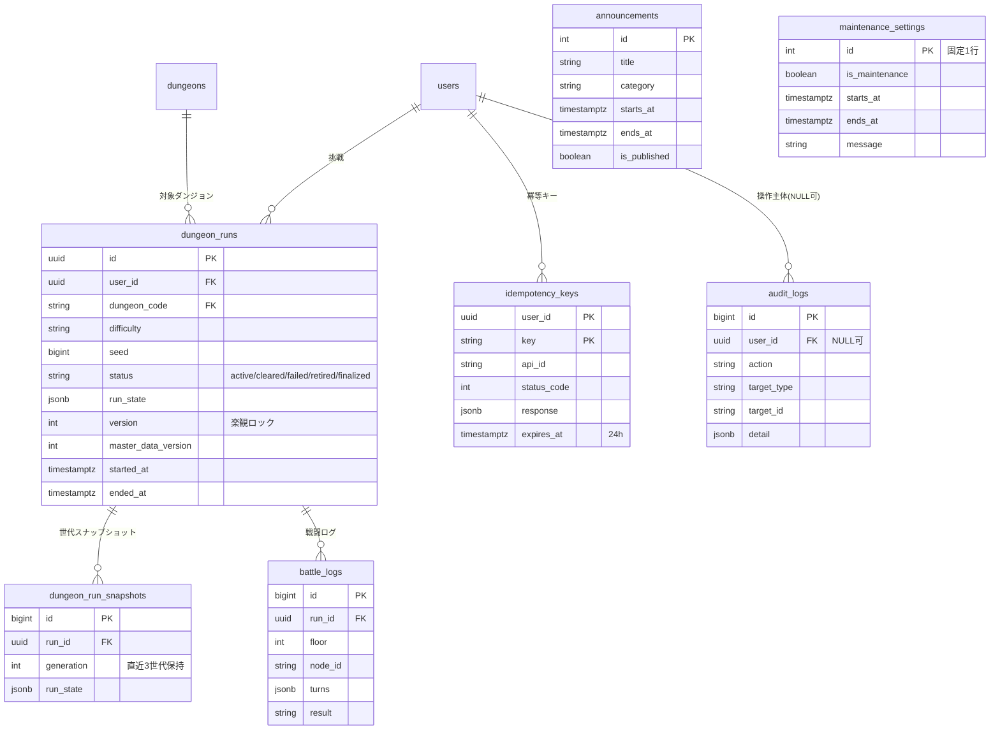

# 12. データベース設計書 — Rogue Chronicle

## 目的

本書は、ローグライトRPG「Rogue Chronicle」のデータベース（PostgreSQL on Neon + Prisma）の物理設計・論理設計を定義する。
テーブル名・分類・統合判断・run_state構造は CORE_SPEC §8 と完全一致させ、API設計書（08）・モジュール設計書（11）・セーブデータ設計書（15）から参照される単一情報源とする。

- DBMS: PostgreSQL 16（Neon, サーバーレス構成、PITR 7日）
- ORM: Prisma（マイグレーションは `prisma migrate`、部分インデックス等はSQLマイグレーションで補完）
- 文字コード: UTF-8 / タイムゾーン: 全カラム `timestamptz`（UTC保存、表示時にJST変換）
- 命名規則: テーブル・カラムとも snake_case（CORE_SPEC §3）。Prismaモデル側は camelCase + `@map` で対応

## 関連文書

- CORE_SPEC.md §5（ゲーム仕様）§7（API一覧）§8（テーブル一覧・run_state構造）
- 08_API_Design.md / 11_Module_Design.md / 15_Save_Data_Design.md / 18_Skill_Design.md

---

# 1. データ分類

本システムのデータは、更新主体とライフサイクルの違いから次の3分類（+運用系）で管理する。

| 分類 | 更新主体 | ライフサイクル | 特徴 | バックアップ要件 |
|---|---|---|---|---|
| マスタデータ | 開発者（シードスクリプト、DEC-013） | リリース単位で更新。ユーザー操作では不変 | 連番int PK + UNIQUEなcode(text) 併用（仮決定 DEC-101）。master_data_versionsでバージョン管理 | Git管理のシードが原本。DBは再投入可能 |
| ユーザー永続データ | ユーザー操作（APIユースケース経由） | アカウント存続期間。退会後30日で物理削除 | 整合性最優先。通貨・図鑑・実績は正規化テーブル | Neon PITR 7日 + 日次バックアップ |
| ラン一時データ | ラン中のユーザー操作 | 1ラン（15〜30分）〜終了後の保持期間まで | run_state JSONB集約（DEC-011）+ 楽観ロック。読み書きは常に一括 | 消失時はスナップショットから復元 |
| 運用データ | 運営者・システム | 掲示期間・保持期間で管理 | お知らせ・メンテ・監査ログ・冪等キー | 監査ログは1年保持 |

## 1.1 CORE_SPEC §8 テーブル振り分け表

| 分類 | テーブル |
|---|---|
| マスタデータ（18） | characters, equipment, skills, skill_effects, relics, enemies, enemy_actions, enemy_ai_rules, dungeons, dungeon_difficulties, dungeon_node_types, random_events, random_event_choices, reward_tables, upgrade_nodes, achievements, stories, master_data_versions（将来: missions） |
| ユーザー永続データ（14） | users, user_profiles, user_settings, auth_sessions, password_reset_tokens（将来）, player_progress, player_currencies, player_characters, player_equipment, player_upgrades, player_codex, player_achievements, player_story_progress, currency_transactions（将来: player_missions） |
| ラン一時データ（3） | dungeon_runs, dungeon_run_snapshots, battle_logs |
| 運用（4） | announcements, maintenance_settings, audit_logs, idempotency_keys（本書で追加、後述 DEC-102） |

## 1.2 エンティティ候補に対する採用・統合・不採用の判断表

初期抽出したエンティティ候補（約60個）に対する判断を全件示す。CORE_SPEC §8「統合・不採用の判断」の9項目はすべて本表に含む。

| # | 候補エンティティ | 判断 | 統合先 / 対応 | 理由 |
|---|---|---|---|---|
| 1 | users | 採用 | users | 認証・アカウントの根幹。全ユーザー系テーブルの親 |
| 2 | guest_accounts | 統合 | users（is_guest列） | ゲストと正式会員は「emailの有無」以外ほぼ同構造。別テーブルだと引き継ぎ（API-006）でFK付け替えが全テーブルに波及するため、users.is_guest で判別（CORE_SPEC §8） |
| 3 | user_profiles | 採用 | user_profiles | 表示名等の頻繁参照データを認証情報と分離（権限・更新頻度が異なる） |
| 4 | user_settings | 採用 | user_settings | API-602/603の永続対象。端末間で同期する設定のみDB保存 |
| 5 | sessions | 統合 | auth_sessions として実装 | Auth.js JWT戦略のため、DBにはリフレッシュ/失効管理の最小構成のみ持つ（CORE_SPEC §8） |
| 6 | auth_sessions | 採用 | auth_sessions | 上記の通り。強制ログアウト・退会時の全セッション失効に必要 |
| 7 | password_reset_tokens | 採用（将来） | password_reset_tokens | API-007が将来対応（メール基盤未整備）。スキーマのみ定義、MVPではマイグレーション対象外 |
| 8 | player_progress | 採用 | player_progress | プレイヤーランク・累計統計。実績判定の集計元 |
| 9 | player_currencies | 採用 | player_currencies | ソウルシャード残高。正規化+version楽観ロックで整合性保証 |
| 10 | character_levels | 統合 | characters.growth（JSONB） | キャラ成長率はマスタ属性であり行データ不要。レベル別テーブルは結合コストのみ増える（CORE_SPEC §8） |
| 11 | character_unlock_conditions | 統合 | characters.unlock_condition（JSONB） | 解放条件は種類が多様（通貨/実績/初期解放）で1キャラ1条件。JSONBで表現十分（CORE_SPEC §8） |
| 12 | characters | 採用 | characters | キャラマスタ（MVP 3体、CORE_SPEC §5.5） |
| 13 | player_characters | 採用 | player_characters | キャラ解放状態はユーザーごとの正規化テーブル（図鑑・解放判定で集計するため） |
| 14 | weapons | 統合 | equipment（slot列） | DEC-017。武器/防具/アクセは属性がほぼ共通。slot列で判別し3テーブル分の重複定義を排除 |
| 15 | armors | 統合 | equipment（slot列） | 同上（DEC-017） |
| 16 | accessories | 統合 | equipment（slot列） | 同上（DEC-017） |
| 17 | equipment | 採用 | equipment | 統合後の装備マスタ |
| 18 | player_weapons | 統合 | player_equipment | DEC-017に伴い所持側も1テーブルに統合 |
| 19 | player_armors | 統合 | player_equipment | 同上 |
| 20 | player_accessories | 統合 | player_equipment | 同上 |
| 21 | player_equipment | 採用 | player_equipment | 永続解放装備（初期装備候補）の解放状態 |
| 22 | skills | 採用 | skills | スキルマスタ（MVP 20種） |
| 23 | skill_effects | 採用 | skill_effects | スキル1件=効果N行（effect_type + params JSONB）。CORE_SPEC §5.8のマスタ駆動方式 |
| 24 | relics | 採用 | relics | レリックマスタ（MVP 10種、trigger + effect JSONB） |
| 25 | enemies | 採用 | enemies | 敵マスタ（MVP 8体） |
| 26 | bosses | 統合 | enemies（enemy_type列） | ボスも敵と同構造。enemy_type: normal/strong/elite/boss の列で判別し種別補正（§5.4）を適用（CORE_SPEC §8） |
| 27 | enemy_actions | 採用 | enemy_actions | 敵の重み付き行動テーブル（§5.7 AI方式） |
| 28 | enemy_ai_rules | 採用 | enemy_ai_rules | 条件ルール（優先評価）。condition JSONB |
| 29 | dungeons | 採用 | dungeons | ダンジョンマスタ（MVP 1種: forgotten_ruins） |
| 30 | dungeon_floors | 統合 | dungeons.generation_config（JSONB） | 階層別の生成パラメータ（ノード数2〜4、REST必須階層等）は「マップ生成関数への入力」であり、行として結合参照しない。JSONB設定が自然（CORE_SPEC §8） |
| 31 | dungeon_difficulties | 採用 | dungeon_difficulties | Normal（MVP唯一）+ 将来Hard/Nightmareの倍率マスタ |
| 32 | dungeon_node_types | 採用 | dungeon_node_types | ノードタイプ13種（BATTLE〜SECRET）の定義マスタ |
| 33 | random_events | 採用 | random_events | ランダムイベントマスタ（MVP 10種） |
| 34 | random_event_choices | 採用 | random_event_choices | イベント選択肢（1イベント=N択） |
| 35 | rewards | 統合 | reward_tables | 報酬は「抽選テーブル」として一元管理。戦闘/宝箱/イベント別の個別テーブルは構造が同一（CORE_SPEC §8） |
| 36 | reward_tables | 採用 | reward_tables | 統合後の報酬抽選マスタ |
| 37 | upgrade_nodes | 採用 | upgrade_nodes | 永続強化ツリー（MVP 12ノード） |
| 38 | achievements | 採用 | achievements | 実績マスタ（MVP 10個） |
| 39 | player_achievements | 採用 | player_achievements | 実績進捗・解除状態（正規化。理由: 集計・解除判定） |
| 40 | stories | 採用 | stories | ストーリーマスタ（STORYノード・拠点用） |
| 41 | player_story_progress | 採用 | player_story_progress | 閲覧済み管理 |
| 42 | player_upgrades | 採用 | player_upgrades | 永続強化の購入段数 |
| 43 | player_codex | 採用 | player_codex | DEC-018。entry_typeで スキル/レリック/敵/装備/キャラ を1テーブルに統合 |
| 44 | skill_codex / relic_codex / enemy_codex 等（図鑑5テーブル） | 統合 | player_codex（entry_type列） | DEC-018。図鑑は「code + 発見日時 + カウント」の同一構造。5テーブル分割は無意味 |
| 45 | currency_transactions | 採用 | currency_transactions | 通貨増減の履歴（監査・不具合調査・補償の根拠）。冪等キー列で二重付与防止 |
| 46 | dungeon_runs | 採用 | dungeon_runs | ラン本体。run_state JSONB + version楽観ロック（DEC-011） |
| 47 | dungeon_run_nodes | 統合 | dungeon_runs.run_state（map） | 1ランのマップ・進行位置は常に一括読み書き（API-304で全量取得）。行分割は更新競合とN+1を生むだけ（CORE_SPEC §8） |
| 48 | dungeon_run_characters | 統合 | run_state.character | 同上。MVPは1キャラ編成（DEC-012）で行管理の必要なし |
| 49 | dungeon_run_skills | 統合 | run_state.skills | 同上（所持上限8枠の配列） |
| 50 | dungeon_run_equipment | 統合 | run_state.equipment | 同上（slot 3枠の固定構造） |
| 51 | dungeon_run_relics | 統合 | run_state.relics | 同上（重複不可の配列） |
| 52 | dungeon_run_items | 統合 | run_state.items | 同上（code+countの配列） |
| 53 | battles | 統合 | run_state.battle | 戦闘中状態は「現在ランの一部」。戦闘終了で消えるため独立行は不要（CORE_SPEC §8） |
| 54 | battle_turns | 統合 | battle_logs.turns（JSONB） | ターン明細は追記専用・再生用途のみ。1戦闘1行+turns JSONBで十分（CORE_SPEC §8） |
| 55 | battle_actions | 統合 | battle_logs.turns（JSONB） | 同上。行動単位の行分割は書き込み回数を数十倍にする |
| 56 | battle_logs | 採用 | battle_logs | 戦闘検証・チート調査用。保持30日（DEC-103） |
| 57 | dungeon_run_snapshots | 採用 | dungeon_run_snapshots | run_state破損時の復元用チェックポイント（直近3世代） |
| 58 | items（消費アイテムマスタ） | 不採用（MVP） | TypeScript定数 + run_state.items | MVPの消費アイテムはポーション等ごく少数でラン内のみ。マスタテーブル化は過剰。将来種類が増えたらequipment同様のマスタ化を検討（仮決定 DEC-106） |
| 59 | error_logs | 不採用 | Vercel標準ログ + 構造化コンソールログ | DEC-020。将来Sentry導入。DBをログシンクにしない（書き込み負荷・肥大化） |
| 60 | missions / player_missions | 不採用（将来） | — | ミッションはMVP対象外（CORE_SPEC §11）。テーブル予約名のみ確保 |
| 61 | rankings | 不採用 | — | ランキング機能自体がMVP対象外（CORE_SPEC §11） |
| 62 | idempotency_keys | 追加 | idempotency_keys | ラン系変更APIのIdempotency-Keyヘッダ必須（CORE_SPEC §7補足）に対応する応答キャッシュ。24h保持（仮決定 DEC-102） |
| 63 | announcements | 採用 | announcements | API-104。運用データ |
| 64 | maintenance_settings | 採用 | maintenance_settings | SCR-009 / ERR_MAINTENANCE(503)の判定元 |
| 65 | audit_logs | 採用 | audit_logs | 退会・補償・マスタ投入等の運用操作の監査証跡。保持1年（DEC-107） |
| 66 | master_data_versions | 採用 | master_data_versions | シード投入のバージョン管理。ラン開始時にrun_stateへ記録（§5.10） |

---

# 2. ER図

ER図は3枚に分割する（マスタ系 / ユーザー永続系 / ラン・運用系）。分類をまたぐ参照（例: player_characters → characters）は各図に相手側エンティティを最小属性で再掲する。

## 2.1 ER図（1/3）マスタ系

```mermaid
erDiagram
    skills ||--o{ skill_effects : "1スキル=N効果行"
    enemies ||--o{ enemy_actions : "行動テーブル"
    enemies ||--o{ enemy_ai_rules : "条件ルール"
    enemy_actions ||--o{ enemy_ai_rules : "発動行動"
    dungeons ||--o{ dungeon_difficulties : "難易度"
    random_events ||--o{ random_event_choices : "選択肢"
    upgrade_nodes o|--o{ upgrade_nodes : "前提ノード"

    characters {
        int id PK
        string code UK
        string name
        string element
        int base_hp
        int base_atk
        int base_def
        int base_spd
        jsonb growth
        jsonb unlock_condition
    }
    skills {
        int id PK
        string code UK
        string name
        string rarity
        int sp_cost
        string target_type
        int max_level
    }
    skill_effects {
        int id PK
        int skill_id FK
        int order_no
        string effect_type
        jsonb params
    }
    relics {
        int id PK
        string code UK
        string name
        string trigger
        jsonb effect
        boolean is_cursed
    }
    enemies {
        int id PK
        string code UK
        string name
        string enemy_type
        string element
        int base_hp
        int base_exp
    }
    enemy_actions {
        int id PK
        int enemy_id FK
        string code
        int weight
        string effect_type
        jsonb params
    }
    enemy_ai_rules {
        int id PK
        int enemy_id FK
        int priority
        jsonb condition
        int action_id FK
    }
    equipment {
        int id PK
        string code UK
        string name
        string slot
        string rarity
        int atk_bonus
        int def_bonus
        jsonb extra_effect
    }
    dungeons {
        int id PK
        string code UK
        string name
        int floor_count
        jsonb generation_config
    }
    dungeon_difficulties {
        int id PK
        int dungeon_id FK
        string code
        float stat_mod
        float exp_mod
        float reward_mod
    }
    dungeon_node_types {
        int id PK
        string code UK
        string name
        int default_weight
        int min_floor
    }
    random_events {
        int id PK
        string code UK
        string name
        int weight
        boolean is_secret
    }
    random_event_choices {
        int id PK
        int event_id FK
        int order_no
        string label
        jsonb requirement
        jsonb outcome
    }
    reward_tables {
        int id PK
        string code UK
        string source_type
        jsonb entries
    }
    upgrade_nodes {
        int id PK
        string code UK
        int max_level
        jsonb cost_per_level
        jsonb effect
        int requires_node_id FK
    }
    achievements {
        int id PK
        string code UK
        string name
        jsonb condition
        jsonb reward
    }
    stories {
        int id PK
        string code UK
        string title
        jsonb unlock_condition
    }
    master_data_versions {
        int version PK
        timestamptz applied_at
        string description
    }
```



## 2.2 ER図（2/3）ユーザー永続系

```mermaid
erDiagram
    users ||--o| user_profiles : "プロフィール"
    users ||--o| user_settings : "設定"
    users ||--o{ auth_sessions : "セッション"
    users ||--o{ password_reset_tokens : "再設定(将来)"
    users ||--o| player_progress : "ランク/統計"
    users ||--o| player_currencies : "通貨残高"
    users ||--o{ player_characters : "解放キャラ"
    users ||--o{ player_equipment : "解放装備"
    users ||--o{ player_upgrades : "永続強化"
    users ||--o{ player_codex : "図鑑"
    users ||--o{ player_achievements : "実績"
    users ||--o{ player_story_progress : "ストーリー"
    users ||--o{ currency_transactions : "通貨履歴"
    characters ||--o{ player_characters : "対象キャラ"
    equipment ||--o{ player_equipment : "対象装備"
    upgrade_nodes ||--o{ player_upgrades : "対象ノード"
    achievements ||--o{ player_achievements : "対象実績"
    stories ||--o{ player_story_progress : "対象話"

    users {
        uuid id PK
        string email UK "NULL可=ゲスト"
        string password_hash
        boolean is_guest
        string role
        string status
        timestamptz withdrawn_at
    }
    user_profiles {
        uuid user_id PK
        string display_name
        string avatar_code
    }
    user_settings {
        uuid user_id PK
        int bgm_volume
        int se_volume
        jsonb extra
    }
    auth_sessions {
        uuid id PK
        uuid user_id FK
        string refresh_token_hash UK
        timestamptz expires_at
        timestamptz revoked_at
    }
    password_reset_tokens {
        uuid id PK
        uuid user_id FK
        string token_hash UK
        timestamptz expires_at
    }
    player_progress {
        uuid user_id PK
        int rank
        int rank_exp
        int total_runs
        int total_clears
        int highest_floor
    }
    player_currencies {
        uuid user_id PK
        bigint soul_shards
        int version "楽観ロック"
    }
    player_characters {
        uuid user_id PK
        int character_id PK
        timestamptz unlocked_at
    }
    player_equipment {
        uuid user_id PK
        int equipment_id PK
        timestamptz unlocked_at
    }
    player_upgrades {
        uuid user_id PK
        int upgrade_node_id PK
        int level
    }
    player_codex {
        uuid user_id PK
        string entry_type PK
        string code PK
        timestamptz discovered_at
        int count
    }
    player_achievements {
        uuid user_id PK
        int achievement_id PK
        int progress
        timestamptz achieved_at
    }
    player_story_progress {
        uuid user_id PK
        int story_id PK
        timestamptz read_at
    }
    currency_transactions {
        bigint id PK
        uuid user_id FK
        string currency
        bigint amount
        bigint balance_after
        string reason
        uuid ref_id
        string idempotency_key UK
    }
```



## 2.3 ER図（3/3）ラン・運用系



---

# 3. テーブル一覧表

推定行数の前提（1年後、仮決定 DEC-108）: 登録ユーザー5,000（うちアクティブ1,000）/ DAU 100 / 1日300ラン（年間約11万ラン）/ 1ラン平均12戦闘・通貨記録5件。

| テーブル名 | 論理名 | 分類 | 概要 | 推定行数(1年後) | 保持期間 |
|---|---|---|---|---|---|
| characters | キャラクターマスタ | マスタ | プレイアブルキャラ定義（MVP 3体） | 10 | 永続 |
| skills | スキルマスタ | マスタ | スキル基本情報（MVP 20種） | 40 | 永続 |
| skill_effects | スキル効果マスタ | マスタ | スキル1件=効果N行 | 120 | 永続 |
| relics | レリックマスタ | マスタ | レリック定義（MVP 10種） | 20 | 永続 |
| enemies | 敵マスタ | マスタ | 敵定義（MVP 8体、enemy_typeで種別） | 20 | 永続 |
| enemy_actions | 敵行動マスタ | マスタ | 重み付き行動テーブル | 80 | 永続 |
| enemy_ai_rules | 敵AIルールマスタ | マスタ | 条件ルール（優先評価） | 60 | 永続 |
| equipment | 装備マスタ | マスタ | 武器/防具/アクセ統合（DEC-017） | 30 | 永続 |
| dungeons | ダンジョンマスタ | マスタ | ダンジョン定義（MVP 1種） | 3 | 永続 |
| dungeon_difficulties | 難易度マスタ | マスタ | ダンジョン×難易度の倍率 | 9 | 永続 |
| dungeon_node_types | ノードタイプマスタ | マスタ | ノードタイプ13種の定義 | 13 | 永続 |
| random_events | ランダムイベントマスタ | マスタ | イベント定義（MVP 10種） | 20 | 永続 |
| random_event_choices | イベント選択肢マスタ | マスタ | イベントの選択肢と結果 | 60 | 永続 |
| reward_tables | 報酬抽選マスタ | マスタ | 報酬テーブル（戦闘/宝箱/イベント等） | 30 | 永続 |
| upgrade_nodes | 永続強化ノードマスタ | マスタ | 強化ツリー（MVP 12ノード） | 24 | 永続 |
| achievements | 実績マスタ | マスタ | 実績定義（MVP 10個） | 30 | 永続 |
| stories | ストーリーマスタ | マスタ | ストーリーテキスト | 30 | 永続 |
| master_data_versions | マスタ版数 | マスタ | シード投入のバージョン管理 | 25 | 永続 |
| users | ユーザー | ユーザー永続 | アカウント（ゲスト含む、論理削除対象） | 5,000 | 退会後30日で物理削除 |
| user_profiles | ユーザープロフィール | ユーザー永続 | 表示名等 | 5,000 | usersに準拠（CASCADE） |
| user_settings | ユーザー設定 | ユーザー永続 | 音量等の同期設定 | 5,000 | usersに準拠（CASCADE） |
| auth_sessions | 認証セッション | ユーザー永続 | リフレッシュ/失効管理 | 8,000 | 期限切れ+7日で削除 |
| password_reset_tokens | パスワード再設定トークン | ユーザー永続 | 将来（API-007） | 0（MVP未使用） | 使用済み/期限切れ即削除 |
| player_progress | プレイヤー進行 | ユーザー永続 | ランク・累計統計 | 5,000 | usersに準拠 |
| player_currencies | 所持通貨 | ユーザー永続 | ソウルシャード残高+楽観ロック | 5,000 | usersに準拠 |
| player_characters | 解放キャラ | ユーザー永続 | キャラ解放状態 | 8,000 | usersに準拠 |
| player_equipment | 解放装備 | ユーザー永続 | 永続解放装備 | 20,000 | usersに準拠 |
| player_upgrades | 永続強化状態 | ユーザー永続 | 強化ノードの購入段数 | 25,000 | usersに準拠 |
| player_codex | 図鑑 | ユーザー永続 | entry_type統合図鑑（DEC-018） | 150,000 | usersに準拠 |
| player_achievements | 実績進捗 | ユーザー永続 | 進捗値・解除日時 | 30,000 | usersに準拠 |
| player_story_progress | ストーリー進行 | ユーザー永続 | 閲覧済み管理 | 20,000 | usersに準拠 |
| currency_transactions | 通貨増減履歴 | ユーザー永続 | 監査・補償の根拠。冪等キー付き | 550,000 | 1年（超過分は月次削除バッチ） |
| dungeon_runs | ダンジョンラン | ラン一時 | ラン本体。run_state JSONB+楽観ロック | 110,000 | 永続（finalize後run_stateはサマリ化、§5.8） |
| dungeon_run_snapshots | ランスナップショット | ラン一時 | 直近3世代のチェックポイント | 6,000 | ランごと3世代。finalize時に全削除 |
| battle_logs | 戦闘ログ | ラン一時 | 1戦闘1行、turns JSONB | 110,000（定常） | 30日（日次削除バッチ、DEC-103） |
| announcements | お知らせ | 運用 | API-104の配信元 | 100 | 永続（非公開化で運用） |
| maintenance_settings | メンテナンス設定 | 運用 | メンテ状態の単一行 | 1 | 永続 |
| audit_logs | 監査ログ | 運用 | 運用操作・重要ユーザー操作の証跡 | 200,000 | 1年（DEC-107） |
| idempotency_keys | 冪等キー | 運用 | ラン系変更APIの応答キャッシュ | 30,000（定常） | 24時間（DEC-102、時間毎削除バッチ） |

---

# 4. テーブル定義

共通ルール:

- 全テーブルに `created_at timestamptz NOT NULL DEFAULT now()` / `updated_at timestamptz NOT NULL DEFAULT now()` を持つ（以降の各表では省略せず記載する。updated_atはPrismaの`@updatedAt`で更新）。
- マスタ系PKは `int GENERATED ALWAYS AS IDENTITY` + UNIQUEな `code text`（仮決定 DEC-101）。内部参照は軽量なint FK、外部公開・シード・run_state内参照は安定的なcodeを使う。
- ユーザー系・ラン系PKは `uuid`（`gen_random_uuid()`）。連番だと推測攻撃・件数漏洩のリスクがあるため。
- FKのON DELETE: ユーザー配下は `CASCADE`（退会物理削除で一括消去）、マスタ参照は `RESTRICT`（マスタ行はシードで削除しない前提）。

## 4.1 マスタ系

### 4.1.1 characters（キャラクターマスタ）

| カラム名 | 論理名 | データ型 | NULL | PK | FK | UNIQUE | CHECK | デフォルト | 説明 |
|---|---|---|---|---|---|---|---|---|---|
| id | ID | int (identity) | 不可 | ○ | | | | 自動採番 | 内部参照用 |
| code | コード | text | 不可 | | | ○ | | | 例: swordsman_rain（CORE_SPEC §5.5） |
| name | 名前 | text | 不可 | | | | | | 例: レイン |
| role_type | タイプ | text | 不可 | | | | | | 例: 剣士・バランス |
| element | 属性 | text | 不可 | | | | IN ('none','fire','water','wind','light','dark') | 'none' | §5.2の4属性+将来2属性 |
| base_hp | 初期HP | int | 不可 | | | | > 0 | | 例: 100 |
| base_atk | 初期攻撃力 | int | 不可 | | | | > 0 | | |
| base_def | 初期防御力 | int | 不可 | | | | >= 0 | | |
| base_spd | 初期素早さ | int | 不可 | | | | > 0 | | |
| base_crit_rate | 初期クリ率(%) | int | 不可 | | | | 0〜100 | 5 | |
| base_crit_dmg | 初期クリダメ(%) | int | 不可 | | | | >= 100 | 150 | |
| growth | 成長率係数 | jsonb | 不可 | | | | | '{}' | 例: {"hp":1.0,"atk":1.1,"def":0.9,"spd":1.0}（0.8〜1.2、character_levels統合先） |
| unique_ability | 固有能力 | jsonb | 不可 | | | | | '{}' | 例: {"code":"undying","name":"不屈","params":{"oncePerRun":true}} |
| unlock_condition | 解放条件 | jsonb | 不可 | | | | | '{"type":"initial"}' | 例: {"type":"soul_shards","amount":300} / {"type":"achievement","code":"total_runs_10"}（character_unlock_conditions統合先） |
| sort_order | 表示順 | int | 不可 | | | | | 0 | 一覧画面SCR-104用 |
| is_active | 有効フラグ | boolean | 不可 | | | | | true | falseで新規解放不可（既解放者は使用可） |
| created_at | 作成日時 | timestamptz | 不可 | | | | | now() | |
| updated_at | 更新日時 | timestamptz | 不可 | | | | | now() | |

インデックス: PK(id) / UNIQUE(code)（API・シードの参照キー）。行数が少なく追加インデックス不要。

### 4.1.2 skills（スキルマスタ）

| カラム名 | 論理名 | データ型 | NULL | PK | FK | UNIQUE | CHECK | デフォルト | 説明 |
|---|---|---|---|---|---|---|---|---|---|
| id | ID | int (identity) | 不可 | ○ | | | | 自動採番 | |
| code | コード | text | 不可 | | | ○ | | | 例: skill_flame_slash |
| name | 名前 | text | 不可 | | | | | | |
| description | 説明文 | text | 不可 | | | | | '' | UI表示用（{value}等のプレースホルダ可） |
| element | 属性 | text | 不可 | | | | IN ('none','fire','water','wind','light','dark') | 'none' | |
| rarity | レア度 | text | 不可 | | | | IN ('common','rare','epic') | 'common' | 3択抽選重み common60/rare30/epic10（§5.8） |
| sp_cost | SPコスト | int | 不可 | | | | >= 0 | | 通常攻撃相当は0 |
| target_type | 対象 | text | 不可 | | | | IN ('single','all','self') | 'single' | |
| max_level | 最大強化Lv | int | 不可 | | | | 1〜3 | 3 | 同一スキル再取得で+1（§5.8） |
| character_code | 専用キャラ | text | 可 | | | | | NULL | NULL=汎用。キャラ専用スキルはcode指定 |
| sort_order | 表示順 | int | 不可 | | | | | 0 | 図鑑SCR-108用 |
| is_active | 有効フラグ | boolean | 不可 | | | | | true | falseで抽選対象外 |
| created_at | 作成日時 | timestamptz | 不可 | | | | | now() | |
| updated_at | 更新日時 | timestamptz | 不可 | | | | | now() | |

インデックス: PK(id) / UNIQUE(code) / INDEX(rarity, is_active)（レベルアップ3択の抽選候補絞り込み。行数僅少のため必須ではないが宣言的に付与）。

### 4.1.3 skill_effects（スキル効果マスタ）

| カラム名 | 論理名 | データ型 | NULL | PK | FK | UNIQUE | CHECK | デフォルト | 説明 |
|---|---|---|---|---|---|---|---|---|---|
| id | ID | int (identity) | 不可 | ○ | | | | 自動採番 | |
| skill_id | スキルID | int | 不可 | | skills.id | ○(複合1) | | | ON DELETE RESTRICT |
| order_no | 適用順 | int | 不可 | | | ○(複合2) | >= 1 | | UNIQUE(skill_id, order_no) |
| effect_type | 効果種別 | text | 不可 | | | | IN ('damage','damage_aoe','heal','buff','debuff','status','sp_gain','shield','revive_guard') | | CORE_SPEC §5.8 |
| params | 効果パラメータ | jsonb | 不可 | | | | | '{}' | 例: {"mult":1.6,"element":"fire","levelScale":[1.0,1.15,1.3]} / {"status":"burn","chance":40} |
| created_at | 作成日時 | timestamptz | 不可 | | | | | now() | |
| updated_at | 更新日時 | timestamptz | 不可 | | | | | now() | |

インデックス: PK(id) / UNIQUE(skill_id, order_no)（1スキルの効果行順序を一意化。skill_idでの引き当てにも利用）。

### 4.1.4 relics（レリックマスタ）

| カラム名 | 論理名 | データ型 | NULL | PK | FK | UNIQUE | CHECK | デフォルト | 説明 |
|---|---|---|---|---|---|---|---|---|---|
| id | ID | int (identity) | 不可 | ○ | | | | 自動採番 | |
| code | コード | text | 不可 | | | ○ | | | 例: lucky_coin |
| name | 名前 | text | 不可 | | | | | | |
| description | 説明文 | text | 不可 | | | | | '' | |
| rarity | レア度 | text | 不可 | | | | IN ('common','rare','epic') | 'common' | |
| trigger | 発動契機 | text | 不可 | | | | IN ('always','battle_start','turn_start','turn_end','on_low_hp','on_kill','node_enter') | | CORE_SPEC §5.8 |
| effect | 効果 | jsonb | 不可 | | | | | '{}' | 例: {"type":"gold_gain_pct","value":20} |
| is_cursed | 呪い付き | boolean | 不可 | | | | | false | MVPで2種（§5.8） |
| sort_order | 表示順 | int | 不可 | | | | | 0 | |
| is_active | 有効フラグ | boolean | 不可 | | | | | true | |
| created_at | 作成日時 | timestamptz | 不可 | | | | | now() | |
| updated_at | 更新日時 | timestamptz | 不可 | | | | | now() | |

インデックス: PK(id) / UNIQUE(code)。

### 4.1.5 enemies（敵マスタ）

| カラム名 | 論理名 | データ型 | NULL | PK | FK | UNIQUE | CHECK | デフォルト | 説明 |
|---|---|---|---|---|---|---|---|---|---|
| id | ID | int (identity) | 不可 | ○ | | | | 自動採番 | |
| code | コード | text | 不可 | | | ○ | | | 例: slime, ruin_guardian |
| name | 名前 | text | 不可 | | | | | | |
| enemy_type | 種別 | text | 不可 | | | | IN ('normal','strong','elite','boss') | 'normal' | bosses統合先。種別補正は§5.4の式で適用 |
| element | 属性 | text | 不可 | | | | IN ('none','fire','water','wind','light','dark') | 'none' | |
| base_hp | 基礎HP | int | 不可 | | | | > 0 | | 階層スケール前の基礎値（§5.4） |
| base_atk | 基礎攻撃力 | int | 不可 | | | | > 0 | | |
| base_def | 基礎防御力 | int | 不可 | | | | >= 0 | | |
| base_spd | 基礎素早さ | int | 不可 | | | | > 0 | | |
| base_crit_rate | クリ率(%) | int | 不可 | | | | 0〜100 | 5 | |
| base_eva | 回避率(%) | int | 不可 | | | | 0〜100 | 0 | |
| status_res | 状態異常耐性(%) | int | 不可 | | | | 0〜100 | 0 | |
| elem_res | 属性耐性 | jsonb | 不可 | | | | | '{}' | 例: {"fire":30}。属性ごと%（§5.1） |
| base_exp | 基礎EXP | int | 不可 | | | | >= 0 | | 獲得EXP式の入力（§5.4） |
| base_gold | 基礎ゴールド | int | 不可 | | | | >= 0 | | ドロップ基礎値 |
| appear_floor_min | 出現階層下限 | int | 不可 | | | | 1〜10 | 1 | |
| appear_floor_max | 出現階層上限 | int | 不可 | | | | 1〜10 | 10 | CHECK(appear_floor_max >= appear_floor_min) |
| description | 図鑑説明 | text | 不可 | | | | | '' | 敵図鑑SCR-110用 |
| is_active | 有効フラグ | boolean | 不可 | | | | | true | |
| created_at | 作成日時 | timestamptz | 不可 | | | | | now() | |
| updated_at | 更新日時 | timestamptz | 不可 | | | | | now() | |

インデックス: PK(id) / UNIQUE(code) / INDEX(enemy_type)（マップ生成時の種別別抽選）。

### 4.1.6 enemy_actions（敵行動マスタ）

| カラム名 | 論理名 | データ型 | NULL | PK | FK | UNIQUE | CHECK | デフォルト | 説明 |
|---|---|---|---|---|---|---|---|---|---|
| id | ID | int (identity) | 不可 | ○ | | | | 自動採番 | |
| enemy_id | 敵ID | int | 不可 | | enemies.id | ○(複合1) | | | ON DELETE RESTRICT |
| code | 行動コード | text | 不可 | | | ○(複合2) | | | UNIQUE(enemy_id, code)。例: strong_attack |
| name | 行動名 | text | 不可 | | | | | | 行動予告（intent）表示名 |
| weight | 抽選重み | int | 不可 | | | | >= 0 | 10 | 重み付き行動テーブル（§5.7）。0=ルール専用行動 |
| effect_type | 効果種別 | text | 不可 | | | | IN ('damage','damage_aoe','heal','buff','debuff','status','summon','charge') | | |
| params | 効果パラメータ | jsonb | 不可 | | | | | '{}' | 例: {"mult":2.0} / {"summonCode":"slime","max":2} |
| intent_icon | 予告アイコン | text | 不可 | | | | | 'attack' | intent表示用（§5.7 全敵に予告表示） |
| created_at | 作成日時 | timestamptz | 不可 | | | | | now() | |
| updated_at | 更新日時 | timestamptz | 不可 | | | | | now() | |

インデックス: PK(id) / UNIQUE(enemy_id, code)（敵単位の行動引き当て）。

### 4.1.7 enemy_ai_rules（敵AIルールマスタ）

| カラム名 | 論理名 | データ型 | NULL | PK | FK | UNIQUE | CHECK | デフォルト | 説明 |
|---|---|---|---|---|---|---|---|---|---|
| id | ID | int (identity) | 不可 | ○ | | | | 自動採番 | |
| enemy_id | 敵ID | int | 不可 | | enemies.id | ○(複合1) | | | ON DELETE RESTRICT |
| priority | 優先度 | int | 不可 | | | ○(複合2) | >= 1 | | UNIQUE(enemy_id, priority)。小さいほど先に評価 |
| condition | 発動条件 | jsonb | 不可 | | | | | '{}' | 例: {"type":"hp_below_pct","value":50} / {"type":"every_n_turns","n":2} |
| action_id | 行動ID | int | 不可 | | enemy_actions.id | | | | 条件成立時に実行する行動。ON DELETE RESTRICT |
| created_at | 作成日時 | timestamptz | 不可 | | | | | now() | |
| updated_at | 更新日時 | timestamptz | 不可 | | | | | now() | |

インデックス: PK(id) / UNIQUE(enemy_id, priority)（優先評価順の一意化と敵単位取得）/ INDEX(action_id)（FK参照整合チェック用）。
条件不成立時は enemy_actions.weight による重み抽選にフォールバック（完全ランダム禁止、§5.7）。

### 4.1.8 equipment（装備マスタ、DEC-017統合）

| カラム名 | 論理名 | データ型 | NULL | PK | FK | UNIQUE | CHECK | デフォルト | 説明 |
|---|---|---|---|---|---|---|---|---|---|
| id | ID | int (identity) | 不可 | ○ | | | | 自動採番 | |
| code | コード | text | 不可 | | | ○ | | | 例: iron_sword |
| name | 名前 | text | 不可 | | | | | | |
| description | 説明文 | text | 不可 | | | | | '' | |
| slot | 装備枠 | text | 不可 | | | | IN ('weapon','armor','accessory') | | weapons/armors/accessories統合キー |
| rarity | レア度 | text | 不可 | | | | IN ('common','rare','epic') | 'common' | |
| element | 属性 | text | 不可 | | | | IN ('none','fire','water','wind','light','dark') | 'none' | 武器の攻撃属性 |
| hp_bonus | HP補正 | int | 不可 | | | | | 0 | 固定値（ランダムオプションはMVP非対応、§5.8仮決定） |
| atk_bonus | 攻撃補正 | int | 不可 | | | | | 0 | |
| def_bonus | 防御補正 | int | 不可 | | | | | 0 | |
| spd_bonus | 素早さ補正 | int | 不可 | | | | | 0 | |
| extra_effect | 追加効果 | jsonb | 可 | | | | | NULL | 例: {"type":"crit_rate","value":5}。将来のランダムオプション拡張枠 |
| is_starter | 初期装備候補 | boolean | 不可 | | | | | false | trueは永続解放対象（SCR-205） |
| price | ショップ価格 | int | 不可 | | | | >= 0 | 0 | ダンジョン内ショップの基準価格 |
| sort_order | 表示順 | int | 不可 | | | | | 0 | |
| is_active | 有効フラグ | boolean | 不可 | | | | | true | |
| created_at | 作成日時 | timestamptz | 不可 | | | | | now() | |
| updated_at | 更新日時 | timestamptz | 不可 | | | | | now() | |

インデックス: PK(id) / UNIQUE(code) / INDEX(slot, rarity)（ドロップ抽選・ショップ品揃えの絞り込み）。

### 4.1.9 dungeons（ダンジョンマスタ）

| カラム名 | 論理名 | データ型 | NULL | PK | FK | UNIQUE | CHECK | デフォルト | 説明 |
|---|---|---|---|---|---|---|---|---|---|
| id | ID | int (identity) | 不可 | ○ | | | | 自動採番 | |
| code | コード | text | 不可 | | | ○ | | | forgotten_ruins（§5.6） |
| name | 名前 | text | 不可 | | | | | | 忘却の遺跡 |
| description | 説明文 | text | 不可 | | | | | '' | SCR-202用 |
| floor_count | 階層数 | int | 不可 | | | | > 0 | 10 | |
| generation_config | 生成設定 | jsonb | 不可 | | | | | '{}' | dungeon_floors統合先。階層別ノード数(2〜4)、ノードタイプ重み、REST必須階層(5,9)、SHOP数(1〜2)、ELITE解禁階層(3)、SECRET出現率(10%)、3連続禁止ルール等（§5.6） |
| enemy_pool | 敵出現プール | jsonb | 不可 | | | | | '{}' | 例: {"normal":["slime","goblin",...],"elite":[...],"boss":["ruin_guardian"]} |
| unlock_condition | 解放条件 | jsonb | 不可 | | | | | '{"type":"initial"}' | 将来の複数ダンジョン用 |
| sort_order | 表示順 | int | 不可 | | | | | 0 | |
| is_active | 有効フラグ | boolean | 不可 | | | | | true | |
| created_at | 作成日時 | timestamptz | 不可 | | | | | now() | |
| updated_at | 更新日時 | timestamptz | 不可 | | | | | now() | |

インデックス: PK(id) / UNIQUE(code)（dungeon_runs.dungeon_codeのFK参照先）。

### 4.1.10 dungeon_difficulties（難易度マスタ）

| カラム名 | 論理名 | データ型 | NULL | PK | FK | UNIQUE | CHECK | デフォルト | 説明 |
|---|---|---|---|---|---|---|---|---|---|
| id | ID | int (identity) | 不可 | ○ | | | | 自動採番 | |
| dungeon_id | ダンジョンID | int | 不可 | | dungeons.id | ○(複合1) | | | ON DELETE RESTRICT |
| code | 難易度コード | text | 不可 | | | ○(複合2) | IN ('normal','hard','nightmare') | | UNIQUE(dungeon_id, code)。MVPはnormalのみ |
| name | 表示名 | text | 不可 | | | | | | |
| stat_mod | 敵ステ倍率 | numeric(4,2) | 不可 | | | | > 0 | 1.00 | difficultyMod（Normal1.0/Hard1.3/Nightmare1.6、§5.4） |
| exp_mod | EXP倍率 | numeric(4,2) | 不可 | | | | > 0 | 1.00 | difficultyExpMod |
| reward_mod | 報酬倍率 | numeric(4,2) | 不可 | | | | > 0 | 1.00 | |
| unlock_condition | 解放条件 | jsonb | 不可 | | | | | '{"type":"initial"}' | 例: {"type":"clear","difficulty":"normal"} |
| is_active | 有効フラグ | boolean | 不可 | | | | | true | |
| created_at | 作成日時 | timestamptz | 不可 | | | | | now() | |
| updated_at | 更新日時 | timestamptz | 不可 | | | | | now() | |

インデックス: PK(id) / UNIQUE(dungeon_id, code)。

### 4.1.11 dungeon_node_types（ノードタイプマスタ）

| カラム名 | 論理名 | データ型 | NULL | PK | FK | UNIQUE | CHECK | デフォルト | 説明 |
|---|---|---|---|---|---|---|---|---|---|
| id | ID | int (identity) | 不可 | ○ | | | | 自動採番 | |
| code | コード | text | 不可 | | | ○ | | | battle/strong/elite/boss/treasure/shop/rest/event/bless/heal/curse/story/secret の13種（§5.6） |
| name | 表示名 | text | 不可 | | | | | | 例: 通常戦闘 |
| icon_code | アイコン | text | 不可 | | | | | '' | マップ描画SCR-301用 |
| default_weight | 既定出現重み | int | 不可 | | | | >= 0 | 10 | ダンジョン側generation_configで上書き可 |
| min_floor | 出現階層下限 | int | 不可 | | | | 1〜10 | 1 | 例: elite=3 |
| max_floor | 出現階層上限 | int | 不可 | | | | 1〜10 | 10 | CHECK(max_floor >= min_floor) |
| description | 説明 | text | 不可 | | | | | '' | |
| created_at | 作成日時 | timestamptz | 不可 | | | | | now() | |
| updated_at | 更新日時 | timestamptz | 不可 | | | | | now() | |

インデックス: PK(id) / UNIQUE(code)。

### 4.1.12 random_events（ランダムイベントマスタ）

| カラム名 | 論理名 | データ型 | NULL | PK | FK | UNIQUE | CHECK | デフォルト | 説明 |
|---|---|---|---|---|---|---|---|---|---|
| id | ID | int (identity) | 不可 | ○ | | | | 自動採番 | |
| code | コード | text | 不可 | | | ○ | | | 例: event_old_altar |
| name | イベント名 | text | 不可 | | | | | | |
| body | 本文 | text | 不可 | | | | | '' | SCR-308表示テキスト |
| weight | 抽選重み | int | 不可 | | | | >= 0 | 10 | EVENTノードでの抽選 |
| min_floor | 出現階層下限 | int | 不可 | | | | 1〜10 | 1 | |
| is_secret | 隠し部屋用 | boolean | 不可 | | | | | false | SECRETノード（上位報酬）専用イベント |
| is_active | 有効フラグ | boolean | 不可 | | | | | true | |
| created_at | 作成日時 | timestamptz | 不可 | | | | | now() | |
| updated_at | 更新日時 | timestamptz | 不可 | | | | | now() | |

インデックス: PK(id) / UNIQUE(code) / INDEX(is_secret, is_active)（抽選プール絞り込み）。

### 4.1.13 random_event_choices（イベント選択肢マスタ）

| カラム名 | 論理名 | データ型 | NULL | PK | FK | UNIQUE | CHECK | デフォルト | 説明 |
|---|---|---|---|---|---|---|---|---|---|
| id | ID | int (identity) | 不可 | ○ | | | | 自動採番 | |
| event_id | イベントID | int | 不可 | | random_events.id | ○(複合1) | | | ON DELETE RESTRICT |
| order_no | 表示順 | int | 不可 | | | ○(複合2) | >= 1 | | UNIQUE(event_id, order_no) |
| label | 選択肢文言 | text | 不可 | | | | | | 例:「祭壇に触れる」 |
| requirement | 選択条件 | jsonb | 可 | | | | | NULL | 例: {"gold":100} / {"relic":"lucky_coin"}。NULL=無条件 |
| outcome | 結果 | jsonb | 不可 | | | | | '{}' | 例: {"type":"reward_table","code":"rt_altar"} / {"type":"stat_up","stat":"atk","pct":5} / {"type":"damage_pct","value":10} |
| created_at | 作成日時 | timestamptz | 不可 | | | | | now() | |
| updated_at | 更新日時 | timestamptz | 不可 | | | | | now() | |

インデックス: PK(id) / UNIQUE(event_id, order_no)。

### 4.1.14 reward_tables（報酬抽選マスタ、rewards統合）

| カラム名 | 論理名 | データ型 | NULL | PK | FK | UNIQUE | CHECK | デフォルト | 説明 |
|---|---|---|---|---|---|---|---|---|---|
| id | ID | int (identity) | 不可 | ○ | | | | 自動採番 | |
| code | コード | text | 不可 | | | ○ | | | 例: rt_battle_f1_3, rt_boss |
| name | 名前 | text | 不可 | | | | | | 運用識別用 |
| source_type | 用途 | text | 不可 | | | | IN ('battle','strong','elite','boss','treasure','event','secret','shop') | | 抽選が呼ばれる文脈 |
| entries | 抽選エントリ | jsonb | 不可 | | | | | '[]' | 例: [{"type":"gold","min":20,"max":40,"weight":50},{"type":"equipment","rarity":"rare","weight":10},{"type":"relic","weight":5}] |
| is_active | 有効フラグ | boolean | 不可 | | | | | true | |
| created_at | 作成日時 | timestamptz | 不可 | | | | | now() | |
| updated_at | 更新日時 | timestamptz | 不可 | | | | | now() | |

インデックス: PK(id) / UNIQUE(code) / INDEX(source_type)（文脈別の抽選テーブル選択）。

### 4.1.15 upgrade_nodes（永続強化ノードマスタ）

| カラム名 | 論理名 | データ型 | NULL | PK | FK | UNIQUE | CHECK | デフォルト | 説明 |
|---|---|---|---|---|---|---|---|---|---|
| id | ID | int (identity) | 不可 | ○ | | | | 自動採番 | |
| code | コード | text | 不可 | | | ○ | | | 例: init_hp_up |
| name | 名前 | text | 不可 | | | | | | 例: 初期HP+5% |
| description | 説明文 | text | 不可 | | | | | '' | |
| max_level | 最大段数 | int | 不可 | | | | >= 1 | 1 | 例: 初期HP+5%×3段（§5.9） |
| cost_per_level | 段数別コスト | jsonb | 不可 | | | | | '[]' | ソウルシャード。例: [100,250,500] |
| effect | 効果 | jsonb | 不可 | | | | | '{}' | 例: {"type":"init_hp_pct","valuePerLevel":5} / {"type":"skill_reroll","valuePerLevel":1} |
| requires_node_id | 前提ノードID | int | 可 | | upgrade_nodes.id | | | NULL | ツリー構造の親。NULL=ルート。ON DELETE RESTRICT |
| sort_order | 表示順 | int | 不可 | | | | | 0 | SCR-106のツリー描画順 |
| is_active | 有効フラグ | boolean | 不可 | | | | | true | |
| created_at | 作成日時 | timestamptz | 不可 | | | | | now() | |
| updated_at | 更新日時 | timestamptz | 不可 | | | | | now() | |

インデックス: PK(id) / UNIQUE(code) / INDEX(requires_node_id)（ツリー展開）。

### 4.1.16 achievements（実績マスタ）

| カラム名 | 論理名 | データ型 | NULL | PK | FK | UNIQUE | CHECK | デフォルト | 説明 |
|---|---|---|---|---|---|---|---|---|---|
| id | ID | int (identity) | 不可 | ○ | | | | 自動採番 | |
| code | コード | text | 不可 | | | ○ | | | 例: total_runs_10（ガルド解放条件、§5.5） |
| name | 名前 | text | 不可 | | | | | | 例: 累計ラン10回 |
| description | 説明文 | text | 不可 | | | | | '' | |
| condition | 達成条件 | jsonb | 不可 | | | | | '{}' | 例: {"type":"total_runs","threshold":10}。player_progressの統計列と対応 |
| reward | 報酬 | jsonb | 可 | | | | | NULL | 例: {"type":"soul_shards","amount":100} / {"type":"character","code":"rogue_gald"} |
| is_hidden | 隠し実績 | boolean | 不可 | | | | | false | 達成まで内容非表示 |
| sort_order | 表示順 | int | 不可 | | | | | 0 | |
| is_active | 有効フラグ | boolean | 不可 | | | | | true | |
| created_at | 作成日時 | timestamptz | 不可 | | | | | now() | |
| updated_at | 更新日時 | timestamptz | 不可 | | | | | now() | |

インデックス: PK(id) / UNIQUE(code)。

### 4.1.17 stories（ストーリーマスタ）

| カラム名 | 論理名 | データ型 | NULL | PK | FK | UNIQUE | CHECK | デフォルト | 説明 |
|---|---|---|---|---|---|---|---|---|---|
| id | ID | int (identity) | 不可 | ○ | | | | 自動採番 | |
| code | コード | text | 不可 | | | ○ | | | 例: story_ruins_intro |
| title | タイトル | text | 不可 | | | | | | |
| body | 本文 | text | 不可 | | | | | '' | STORYノード・拠点閲覧用 |
| unlock_condition | 解放条件 | jsonb | 不可 | | | | | '{"type":"initial"}' | 例: {"type":"clear_count","value":1} |
| sort_order | 表示順 | int | 不可 | | | | | 0 | |
| is_active | 有効フラグ | boolean | 不可 | | | | | true | |
| created_at | 作成日時 | timestamptz | 不可 | | | | | now() | |
| updated_at | 更新日時 | timestamptz | 不可 | | | | | now() | |

インデックス: PK(id) / UNIQUE(code)。

### 4.1.18 master_data_versions（マスタ版数）

| カラム名 | 論理名 | データ型 | NULL | PK | FK | UNIQUE | CHECK | デフォルト | 説明 |
|---|---|---|---|---|---|---|---|---|---|
| version | バージョン | int | 不可 | ○ | | | > 0 | | 単調増加のマスタ版数。シード投入ごとに+1 |
| applied_at | 適用日時 | timestamptz | 不可 | | | | | now() | |
| description | 変更内容 | text | 不可 | | | | | '' | 例:「スキル2種追加、slime調整」 |
| checksum | チェックサム | text | 可 | | | | | NULL | シード定数のハッシュ（差分検知・再投入判定用） |
| created_at | 作成日時 | timestamptz | 不可 | | | | | now() | |
| updated_at | 更新日時 | timestamptz | 不可 | | | | | now() | |

インデックス: PK(version)。最新版取得は `ORDER BY version DESC LIMIT 1`（行数僅少）。

## 4.2 ユーザー永続系

### 4.2.1 users（ユーザー）

| カラム名 | 論理名 | データ型 | NULL | PK | FK | UNIQUE | CHECK | デフォルト | 説明 |
|---|---|---|---|---|---|---|---|---|---|
| id | ユーザーID | uuid | 不可 | ○ | | | | gen_random_uuid() | |
| email | メールアドレス | text | 可 | | | ○ | | NULL | NULL=ゲスト（guest_accounts統合、DEC-006）。PostgreSQLはUNIQUEで複数NULL許容 |
| password_hash | パスワードハッシュ | text | 可 | | | | | NULL | bcrypt。ゲストはNULL |
| is_guest | ゲストフラグ | boolean | 不可 | | | | | true | ゲスト引き継ぎ（API-006）でfalseへ更新 |
| role | 権限 | text | 不可 | | | | IN ('user','admin','operator','developer') | 'user' | 管理API（DEC-013土台）の認可判定 |
| status | 状態 | text | 不可 | | | | IN ('active','withdrawn') | 'active' | 論理削除（§6） |
| withdrawn_at | 退会日時 | timestamptz | 可 | | | | | NULL | status='withdrawn'時に設定。CHECK((status='withdrawn') = (withdrawn_at IS NOT NULL)) |
| last_login_at | 最終ログイン | timestamptz | 可 | | | | | NULL | 休眠ゲスト削除バッチの判定用 |
| created_at | 作成日時 | timestamptz | 不可 | | | | | now() | |
| updated_at | 更新日時 | timestamptz | 不可 | | | | | now() | |

インデックス:
- PK(id) / UNIQUE(email)（ログイン検索。NULL=ゲストは索引対象外で軽量）
- 部分INDEX `(withdrawn_at) WHERE status = 'withdrawn'`（30日後物理削除バッチの走査、§6）
- 部分INDEX `(last_login_at) WHERE is_guest = true`（休眠ゲスト削除バッチ、仮決定 DEC-109: ゲストは最終ログインから180日で削除）

### 4.2.2 user_profiles（ユーザープロフィール）

| カラム名 | 論理名 | データ型 | NULL | PK | FK | UNIQUE | CHECK | デフォルト | 説明 |
|---|---|---|---|---|---|---|---|---|---|
| user_id | ユーザーID | uuid | 不可 | ○ | users.id | | | | 1:1。ON DELETE CASCADE |
| display_name | 表示名 | text | 不可 | | | | char_length 1〜16 | | プロフィールSCR-102 |
| avatar_code | アバター | text | 不可 | | | | | 'default' | キャライラストから選択 |
| title_code | 称号 | text | 可 | | | | | NULL | 実績報酬の称号（将来拡張枠） |
| created_at | 作成日時 | timestamptz | 不可 | | | | | now() | |
| updated_at | 更新日時 | timestamptz | 不可 | | | | | now() | |

インデックス: PK(user_id)。表示名の重複は許容（一意化しない。仮決定 DEC-110: 個人開発規模で名前予約管理は過剰）。

### 4.2.3 user_settings（ユーザー設定）

| カラム名 | 論理名 | データ型 | NULL | PK | FK | UNIQUE | CHECK | デフォルト | 説明 |
|---|---|---|---|---|---|---|---|---|---|
| user_id | ユーザーID | uuid | 不可 | ○ | users.id | | | | 1:1。ON DELETE CASCADE |
| bgm_volume | BGM音量 | int | 不可 | | | | 0〜100 | 50 | |
| se_volume | SE音量 | int | 不可 | | | | 0〜100 | 50 | |
| battle_speed | 戦闘速度 | int | 不可 | | | | IN (1,2) | 1 | 演出倍速 |
| reduce_motion | 演出簡略化 | boolean | 不可 | | | | | false | アクセシビリティ |
| extra | その他設定 | jsonb | 不可 | | | | | '{}' | 追加設定のスキーマレス枠（端末間同期が必要なもののみ。非重要データはLocalStorage、CORE_SPEC §10） |
| created_at | 作成日時 | timestamptz | 不可 | | | | | now() | |
| updated_at | 更新日時 | timestamptz | 不可 | | | | | now() | |

インデックス: PK(user_id)。

### 4.2.4 auth_sessions（認証セッション）

Auth.js JWT戦略のため、テーブルはリフレッシュトークンの失効管理に限定した最小構成（CORE_SPEC §8）。

| カラム名 | 論理名 | データ型 | NULL | PK | FK | UNIQUE | CHECK | デフォルト | 説明 |
|---|---|---|---|---|---|---|---|---|---|
| id | セッションID | uuid | 不可 | ○ | | | | gen_random_uuid() | |
| user_id | ユーザーID | uuid | 不可 | | users.id | | | | ON DELETE CASCADE（退会で全失効） |
| refresh_token_hash | トークンハッシュ | text | 不可 | | | ○ | | | 平文は保存しない（SHA-256） |
| expires_at | 有効期限 | timestamptz | 不可 | | | | | | 最大30日（CORE_SPEC §12） |
| revoked_at | 失効日時 | timestamptz | 可 | | | | | NULL | ログアウト・強制失効 |
| user_agent | UA | text | 不可 | | | | | '' | 不審ログイン調査用 |
| ip_hash | IPハッシュ | text | 不可 | | | | | '' | 生IPは保持しない（プライバシー配慮） |
| created_at | 作成日時 | timestamptz | 不可 | | | | | now() | |
| updated_at | 更新日時 | timestamptz | 不可 | | | | | now() | |

インデックス: PK(id) / UNIQUE(refresh_token_hash)（トークン照合）/ INDEX(user_id)（ユーザーの全セッション失効）/ INDEX(expires_at)（期限切れ+7日削除バッチ）。

### 4.2.5 password_reset_tokens（パスワード再設定トークン・将来）

API-007は将来対応（メール基盤要）。スキーマのみ定義し、MVPマイグレーションには含めない。

| カラム名 | 論理名 | データ型 | NULL | PK | FK | UNIQUE | CHECK | デフォルト | 説明 |
|---|---|---|---|---|---|---|---|---|---|
| id | ID | uuid | 不可 | ○ | | | | gen_random_uuid() | |
| user_id | ユーザーID | uuid | 不可 | | users.id | | | | ON DELETE CASCADE |
| token_hash | トークンハッシュ | text | 不可 | | | ○ | | | |
| expires_at | 有効期限 | timestamptz | 不可 | | | | | | 発行から30分 |
| used_at | 使用日時 | timestamptz | 可 | | | | | NULL | 使い捨て |
| created_at | 作成日時 | timestamptz | 不可 | | | | | now() | |
| updated_at | 更新日時 | timestamptz | 不可 | | | | | now() | |

インデックス: PK(id) / UNIQUE(token_hash) / INDEX(user_id)。

### 4.2.6 player_progress（プレイヤー進行）

| カラム名 | 論理名 | データ型 | NULL | PK | FK | UNIQUE | CHECK | デフォルト | 説明 |
|---|---|---|---|---|---|---|---|---|---|
| user_id | ユーザーID | uuid | 不可 | ○ | users.id | | | | 1:1。ON DELETE CASCADE |
| rank | プレイヤーランク | int | 不可 | | | | 1〜50 | 1 | 上限50（§5.9） |
| rank_exp | ランクEXP | int | 不可 | | | | >= 0 | 0 | 現ランク内の累積。expToRank(R)=100×R^1.8 |
| total_runs | 累計ラン数 | int | 不可 | | | | >= 0 | 0 | 実績判定・ガルド解放条件 |
| total_clears | 累計クリア数 | int | 不可 | | | | >= 0 | 0 | |
| total_failures | 累計敗北数 | int | 不可 | | | | >= 0 | 0 | |
| total_retires | 累計リタイア数 | int | 不可 | | | | >= 0 | 0 | |
| total_kills | 累計撃破数 | int | 不可 | | | | >= 0 | 0 | |
| highest_floor | 最高到達階層 | int | 不可 | | | | 0〜10 | 0 | |
| total_play_seconds | 累計プレイ秒 | bigint | 不可 | | | | >= 0 | 0 | リザルト時にラン時間を加算 |
| created_at | 作成日時 | timestamptz | 不可 | | | | | now() | |
| updated_at | 更新日時 | timestamptz | 不可 | | | | | now() | |

インデックス: PK(user_id)。統計列は実績condition（4.1.16）の判定元。finalizeトランザクション内で加算更新する。

### 4.2.7 player_currencies（所持通貨）

| カラム名 | 論理名 | データ型 | NULL | PK | FK | UNIQUE | CHECK | デフォルト | 説明 |
|---|---|---|---|---|---|---|---|---|---|
| user_id | ユーザーID | uuid | 不可 | ○ | users.id | | | | 1:1。ON DELETE CASCADE |
| soul_shards | ソウルシャード | bigint | 不可 | | | | >= 0 | 0 | 永続通貨。負残高はDB制約で禁止 |
| version | 版数 | int | 不可 | | | | >= 0 | 0 | 楽観ロック（§5.4方針）。UPDATE ... WHERE version = :v |
| created_at | 作成日時 | timestamptz | 不可 | | | | | now() | |
| updated_at | 更新日時 | timestamptz | 不可 | | | | | now() | |

インデックス: PK(user_id)。ゴールドはラン内一時通貨のためrun_state側にのみ存在し、本テーブルには持たない（§5.9）。
残高変更は必ず currency_transactions のINSERTと同一トランザクションで行う（§5.5）。

### 4.2.8 player_characters（解放キャラ）

| カラム名 | 論理名 | データ型 | NULL | PK | FK | UNIQUE | CHECK | デフォルト | 説明 |
|---|---|---|---|---|---|---|---|---|---|
| user_id | ユーザーID | uuid | 不可 | ○(複合1) | users.id | | | | ON DELETE CASCADE |
| character_id | キャラID | int | 不可 | ○(複合2) | characters.id | | | | ON DELETE RESTRICT |
| unlocked_at | 解放日時 | timestamptz | 不可 | | | | | now() | |
| runs_used | 使用ラン数 | int | 不可 | | | | >= 0 | 0 | キャラ別統計（SCR-105） |
| clears | クリア数 | int | 不可 | | | | >= 0 | 0 | |
| created_at | 作成日時 | timestamptz | 不可 | | | | | now() | |
| updated_at | 更新日時 | timestamptz | 不可 | | | | | now() | |

インデックス: PK(user_id, character_id)（行が存在=解放済み。user_id先頭のため一覧取得はPKで賄える）/ INDEX(character_id)（キャラ別解放数集計）。

### 4.2.9 player_equipment（解放装備）

| カラム名 | 論理名 | データ型 | NULL | PK | FK | UNIQUE | CHECK | デフォルト | 説明 |
|---|---|---|---|---|---|---|---|---|---|
| user_id | ユーザーID | uuid | 不可 | ○(複合1) | users.id | | | | ON DELETE CASCADE |
| equipment_id | 装備ID | int | 不可 | ○(複合2) | equipment.id | | | | ON DELETE RESTRICT |
| unlocked_at | 解放日時 | timestamptz | 不可 | | | | | now() | 初期装備候補として選択可能に（SCR-205） |
| created_at | 作成日時 | timestamptz | 不可 | | | | | now() | |
| updated_at | 更新日時 | timestamptz | 不可 | | | | | now() | |

インデックス: PK(user_id, equipment_id) / INDEX(equipment_id)。ラン内で拾った装備はrun_state管理であり本テーブルには入らない（永続解放のみ）。

### 4.2.10 player_upgrades（永続強化状態）

| カラム名 | 論理名 | データ型 | NULL | PK | FK | UNIQUE | CHECK | デフォルト | 説明 |
|---|---|---|---|---|---|---|---|---|---|
| user_id | ユーザーID | uuid | 不可 | ○(複合1) | users.id | | | | ON DELETE CASCADE |
| upgrade_node_id | 強化ノードID | int | 不可 | ○(複合2) | upgrade_nodes.id | | | | ON DELETE RESTRICT |
| level | 購入段数 | int | 不可 | | | | >= 1 | 1 | max_levelまで。API-204でインクリメント |
| created_at | 作成日時 | timestamptz | 不可 | | | | | now() | |
| updated_at | 更新日時 | timestamptz | 不可 | | | | | now() | |

インデックス: PK(user_id, upgrade_node_id)。購入はAPI-204で「player_currencies減算 + currency_transactions記録 + 本テーブルUPSERT」を1トランザクションで実行。

### 4.2.11 player_codex（図鑑、DEC-018統合）

| カラム名 | 論理名 | データ型 | NULL | PK | FK | UNIQUE | CHECK | デフォルト | 説明 |
|---|---|---|---|---|---|---|---|---|---|
| user_id | ユーザーID | uuid | 不可 | ○(複合1) | users.id | | | | ON DELETE CASCADE |
| entry_type | エントリ種別 | text | 不可 | ○(複合2) | | | IN ('skill','relic','enemy','equipment','character') | | 5図鑑を1テーブルに統合 |
| code | 対象コード | text | 不可 | ○(複合3) | | | | | 各マスタのcode。マスタ横断のためFKは張らずアプリで検証（仮決定 DEC-111） |
| discovered_at | 発見日時 | timestamptz | 不可 | | | | | now() | |
| count | カウント | int | 不可 | | | | >= 0 | 0 | 敵=撃破数、スキル/装備/レリック=取得回数 |
| created_at | 作成日時 | timestamptz | 不可 | | | | | now() | |
| updated_at | 更新日時 | timestamptz | 不可 | | | | | now() | |

インデックス: PK(user_id, entry_type, code)（API-601はuser_id+entry_typeの前方一致でPKを利用）。
更新はfinalize時にrun_state.earnedの内容から一括UPSERT（ラン中は書かない。書き込み回数削減）。

### 4.2.12 player_achievements（実績進捗）

| カラム名 | 論理名 | データ型 | NULL | PK | FK | UNIQUE | CHECK | デフォルト | 説明 |
|---|---|---|---|---|---|---|---|---|---|
| user_id | ユーザーID | uuid | 不可 | ○(複合1) | users.id | | | | ON DELETE CASCADE |
| achievement_id | 実績ID | int | 不可 | ○(複合2) | achievements.id | | | | ON DELETE RESTRICT |
| progress | 進捗値 | int | 不可 | | | | >= 0 | 0 | condition.thresholdと比較 |
| achieved_at | 達成日時 | timestamptz | 可 | | | | | NULL | NULL=未達成 |
| reward_claimed_at | 報酬受領日時 | timestamptz | 可 | | | | | NULL | 実績報酬の二重受領防止 |
| created_at | 作成日時 | timestamptz | 不可 | | | | | now() | |
| updated_at | 更新日時 | timestamptz | 不可 | | | | | now() | |

インデックス: PK(user_id, achievement_id) / 部分INDEX `(user_id) WHERE achieved_at IS NULL`（未達成分のみ判定対象にする走査の削減）。

### 4.2.13 player_story_progress（ストーリー進行）

| カラム名 | 論理名 | データ型 | NULL | PK | FK | UNIQUE | CHECK | デフォルト | 説明 |
|---|---|---|---|---|---|---|---|---|---|
| user_id | ユーザーID | uuid | 不可 | ○(複合1) | users.id | | | | ON DELETE CASCADE |
| story_id | ストーリーID | int | 不可 | ○(複合2) | stories.id | | | | ON DELETE RESTRICT |
| read_at | 閲覧日時 | timestamptz | 不可 | | | | | now() | 行が存在=解放済み・閲覧済み |
| created_at | 作成日時 | timestamptz | 不可 | | | | | now() | |
| updated_at | 更新日時 | timestamptz | 不可 | | | | | now() | |

インデックス: PK(user_id, story_id)。

### 4.2.14 currency_transactions（通貨増減履歴）

| カラム名 | 論理名 | データ型 | NULL | PK | FK | UNIQUE | CHECK | デフォルト | 説明 |
|---|---|---|---|---|---|---|---|---|---|
| id | ID | bigint (identity) | 不可 | ○ | | | | 自動採番 | 大量追記のためuuidでなくbigint |
| user_id | ユーザーID | uuid | 不可 | | users.id | | | | ON DELETE CASCADE |
| currency | 通貨種別 | text | 不可 | | | | IN ('gold','soul_shards') | | goldはラン内ショップ購入等サーバー権威の主要増減のみ記録（残高権威はrun_state。仮決定 DEC-112）。soul_shardsは全増減を記録 |
| amount | 増減額 | bigint | 不可 | | | | <> 0 | | 正=獲得、負=消費 |
| balance_after | 変動後残高 | bigint | 不可 | | | | >= 0 | | soul_shards=player_currencies残高、gold=run_state上の残高 |
| reason | 事由 | text | 不可 | | | | | | 例: run_reward / character_unlock / upgrade_purchase / shop_purchase / compensation |
| ref_id | 参照ID | uuid | 可 | | | | | NULL | 関連エンティティ（run_id等）。多型参照のためFKなし |
| idempotency_key | 冪等キー | text | 可 | | | ○ | | NULL | 同一キーの二重INSERTをUNIQUE違反で拒否（二重付与防止の最終防衛線、§5.11） |
| created_at | 作成日時 | timestamptz | 不可 | | | | | now() | |
| updated_at | 更新日時 | timestamptz | 不可 | | | | | now() | |

インデックス: PK(id) / UNIQUE(idempotency_key)（NULLは重複可）/ INDEX(user_id, created_at DESC)(ユーザー別履歴照会) / INDEX(created_at)（1年超過分の削除バッチ）。

## 4.3 ラン一時系

### 4.3.1 dungeon_runs（ダンジョンラン）

| カラム名 | 論理名 | データ型 | NULL | PK | FK | UNIQUE | CHECK | デフォルト | 説明 |
|---|---|---|---|---|---|---|---|---|---|
| id | ランID | uuid | 不可 | ○ | | | | gen_random_uuid() | |
| user_id | ユーザーID | uuid | 不可 | | users.id | 部分UNIQUE | | | ON DELETE CASCADE |
| dungeon_code | ダンジョンコード | text | 不可 | | dungeons.code | | | | UNIQUE列へのFK。run_state内参照と揃えてcodeを採用 |
| difficulty | 難易度 | text | 不可 | | | | IN ('normal','hard','nightmare') | 'normal' | dungeon_difficulties.codeと対応（複合一意のためFKなし、アプリ検証。仮決定 DEC-113） |
| character_code | 使用キャラ | text | 不可 | | | | | | 統計・一覧表示用に列でも保持（詳細はrun_state.character） |
| seed | シード | bigint | 不可 | | | | | | サーバー生成32bit seed（DEC-019）。再現性・チート検証用 |
| status | 状態 | text | 不可 | | | | IN ('active','cleared','failed','retired','finalized') | 'active' | active→(cleared/failed/retired)→finalized（§5.11） |
| run_state | ラン状態 | jsonb | 不可 | | | | | | CORE_SPEC §8構造（schemaVersion/map/position/character/skills/equipment/relics/items/gold/battle/pendingReward/rngCursor/earned）。finalize後はサマリのみに縮小（§5.8） |
| version | 版数 | int | 不可 | | | | >= 0 | 0 | 楽観ロック（DEC-011）。全ラン系変更APIでWHERE version=?（§5.4） |
| master_data_version | マスタ版数 | int | 不可 | | master_data_versions.version | | | | ラン開始時点のマスタ版を記録（§5.10）。ON DELETE RESTRICT |
| last_floor | 到達階層 | int | 不可 | | | | 1〜10 | 1 | 一覧・統計用（run_stateを開かず参照） |
| started_at | 開始日時 | timestamptz | 不可 | | | | | now() | |
| ended_at | 終了日時 | timestamptz | 可 | | | | | NULL | cleared/failed/retired遷移時に設定 |
| created_at | 作成日時 | timestamptz | 不可 | | | | | now() | |
| updated_at | 更新日時 | timestamptz | 不可 | | | | | now() | |

インデックス:
- PK(id)
- **部分UNIQUE INDEX `(user_id) WHERE status = 'active'`** — 「同時アクティブラン1つ」をDB制約で保証。アプリのチェック漏れ・並行リクエストでも二重ラン（ERR_RUN_ALREADY_ACTIVE）を物理的に阻止する本設計の要
- INDEX(user_id, started_at DESC)（ラン履歴一覧）
- INDEX(status, ended_at)（finalize漏れ検知・サマリ化バッチ）

```sql
-- Prismaで表現できないためSQLマイグレーションで作成
CREATE UNIQUE INDEX uq_dungeon_runs_active_per_user
  ON dungeon_runs (user_id) WHERE status = 'active';
```

### 4.3.2 dungeon_run_snapshots（ランスナップショット）

| カラム名 | 論理名 | データ型 | NULL | PK | FK | UNIQUE | CHECK | デフォルト | 説明 |
|---|---|---|---|---|---|---|---|---|---|
| id | ID | bigint (identity) | 不可 | ○ | | | | 自動採番 | |
| run_id | ランID | uuid | 不可 | | dungeon_runs.id | ○(複合1) | | | ON DELETE CASCADE（ラン削除で連動削除） |
| generation | 世代 | int | 不可 | | | ○(複合2) | >= 1 | | UNIQUE(run_id, generation)。単調増加 |
| run_state | ラン状態 | jsonb | 不可 | | | | | | 取得時点のrun_state全量コピー |
| taken_reason | 取得契機 | text | 不可 | | | | | 'checkpoint' | checkpoint（階層移動時）/ battle_start / manual |
| created_at | 作成日時 | timestamptz | 不可 | | | | | now() | |
| updated_at | 更新日時 | timestamptz | 不可 | | | | | now() | |

インデックス: PK(id) / UNIQUE(run_id, generation)（復元時は run_id で最新generationを取得）。

運用: 階層移動（API-305のfloor跨ぎ）と戦闘開始時にINSERTし、同一トランザクション内で `generation <= max - 3` の行をDELETE（**直近3世代保持**）。finalize時に当該runの全スナップショットを削除。

### 4.3.3 battle_logs（戦闘ログ）

| カラム名 | 論理名 | データ型 | NULL | PK | FK | UNIQUE | CHECK | デフォルト | 説明 |
|---|---|---|---|---|---|---|---|---|---|
| id | ID | bigint (identity) | 不可 | ○ | | | | 自動採番 | |
| run_id | ランID | uuid | 不可 | | dungeon_runs.id | | | | ON DELETE CASCADE |
| floor | 階層 | int | 不可 | | | | 1〜10 | | |
| node_id | ノードID | text | 不可 | | | | | | run_state.map内のノード識別子（例: f3n2） |
| enemy_codes | 敵構成 | jsonb | 不可 | | | | | '[]' | 例: ["goblin","slime"]（1〜3体、DEC-002） |
| turns | ターン明細 | jsonb | 不可 | | | | | '[]' | battle_turns/battle_actions統合先。[{turnNo, actor, action, damage, crit, statusApplied, hpAfter...}] |
| result | 結果 | text | 不可 | | | | IN ('win','lose','escape') | | |
| rng_seed_cursor | 乱数カーソル | int | 不可 | | | | >= 0 | 0 | 戦闘開始時点のPRNGカーソル（DEC-019、再現検証用） |
| created_at | 作成日時 | timestamptz | 不可 | | | | | now() | |
| updated_at | 更新日時 | timestamptz | 不可 | | | | | now() | |

インデックス: PK(id) / INDEX(run_id)（ラン単位の検証照会）/ INDEX(created_at)（30日削除バッチ、DEC-103）。
書き込みは戦闘終了時に1回のみ（ターンごとに書かない。ラン中の戦闘途中状態はrun_state.battleが持つ）。

## 4.4 運用系

### 4.4.1 announcements（お知らせ）

| カラム名 | 論理名 | データ型 | NULL | PK | FK | UNIQUE | CHECK | デフォルト | 説明 |
|---|---|---|---|---|---|---|---|---|---|
| id | ID | int (identity) | 不可 | ○ | | | | 自動採番 | |
| title | タイトル | text | 不可 | | | | | | |
| body | 本文 | text | 不可 | | | | | | Markdown可 |
| category | 分類 | text | 不可 | | | | IN ('info','maintenance','update','event') | 'info' | |
| starts_at | 掲載開始 | timestamptz | 不可 | | | | | now() | |
| ends_at | 掲載終了 | timestamptz | 可 | | | | | NULL | NULL=無期限 |
| is_published | 公開フラグ | boolean | 不可 | | | | | false | 下書き運用 |
| created_at | 作成日時 | timestamptz | 不可 | | | | | now() | |
| updated_at | 更新日時 | timestamptz | 不可 | | | | | now() | |

インデックス: PK(id) / INDEX(is_published, starts_at DESC)（API-104の公開中一覧取得）。

### 4.4.2 maintenance_settings（メンテナンス設定）

| カラム名 | 論理名 | データ型 | NULL | PK | FK | UNIQUE | CHECK | デフォルト | 説明 |
|---|---|---|---|---|---|---|---|---|---|
| id | ID | int | 不可 | ○ | | | id = 1 | 1 | CHECK(id=1)で単一行を強制 |
| is_maintenance | メンテ中 | boolean | 不可 | | | | | false | trueで全APIがERR_MAINTENANCE(503)を返す（roleがoperator/developer/adminは除外） |
| starts_at | 開始予定 | timestamptz | 可 | | | | | NULL | 事前告知表示用 |
| ends_at | 終了予定 | timestamptz | 可 | | | | | NULL | SCR-009に表示 |
| message | メッセージ | text | 不可 | | | | | '' | |
| created_at | 作成日時 | timestamptz | 不可 | | | | | now() | |
| updated_at | 更新日時 | timestamptz | 不可 | | | | | now() | |

インデックス: PK(id)。参照頻度が高いためアプリ側で60秒キャッシュ（仮決定 DEC-114）。

### 4.4.3 audit_logs（監査ログ）

| カラム名 | 論理名 | データ型 | NULL | PK | FK | UNIQUE | CHECK | デフォルト | 説明 |
|---|---|---|---|---|---|---|---|---|---|
| id | ID | bigint (identity) | 不可 | ○ | | | | 自動採番 | |
| user_id | 操作主体 | uuid | 可 | | users.id | | | NULL | ON DELETE SET NULL（監査ログは退会後も残す）。NULL=システムバッチ |
| actor_role | 操作時権限 | text | 不可 | | | | | 'user' | 操作時点のroleを固定記録 |
| action | 操作 | text | 不可 | | | | | | 例: user_withdraw / master_seed_apply / compensation_grant / run_force_finalize |
| target_type | 対象種別 | text | 不可 | | | | | '' | 例: dungeon_runs |
| target_id | 対象ID | text | 不可 | | | | | '' | uuid/int混在のためtext |
| detail | 詳細 | jsonb | 不可 | | | | | '{}' | 変更前後値・理由等 |
| created_at | 作成日時 | timestamptz | 不可 | | | | | now() | |
| updated_at | 更新日時 | timestamptz | 不可 | | | | | now() | |

インデックス: PK(id) / INDEX(user_id, created_at DESC) / INDEX(action, created_at DESC) / INDEX(created_at)（1年削除バッチ、DEC-107）。

### 4.4.4 idempotency_keys（冪等キー）

ラン系変更API（API-303, 305, 306, 307, 402, 502〜508）のIdempotency-Keyヘッダ必須化（CORE_SPEC §7補足）に対応する応答キャッシュ。

| カラム名 | 論理名 | データ型 | NULL | PK | FK | UNIQUE | CHECK | デフォルト | 説明 |
|---|---|---|---|---|---|---|---|---|---|
| user_id | ユーザーID | uuid | 不可 | ○(複合1) | users.id | | | | ON DELETE CASCADE。キーはユーザー単位で名前空間分離 |
| key | 冪等キー | text | 不可 | ○(複合2) | | | char_length 8〜128 | | クライアント生成のUUID推奨 |
| api_id | API識別子 | text | 不可 | | | | | | 例: API-402。別APIへの同一キー流用を検知しERR_VALIDATION |
| request_hash | リクエストハッシュ | text | 不可 | | | | | | 同一キー+異なるボディをERR_DUPLICATE_REQUEST(409)で拒否 |
| status_code | 応答ステータス | int | 可 | | | | | NULL | NULL=処理中（同時再送はERR_DUPLICATE_REQUEST） |
| response | 応答ボディ | jsonb | 可 | | | | | NULL | 完了時に保存。再送時はこれをそのまま返す |
| expires_at | 有効期限 | timestamptz | 不可 | | | | | now() + interval '24 hours' | 24時間保持（仮決定 DEC-102） |
| created_at | 作成日時 | timestamptz | 不可 | | | | | now() | |
| updated_at | 更新日時 | timestamptz | 不可 | | | | | now() | |

インデックス: PK(user_id, key) / INDEX(expires_at)（毎時削除バッチ）。

処理手順: (1) INSERTを試行 → 成功なら本処理実行後にresponseをUPDATE / (2) PK衝突ならSELECTし、完了済み→保存済みresponseを返却、処理中→ERR_DUPLICATE_REQUEST(409)。

# 5. 設計方針

## 5.1 UUIDと連番IDの使い分け（DEC-101関連）

| 対象 | PK方式 | 理由 |
|---|---|---|
| ユーザー系・ラン系（users, dungeon_runs, currency_transactions, audit_logs 等） | UUID v7（`gen_random_uuid()`はv4のためアプリ側でv7生成、仮決定） | 推測不能（IDOR対策）、複数端末・分散生成で衝突しない。v7は時間順ソート可能でインデックス断片化を抑制 |
| マスタ系（characters, skills, enemies 等） | 連番int + UNIQUEなcode(text) | シード管理・FK・デバッグが容易。外部公開はcodeで行いintは内部専用 |

- APIの入出力では**マスタはcode、ユーザーデータはUUID**のみを使用し、連番intを外部に出さない。

## 5.2 JSONBを使う箇所・使わない箇所

| 使う（スキーマ進化・一括読み書きが主目的） | 使わない（集計・整合性が必要） |
|---|---|
| dungeon_runs.run_state（DEC-011。1ランを常に一括読み書き） | player_currencies（残高。加減算の整合性・CHECK制約が必要） |
| skill_effects.params / level_scaling（効果パラメータの多様性） | player_codex（発見率集計・UNIQUE制約） |
| enemy_ai_rules.condition（条件式の多様性） | player_achievements / player_characters（解放判定・JOIN） |
| dungeons.generation_config（生成パラメータ） | currency_transactions（監査・集計の根幹） |
| battle_logs.turns（参照は調査時のみ） | player_upgrades（段数の検証・前提ノードJOIN） |

- JSONBカラムは**必ずZodスキーマで読み書き時に検証**し（validateRunState等）、`schemaVersion` フィールドで構造移行に備える。
- JSONB内の値を条件にした検索は原則行わない（必要になったら生成列+インデックスを追加）。

## 5.3 履歴管理

- 通貨: 残高は player_currencies、増減履歴は currency_transactions（append-only、reason/ref_id/idempotency_key付き）。**残高と履歴の同時更新を1トランザクションで強制**し、履歴合計と残高の突合バッチで改ざん・バグを検知できる。
- ラン: dungeon_run_snapshots にノード開始時点の run_state を世代保存（直近3世代、超過分は同Tx内でDELETE）。
- マスタ: master_data_versions にリリース単位で記録。シードはGit管理が原本。

## 5.4 排他制御・楽観ロック

- dungeon_runs.version / player_currencies.version による楽観ロック。更新は必ず
  `UPDATE ... SET version = version + 1 WHERE id = $1 AND version = $2` の形式とし、0行更新は `ERR_CONFLICT_VERSION` として返す。
- 悲観ロック（SELECT FOR UPDATE）は使用しない（サーバーレスの接続保持時間を最小化するため。仮決定）。
- 「同時アクティブラン1つ」は部分UNIQUEインデックス
  `CREATE UNIQUE INDEX uq_dungeon_runs_active ON dungeon_runs (user_id) WHERE status = 'active';`
  でDBレベル保証（アプリ検証はUX用の事前チェックに過ぎない）。

## 5.5 トランザクション境界

| ユースケース | 1トランザクションに含める操作 |
|---|---|
| ラン開始（API-303） | アクティブラン検査→runs INSERT→snapshots INSERT |
| ラン系変更（API-305/402/502〜508） | runs条件付きUPDATE（楽観ロック）→（終了時battle_logs INSERT）→（ノード開始時snapshots INSERT+ローテーション） |
| finalize（API-307） | runs条件付きUPDATE（status遷移）→player_currencies UPDATE→currency_transactions INSERT→player_progress UPDATE→player_codex/player_achievements/player_characters INSERT（ON CONFLICT DO NOTHING） |
| 永続強化（API-204） | player_currencies条件付きUPDATE→player_upgrades upsert→currency_transactions INSERT |

- Prismaの `$transaction`（interactive transaction）を使用し、タイムアウトは5秒（API全体10秒の内側）。

## 5.6 N+1問題への指針

- 一覧系API（API-201, 301, 601）はマスタ全件+ユーザーデータ1クエリの2クエリ構成を上限とし、ループ内クエリを禁止。
- Prismaでは `include`/`in` 句によるバッチ取得を使用。マスタは起動時ロード+メモリキャッシュ（master_data_versionsで失効判定、サーバーレスのためインスタンス生存中のみ）。

## 5.7 大量データ化・ログ肥大化対策

| テーブル | 増加ペース試算（DAU100） | 対策 |
|---|---|---|
| dungeon_runs | 〜500行/日 | finalized後90日で物理削除（統計はplayer_progressに集約済み、仮決定） |
| dungeon_run_snapshots | ラン中のみ3世代 | ラン終了時に全削除（finalize Tx内） |
| battle_logs | 〜7,500行/日 | **30日で削除**（Vercel Cron日次バッチ）。パーティションは行数見込みから不要と判断 |
| currency_transactions | 〜1,000行/日 | 無期限保持（監査根幹）。年1回アーカイブ検討 |
| audit_logs | 〜500行/日 | 1年で削除 |
| idempotency_keys | 〜10,000行/日 | expires_at（24h）超過を毎時削除 |

## 5.8 マスタ変更が既存ランへ与える影響（ISSUE-004）

- run_state にはマスタの**参照code**のみを保存し値を複製しないため、ラン途中でマスタ値が変わると挙動が変わる。
- MVP運用（仮決定）: バランス変更を含むリリースはメンテナンスウィンドウで実施し、アクティブランを強制リタイア（retired扱い・ソウルシャード100%補償）してから適用する。maintenance_settings.forced_retire フラグで制御。
- 将来: run開始時に master_data_versions.version を run_state へ記録し、ラン中は開始時点のマスタスナップショットを参照する方式へ移行。

## 5.9 不正な報酬獲得の防止（DBレイヤの寄与）

1. pendingReward の claimed フラグ + status の一方向遷移（active→cleared/failed/retired→finalized）を**条件付きUPDATE**で検証（0行=先行処理済み）。
2. currency_transactions.idempotency_key UNIQUE により、同一操作での二重加算をDB制約で最終遮断。
3. 通貨のCHECK制約（`soul_shards >= 0`, `amount <> 0`）で負残高・ゼロ取引を排除。
4. 詳細は 22_Security_Design.md。

# 6. 論理削除・データ保持期間

- **論理削除を採用するのは users のみ**（status='withdrawn' → 30日後にCASCADE物理削除バッチ。復会猶予と問い合わせ対応のため）。
- その他のテーブルは物理削除（誤削除リスクはPITR 7日でカバー）。「削除フラグ列の乱立」は採用しない。

| データ | 保持期間 | 削除方法 |
|---|---|---|
| 退会ユーザー | 30日 | Vercel Cron日次（users CASCADE） |
| dungeon_runs（finalized） | 90日 | 日次バッチ |
| dungeon_run_snapshots | ラン終了まで | finalize Tx内 |
| battle_logs | 30日 | 日次バッチ |
| audit_logs | 1年 | 月次バッチ |
| idempotency_keys | 24時間 | 毎時バッチ |
| announcements | 掲載終了後も保持（少量） | 手動 |

# 7. Prismaスキーマ抜粋（4モデル例）

命名規約（snake_case ⇔ camelCase の `@map`/`@@map`）と制約表現の実装例を示す。全モデルは実装フェーズで本書のテーブル定義から機械的に展開する。

```prisma
model User {
  id             String    @id @default(uuid()) @db.Uuid
  email          String?   @unique
  passwordHash   String?   @map("password_hash")
  isGuest        Boolean   @default(true) @map("is_guest")
  role           Role      @default(user)
  status         UserStatus @default(active)
  failedAttempts Int       @default(0) @map("failed_attempts")
  lockedUntil    DateTime? @map("locked_until") @db.Timestamptz
  withdrawnAt    DateTime? @map("withdrawn_at") @db.Timestamptz
  createdAt      DateTime  @default(now()) @map("created_at") @db.Timestamptz
  updatedAt      DateTime  @updatedAt @map("updated_at") @db.Timestamptz

  profile        UserProfile?
  runs           DungeonRun[]
  @@map("users")
}

enum Role { user admin operator developer }
enum UserStatus { active withdrawn }
enum RunStatus { active cleared failed retired finalized }

model DungeonRun {
  id           String    @id @db.Uuid            // UUID v7をアプリ側で生成
  userId       String    @map("user_id") @db.Uuid
  dungeonCode  String    @map("dungeon_code")
  difficulty   String    @default("normal")
  seed         BigInt
  status       RunStatus @default(active)
  runState     Json      @map("run_state")        // 読み書き時にZod検証（validateRunState）
  version      Int       @default(0)              // 楽観ロック
  startedAt    DateTime  @default(now()) @map("started_at") @db.Timestamptz
  endedAt      DateTime? @map("ended_at") @db.Timestamptz
  createdAt    DateTime  @default(now()) @map("created_at") @db.Timestamptz
  updatedAt    DateTime  @updatedAt @map("updated_at") @db.Timestamptz

  user         User @relation(fields: [userId], references: [id], onDelete: Cascade)
  @@index([userId, status])
  // 部分UNIQUE（user_id WHERE status='active'）はPrisma非対応のためSQLマイグレーションで追加
  @@map("dungeon_runs")
}

model Skill {
  id            Int     @id @default(autoincrement())
  code          String  @unique
  name          String
  description   String
  skillType     String  @map("skill_type")   // active/passive/innate
  rarity        String                        // common/rare/epic
  spCost        Int     @map("sp_cost")
  targetType    String  @map("target_type")  // single/all/self
  element       String  @default("none")
  maxLevel      Int     @default(3) @map("max_level")
  characterCode String? @map("character_code") // 固有スキルのみ
  isInnate      Boolean @default(false) @map("is_innate")
  createdAt     DateTime @default(now()) @map("created_at") @db.Timestamptz
  updatedAt     DateTime @updatedAt @map("updated_at") @db.Timestamptz

  effects       SkillEffect[]
  @@map("skills")
}

model SkillEffect {
  id           Int    @id @default(autoincrement())
  skillId      Int    @map("skill_id")
  order        Int
  effectType   String @map("effect_type")     // damage/heal/buff/... (18_Skill_Design.md)
  params       Json                            // effect_typeごとのZodスキーマで検証
  levelScaling Json?  @map("level_scaling")
  createdAt    DateTime @default(now()) @map("created_at") @db.Timestamptz
  updatedAt    DateTime @updatedAt @map("updated_at") @db.Timestamptz

  skill        Skill @relation(fields: [skillId], references: [id], onDelete: Cascade)
  @@unique([skillId, order])
  @@map("skill_effects")
}
```

# 8. シードデータ運用

1. マスタ原本は `src/constants/masters/*.ts`（TypeScript定数、Zodで型検証）とし、Gitで履歴管理する。
2. `prisma/seed.ts` が定数を読み込み、**upsert（codeキー）** で投入する。削除されたマスタは「無効化フラグ」ではなく物理DELETE（参照ランが残る場合はリリースノートで告知・§5.8の手順）。
3. 投入完了時に master_data_versions へ `{version, applied_at, description}` をINSERTする。versionは `YYYYMMDD.n` 形式（仮決定）。
4. 環境ごとの実行: local=`pnpm db:seed` / Preview・Production=デプロイパイプラインの `prisma migrate deploy && prisma db seed`。
5. シード変更のレビュー観点: code重複なし / FK参照先の存在 / バランス変更はDecision Log記録。

---

## 未決事項

- UUID v7生成ライブラリの選定（uuidv7 npm か Postgres 17移行待ちか）。実装初週に決定。
- dungeon_runs（finalized）の90日保持は仮決定。分析ニーズ（勝率・離脱分析）が固まったら匿名化集計テーブルへの移行を検討。
- レート制限をDBベースにする場合の専用テーブル追加（13_API_Design.md 未決事項と連動）。
- Neonのオートスケール設定（compute min/max）は負荷テスト（21_Test_Design.md）後に確定。

## 実装時の注意点

- 部分UNIQUEインデックス・CHECK制約はPrismaスキーマで表現できないため、`prisma migrate dev --create-only` で生成したSQLに**手書き追記**し、マイグレーションファイルをレビュー対象とすること。
- run_state の読み書きは必ず validateRunState（Zod）を通し、`prisma.dungeonRun.update` を直接呼ばず saveRunProgress ヘルパ経由に統一すること。
- マイグレーションは**後方互換（列追加→コード切替→列削除の3段階）**を原則とし、リリース計画（26_Release_Plan.md）のロールバック手順と整合させること。
- Neonでは接続に pooled connection string（`-pooler`）を使用し、Prismaの `directUrl` にはdirect接続を設定すること（マイグレーション用）。

## 関連設計書

- [13_API_Design.md](./13_API_Design.md) — 各テーブルを更新するAPIとトランザクション
- [15_Save_Data_Design.md](./15_Save_Data_Design.md) — run_state詳細・スナップショット復旧
- [20_Detailed_Design.md](./20_Detailed_Design.md) — saveRunProgress・grantPersistentRewards
- [22_Security_Design.md](./22_Security_Design.md) — 不正対策とDB制約の対応
- [23_Logging_Monitoring.md](./23_Logging_Monitoring.md) — ログテーブルの保持・削除バッチ
- [18_Skill_Design.md](./18_Skill_Design.md) / [19_Enemy_AI_Design.md](./19_Enemy_AI_Design.md) — マスタJSONBのスキーマ出典


