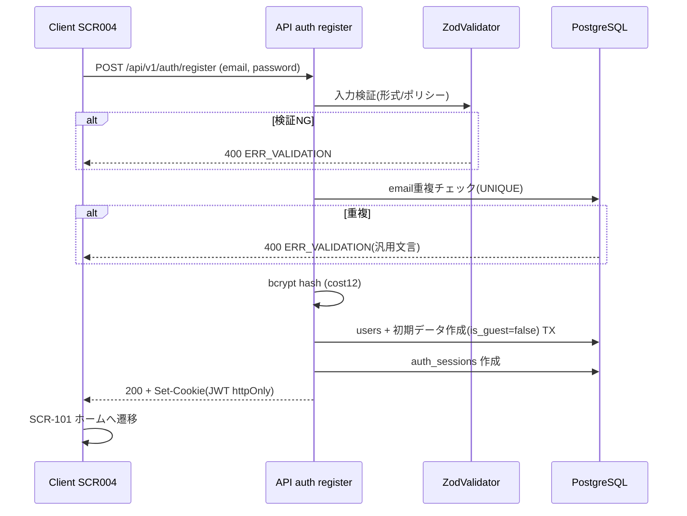
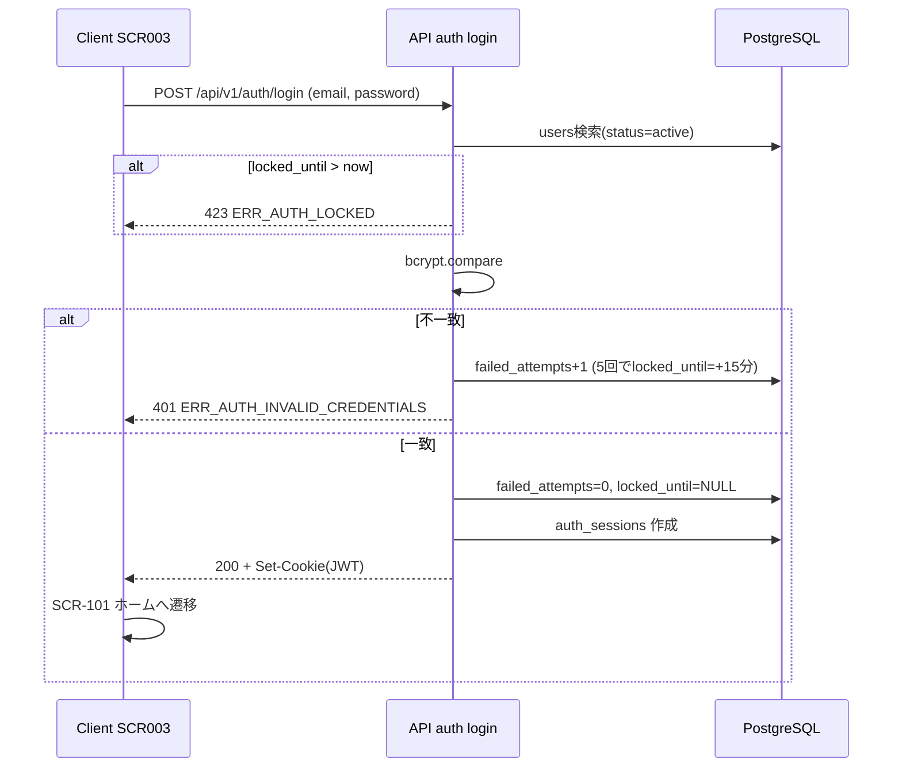
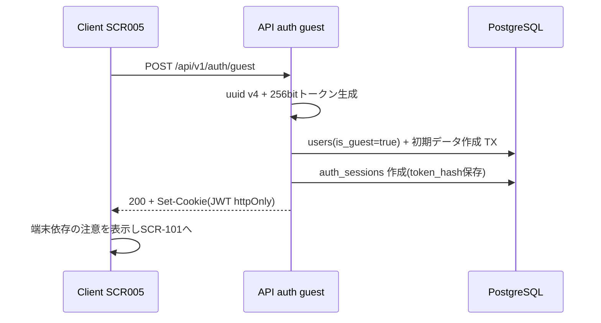
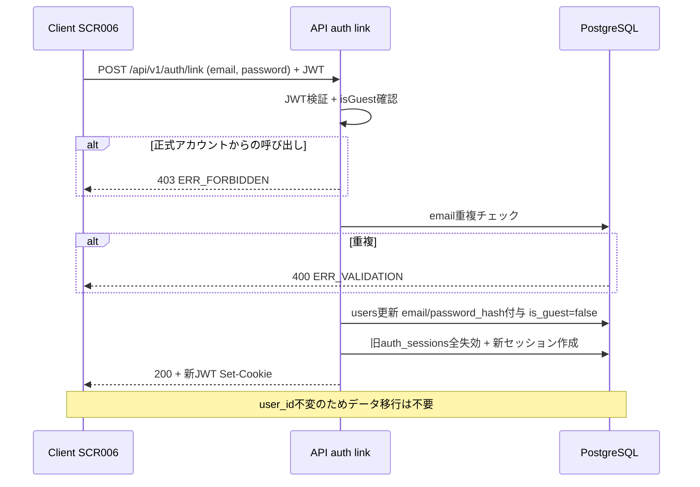

# 14. 認証設計書（Authentication Design）

- 対象プロダクト: Rogue Chronicle（ローグライトRPG）
- 目的: 本書は認証・セッション管理・アカウントライフサイクル（ゲスト開始／登録／ログイン／引き継ぎ／退会）の設計を定義する。API ID・エラーコード・テーブル名はCORE SPEC（設計共通仕様）と完全一致させる。
- 関連文書: 00_Project_Overview.md / 12_Database_Design.md / 13_API_Design.md / 15_Save_Data_Design.md / 22_Security_Design.md

---

## 1. 認証方式の全体像

DEC-006に基づき、MVPでは以下の2方式を採用する。

| 方式 | 対象 | MVP | 実装基盤 |
|---|---|---|---|
| ゲストプレイ | 登録なしで即プレイしたいユーザー | ○ | 独自実装（uuid + シークレットトークン）+ Auth.js セッションへ統合 |
| メール + パスワード | 正式アカウント | ○ | Auth.js (NextAuth v5) Credentials Provider |
| Google / GitHub / Apple ログイン | ソーシャルログイン希望者 | ×（将来） | Auth.js OAuth Provider 追加のみで対応 |
| メール認証（確認メール） | 正式アカウントの実在性確認 | ×（将来） | Resend 導入後 |
| パスワード再設定（API-007） | パスワード忘れ | △（将来） | Resend 導入後、password_reset_tokens テーブル使用 |

### 1.1 将来拡張を見込んだ設計方針（仮決定 DEC-141）

- Auth.js の Provider 配列に Credentials / Guest（Credentials の変種）を登録し、将来は `GoogleProvider` 等を**配列へ追加するだけ**で拡張可能な構成とする。
- users テーブルは Auth.js の Account モデル（provider / provider_account_id）を最初から持たせ、OAuth追加時のスキーマ変更を不要にする（列は auth_sessions と同居させず users 側の関連テーブル `auth_sessions` で管理。詳細は 12_Database_Design.md）。
- JWTペイロードは `{ sub: user_id, isGuest, role, sessionId, iat, exp }` の最小構成とし、Provider が増えても形を変えない。

---

## 2. ゲストプレイ（API-005: POST /auth/guest）

### 2.1 仕様

| 項目 | 内容 |
|---|---|
| API | API-005 `POST /api/v1/auth/guest`（認証不要） |
| 発行物 | `user_id`（uuid v4）+ シークレットトークン（256bit ランダム、サーバーでhash保存） |
| 保存先 | httpOnly Cookie（セッションCookieとして Auth.js JWT に統合） |
| users レコード | `is_guest = true`, email/password_hash は NULL, `status = active` |
| レート制限 | 5回/分/IP（認証系共通） |

### 2.2 処理フロー

1. クライアントが SCR-005（ゲスト開始画面）で「ゲストで始める」を押下。
2. サーバーが users に `is_guest=true` の行を作成し、player_progress / player_currencies / user_settings / user_profiles の初期行を同一トランザクションで作成。
3. シークレットトークンを生成し、bcryptハッシュを auth_sessions に保存（トークン原文はDB非保存）。
4. Auth.js JWT を発行し httpOnly Cookie にセット。応答は `{ userId, isGuest: true }`。

### 2.3 端末依存の注意表示（必須UI要件）

ゲストアカウントは Cookie（＝端末×ブラウザ）に依存するため、以下を SCR-005 とホーム画面（SCR-101）のゲストバッジに常時表示する。

> 「ゲストデータはこの端末・ブラウザにのみ保存されます。Cookie削除・端末変更・ブラウザ変更でデータにアクセスできなくなります。データを守るにはアカウント登録（引き継ぎ）を行ってください。」

- ゲストのプレイヤーランクが3に到達した時点、および累計ラン3回時点で引き継ぎ推奨モーダルを表示する（仮決定 DEC-142）。
- ゲストトークンの再発行機能は提供しない（紛失＝復旧不可を明記）。

---

## 3. メール + パスワード認証

### 3.1 登録（API-001: POST /auth/register）

| 項目 | 内容 |
|---|---|
| 入力 | email, password, passwordConfirm, 表示名（任意、未指定は自動生成） |
| 検証 | Zod: email形式 / パスワードポリシー / 確認一致。全てサーバー側で実施 |
| 重複 | email UNIQUE 違反時 ERR_VALIDATION(400)（存在有無を悟らせないため「登録できません」の汎用文言。仮決定 DEC-143） |
| ハッシュ | bcrypt cost=12。ソルトはbcrypt内蔵 |
| 応答 | 登録成功後、即ログイン状態（JWT Cookie発行） |

### 3.2 パスワードポリシー

| ルール | 値 |
|---|---|
| 最小長 | 8文字以上 |
| 最大長 | 72文字（bcrypt入力上限） |
| 文字種 | 英字・数字を各1文字以上含む |
| 禁止 | email と同一文字列 / 全て同一文字 |
| ハッシュ | bcrypt cost 12（`$2b$12$...`） |

### 3.3 ログイン（API-002: POST /auth/login）

- Auth.js Credentials Provider の `authorize()` 内で以下を順に検証:
  1. Zod入力検証（不正なら ERR_VALIDATION）
  2. users 検索（`status = active` のみ。withdrawn は ERR_AUTH_INVALID_CREDENTIALS 扱い）
  3. `locked_until > now()` なら ERR_AUTH_LOCKED(423)
  4. bcrypt.compare。失敗時 users.failed_attempts をインクリメントし ERR_AUTH_INVALID_CREDENTIALS(401)
  5. failed_attempts が5に達したら `locked_until = now() + 15分` を設定
  6. 成功時 failed_attempts=0 / locked_until=NULL にリセットし、auth_sessions に行を作成、JWT発行
- 失敗応答はemail不存在/パスワード不一致を区別しない（常に ERR_AUTH_INVALID_CREDENTIALS）。

### 3.4 ログアウト（API-003: POST /auth/logout）

- Cookie削除 + auth_sessions の該当行を `revoked_at = now()` で失効。
- JWTはステートレスだが、リクエスト毎に `sessionId` を auth_sessions と照合し revoked を拒否する（後述 §5.3）。

---

## 4. ゲスト→正式アカウント引き継ぎ（API-006: POST /auth/link）

### 4.1 仕様

| 項目 | 内容 |
|---|---|
| API | API-006 `POST /api/v1/auth/link`（要認証・ゲストのみ） |
| 画面 | SCR-006 データ引き継ぎ画面 |
| 入力 | email, password, passwordConfirm（登録と同一のZodスキーマ） |
| 処理 | 当該ゲスト users 行に email / password_hash を付与し `is_guest = false` に更新 |
| データ移行 | **不要**。全ユーザーデータ（player_progress, player_currencies, dungeon_runs 等）は user_id 外部キーで紐づいており、user_id は変わらないため |
| 事前条件 | 呼び出しユーザーが `is_guest = true` であること。正式アカウントからの呼び出しは ERR_FORBIDDEN(403) |
| email重複 | ERR_VALIDATION(400)（汎用文言、DEC-143と同様） |

### 4.2 設計上の要点

- 引き継ぎは「新アカウント作成＋データコピー」ではなく「同一行の昇格」。ラン継続中（dungeon_runs.status=active）でも中断なく実行できる。
- 引き継ぎ成功時、既存の auth_sessions（ゲストトークン系）は全て失効させ、新しいJWTを発行する（トークン格上げによるセッション固定攻撃の防止）。
- 逆方向（正式→ゲスト化）は提供しない。

---

## 5. セッション管理

### 5.1 方式: Auth.js JWT戦略（DEC-006）

| 項目 | 値 |
|---|---|
| 戦略 | JWT（Auth.js `session: { strategy: "jwt" }`） |
| アクセストークン有効期限 | 24時間 |
| スライド延長 | アクセス時に残り12時間未満なら再発行。**初回発行から最大30日**で強制再ログイン（auth_sessions.created_at 基準） |
| 署名 | AUTH_SECRET（HS256, Vercel環境変数） |
| ペイロード | sub(user_id), isGuest, role, sessionId, iat, exp |

### 5.2 Cookie属性

| 属性 | 値 | 理由 |
|---|---|---|
| httpOnly | true | XSSによるトークン窃取防止 |
| Secure | true（本番） | HTTPS限定 |
| SameSite | Lax | CSRF緩和 + 外部リンク流入時のセッション維持 |
| Path | / | 全画面・全APIで使用 |
| Max-Age | 86400（24h、スライドで更新） | §5.1と一致 |
| 名前 | `__Host-rc.session-token`（本番。__Host-プレフィックスでDomain/Path固定） | Cookie上書き攻撃対策 |

### 5.3 auth_sessions テーブルの役割（失効管理）

JWTステートレス運用の弱点（即時失効不可）を補うため、auth_sessions に最小の失効台帳を持つ。

- 行: `id(sessionId), user_id, token_hash(ゲストのみ), created_at, last_seen_at, expires_at, revoked_at, user_agent, ip_hash`
- 全認証必須APIで `sessionId` の行を参照し、`revoked_at IS NOT NULL` または `created_at + 30日 < now()` なら ERR_AUTH_SESSION_EXPIRED(401)。
- 照合コスト削減のため、この参照結果は同一リクエスト内でメモ化する（外部キャッシュはMVPでは使わない。仮決定 DEC-144）。

### 5.4 複数端末・同時ログイン

- 複数端末での同時ログインは**許可**する（セッション数上限なし。MVP）。
- ただしラン操作（API-303, 305, 306, 307, 402, 502〜508）は dungeon_runs.version による**楽観ロックで後勝ち**とする（DEC-011）。競合した端末には ERR_CONFLICT_VERSION(409) が返り、GET /runs/current（API-304）で最新状態へ同期する。詳細は 15_Save_Data_Design.md §7。

### 5.5 セッション失効の一覧

| きっかけ | 失効範囲 |
|---|---|
| 明示ログアウト（API-003） | 当該セッションのみ |
| パスワード変更（将来 API-007確定時） | 当該ユーザーの全セッション |
| ゲスト引き継ぎ成功（API-006） | 引き継ぎ前の全セッション |
| 退会（API-008） | 全セッション即時 |
| 30日経過 | 当該セッション（強制再ログイン） |

---

## 6. 退会（API-008: DELETE /auth/account）

### 6.1 フロー（確認2段階）

1. **確認1**: SCR-116（設定画面）から退会導線 → 影響説明画面（永続データ・ラン履歴が消えること、30日以内は復帰可能なことを表示）で「退会手続きへ」。
2. **確認2**: 正式アカウントはパスワード再入力、ゲストは確認フレーズ「削除する」の入力で最終確定。
3. サーバー処理: `users.status = 'withdrawn'`, `withdrawn_at = now()` を設定し、全 auth_sessions を失効。active なラン（dungeon_runs.status=active）は `retired` に更新（報酬付与はしない）。

### 6.2 データ削除ポリシー

| フェーズ | タイミング | 内容 |
|---|---|---|
| 論理削除 | 退会即時 | status=withdrawn。ログイン不可。API-002は ERR_AUTH_INVALID_CREDENTIALS |
| 復帰猶予 | 30日間 | 将来: サポート経由の復帰を想定（MVPでは復帰機能なし、猶予のみ確保。仮決定 DEC-145） |
| 物理削除 | 退会30日後 | 日次バッチ（Vercel Cron）で users と全関連行（CASCADE）を削除。currency_transactions / battle_logs / audit_logs 内の user_id はNULL化ではなく行削除（個人データ最小化） |

---

## 7. 認証フロー図

### 7.1 新規登録（API-001）

### 7.2 ログイン（API-002）

### 7.3 ゲスト開始（API-005）

### 7.4 ゲスト引き継ぎ（API-006）

---

## 8. セキュリティ対策（認証領域）

| 脅威 | 対策 | 実装箇所 |
|---|---|---|
| CSRF | Auth.js内蔵CSRFトークン（認証フォーム系Server Actions）+ SameSite=Lax + 変更系APIはJSONのみ受理（Content-Type検証） | Auth.js設定 / route handlers |
| XSS | React自動エスケープ + `dangerouslySetInnerHTML` 禁止 + CSPヘッダ（具体値は 22_Security_Design.md §4） + httpOnly Cookie | 全画面 / next.config |
| SQLインジェクション | Prismaのパラメタライズドクエリのみ使用。`$queryRawUnsafe` 禁止 | server/repositories |
| ブルートフォース | 5回連続失敗で15分アカウントロック（users.failed_attempts, users.locked_until）+ ERR_AUTH_LOCKED(423) | API-002 |
| レート制限 | 認証系API（001,002,005,006,008）は 5回/分/IP。超過は ERR_RATE_LIMITED(429) | server/services（レート制限サービス） |
| セッション固定 | ログイン・引き継ぎ成功時に必ず新sessionId発行 | AuthModule |
| タイミング攻撃 | email不存在時もダミーbcrypt比較を実行し応答時間を均一化 | API-002 |
| トークン漏洩 | JWTはhttpOnly Cookieのみ（LocalStorage保存禁止）。AUTH_SECRETはVercel環境変数 | 全体 |

---

## 未決事項

| ID | 内容 |
|---|---|
| ISSUE-141 | メール認証（確認メール）導入時、未認証アカウントの機能制限範囲（Resend導入後に決定） |
| ISSUE-142 | 退会後30日以内の復帰手段（MVPは猶予期間のみ確保、復帰UI/サポートフローは未定。DEC-145参照） |
| ISSUE-143 | OAuth追加時の同一emailアカウント自動リンク可否（乗っ取りリスクがあるため既定は手動リンク想定） |
| ISSUE-144 | レート制限のストア（MVPはメモリ+Vercel単一リージョン前提。エッジ多リージョン化時はUpstash等の検討要） |

## 実装時の注意点

- bcryptはNode.jsランタイム必須。認証系route handlerに `export const runtime = "nodejs"` を明示し、Edgeランタイムへの誤配置を防ぐ。
- Auth.js v5の `authorize()` 内で投げたエラーは汎用化されるため、ERR_AUTH_LOCKED等のエラーコードは独自のエラーマッピング層で変換して返す。
- ゲストのシークレットトークンはログ・エラーレポートに絶対に出力しない（LoggingModuleでマスキング）。
- failed_attempts のインクリメントはトランザクション内で `UPDATE ... SET failed_attempts = failed_attempts + 1` とし、並行ログイン試行での取りこぼしを防ぐ。
- 退会物理削除バッチは削除件数を audit_logs に記録する。
- Cookie名の `__Host-` プレフィックスはローカル開発（http）では使えないため、開発時は通常名にフォールバックする設定を用意する。

## 関連設計書

- 00_Project_Overview.md（プロジェクト概要・DEC-006）
- 09_Screen_Design.md（SCR-003〜SCR-006, SCR-116）
- 12_Database_Design.md（users / auth_sessions / password_reset_tokens）
- 13_API_Design.md（API-001〜API-008 の入出力詳細）
- 15_Save_Data_Design.md（複数端末競合・楽観ロック）
- 22_Security_Design.md（脅威モデル・HTTPヘッダ具体値）
