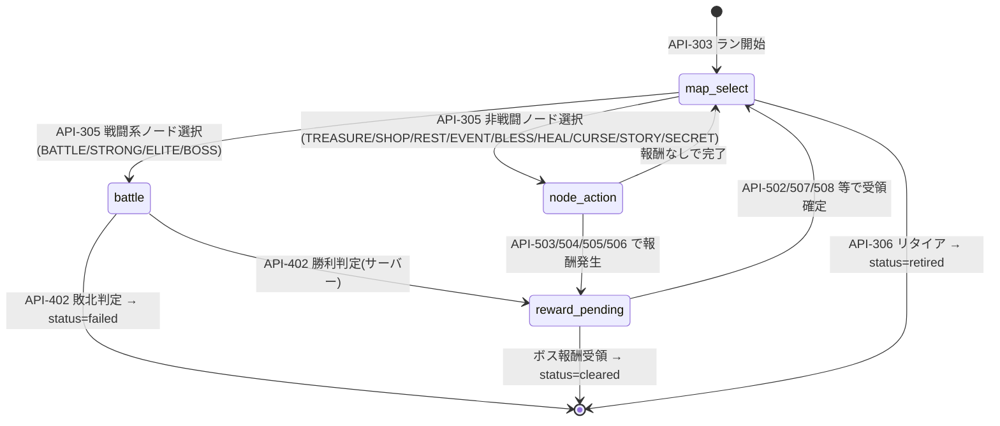
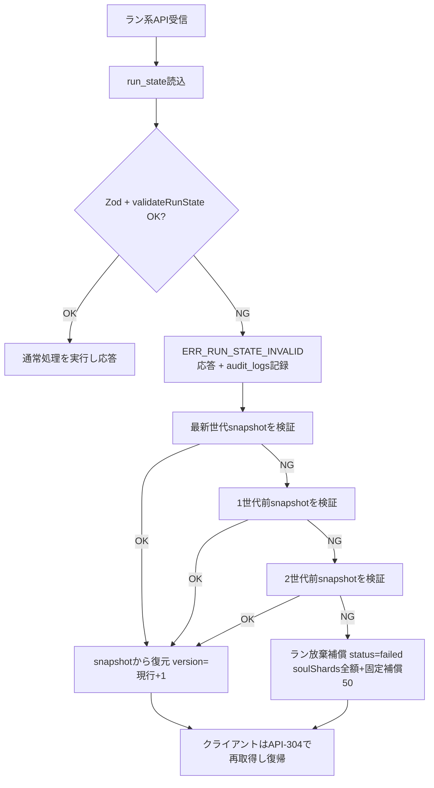

# 15. セーブデータ設計書（Save Data Design）

- 対象プロダクト: Rogue Chronicle（ローグライトRPG）
- 目的: 本書はゲーム進行データの保存方式（サーバー権威）、run_state JSONBの完全スキーマ、自動保存タイミング、チェックポイント世代管理、途中再開、排他制御、破損検知・復旧を定義する。API ID・エラーコード・テーブル名・run_state構造はCORE SPECと完全一致させる。
- 関連文書: 12_Database_Design.md / 13_API_Design.md / 14_Authentication_Design.md / 22_Security_Design.md

---

## 1. 保存方式の基本方針: サーバー権威（DEC-007 / DEC-011）

- **全ゲーム進行はサーバーのDBにのみ保存する。** ラン中の状態は dungeon_runs.run_state（JSONB）、ラン外の永続データはユーザー永続テーブル（player_progress, player_currencies, player_characters, player_equipment, player_upgrades, player_codex, player_achievements, player_story_progress）に保存する。
- クライアントは行動の選択のみをAPIで送信し、戦闘計算・報酬抽選・乱数は全てサーバーで実行する（DEC-007）。したがって**クライアントに「セーブ処理」は存在しない**。全ての変更系APIがサーバー側で状態を確定（DBコミット）してから応答を返すため、応答を受け取った時点で保存は完了している。
- 「セーブボタン」「オートセーブ中...」等のUIは不要。SCR-313（一時停止画面）には「進行は自動的にサーバーへ保存されています」と表示する（仮決定 DEC-151）。

### 1.1 LocalStorage の使用範囲（DEC-020系方針・技術スタック§10準拠）

LocalStorageは**非重要データのみ**に使用する。

| 区分 | 保存してよいもの（許可リスト） |
|---|---|
| 設定キャッシュ | 音量（効果音ON/OFF）、演出スピード、ダメージ表示設定（正はuser_settingsでサーバー保存、LocalStorageは未ログイン時・オフライン表示用キャッシュ） |
| UI状態 | チュートリアル表示済みフラグ、最後に見たお知らせID、折りたたみUIの開閉状態 |
| 開発用 | デバッグフラグ（本番ビルドでは無効） |

**禁止リスト（LocalStorage / SessionStorage / IndexedDB への保存を禁止）:**

1. run_state の全部または一部（map, position, character, skills, equipment, relics, items, gold, battle, pendingReward, rngCursor, earned）
2. 所持通貨（ゴールド、ソウルシャード）・プレイヤーランク・EXP
3. 認証トークン・セッション情報（JWTはhttpOnly Cookieのみ）
4. 図鑑・実績・永続強化の解放状態
5. 冪等キーと対応する応答内容（リトライ管理はメモリ上のみ）
6. マスタデータの改ざん可能なコピー（表示用キャッシュはTanStack Queryのメモリキャッシュのみ）

違反はコードレビュー観点に含める（22_Security_Design.md §3参照）。

---

## 2. run_state JSONB 完全スキーマ定義

dungeon_runs.run_state に格納する。CORE SPEC §8の骨子を全フィールドで詳細化する。Zodスキーマ（src/schemas/runState.ts）と本表は常に一致させること。

### 2.1 ルート

| フィールド | 型 | 必須 | 説明 |
|---|---|---|---|
| schemaVersion | number（整数） | ○ | run_stateスキーマのバージョン。MVPは `1`。マイグレーション判定に使用 |
| map | Map | ○ | 生成済みノードマップ（ラン開始時に確定、以後不変） |
| position | Position | ○ | 現在位置とフェーズ |
| character | Character | ○ | ラン内キャラクター状態 |
| skills | Skill[] | ○ | 所持スキル（最大8枠） |
| equipment | Equipment | ○ | 装備3枠 |
| relics | string[] | ○ | 所持レリックのcode配列（重複不可） |
| items | Item[] | ○ | 所持消耗品 |
| gold | number（整数≥0） | ○ | ラン内通貨ゴールド |
| battle | Battle \| null | ○ | 戦闘中のみ非null。phase=battle と連動 |
| pendingReward | PendingReward \| null | ○ | 未受領報酬。phase=reward_pending と連動 |
| rngCursor | number（整数≥0） | ○ | PRNG（mulberry32相当, DEC-019）の消費カーソル。dungeon_runs.seed と組で全乱数を再現可能 |
| earned | Earned | ○ | ラン中に確定した持ち帰り資源の累計 |

### 2.2 Map

| フィールド | 型 | 説明 |
|---|---|---|
| seed | number（32bit整数） | マップ生成シード（dungeon_runs.seed と同値を冗長保持） |
| floors | Floor[] | 階層1〜10の配列 |
| floors[].floor | number | 階層番号（1〜10） |
| floors[].nodes | Node[] | 当該階層のノード（1〜4個） |
| nodes[].id | string | ノードID。形式 `f{floor}n{index}`（例 `f3n2`） |
| nodes[].type | string | ノードタイプ: BATTLE / STRONG / ELITE / BOSS / TREASURE / SHOP / REST / EVENT / BLESS / HEAL / CURSE / STORY / SECRET |
| nodes[].visited | boolean | 訪問済みか |
| nodes[].payloadRef | string \| null | イベント・敵編成等の抽選結果参照（code）。未確定はnull |
| edges | Edge[] | ノード間接続 |
| edges[].from / edges[].to | string | ノードID。fromの階層+1がtoの階層であること |

### 2.3 Position と phase 遷移

| フィールド | 型 | 説明 |
|---|---|---|
| floor | number | 現在階層（1〜10） |
| nodeId | string | 現在ノードID（例 `f3n2`）。map_select中は「直前に完了したノード」 |
| phase | string | `map_select` / `node_action` / `battle` / `reward_pending` の4値 |

- phase と受理可能APIの対応は §6 の再開対応表と同一。phase外のAPI呼び出しは ERR_INVALID_ACTION(422)。

### 2.4 Character

| フィールド | 型 | 説明 |
|---|---|---|
| code | string | キャラクターcode（swordsman_rain / mage_lilia / rogue_gald） |
| level | number | ラン内レベル（1〜20） |
| exp | number | 現在レベル内の累積EXP |
| stats | Stats | レベル・装備・レリック・永続強化を合算した**現在の確定ステータス**（maxHp, atk, def, spd, critRate, critDmg, eva, acc, statusRes, elemRes{fire,water,wind,none}, maxSp） |
| hp | number | 現在HP（0〜maxHp） |
| sp | number | 現在SP（0〜maxSp） |
| uniqueUsed | boolean | 固有能力の消費状況（例: レイン「不屈」の使用済みフラグ） |

### 2.5 Skill / Equipment / Item

| フィールド | 型 | 説明 |
|---|---|---|
| skills[].code | string | skillsマスタのcode（例 skill_flame_slash） |
| skills[].level | number | 強化Lv（1〜3） |
| equipment.weapon | string \| null | equipmentマスタのcode |
| equipment.armor | string \| null | 同上 |
| equipment.accessory | string \| null | 同上 |
| items[].code | string | 消耗品code（例 potion） |
| items[].count | number | 個数（1以上） |

### 2.6 Battle（戦闘中のみ非null）

| フィールド | 型 | 説明 |
|---|---|---|
| enemies | BattleEnemy[] | 敵1〜3体。`{ index, code, hp, maxHp, stats, statusEffects[], buffs[], intent }` |
| enemies[].intent | object | 行動予告 `{ actionCode, targetType, forecastDamage \| null }` |
| turnNo | number | 現在ターン番号（1〜） |
| actionQueue | string[] | 当該ターンの行動順（spd降順、`player` / `enemy:{index}`） |
| rngCursor | number | 戦闘開始時点のカーソル控え（検証・リプレイ用。全体のrngCursorとは別に保持） |
| effects | object | プレイヤー側の状態異常・バフ/デバフ `{ statusEffects[], buffs[] }`。各要素 `{ code, remainingTurns, value }` |

### 2.7 PendingReward（未受領報酬・多重取得防止の要）

| フィールド | 型 | 説明 |
|---|---|---|
| type | string | `battle` / `treasure` / `event` / `level_up` / `boss` |
| choices | object[] | 提示済み選択肢（サーバー抽選済み。例: スキル3択の候補、宝箱の中身） |
| claimed | boolean | 受領確定済みか。true 化と報酬付与は同一トランザクション |
| sourceNodeId | string | 発生元ノードID |
| rerollLeft | number | スキル3択のリロール残回数（type=level_up時のみ） |

### 2.8 Earned

| フィールド | 型 | 説明 |
|---|---|---|
| soulShards | number | ラン中確定済みソウルシャード（リザルトで倍率適用: クリア100%/リタイア80%/敗北50%） |
| rankExp | number | 獲得予定ランクEXP累計 |
| kills | number | 撃破数（実績判定用） |

---

## 3. 自動保存タイミング表

「クライアントが保存する」のではなく、**全ての変更系APIがサーバーで状態を確定（DBトランザクションコミット）してから応答する**。下表は「どの操作でサーバー保存が発生するか」の整理であり、クライアント側の保存処理は一切不要。

| タイミング | API | サーバーで確定される内容 |
|---|---|---|
| ラン開始 | API-303 | マップ生成、初期run_state、seed、snapshot世代1 |
| ノード選択時 | API-305 | position更新、戦闘状態生成（戦闘ノード時）、snapshot世代保存 |
| 戦闘の各行動解決後 | API-402 | ダメージ・状態異常・敵行動・戦闘終了判定・報酬抽選まで全て解決した後のrun_state |
| レベルアップのスキル選択時 | API-502 | スキル追加/強化、pendingReward.claimed=true |
| 宝箱開封時 | API-503 | ドロップ抽選結果、pendingReward |
| ショップ購入時 | API-504 | gold減算、アイテム/装備追加 |
| 休憩実行時 | API-505 | HP50%回復 or スキル強化 |
| イベント選択時 | API-506 | イベント結果適用 |
| 装備変更時 | API-507 | equipment更新、stats再計算 |
| レリック取得確定時 | API-508 | relics追加 |
| リタイア時 | API-306 | status=retired、earned×80%の持ち帰り確定 |
| リザルト確定時 | API-307 | 永続テーブルへの付与（player_currencies, player_progress等）、status=finalized |

- 参照系（API-304, 401, 501）は保存を発生させない。
- ラン系変更APIは全て `Idempotency-Key` ヘッダ + run_state.version 楽観ロック必須（CORE SPEC §7）。

---

## 4. チェックポイント・世代管理（dungeon_run_snapshots）

### 4.1 保存ルール

| 項目 | 内容 |
|---|---|
| テーブル | dungeon_run_snapshots |
| 保存タイミング | **ノード開始時**（API-305でノード選択が確定した直後のrun_state）+ ラン開始時（API-303） |
| 保存内容 | run_id, generation（連番）, run_state（JSONB全量コピー）, version, created_at |
| 世代数 | 直近3世代のみ保持。4世代目保存時に最古を同一トランザクションで削除 |
| 削除 | ラン終了（finalized/failed/retired）から7日後にバッチ削除（仮決定 DEC-152） |

戦闘中の各行動ではsnapshotを取らない（run_state本体が毎行動で確定保存されるため）。snapshotは「run_state本体が破損した場合の巻き戻し先」であり、ノード単位の粒度で十分とする。

### 4.2 破損時の復旧手順（優先順）

1. **最新世代**（現在ノード開始時点）から復元 → 現在ノードのやり直し
2. 失敗（最新世代も検証NG）なら**1世代前**から復元
3. 全世代検証NG なら**ラン放棄補償**: status=failed とし、earned.soulShards の100%（敗北時50%ではなく全額。運営過失のため）+ 固定補償（ソウルシャード50）を付与（仮決定 DEC-153）

復元時は dungeon_runs.version を**現行versionより大きい値（現行+1）**に更新し、古いデータでの上書き扱いにならないようにする（§8参照）。復元イベントは audit_logs に記録する。

---

## 5. 途中再開（再ログイン・リロード時）

クライアントはアプリ起動時・リロード時に GET /runs/current（API-304）を呼び、応答の position.phase に応じて画面復帰する。

| API-304の応答 | phase | 復帰先画面 | 補足 |
|---|---|---|---|
| active なランなし（404相当の空応答） | - | SCR-101 ホーム | 通常起動 |
| active | map_select | SCR-301 ダンジョンマップ画面 | 次ノード選択待ち状態を再現 |
| active | node_action | ノードtype別: TREASURE→SCR-305 / SHOP→SCR-306 / REST→SCR-307 / EVENT・BLESS・HEAL・CURSE・SECRET→SCR-308 / STORY→SCR-308（ストーリー表示） | 選択肢はサーバー再送（run_stateから再構築） |
| active | battle | SCR-302 戦闘画面 | 追加で GET /runs/current/battle（API-401）を呼び敵状態・intent・actionQueueを取得 |
| active | reward_pending | pendingReward.type別: level_up→SCR-303 / battle・treasure→SCR-305/310相当の報酬画面 / boss→SCR-401 | claimed=falseの報酬を必ず先に消化させる |
| cleared / failed（finalize未実行） | - | SCR-401 / SCR-402 → SCR-403 | API-307でリザルト確定を促す |

- 再開時にクライアントが独自状態を持ち込むことはない。表示は常にAPI-304応答のrun_stateのみから構築する。

---

## 6. 排他制御

### 6.1 楽観ロック（DEC-011）

- dungeon_runs.version（整数、初期1）を全変更系APIで使用。リクエストボディに `expectedVersion` を必須で含め、サーバーは `UPDATE dungeon_runs SET run_state=..., version=version+1 WHERE id=... AND version=expectedVersion` で更新。更新0行なら ERR_CONFLICT_VERSION(409)。
- クライアントは ERR_CONFLICT_VERSION 受信時、**API-304で最新状態を再取得して画面を同期**し、操作をやり直す（自動再送はしない。ユーザーの意図が変わる可能性があるため）。

### 6.2 複数端末競合（後勝ち）

- 複数端末の同時プレイは禁止しないが、versionにより**後から確定した操作が勝つ**のではなく、正確には「古いversionを前提にした操作が拒否される」＝先にコミットした方が勝ち、負けた端末は同期して続行する。UI上は「他の端末で操作が行われました。最新の状態を読み込みます」と表示。

### 6.3 二重保存防止（冪等キー）

- ラン系変更API（303, 305, 306, 307, 402, 502〜508）は `Idempotency-Key` ヘッダ必須（UUID v4、操作ごとにクライアント生成）。
- サーバーは (user_id, idempotency_key) をキーに処理結果（HTTPステータス+ボディ）を24時間保存。同一キー再受信時は**保存済み応答をそのまま返す**（再適用しない）。処理中の同一キー到着は ERR_DUPLICATE_REQUEST(409)。
- これにより「応答が届かなかったが実は成功していた」ケースでのリトライが安全になる。

---

## 7. 保存失敗時の挙動（リトライ設計）

- クライアントは変更系API呼び出しで**応答未達（ネットワークエラー/タイムアウト）**の場合のみ、**同一Idempotency-Keyで最大3回リトライ**する。間隔は指数バックオフ 2s → 4s → 8s。
- 3回失敗した場合は SCR-010（通信エラー画面）へ遷移し、「再試行」ボタンで同一キーのまま再開する。
- 4xx応答（ERR_VALIDATION, ERR_INVALID_ACTION, ERR_CONFLICT_VERSION等）はリトライしない（意味的失敗のため）。ERR_RATE_LIMITED(429)は Retry-After 秒後に1回のみ再試行。
- サーバーは冪等キーで二重適用を防止するため、リトライにより報酬二重付与・通貨二重減算は発生しない。

---

## 8. セーブデータ破損検知と復旧

### 8.1 検知

- 全ラン系APIはrun_stateをDBから読み込んだ直後に **Zodスキーマ検証（src/schemas/runState.ts）+ validateRunState（domain層の意味検証）** を実行する。
- validateRunState の検証項目（例）: hp ≤ maxHp / gold ≥ 0 / relics重複なし / skills ≤ 8枠 / position.nodeId がmap内に存在 / phaseとbattle・pendingRewardのnull整合 / edges整合 / schemaVersion既知値。
- 検証NG時は ERR_RUN_STATE_INVALID(409) を返し、同時にサーバー側で復旧フローを開始する。発生は audit_logs に記録する（22_Security_Design.md §5）。

### 8.2 復旧フロー

- 復旧はAPI応答とは非同期にせず、ERR_RUN_STATE_INVALID を受けたクライアントが API-304 を呼んだ時点で復元済みrun_state（または放棄補償後の状態）が返る、という同期的な整理とする（仮決定 DEC-154）。

### 8.3 古いデータでの上書き防止

- versionが進んでいるrun_stateを過去の状態に戻す経路は、**§8.2のsnapshot復元処理のみ**に限定する。
- クライアントからrun_state本体（またはその断片）を受け取って保存するAPIは存在しない（全APIは「選択」だけを受け取る）。よって「古いセーブデータのアップロードによる巻き戻し」は構造的に不可能。
- snapshot復元時も version は必ず単調増加（現行+1）させ、冪等キー台帳は当該runについてクリアする（復元前の応答キャッシュが復元後の状態と矛盾するため）。
- 運用者による手動復旧（DB直接操作）も同じ規則（version単調増加 + audit_logs記録）に従う。

---

## 未決事項

| ID | 内容 |
|---|---|
| ISSUE-151 | schemaVersion 2以降のマイグレーション方針（読み込み時レイジー変換 or バッチ一括変換）。MVPはv1固定のため未決 |
| ISSUE-152 | 冪等キー台帳の保存先（MVPはPostgreSQLテーブル想定。行数増加時のパーティション/TTL戦略） |
| ISSUE-153 | ラン放棄補償の固定額（暫定ソウルシャード50、DEC-153）のバランス調整 |
| ISSUE-154 | battle_logs（保持30日）とsnapshotの突合による破損原因調査手順の詳細化 |

## 実装時の注意点

- run_stateの読み書きは必ず SaveModule（saveRunProgress / validateRunState）経由とし、usecase から Prisma で直接 run_state を更新するコードを書かない。
- JSONBの部分更新（jsonb_set）は使わず、常に全量読み込み→domain処理→全量書き戻しとする（1ランのデータは一括読み書き前提、CORE SPEC §8）。
- Zodスキーマは `.strict()` を指定し、未知フィールドの混入（将来の改ざん・バグ検知）を早期に発見する。
- snapshot保存とrun_state更新は同一トランザクションで行い、「run_stateだけ進んでsnapshotが無い」状態を作らない。
- リトライの指数バックオフはブラウザタブ非アクティブ時のタイマー間引きを考慮し、経過時間ベース（Date.now比較）で実装する。
- earned.soulShards への倍率（100/80/50%）適用は finalize（API-307）時の1回のみ。途中で適用すると二重割引バグの温床になる。
- 冪等キー応答キャッシュにはSet-Cookie等の認証ヘッダを含めない。

## 関連設計書

- 05_Game_Design.md（報酬・成長仕様）
- 12_Database_Design.md（dungeon_runs / dungeon_run_snapshots / battle_logs / currency_transactions）
- 13_API_Design.md（API-303〜API-508 の入出力・Idempotency-Key仕様）
- 14_Authentication_Design.md（複数端末セッション方針）
- 22_Security_Design.md（改ざん対策・audit_logs）
