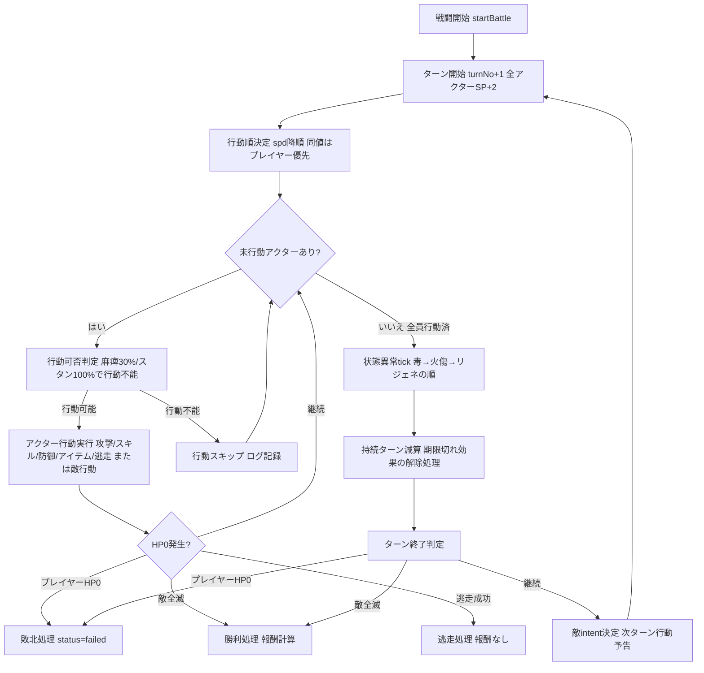
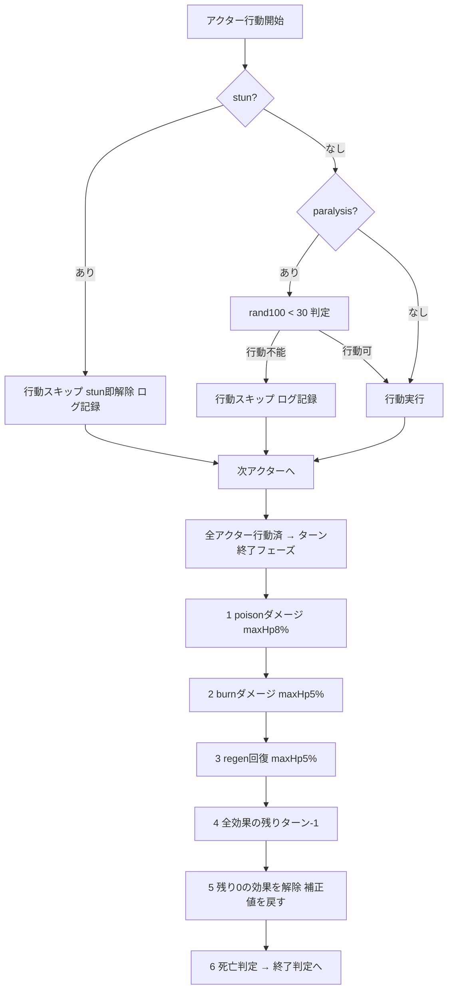

# 16. 戦闘設計書（Battle Design）

- 対象プロダクト: Rogue Chronicle（ローグライトRPG）
- 目的: 戦闘方式の選定根拠、ターン制コマンドバトルの全仕様（フロー・コマンド・計算式・状態異常・敵行動・報酬・ログ）を実装可能な粒度で定義する
- 準拠: CORE_SPEC §5.1〜§5.7（計算式・ステータス・属性・状態異常・敵はCORE_SPECと完全一致）
- 関連文書: 05_Game_Design.md / 17_Dungeon_Design.md / 18_Skill_Design.md / 19_Enemy_AI_Design.md / 12_Database_Design.md / 13_API_Design.md

---

## 1. 戦闘方式の比較選定（DEC-002）

### 1.1 候補と評価（5段階、5が最良）

| 観点 | ターン制コマンド | セミオート | リアルタイムアクション | カードバトル | オートバトル+スキル選択 | グリッドタクティカル |
|---|---|---|---|---|---|---|
| 個人開発難易度（低いほど高評価） | 5 | 4 | 1 | 3 | 4 | 2 |
| スマホ操作性 | 5 | 5 | 2 | 4 | 5 | 3 |
| ローグライト相性（ビルド構築の反映しやすさ） | 5 | 3 | 3 | 5 | 3 | 4 |
| 繰り返し遊びやすさ（1ラン15〜30分・テンポ） | 4 | 5 | 3 | 4 | 5 | 2 |
| UI実装難易度（低いほど高評価） | 5 | 4 | 1 | 3 | 4 | 2 |
| バランス調整しやすさ | 5 | 3 | 2 | 4 | 3 | 3 |
| 拡張性（パーティ制・スキル追加・オート化） | 4 | 4 | 3 | 4 | 4 | 5 |
| **合計** | **33** | **28** | **15** | **27** | **28** | **21** |

### 1.2 採用: ターン制コマンドバトル（DEC-002）

採用理由:
1. **サーバー権威（DEC-007）と最も相性が良い**: 1行動=1リクエスト（API-402）で完結し、リアルタイム同期が不要。乱数・計算を全てサーバーで実行できる
2. **個人開発でのバランス調整コストが最小**: 全計算が決定的な式（§4）で表現でき、シード再現（DEC-019）でリプレイ検証可能
3. **スマホ縦持ち片手操作に最適**: コマンド5種のタップのみで完結。ドラッグ・スワイプ・タイミング入力なし
4. **ローグライトの核（スキル3択・レリック・装備ビルド）が数式に直結**: ビルド差が明確に体感できる
5. **将来のオート戦闘・倍速が追加コストほぼゼロ**: 行動APIの繰り返し呼び出しで成立（§13）

カードバトルは相性は良いがデッキ管理UI・カード枚数のコンテンツ量が個人開発MVPには過大、セミオート/オートは「ビルドを操作で活かす」体験が薄いため次点とした。

---

## 2. 戦闘の基本構造

- 編成: **プレイヤー1キャラ vs 敵1〜3体**（DEC-012。パーティ制は将来拡張）
- 戦闘はノード進入時にサーバーが生成（API-305の応答に戦闘初期状態を含む。戦闘開始APIは独立させない）
- 戦闘状態は `dungeon_runs.run_state.battle` に保持（enemies / turnNo / actionQueue / rngCursor / effects）
- クライアントは行動選択のみ送信（API-402）。ダメージ・命中・状態異常・報酬は全てサーバー計算（DEC-007）

### 2.1 ターンフロー図



### 2.2 行動順（determineTurnOrder）

- ターン開始時に **spd降順** でその ターンの行動キュー（actionQueue）を確定する
- 同値の場合: **プレイヤー優先**（CORE_SPEC §5.1）。敵同士の同値は配置スロット順（enemies[0]→[2]）
- ターン途中でspdが変化（spdUp/spdDown付与等）しても**当該ターンのキューは変更しない**。次ターンの行動順決定から反映
- 行動途中で死亡したアクターはキューから除外される

### 2.3 SPの回復内訳（DEC-030 仮決定）

| タイミング | 回復量 | 備考 |
|---|---|---|
| ターン開始時（基礎回復） | +2 | CORE_SPEC §5.1「毎ターン+2回復」。全アクター共通 |
| 通常攻撃実行時 | +1 | コマンド仕様（§3.1） |
| 防御実行時 | +2 | コマンド仕様（§3.3） |
| リリア固有「魔力循環」 | +1/ターン | ターン開始時の基礎回復に加算 |

- 初期SP: 戦闘開始時 sp = maxSp = 10（レリック・永続強化で将来変動可）
- SPは戦闘終了時にリセットされず、**次の戦闘開始時に maxSp まで回復する**（仮決定 DEC-030。ラン間の持ち越し管理を単純化するため）

---

## 3. コマンド設計（プレイヤーの5コマンド）

API-402 のリクエスト `actionType` と対応させる。

| コマンド | actionType | 効果 | SP | ターン消費 |
|---|---|---|---|---|
| 通常攻撃 | attack | 単体に skillMult 1.0 の物理ダメージ + **SP+1回復** | 0 | 消費 |
| スキル | skill | skills配列から選択。skillMult 0.8〜3.0、効果はskill_effects駆動 | スキルごとのcost（1〜6） | 消費 |
| 防御 | guard | そのターン終了まで**被ダメージ50%減** + **SP+2回復** | 0 | 消費 |
| アイテム | item | 所持アイテム使用（§3.4）。**使用でターン消費** | 0 | 消費 |
| 逃走 | flee | 成功率式（§3.5）で判定。成功なら戦闘離脱、失敗ならターン消費のみ | 0 | 消費 |

### 3.1 通常攻撃（attack）
- 対象: 敵単体（targetIndex必須）。命中判定あり（§4.4）
- skillMult = 1.0、属性 = キャラの属性（レイン=火、リリア=水、ガルド=風）
- 命中・回避に関わらずSP+1は付与する（空振りでも構えの回復とする。仮決定 DEC-031）

### 3.2 スキル（skill）
- `skillCode` と（単体対象スキルなら）`targetIndex` を指定
- SP不足時は ERR_INVALID_ACTION(422)。クライアント側でもSP不足スキルはdisabled表示（§12）
- 効果は skills + skill_effects マスタ駆動（damage / damage_aoe / heal / buff / debuff / status / sp_gain / shield / revive_guard）。個別20種は 18_Skill_Design.md

### 3.3 防御（guard）
- 効果: 付与ターンの**ターン終了まで**、受ける全ダメージ（属性・状態異常tickダメージ含む）を50%減（floor適用は最終ダメージ算出後）
- SP+2回復。バフ枠ではなく行動フラグ `guarding: true` で管理（ターン終了時に自動解除、重複概念なし）

### 3.4 アイテム（item）— MVP消耗品3種（仮決定 DEC-032）

| code | 名称 | 効果 | 入手 |
|---|---|---|---|
| potion | ポーション | HP40%回復（maxHp基準、floor） | ショップ40G/宝箱/イベント |
| hi_potion | ハイポーション | HP70%回復 | ショップ90G/宝箱 |
| antidote | 万能解毒薬 | 状態異常5種を全て解除 | ショップ30G/イベント |

- 所持上限: 各コード5個（超過分の獲得は破棄しゴールド換算+10G。仮決定 DEC-032）
- 戦闘外（マップ画面）でも使用可（potion/hi_potionのみ）。戦闘中はターン消費

### 3.5 逃走（flee）

```
逃走成功率 = clamp(50 + (自spd - 敵最速spd) × 2, 20, 90)   ※CORE_SPEC §5.4
```

- **ボス戦・エリート戦は逃走不可**（コマンド自体をdisabled、送信時はERR_INVALID_ACTION）。強敵（STRONG）戦は逃走可
- 成功: 戦闘即終了。**報酬なし**（EXP・ゴールド・ドロップ全て0）。当該ノードは消化済み扱いとなり phase→map_select（詳細は17章§9）
- 失敗: ターン消費のみ（敵の行動は通常どおり実行される）
- 計算例: 自spd10 vs 敵最速spd13 → 50 + (10-13)×2 = 44%。自spd16 vs 敵spd8 → 50+16=66%。自spd30 vs spd6 → 98→clampで90%

---

## 4. 計算式（CORE_SPEC §5.4 転記 + 変数定義 + 計算例）

### 4.1 ダメージ

```
ダメージ = max(1, floor(atk × skillMult × (100 / (100 + def)) × elemMod × critMod × rand(0.90〜1.10)))
  skillMult: 通常攻撃1.0 / スキル0.8〜3.0
  elemMod: 1.25 / 1.0 / 0.75（さらに対象のelemResで最大-50%）
  critMod: クリ時 critDmg/100（基本1.5）、非クリ時1.0
```

| 変数 | 定義 |
|---|---|
| atk | 攻撃側の攻撃力（バフ・デバフ・状態異常補正適用後の実効値） |
| skillMult | 行動の倍率。通常攻撃=1.0、スキルはマスタ定義0.8〜3.0 |
| def | 防御側の防御力（実効値）。逓減式のため防御は積むほど1あたりの価値が下がる |
| elemMod | 属性相性（§4.2）。elemRes n% はその属性の被ダメージを n% 軽減（上限50%） |
| critMod | クリティカル時 critDmg/100（基本1.5）。非クリ時1.0 |
| rand(0.90〜1.10) | サーバーPRNG（mulberry32, DEC-019）による一様乱数。rngCursorを1消費 |

**計算例（atk20, skillMult1.5, def15, 等倍属性, critRate5%, critDmg150%）**
- 基礎値 = 20 × 1.5 × (100/115) = 26.087
- 非クリ時: rand0.90→floor(23.48)=**23**、rand1.00→**26**、rand1.10→floor(28.70)=**28**（範囲23〜28）
- クリ時: 26.087 × 1.5 = 39.13 → 乱数込みで**35〜43**
- 期待値 = 26.087 × (0.95×1.0 + 0.05×1.5) × 1.0(乱数期待) ≒ **26.7**

**属性例（火atk20, skillMult1.5 → 風属性の敵 def15, 敵の風elemRes20%）**
- elemMod = 1.25 × (1 - 0.20) = 1.0 → 26.087 → 期待値26.7（有利分が耐性で相殺される例）

### 4.2 属性（CORE_SPEC §5.2）

- MVP4属性: 無(none) / 火(fire) / 水(water) / 風(wind)
- 相性: **火→風 有利、風→水 有利、水→火 有利**（有利1.25 / 不利0.75 / その他1.0）。無は常に等倍
- elemResは属性ごとに保持し、被属性ダメージを最大50%軽減（elemMod計算後に乗算: `× (100 - min(elemRes,50))/100`）
- 将来: 光(light)/闇(dark)を相互有利で追加

### 4.3 クリティカル

```
クリティカル判定: rand100 < critRate（上限100）
```
- rand100はPRNGの0〜99.99…の実数（rngCursor 1消費）。critRate基本5%（ガルドは15%）
- critUpバフで加算。クリティカル時は critMod = critDmg/100（基本1.5）

### 4.4 命中・回避

```
命中判定: rand100 < clamp(95 + acc - eva, 50, 100)   ※外れたら「回避」
```
- acc: 攻撃側の命中率補正（基本0）、eva: 防御側の回避率
- 命中率は50%を下回らず100%を超えない
- 適用範囲: damage / damage_aoe / status系の敵対行動に適用。**heal / buff / 自己対象スキルは必中**（仮決定 DEC-031）
- 回避された場合: ダメージ0・付随する状態異常も不発。ログに `damage: 0, miss: true`
- 計算例: acc0 vs 洞窟コウモリ eva15 → clamp(95-15)=**80%**。acc10 vs eva15 → **90%**

### 4.5 状態異常成功率

```
状態異常成功率 = 基本成功率 × (100 - statusRes) / 100
```
- 基本成功率はスキル/敵行動のマスタ定義（例: fire_impのburn付与80%）
- 計算例: 基本80% vs statusRes25 → 80×0.75 = **60%**。ボスのstatusResは高め（§9）

### 4.6 EXP・レベルアップ

```
獲得EXP = Σ 敵のbaseExp × (1 + 0.10 × (floor - 1)) × difficultyExpMod
必要EXP: expToNext(L) = floor(20 × L^1.5)   ※ラン内レベル上限20、開始Lv1
レベルアップ成長: maxHp+8%, atk+5%, def+5%, spd+2%（キャラごとの成長率係数0.8〜1.2を乗算）
                 + 全回復なし（HP割合維持）+ スキル3択
```
- difficultyExpMod: Normal 1.0（MVP唯一）
- HP割合維持の例: HP 60/100 でレベルアップし maxHp108 になったら HP = floor(108 × 0.6) = 64
- 成長は乗算累積: `stat(L) = floor(base × (1 + r)^(L-1))`（rは上記成長率×キャラ係数）
- EXPは戦闘勝利時に一括付与。複数レベル同時上昇あり（スキル3択はレベル上昇回数分、順に提示。API-501/502）

**必要EXP早見表**

| Lv | 1→2 | 2→3 | 3→4 | 4→5 | 5→6 | 9→10 | 14→15 | 19→20 |
|---|---|---|---|---|---|---|---|---|
| expToNext | 20 | 56 | 103 | 160 | 223 | 540 | 1161 | 1656 |

**獲得EXP例**: ゴブリン（baseExp10）を階層1で倒す→10、階層5→14、階層10→19

### 4.7 敵成長・種別補正・難易度補正

```
敵ステータス: stat(floor) = base × (1 + 0.12 × (floor - 1)) × difficultyMod
敵種別補正: 通常×1.0 / 強敵 HP×1.5,ATK×1.15 / エリート HP×2.0,ATK×1.3 / ボス HP×4.0,ATK×1.5
難易度補正 difficultyMod: Normal 1.0（MVP唯一）/ 将来 Hard 1.3 / Nightmare 1.6（EXP・報酬も同率増加）
```
- 最終値 = `floor(base × (1 + 0.12×(floor-1)) × difficultyMod × 種別補正)`（HP/ATKのみ種別補正あり。DEF/SPDは階層スケールのみ）
- 階層係数: 階層1=×1.00 / 階層5=×1.48 / 階層10=×2.08

---

## 5. バランス初期案 早見表（仮決定 DEC-033）

### 5.1 敵の基礎ステータス（base値。CORE_SPEC §5.7の8体、数値は本書で初期定義）

| code | 名前 | 種別 | 属性 | baseHP | baseATK | baseDEF | baseSPD | eva | statusRes | baseExp | baseGold |
|---|---|---|---|---|---|---|---|---|---|---|---|
| slime | スライム | 通常 | 水 | 30 | 8 | 5 | 6 | 0 | 0 | 8 | 10 |
| goblin | ゴブリン | 通常 | 無 | 40 | 10 | 6 | 8 | 0 | 0 | 10 | 14 |
| bat | 洞窟コウモリ | 通常 | 風 | 28 | 9 | 4 | 13 | 15 | 0 | 10 | 12 |
| skeleton | スケルトン | 通常 | 無 | 45 | 9 | 12 | 7 | 0 | 20 | 12 | 15 |
| fire_imp | 火の小鬼 | 通常 | 火 | 34 | 11 | 5 | 9 | 5 | 0 | 12 | 15 |
| orc_champion | オークチャンピオン | エリート | 無 | 50 | 12 | 8 | 8 | 0 | 30 | 40 | 60 |
| dark_shaman | 闇のシャーマン | エリート | 水 | 42 | 11 | 7 | 10 | 5 | 30 | 40 | 60 |
| ruin_guardian | 遺跡の守護者 | ボス | 無 | 60 | 13 | 10 | 9 | 0 | 60 | 150 | 200 |

### 5.2 階層1 / 5 / 10 の敵実数値（種別補正込み・Normal）

| 敵 | 階層1 HP/ATK/DEF/SPD | 階層5 HP/ATK/DEF/SPD | 階層10 HP/ATK/DEF/SPD |
|---|---|---|---|
| slime | 30 / 8 / 5 / 6 | 44 / 11 / 7 / 8 | 62 / 16 / 10 / 12 |
| goblin | 40 / 10 / 6 / 8 | 59 / 14 / 8 / 11 | 83 / 20 / 12 / 16 |
| bat | 28 / 9 / 4 / 13 | 41 / 13 / 5 / 19 | 58 / 18 / 8 / 27 |
| skeleton | 45 / 9 / 12 / 7 | 66 / 13 / 17 / 10 | 93 / 18 / 24 / 14 |
| fire_imp | 34 / 11 / 5 / 9 | 50 / 16 / 7 / 13 | 70 / 22 / 10 / 18 |
| orc_champion（HP×2.0, ATK×1.3） | 100 / 15 / 8 / 8 ※出現は階層3以降 | 148 / 23 / 11 / 11 | 208 / 32 / 16 / 16 ※参考値 |
| dark_shaman（HP×2.0, ATK×1.3） | 84 / 14 / 7 / 10 ※出現は階層3以降 | 124 / 21 / 10 / 14 | 174 / 29 / 14 / 20 ※参考値 |
| ruin_guardian（HP×4.0, ATK×1.5） | —（階層10固定） | — | **499 / 40 / 20 / 18** |

※ エリートの実出現階層は3〜9（17章）。階層1/10列は式の参考値。

### 5.3 プレイヤー実数値（Lv1 / 10 / 20、キャラ係数1.0・装備なし）

| キャラ | Lv1 HP/ATK/DEF/SPD | Lv10 HP/ATK/DEF/SPD | Lv20 HP/ATK/DEF/SPD |
|---|---|---|---|
| swordsman_rain（レイン） | 100 / 12 / 10 / 10 | 199 / 18 / 15 / 11 | 431 / 30 / 25 / 14 |
| mage_lilia（リリア） | 80 / 14 / 7 / 9 | 159 / 21 / 10 / 10 | 345 / 35 / 17 / 13 |
| rogue_gald（ガルド） | 85 / 11 / 8 / 14 | 169 / 17 / 12 / 16 | 366 / 27 / 20 / 20 |

計算根拠: `stat(L) = floor(base × (1+r)^(L-1))`、r = HP8% / ATK5% / DEF5% / SPD2%。1.08^9=1.999、1.08^19=4.316、1.05^9=1.551、1.05^19=2.527、1.02^9=1.195、1.02^19=1.457。

### 5.4 バランス検算（初期案の妥当性）

- 階層1: レインLv1（atk12）→ゴブリン（def6）: 12×1.0×(100/106)≒11.3 → 4発。被弾は10×(100/110)≒9.1 → 想定3〜5ターン戦闘
- 階層10ボス: レインLv15想定（HP293/atk23/def19、装備+スキルで実効atk30前後）→ボスdef20: スキル2.0倍で約50/turn → HP499に対し約10〜12ターン。被弾40×(100/119)≒33/turn → 回復・防御必須の設計。1ラン15〜30分（CORE_SPEC §1）に収まる

---

## 6. バフ・デバフ・状態異常

### 6.1 状態異常（CORE_SPEC §5.3 の5種、完全仕様）

| コード | 名称 | 効果 | 継続 | 付与時の処理 | 解除時の処理 | 重複ルール |
|---|---|---|---|---|---|---|
| poison | 毒 | ターン終了時 maxHpの8%ダメージ（floor、防御50%減の対象、ダメージ下限1） | 3ターン | 成功率判定→既存poisonがあれば残りターンを3に上書き（リフレッシュ、非スタック） | effectsから除去のみ | 同種は持続上書き。burnとは共存可 |
| burn | 火傷 | ターン終了時 maxHpの5%ダメージ + **atk-10%**（実効atk計算に乗算0.90） | 2ターン | 成功率判定→atk補正フラグ付与→リフレッシュ規則同上 | atk補正を除去（実効値再計算） | 同種は持続上書き。atkDownとは乗算共存 |
| paralysis | 麻痺 | 行動開始時に判定し**30%で行動不能**（そのアクターの行動をスキップ） | 2ターン | 成功率判定→付与。stunと共存可（判定はstun優先） | 除去のみ | 同種は持続上書き |
| stun | スタン | **1回行動不能**（次の自分の行動を100%スキップ） | 1ターン | 成功率判定→付与。既にstun中の対象へは無効（連続スタンハメ防止、仮決定 DEC-034） | 行動スキップ消化時に即解除 | 再付与不可（効果中） |
| weaken | 弱体 | **def-25%**（実効def計算に乗算0.75） | 3ターン | 成功率判定→def補正付与→リフレッシュ | def補正を除去 | 同種は持続上書き。defDownとは乗算共存 |

- 状態異常は**プレイヤー・敵の双方に適用可能**
- ターン数の減算は「付与されたターンの終了時」から数える（付与ターン終了時に残り-1）

### 6.2 バフ・デバフ（別枠。CORE_SPEC: 重複は同種上書き・効果値大が優先）

効果値・持続はMVP初期案（仮決定 DEC-035）。スキル・レリック側で値の上書き定義可。

| コード | 名称 | 効果（初期案） | 持続（初期案） | 種別 |
|---|---|---|---|---|
| atkUp | 攻撃強化 | atk+25%（乗算1.25） | 3ターン | バフ |
| atkDown | 攻撃弱化 | atk-25%（乗算0.75） | 3ターン | デバフ |
| defUp | 防御強化 | def+25% | 3ターン | バフ |
| defDown | 防御弱化 | def-25% | 3ターン | デバフ |
| spdUp | 加速 | spd+30% | 3ターン | バフ |
| spdDown | 減速 | spd-30% | 3ターン | デバフ |
| critUp | 会心強化 | critRate+15pt（加算） | 3ターン | バフ |
| regen | リジェネ | ターン終了時 maxHpの5%回復（floor、超過分切り捨て） | 3ターン | バフ |

**重複ルール（CORE_SPEC準拠）**: 同種を再付与した場合、新しい効果値が既存**以上**なら効果値・残りターンとも上書き。既存**未満**なら無視（持続も延びない）。異種は全て共存し**乗算**で合成（例: atkUp1.25 × burn0.90 = 実効atk×1.125）。critUpのみ加算合成。

**実効ステータスの計算順序**: `実効値 = floor(基礎値(レベル・装備込み) × レリック常時補正 × バフデバフ乗算 × 状態異常乗算)`。critRateは加算のみ。

### 6.3 状態異常の処理タイミング図



- tick順は **poison → burn → regen → 持続減算 → 解除 → 死亡判定** で固定（プレイヤー→敵スロット順に処理）
- tickダメージにも防御コマンドの50%減は適用される。命中・クリティカル・属性は適用しない

---

## 7. 敵AI概要と行動予告（intent）

- 方式: **「重み付き行動テーブル + 条件ルール（優先評価）」**。完全ランダム禁止（CORE_SPEC §5.7）。詳細仕様・全敵の行動テーブルは **19_Enemy_AI_Design.md** に委譲
- 評価順: ①条件ルール（例: 「HP30%以下なら回復」「2ターンごとに強撃」）を優先度順に評価 → ②該当なしなら重みテーブルから抽選（rngCursor消費）

### 7.1 intentの戦闘フロー上の扱い

1. **決定タイミング**: 戦闘開始時（1ターン目分）と、各ターン終了処理の最後（図§2.1のIT）。この時点でPRNGを消費して次行動を**確定**させる
2. **保存**: `run_state.battle.enemies[].intent = { actionCode, targetHint, category }` に保存。category: attack / strong_attack / buff / debuff / heal / summon / unknown
3. **表示**: API-401/402の応答に含め、SCR-302で敵の頭上にアイコン表示（全敵に表示。CORE_SPEC §5.7）
4. **実行**: 敵の行動時は保存済みintentをそのまま実行する（再抽選しない）。ただし**対象や条件が無効化された場合**（対象死亡・自己HP全快での回復等）は「通常攻撃」にフォールバック（仮決定 DEC-036）
5. スタン・麻痺で行動不能だった場合、intentは消化されず**次ターンも同じintentを維持**する（予告詐欺防止）

---

## 8. ボス固有行動: ruin_guardian「遺跡の守護者」3フェーズ仕様

CORE_SPEC §5.7「3フェーズ。HP50%以下で怒り(atk+30%)、フェーズ移行で全体攻撃予告」を具体化（数値は仮決定 DEC-037）。

- 階層10ステータス（§5.2）: HP499 / ATK40 / DEF20 / SPD18 / statusRes60 / 逃走不可
- **怒り状態**: HP≤50%（249以下）になった瞬間に恒久バフ `enrage`（atk+30%、解除不能、バフ枠外の固有フラグ）を得る。フェーズとは独立に判定

| フェーズ | HP閾値 | 移行時の挙動 |
|---|---|---|
| フェーズ1「静観」 | HP > 70%（350超） | — |
| フェーズ2「覚醒」 | 70% ≥ HP > 35%（350〜175超） | 移行した瞬間、intentを**「崩落の一撃」予告**に強制上書き（1ターン予告→次の自行動で発動） |
| フェーズ3「暴走」 | HP ≤ 35%（175以下） | 同上（再度「崩落の一撃」予告）。以降、行動テーブルが攻撃偏重に |

**行動テーブル（重み%は各フェーズ内で合計100）**

| 行動code | 内容 | P1 | P2 | P3 |
|---|---|---|---|---|
| guardian_smash（通常攻撃） | skillMult1.0 単体 | 60 | 40 | 30 |
| guardian_crush（強撃） | skillMult1.6 単体、20%でstun付与（基本成功率） | 20 | 30 | 40 |
| guardian_harden（硬化） | 自身にdefUp（+25%/3T） | 20 | 10 | 0 |
| guardian_roar（咆哮） | プレイヤーにatkDown（-25%/3T、基本成功率90%） | 0 | 20 | 10 |
| guardian_quake（崩落の一撃=全体攻撃） | skillMult2.2 全体（MVPでは対象=プレイヤー1体）。**必ず1ターン前に予告intent（category: strong_attack）** | 0 | ※移行時+条件 | 20 |

**条件ルール（優先評価、上から）**
1. フェーズ移行が発生 → 次intentを guardian_quake 予告に強制（各フェーズ移行につき1回）
2. P3中、3ターンごと（P3突入後のターン数 % 3 == 0）→ guardian_quake 予告
3. 上記なし → フェーズ別重み抽選

- guardian_quake被弾想定: 40×1.3(怒り)×2.2×(100/119) ≒ 96ダメージ（防御で48）。**予告ターンに防御/回復を選ばせる設計**
- 撃破時: クリア判定へ（status=cleared、17章§9）

---

## 9. 戦闘報酬と戦闘ログ

### 9.1 報酬（calculateBattleReward、全てサーバー計算）

- **ゴールド** = `floor(Σ 敵のbaseGold × (1 + 0.10 × (floor - 1)) × rand(0.9〜1.1))`（EXPと同じ階層係数を適用。仮決定 DEC-038）
- **EXP** = §4.6の式
- **ドロップ**: 敵種別ごとに reward_tables を参照する方式。`enemies.drop_table_code → reward_tables(code, entries[{itemType, itemCode, rarity, weight}])` を重み抽選

| 敵種別 | ドロップ発生率（初期案） | 参照テーブル例 |
|---|---|---|
| 通常 | 30% | rt_battle_normal（消耗品60/装備common35/装備rare5） |
| 強敵 | 50% | rt_battle_strong（装備common50/装備rare40/消耗品10） |
| エリート | 100% | rt_battle_elite（装備rare60/装備epic20/レリック20） |
| ボス | 100%（固定+抽選） | rt_boss（レリック1個確定 + 装備epic抽選50%） |

- 報酬は勝利時にAPI-402応答へ含め、`run_state.pendingReward` に保存 → phase=reward_pending。受領確定でmap_selectへ（17章§9）

### 9.2 戦闘ログ仕様（actionLog）

battle_logsテーブル（保持30日）に1戦闘1レコード、`actions` JSONBに全行動を追記。1行動のスキーマ:

```jsonc
{
  "turnNo": 3,
  "actor": { "side": "player", "code": "swordsman_rain" },      // side: player / enemy、敵は "slot": 0〜2 を併記
  "action": { "type": "skill", "code": "skill_flame_slash" },   // type: attack/skill/guard/item/flee/enemy_action/status_tick
  "target": { "side": "enemy", "slot": 1, "code": "goblin" },   // 全体効果は targets: [...] 配列
  "damage": 34,                                                  // 回避時0
  "miss": false,
  "crit": true,
  "statusChanges": [                                             // 付与/解除/バフを列挙
    { "code": "burn", "kind": "status", "op": "apply", "duration": 2, "success": true }
  ],
  "remainingHp": { "actorHp": 74, "targetHp": 12 },
  "spChange": -3,
  "rngCursorAfter": 118
}
```

- 状態異常tick・レベルアップも type: status_tick / level_up の行として記録
- 用途: 不具合調査・チート検証（AntiCheatModule）・シード再現テスト。クライアントには当該ターン分のみ返す

---

## 10. 戦闘中のスキル選択UI連携

- SCR-302（戦闘画面）→ スキルボタンで所持スキル一覧（最大8枠）をボトムシート表示
- 各スキルに表示: 名称 / SPコスト / 強化Lv（★1〜3）/ 属性 / 効果概要 / **SP不足時はグレーアウト+タップ不可**
- 単体対象スキルは対象選択（敵1体なら自動確定）。API-402へ `{ actionType: "skill", skillCode, targetIndex }` を送信
- 応答の actionLog を演出キューに変換して再生（ダメージ数字・状態異常アイコン・intent更新）
- **レベルアップ時のスキル3択（SCR-303/304）は戦闘終了後の reward_pending フェーズで表示**（API-501/502）。戦闘中に割り込まない

## 11. スキル強化の戦闘への反映

- 同一スキル再取得で強化Lv+1（最大3。CORE_SPEC §5.8）
- 反映式（初期案・仮決定 DEC-039）: `実効skillMult = skillMult × (1 + 0.15 × (level - 1))`、回復・シールド等の効果値も同率。SPコストは不変。個別の例外は18_Skill_Design.mdで上書き定義
- 例: skill_flame_slash（skillMult1.5）Lv3 → 1.5×1.30 = 1.95
- 戦闘状態には `run_state.skills[{code, level}]` の現在値が常に適用される（休憩ノードの強化も即反映）

## 12. 倍速機能・オート戦闘の将来対応

- **倍速（MVP実装）**: x1 / x2 のトグル（SCR-302右上、user_settingsに保存）。**演出時間（アニメーション・ダメージ表示・ウェイト）の短縮のみ**。ロジック・API呼び出し・乱数には一切影響しない（サーバーは倍速の存在を知らない）
- **オート戦闘（将来）**: サーバー側は既にAPI-402の繰り返しで成立する設計のため追加API不要。クライアントに行動選択ポリシー（例: SP≥コストの最大倍率スキル→なければ通常攻撃、HP30%以下でポーション）を実装し、応答受信ごとに次リクエストを自動送信するのみ。将来「サーバー側一括解決API（1リクエストで戦闘終了まで）」への拡張余地をactionLog構造が既に担保している

---

## 未決事項

| ID | 内容 |
|---|---|
| ISSUE-101 | 敵基礎ステータス・baseExp/baseGold（§5.1）は初期案。α版プレイテストで階層5・10の戦闘ターン数（目標3〜6/8〜12）を実測して調整 |
| ISSUE-102 | バフ・デバフの効果値/持続（§6.2）とスキル強化倍率+15%（§11）は18_Skill_Design.mdの個別スキル値確定後に相互調整 |
| ISSUE-103 | 逃走成功時にノードを「消化済み」とするか「未消化で再入可」とするかはUX検証後に最終決定（現行: 消化済み） |
| ISSUE-104 | guardian_quakeのダメージ倍率2.2はパーティ制導入時（将来）に全体攻撃として再バランス要 |
| ISSUE-105 | オート戦闘の行動選択ポリシーをクライアント実装かサーバー一括解決APIか（将来判断） |

## 実装時の注意点

1. 戦闘計算は全て `src/domain/battle/` の純関数で実装し、PRNG（mulberry32）と rngCursor を引数で受け渡す。`Math.random` 使用禁止（DEC-019）
2. floor/max(1,…)の適用位置を式（§4.1）と厳密に一致させること。途中丸めを入れるとシード再現テストが壊れる
3. API-402は Idempotency-Key + run_state.version 楽観ロック必須。同一行動の二重送信は ERR_DUPLICATE_REQUEST、version不一致は ERR_CONFLICT_VERSION
4. intentは「決定時にPRNG消費・保存済みを実行」を厳守。実行時に再抽選するとリプレイ検証（battle_logsのrngCursorAfter照合）が破綻する
5. 実効ステータスは毎回基礎値から再計算する（差分加減算で管理するとバフ解除時の丸め誤差が蓄積する）
6. 防御の50%減は最終ダメージに適用後 `max(1, …)` を再適用（0ダメージを作らない）
7. レインの固有「不屈」（致死ダメージをHP1で耐える・ラン1回）は revive_guard 効果として敗北判定より**前**に評価する
8. クライアント演出はactionLog駆動の再生キューにする（倍速はキュー再生速度のみ変更）

## 関連設計書

- CORE_SPEC.md（計算式・ステータス・状態異常・敵一覧の単一情報源）
- 05_Game_Design.md（ゲームサイクル・バランス方針）
- 17_Dungeon_Design.md（ノード進入→戦闘開始、phase遷移、報酬受領フロー）
- 18_Skill_Design.md（スキル20種・skill_effects定義）
- 19_Enemy_AI_Design.md（敵AI行動テーブル・条件ルール詳細）
- 12_Database_Design.md（run_state.battle / battle_logs / reward_tables）
- 13_API_Design.md（API-401/402/501/502）
- 09_Screen_Design.md（SCR-302/303/304）
