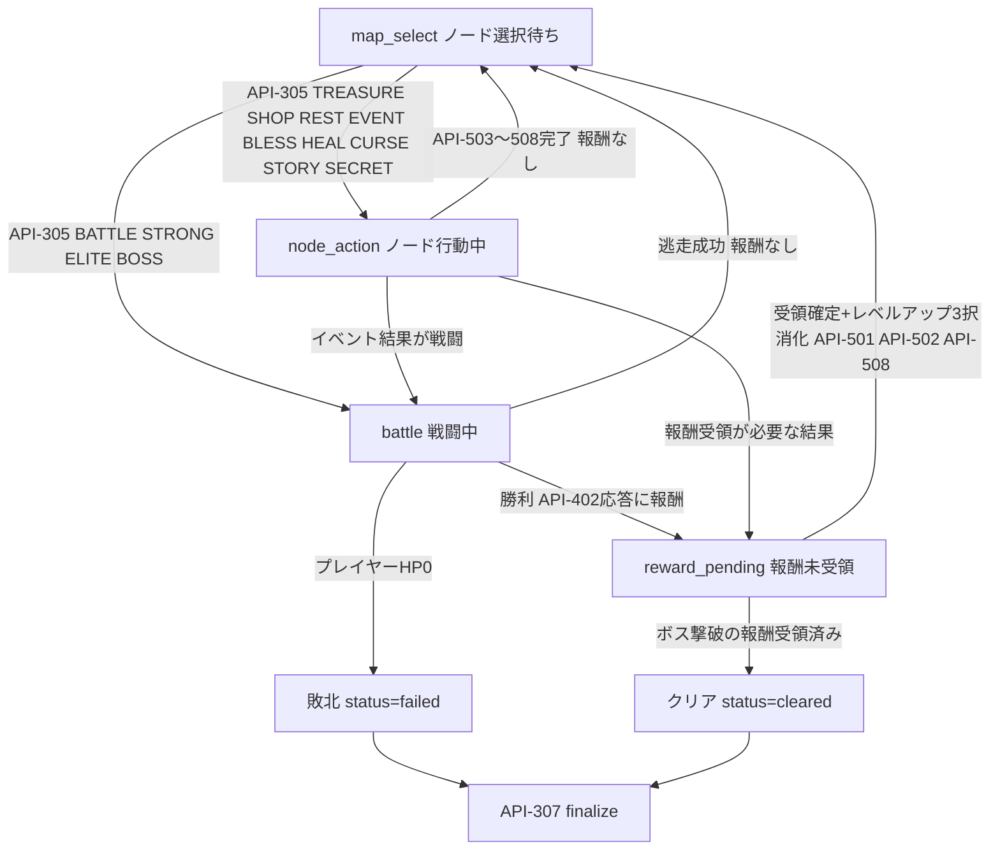
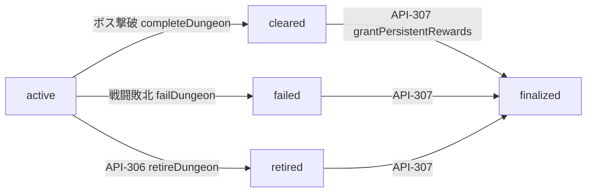

# 17. ダンジョン設計書（Dungeon Design）

- 対象プロダクト: Rogue Chronicle（ローグライトRPG）
- 目的: マップ方式の選定根拠、ノードタイプ仕様、マップ生成アルゴリズム、各ノードの詳細仕様（イベント・休憩・宝箱・ショップ）、ラン進行管理を実装可能な粒度で定義する
- 準拠: CORE_SPEC §5.6（ダンジョン骨子・数値・制約はCORE_SPECと完全一致）
- 関連文書: 05_Game_Design.md / 16_Battle_Design.md / 18_Skill_Design.md / 19_Enemy_AI_Design.md / 12_Database_Design.md / 13_API_Design.md / 15_Save_Data_Design.md

---

## 1. マップ方式の比較選定（DEC-003）

### 1.1 候補と評価（5段階、5が最良）

| 観点 | ノード選択型（Slay the Spire型の列グラフ） | ランダムマップ型（グリッド探索・不思議のダンジョン型） |
|---|---|---|
| 個人開発の実装コスト（低いほど高評価） | 5（グラフ生成+SVG/DOM描画のみ） | 2（地形生成・視界・移動・衝突が必要） |
| スマホ操作性 | 5（ノードタップのみ） | 2（仮想パッド or フリック移動が必要） |
| 1ラン15〜30分のコントロール性 | 5（ノード数=行動回数で厳密に制御可能） | 3（探索時間の分散が大きい） |
| サーバー権威（DEC-007）との相性 | 5（1ノード選択=1リクエストで完結） | 2（移動ごとの同期 or クライアント信頼が必要） |
| リスク選択の戦略性（ローグライト相性） | 5（分岐の先が見える=ルート構築が意思決定になる） | 4（探索の緊張感はあるが事前計画性は低い） |
| 演出コスト（DEC-009: CSS/Framer Motionのみ） | 5（静的グラフで成立） | 1（タイルマップ描画にCanvas系がほぼ必須） |
| 拡張性（階層追加・ノードタイプ追加） | 4（マスタ追加のみ） | 4（生成器の拡張で対応可能） |
| **合計** | **34** | **18** |

### 1.2 採用: ノード選択型（DEC-003）

採用理由:
1. **DEC-007・DEC-009と両立する唯一の現実解**: ノード選択はAPI-305の1リクエストで完結し、乱数・報酬を全てサーバーで実行できる。描画もCSSで足りる
2. **「次に何が来るか見えるリスク選択」がビルド構築（スキル3択・レリック）と噛み合う**: REST前にELITEを踏むか等の意思決定が生まれる
3. **1ラン15〜30分（CORE_SPEC §1）をノード数10〜12個で厳密に保証できる**
4. ランダムマップ型は将来モード（別ダンジョン）として拡張余地を残すが、MVPでは不採用

---

## 2. ノードタイプ一覧（全13種）

`dungeon_node_types` マスタに登録する。アイコンはlucide-reactのアイコン名を基本方針とする（仮決定 DEC-040。SVG差し替え可能な設計にする）。

| code | 名称 | 効果（進入時の挙動） | 出現階層 | アイコン方針 |
|---|---|---|---|---|
| BATTLE | 通常戦闘 | 通常敵1〜3体と戦闘（編成は19章§8）。勝利でEXP・ゴールド・ドロップ判定（通常10%、19章§9） | 1〜9（階層1は固定でこれ1個） | swords / 白 |
| STRONG | 強敵 | 強敵補正（HP×1.5, ATK×1.15）の敵1体（階層6以降は50%で通常敵1体随伴）。報酬はEXP・ゴールド1.5倍+ドロップ30%。逃走可 | 2〜9 | sword / 赤枠 |
| ELITE | エリート | orc_champion / dark_shaman のいずれか1体（エリート補正 HP×2.0, ATK×1.3）。逃走不可。ドロップ50%（rt_battle_elite） | 3〜9 | skull / 紫 |
| BOSS | ボス | ruin_guardian と戦闘（ボス補正 HP×4.0, ATK×1.5）。逃走不可。撃破でクリア | 10（固定1個） | crown / 金 |
| TREASURE | 宝箱 | SCR-305で開封。rt_treasure_normal（装備60% / ゴールド25% / 消耗品15%、§8）を抽選 | 2〜9 | package / 黄 |
| SHOP | ショップ | SCR-306。5枠（装備2/消耗品2/レリック1）。価格=基準×(1+0.1×階層)、売却50%（§9） | 3〜9（マップ全体で1〜2個） | store / 青 |
| REST | 休憩 | SCR-307。「HP50%回復」or「所持スキル1つ強化（Lv+1、最大3）」の二択（§7）。スキル削除もここで可（CORE_SPEC §5.8） | 2〜9（階層5・9に1個以上保証） | flame / 橙（焚き火） |
| EVENT | ランダムイベント | SCR-308。random_events 10種（§6）から出現階層条件を満たすものを等重み抽選 | 2〜9 | help-circle / 白 |
| BLESS | 強化イベント | 「攻撃の加護 atk+8%」「守りの加護 def+8%」「生命の加護 maxHp+10%」の3択から1つ（ラン中永続。仮決定 DEC-040） | 2〜9 | sparkles / 金 |
| HEAL | 回復イベント | 自動でHP35%回復+25%でポーション1個（仮決定 DEC-040） | 2〜9 | heart / 緑 |
| CURSE | 呪いイベント | 二択:「呪いを受け入れる」= maxHp-10%（ラン中）と引き換えに epic装備50% / レリック50% ／「立ち去る」= 変化なし | 3〜9 | skull+flame / 紫 |
| STORY | ストーリー | storiesマスタの断章を1つ閲覧（player_story_progressに記録）+ ソウルシャード+5（earnedに加算） | 2〜9 | book-open / 白 |
| SECRET | 隠し部屋 | EVENT扱いの上位報酬（CORE_SPEC §5.6）: rare以上確定の装備1個（rare60/epic40）+ 60G（rt_treasure_secret。仮決定 DEC-041） | 3〜8（マップ全体で10%出現） | 未踏時「？？」表示 → key / 金 |

- 戦闘系4種（BATTLE/STRONG/ELITE/BOSS）は進入時にサーバーが戦闘状態を生成する（戦闘開始APIは独立させない。CORE_SPEC §7補足）
- マップ上の表示: 訪問済み=減光、現在地=強調リング、選択可能（隣接）=パルスアニメーション、選択不可=通常表示

---

## 3. マップ生成ルール

### 3.1 構造パラメータ（dungeons.generation_config JSONBに保持）

| パラメータ | 値（forgotten_ruins / Normal） |
|---|---|
| 階層数 | 10 |
| 階層1のノード数 | 1（固定・BATTLE） |
| 階層10のノード数 | 1（固定・BOSS） |
| 階層2〜9のノード数 | 各2〜4（乱数） |
| 1ノードの出エッジ数 | 次階層へ1〜3本 |
| REST保証 | 階層5・9に各1個以上 |
| SHOP数 | マップ全体で1〜2個（階層3〜9） |
| ELITE制約 | 階層3以降のみ |
| 連続制約 | 同一タイプが同一パス上に3連続しない |
| SECRET | マップ全体で10%の確率で1個出現（階層3〜8） |

### 3.2 生成手順（generateDungeonMap）

生成は全てサーバーの `src/domain/dungeon/generateDungeonMap.ts` で実行する。PRNGはmulberry32（§4）で、呼び出しごとにrngCursorを+1する。

1. **seed取得**: `generateDungeonSeed()` が32bit符号なし整数のseedを生成（§4.1）。dungeon_runs.seed に保存
2. **ノード数決定**: 階層1=1、階層10=1。階層2〜9は各 `2 + rngInt(0, 2)`（=2〜4）
3. **ノード生成**: nodeId は `f{階層}n{番号}` 形式（例: f3n2。番号は0始まりで階層内の左からの位置）
4. **エッジ生成（ウィンドウ方式）**: 各ノードから次階層へ1〜3本。交差を最小化するため、階層内の位置比率に応じた接続可能ウィンドウ内から選ぶ（下記擬似コード）
5. **到達可能性の補修**: 入エッジが0本のノードに対し、前階層の最も位置が近いノードからエッジを追加する。これにより「全ノードが開始ノードから到達可能」かつ「全ノードからボスへ到達可能」を保証する（各ノードの出エッジは常に1本以上のため、階層10=1ノードに必ず収束する）
6. **タイプ割当（制約充足）**: 固定枠→保証枠→重み抽選の順（§3.4）
7. **SECRET抽選**: `rng() < 0.10` のとき、階層3〜8のEVENT/BLESS/HEAL/CURSEノードから1個をランダムに選びSECRETへ置換。候補がなければ出現なし（仮決定 DEC-041）
8. **検証（validateMap）**: §3.5の検証リストを全チェック。タイプ制約違反はステップ6からリトライ（最大10回）、構造違反または10回超過は `seed+1`（32bitラップアラウンド）で全体を再生成し、実際に使用したseedをdungeon_runs.seedに保存する

```typescript
// src/domain/dungeon/generateDungeonMap.ts（擬似コード）
function generateDungeonMap(seed: uint32, config: GenerationConfig): DungeonMap {
  const rng = createSeededRng(seed);              // mulberry32。呼び出しごとにcursor+1

  // Step 2-3: ノード数決定 + ノード生成
  const counts: number[] = [1];                   // counts[0] = 階層1
  for (let f = 2; f <= 9; f++) counts.push(2 + rngInt(rng, 0, 2));
  counts.push(1);                                 // 階層10
  const floors = counts.map((n, i) =>
    range(n).map(j => ({ nodeId: `f${i + 1}n${j}`, floor: i + 1, type: null })));

  // Step 4: エッジ生成（ウィンドウ方式）
  const edges: Edge[] = [];
  for (let f = 1; f <= 9; f++) {
    const n = counts[f - 1], m = counts[f];
    for (let i = 0; i < n; i++) {
      const lo = Math.max(0, Math.floor((i * m) / n) - 1);        // 基本ウィンドウ±1
      const hi = Math.min(m - 1, Math.floor(((i + 1) * m - 1) / n) + 1);
      const window = range(lo, hi + 1);                            // 接続候補（昇順）
      const k = Math.min(1 + rngInt(rng, 0, 2), window.length);    // 出エッジ1〜3本
      for (const j of pickDistinctSorted(rng, window, k)) {
        edges.push({ from: `f${f}n${i}`, to: `f${f + 1}n${j}` });
      }
    }
    // Step 5: 到達可能性の補修（入エッジ0のノードへ最寄りから追加）
    for (let j = 0; j < m; j++) {
      if (!edges.some(e => e.to === `f${f + 1}n${j}`)) {
        const i = nearestIndex(j, m, n);           // 位置比率が最も近い前階層ノード
        edges.push({ from: `f${f}n${i}`, to: `f${f + 1}n${j}` });
      }
    }
  }

  assignNodeTypes(rng, floors, edges, config);     // Step 6-7（§3.4）
  const map = { seed, floors, edges };
  if (!validateMap(map, config)) {                 // Step 8
    return generateDungeonMap((seed + 1) >>> 0, config);   // 全体再生成
  }
  return map;
}
```

### 3.3 タイプ出現重みテーブル（階層帯別、合計100%）

固定枠（階層1=BATTLE、階層10=BOSS）、保証枠（REST階層5・9、SHOP全体1〜2）を除いた残りノードに適用する重み（仮決定 DEC-042）。SHOPは保証枠でのみ配置するため重み0。

| ノードタイプ | 階層1〜3 | 階層4〜6 | 階層7〜9 |
|---|---|---|---|
| BATTLE | 46 | 34 | 30 |
| STRONG | 8 | 13 | 15 |
| ELITE | 4 ※階層3のみ有効 | 9 | 12 |
| TREASURE | 12 | 10 | 8 |
| REST | 4 | 8 | 10 |
| EVENT | 12 | 12 | 10 |
| BLESS | 4 | 4 | 5 |
| HEAL | 5 | 5 | 5 |
| CURSE | 2 | 2 | 2 |
| STORY | 3 | 3 | 3 |
| **合計** | **100** | **100** | **100** |

- 階層1〜2ではELITE重み4はBATTLEへ振り替える（実質BATTLE 50）。CURSEは階層2ではEVENTへ振り替える（CURSEは階層3以降）
- SECRETは重み抽選ではなくマップ全体10%の別枠抽選（§3.2 ステップ7）
- 意図: 序盤=戦闘中心でEXP確保、中盤=リソース分岐（REST/SHOP圏）、終盤=リスク（STRONG/ELITE）と回復（REST）のトレードオフ

### 3.4 タイプ割当の制約充足手順（assignNodeTypes）

1. **固定枠**: `f1n0 = BATTLE`、`f10n0 = BOSS`
2. **REST保証**: 階層5・階層9それぞれで未割当ノードから1個をランダム選択し `REST`
3. **SHOP配置**: `shopCount = 1 + (rng() < 0.5 ? 1 : 0)`（=1〜2）。階層3〜9から相異なる階層を shopCount 個ランダム選択し、各階層の未割当ノード1個を `SHOP`
4. **重み抽選**: 残りノードを「階層昇順→階層内番号順」に走査し、§3.3の重みで抽選。以下の棄却条件に該当したら再抽選（最大10回）:
   - ELITEが階層1〜2に出た（重み振替後は発生しないが防御的に検査）
   - **同一パス3連続**: 割当タイプtについて、`親ノードpのtype == t` かつ `pのいずれかの親gpのtype == t` となる経路が存在する（=そのノードを踏むパスにtが3連続で並ぶ）
   - 10回失敗時はBATTLEを割当。BATTLE自体が3連続違反になる場合はEVENTを割当（EVENTは中身が毎回変わるため連続を許容する例外。仮決定 DEC-042）
5. **SECRET抽選**: §3.2 ステップ7

```typescript
function assignNodeTypes(rng, floors, edges, config): void {
  fixNode(floors, "f1n0", "BATTLE");
  fixNode(floors, `f10n0`, "BOSS");
  for (const f of [5, 9]) setRandomUnassigned(rng, floors[f - 1], "REST");
  const shopFloors = pickDistinctFloors(rng, [3, 4, 5, 6, 7, 8, 9], 1 + (rng() < 0.5 ? 1 : 0));
  for (const f of shopFloors) setRandomUnassigned(rng, floors[f - 1], "SHOP");

  for (const node of unassignedNodesInOrder(floors)) {
    let type = null;
    for (let retry = 0; retry < 10 && type === null; retry++) {
      const t = weightedPick(rng, weightTableFor(node.floor));    // §3.3
      if (!violatesTripleRule(t, node, floors, edges)) type = t;
    }
    node.type = type ?? (violatesTripleRule("BATTLE", node, floors, edges) ? "EVENT" : "BATTLE");
  }
  if (rng() < 0.10) convertOneToSecret(rng, floors);              // 階層3〜8のEVENT/BLESS/HEAL/CURSEから1個
}

function violatesTripleRule(t, node, floors, edges): boolean {
  // node に t を置いたとき「親(type=t) → その親(type=t)」の鎖が存在するか
  return parentsOf(node, edges).some(p =>
    p.type === t && parentsOf(p, edges).some(gp => gp.type === t));
}
```

### 3.5 検証リスト（validateMap）

| # | 検証項目 | 違反時 |
|---|---|---|
| 1 | 階層数=10、階層1・10のノード数=1、階層2〜9は2〜4 | 全体再生成 |
| 2 | 全ノードの出エッジ1〜3本（階層10除く）、エッジは必ず隣接階層間のみ | 全体再生成 |
| 3 | 全ノードが f1n0 から到達可能 かつ f10n0 へ到達可能（BFSで確認） | 全体再生成 |
| 4 | 階層5・9にRESTが1個以上 / SHOP合計1〜2 / ELITEは階層3以降 / CURSEは階層3以降 / SECRETは0〜1個かつ階層3〜8 | タイプ再割当 |
| 5 | 同一タイプ3連続パスが存在しない（全経路をDFS走査） | タイプ再割当 |
| 6 | BOSSが1個のみ、階層10にある | 全体再生成 |

---

## 4. シード・再現性（DEC-019準拠）

### 4.1 seedとPRNG

- **seed**: サーバーが `crypto.getRandomValues` で生成する **32bit符号なし整数**（0〜4294967295）。`dungeon_runs.seed` に保存。クライアントからのseed指定は不可（固定シード共有は将来機能）
- **PRNG**: mulberry32。**ラン全体で単一の乱数列**を使い、マップ生成・戦闘・報酬・イベントの全ての抽選が同じ列を順に消費する

```typescript
// src/domain/shared/rng.ts
export function mulberry32(seed: number): () => number {
  let a = seed >>> 0;
  return () => {
    a = (a + 0x6d2b79f5) >>> 0;
    let t = a;
    t = Math.imul(t ^ (t >>> 15), t | 1);
    t ^= t + Math.imul(t ^ (t >>> 7), t | 61);
    return ((t ^ (t >>> 14)) >>> 0) / 4294967296;   // [0, 1)
  };
}
// rngCursor付きラッパー: next()のたびに state.cursor += 1
export function createSeededRng(seed: number, cursor = 0) { /* cursor回空読みして再開 */ }
```

### 4.2 rngCursor管理

- `run_state.rngCursor` に「これまでに消費した乱数の総数」を保持する（戦闘ログには行動ごとの `rngCursorAfter` も記録。16章§9.2）
- API処理の流れ: ①run_stateロード → ②`createSeededRng(seed, rngCursor)` で復元（seedから cursor 回空読みで早送り。1ラン全体でも消費は数千回程度のためO(n)早送りで十分） → ③抽選実行 → ④更新後のcursorをrun_stateへ書き戻し（versionで楽観ロック）
- **マップ生成はcursor=0から開始**する固定順序のため、同一seedなら常に同一マップになる

### 4.3 同一seed同一マップの検証方法

1. **単体テスト（決定性）**: 同一seedで `generateDungeonMap` を2回実行し、正規化JSON（キーソート済み）が deep-equal であること（TC番号は21章に登録）
2. **ハッシュ検証**: 正規化JSONのSHA-256を比較するユーティリティを用意し、リグレッションテストでは既知seed（例: seed=123456789）のハッシュ固定値を検査する
3. **プロパティテスト**: ランダムな1000 seedで生成し、§3.5の検証リストが全て成立すること・生成が有限回で終了することを確認
4. **本番検証**: 不具合調査時は dungeon_runs.seed と battle_logs の rngCursorAfter からラン全体をローカルで再現できる（AntiCheatModuleのチート検証も同じ手順）

## 5. 難易度別生成

- **MVP: Normalのみ**（dungeon_difficulties に normal 1行。difficultyMod=1.0）
- **将来Hardの方針**（実装しないが設計余地を確保）: 生成パラメータを dungeon_difficulties.generation_override JSONB で上書きする方式とする
  - 例: STRONG/ELITE重み+5pt（BATTLEから振替）、CURSE重み+2pt、REST保証を階層9のみに縮小、敵difficultyMod 1.3（CORE_SPEC §5.4）、EXP・報酬も同率増加
  - マップ生成コードは difficulty を引数に取るだけで分岐を持たない（データ駆動）

---

## 6. ランダムイベント10種（random_events / random_event_choices マスタ）

- EVENTノード進入時、出現階層条件を満たすイベントから**等重み**で1つ抽選（同一ラン中の同一イベント再抽選は可、ただし直前に見たイベントは除外。仮決定 DEC-043）
- 結果の抽選・適用は全てAPI-506（イベント選択）のサーバー処理。HPダメージは maxHp基準%・floor・下限1で、**イベントによるHPは1未満にならない**（イベント死亡なし。仮決定 DEC-043）
- ゴールド不足で選べない選択肢はグレーアウト（送信時は ERR_INSUFFICIENT_GOLD）
- 数値は全て仮決定 DEC-043

### 6.1 イベント一覧

**EV-01 ev_altar「怪しい祭壇」**（階層2〜9）
フレーバー: 黒曜石の祭壇が鈍く脈打っている。乾いた血の痕が、祈った者の末路を物語る。

| 選択肢 | 結果（確率） | 期待値コメント |
|---|---|---|
| A: 祈る | 60%: atk+8%（ラン中永続） / 40%: maxHp-8%（ラン中） | 期待値プラスだが分散大。HP依存ビルドは避けるべき択 |
| B: 血を捧げる（現HPの20%消費） | 100%: ランダムレリック1個 | HP20%=レリック1個は強い。回復手段があるなら最適解 |
| C: 立ち去る | 変化なし | 安全択 |

**EV-02 ev_peddler「行商人」**（階層2〜9）
フレーバー: 遺跡の奥だというのに、ランタンを提げた男が荷を広げて笑う。「掘り出し物だよ、旦那」

| 選択肢 | 結果（確率） | 期待値コメント |
|---|---|---|
| A: 装備を買う（70G） | 100%: 装備1個（common60% / rare35% / epic5%） | ショップより割高な代わりに階層係数なしの固定価格。rare以上40%は妥当な賭け |
| B: 薬を買う（35G） | 100%: ポーション1個+万能解毒薬1個 | ショップ基準価格70G相当が35G。出たら買い得の択 |
| C: 立ち去る | 変化なし | — |

**EV-03 ev_trap「罠の通路」**（階層3〜9）
フレーバー: 床一面に細い糸が張り巡らされている。奥には先人の亡骸と、光る何か。

| 選択肢 | 結果（確率） | 期待値コメント |
|---|---|---|
| A: 慎重に解除する | 70%: 通過+罠の部品を換金30G / 30%: maxHp12%ダメージ | 期待+21G・期待-3.6%HP。基本はこれ |
| B: 走り抜ける | 50%: 無傷で通過 / 50%: maxHp18%ダメージ | 期待-9%HP。急ぐ理由がないため罠（選択肢自体が罠というデザイン） |
| C: 引き返す | 100%: 何も起きない | 安全択 |

**EV-04 ev_hidden_path「隠し通路」**（階層2〜8）
フレーバー: 壁の煉瓦が一枚だけ色が違う。押し込むと、冷たい風が吹き出す隙間が開いた。

| 選択肢 | 結果（確率） | 期待値コメント |
|---|---|---|
| A: 進む | 60%: 宝箱報酬（rt_treasure_normal 1回、§8） / 40%: 待ち伏せ戦闘（BATTLE編成、勝利で通常報酬） | 60%で無償の宝箱。40%側もEXPが入るため実質損がない強イベント（出現率で調整） |
| B: 無視する | 変化なし | — |

**EV-05 ev_cursed_chest「呪いの宝箱」**（階層3〜9）
フレーバー: 鎖で何重にも封じられた宝箱。鎖の方が、中身より雄弁だ。

| 選択肢 | 結果（確率） | 期待値コメント |
|---|---|---|
| A: 開ける | 45%: epic装備1個 / 25%: 90G / 30%: 呪い（maxHp-10%（ラン中）+次戦闘開始時に自分へweaken付与） | epic45%は破格。30%の呪いを引き受けられる盤面かの判断を問う |
| B: 開けない | 変化なし | — |

**EV-06 ev_wounded「負傷した冒険者」**（階層2〜8）
フレーバー: 柱の陰で冒険者がうずくまっている。「頼む……薬を……」

| 選択肢 | 結果（確率） | 期待値コメント |
|---|---|---|
| A: 手当てする（ポーション1個消費。未所持なら現HPの15%消費） | 100%: お礼60G+20%: レリック1個 | コスト約40G相当で60G+期待0.2レリック。人助けが得なバランス |
| B: 荷物を漁る | 60%: 40G / 40%: 何も持っていなかった | 期待+24G。ノーコストだが上振れなし |
| C: 立ち去る | 変化なし | — |

**EV-07 ev_gambler「賭博師」**（階層3〜9）
フレーバー: 骸骨の山の上で男がサイコロを転がしている。「遺跡の中じゃ、金の使い道もないだろう？」

| 選択肢 | 結果（確率） | 期待値コメント |
|---|---|---|
| A: 30G賭ける | 45%: 75G獲得 / 55%: 没収 | 期待値+3.75G（=75×0.45-30）。わずかにプレイヤー有利 |
| B: 80G賭ける | 45%: 200G獲得 / 55%: 没収 | 期待値+10G。ハイリスク寄り。ショップ前に引くと熱い |
| C: 賭けない | 変化なし | — |

**EV-08 ev_inscription「古代の碑文」**（階層4〜9）
フレーバー: 壁一面に刻まれた古代文字が、微かに燐光を放っている。読めそうな気がする。

| 選択肢 | 結果（確率） | 期待値コメント |
|---|---|---|
| A: 解読を試みる | 65%: EXP+（15×階層） / 35%: 何も起きない | 階層6なら期待+58.5EXP（Lv6→7の半分弱）。無リスクの成長択 |
| B: 魔力に触れる | 40%: ランダムな所持スキル1つ強化Lv+1（最大3） / 60%: maxHp8%ダメージ | スキル強化は休憩1回分の価値。期待値はほぼ等価でギャンブル性を担わせる |
| C: 立ち去る | 変化なし | — |

**EV-09 ev_spring「癒しの泉」**（階層2〜9）
フレーバー: 崩れた聖堂の中央に、澄んだ泉が湧いている。水面が淡く光る。

| 選択肢 | 結果（確率） | 期待値コメント |
|---|---|---|
| A: 泉に浸かる | 100%: HP35%回復 | 確実な回復。RESTの50%より軽い分ノーコスト |
| B: 水を汲む | 100%: ポーション1個（所持上限超過分は+10G換算。16章DEC-032） | 回復を後で使いたい場合の温存択 |
| C: 泉の底を探る | 50%: 45G / 50%: maxHp10%ダメージ（回復の機会も失う） | 期待+22.5G/-5%HP。欲張り択 |

**EV-10 ev_ambush「盗賊の待ち伏せ」**（階層3〜9）
フレーバー: 「命が惜しければ有り金を置いていきな」——瓦礫の上から複数の影が降ってくる。

| 選択肢 | 結果（確率） | 期待値コメント |
|---|---|---|
| A: 迎え撃つ | 100%: 戦闘発生（goblin×2、通常補正）。勝利で通常報酬+40G | EXP+ボーナスGで基本は最効率。HP消費が対価 |
| B: 通行料を払う（所持ゴールドの25%、floor） | 100%: 戦闘回避 | 所持Gが多いほど高くつく。HP温存の保険 |
| C: 強行突破 | 55%: 無傷で通過 / 45%: maxHp15%ダメージ+20G喪失 | 期待-6.75%HP・-9G。Bより安いがブレる |

### 6.2 イベント処理フロー

1. API-305でEVENTノード選択 → サーバーがイベント抽選（rngCursor消費）→ `run_state.pendingReward = { type: "event", eventCode, resolved: false }` 相当のイベント状態を保存し phase=node_action
2. クライアントはSCR-308で選択肢表示 → API-506 `{ choiceCode }` 送信
3. サーバーが結果抽選・適用（HP/ゴールド/装備/レリック/EXP等）→ 結果テキストと適用差分を応答 → 戦闘発生する結果は phase=battle へ、それ以外は受領完了で phase=map_select
4. 二重送信はIdempotency-Keyと「選択済みイベントへの再選択= ERR_REWARD_ALREADY_CLAIMED」で拒否

---

## 7. 休憩ノード（REST / API-505 / SCR-307）

CORE_SPEC §5.6のとおり二択。**どちらか一方のみ**選んで消化（キャンセル不可、選択後 phase=map_select）。

| 選択肢 | 効果 |
|---|---|
| 焚き火で休む | HP回復 = floor(maxHp × 0.5)（超過分切り捨て。maxHp上限まで） |
| 鍛錬する | 所持スキル1つを選び強化Lv+1（最大Lv3。全スキルLv3なら選択肢自体を無効表示） |

- 付帯機能: 休憩画面では**スキル削除**（所持上限8枠の整理。CORE_SPEC §5.8）を回数無制限で実行可能。削除は休憩の二択消費に含まれない
- 不正防止: RESTノード以外でのAPI-505は ERR_RUN_STATE_INVALID

## 8. 宝箱ノード（TREASURE / API-503 / SCR-305）

`reward_tables` の `rt_treasure_normal` を参照して1回抽選する（仮決定 DEC-044）:

| 大分類（重み） | 内訳 |
|---|---|
| 装備 60% | レア度重み: common50 / rare40 / epic10 → 該当レア度のequipmentから等重み抽選（武器中心。18章・装備一覧準拠） |
| ゴールド 25% | `floor((40 + 10 × 階層) × rand(0.9〜1.1))`（例: 階層5 → 81〜99G） |
| 消耗品 15% | potion50 / hi_potion20 / antidote30（所持上限超過は+10G換算） |

- SECRETノードは `rt_treasure_secret`（装備100%: rare60/epic40 + 固定60G。§2）
- 開封は1ノード1回。開封後の再送信は ERR_REWARD_ALREADY_CLAIMED。装備獲得時は装備変更UI（SCR-309/API-507）へ連続遷移可

## 9. ショップノード（SHOP / API-504 / SCR-306）

- **品揃え5枠（固定構成）**: 装備2枠 / 消耗品2枠 / レリック1枠。ノード生成時ではなく**進入時にrngCursorから抽選し run_state に保存**（再入場不可のため1回のみ）
  - 装備枠: レア度重み common50 / rare40 / epic10 で2枠（同一品は重複しない）
  - 消耗品枠: potion / hi_potion / antidote から重複なしで2枠
  - レリック枠: 未所持レリックから等重み1枠（全所持なら装備枠に振替）
- **価格式**: `表示価格 = floor(基準価格 × (1 + 0.1 × 階層))`。基準価格（仮決定 DEC-045）:

| 商品 | 基準価格 | 階層4での表示価格 | 階層8での表示価格 |
|---|---|---|---|
| 装備 common | 60G | 84G | 108G |
| 装備 rare | 120G | 168G | 216G |
| 装備 epic | 240G | 336G | 432G |
| potion | 40G | 56G | 72G |
| hi_potion | 90G | 126G | 162G |
| antidote | 30G | 42G | 54G |
| レリック | 150G | 210G | 270G |

（16章§3.4の「ショップ40G」等は基準価格を指す。表示価格は本式で階層補正される）

- **売却**: 所持装備・消耗品を `floor(当該階層での購入相当価格 × 0.5)` で売却可。レリックは売却不可
- 購入済み枠は売り切れ表示。ゴールド不足は ERR_INSUFFICIENT_GOLD(422)。全枠購入・任意タイミングで「立ち去る」→ phase=map_select（ショップは離脱後再入場不可）

---

## 10. 進行管理

### 10.1 position.phase 遷移図（run_state.position.phase）



- phase別に許可されるAPIをサーバーで強制する:

| phase | 許可API |
|---|---|
| map_select | API-305（次ノード選択）、API-304、API-306、API-507（装備変更）、戦闘外アイテム使用 |
| node_action | 当該ノードタイプの実行API（503〜508）、API-304、API-306 |
| battle | API-401、API-402、API-304 |
| reward_pending | API-501、API-502、API-503応答受領、API-508、API-304 |

### 10.2 途中離脱・再開（API-304）

- run_stateは**全ての変更APIで即時保存**（DEC-011。楽観ロックversion+1）。ブラウザを閉じても失われない
- 再開フロー: ホーム画面ロード時にAPI-304 `GET /runs/current` → `status=active` のランがあれば「再開する / リタイアする」ダイアログ → 再開時は position.phase に対応する画面（SCR-301/302/305〜308等）へ直接復帰。戦闘中なら battle オブジェクト（enemies/turnNo/intent/rngCursor）ごと復元
- pendingReward が未受領なら受領UIから再開（報酬消失なし）
- 破損対策: dungeon_run_snapshots（直近3世代）から `validateRunState` 失敗時に1世代前へロールバック（15章）

### 10.3 不正進行の防止（サーバー検証、DEC-007）

API-305（次ノード選択）で以下を全て検証。1つでも違反なら拒否:

| 検証 | 違反時のエラー |
|---|---|
| phase == map_select | ERR_RUN_STATE_INVALID(409) |
| 選択nodeIdが現在ノードの出エッジに含まれる（**隣接ノード以外拒否**） | ERR_INVALID_ACTION(422) |
| 選択ノードのfloor == 現在floor+1 | ERR_INVALID_ACTION(422) |
| Idempotency-Key未使用（重複は前回応答を再返却） | ERR_DUPLICATE_REQUEST(409) |
| リクエストのversion == run_state.version | ERR_CONFLICT_VERSION(409) |
| status == active | ERR_RUN_STATE_INVALID(409) |

- 報酬・抽選・戦闘計算は全てサーバー（クライアント申告値は一切信用しない）。抽選結果の検証はseed+rngCursorの再実行で可能（§4.3）
- 同一ユーザーの多重ラン開始（API-303）は ERR_RUN_ALREADY_ACTIVE(409)

### 10.4 クリア / 敗北 / リタイア判定と status 遷移

| 判定 | 条件 | 処理 |
|---|---|---|
| クリア | 階層10のBOSS（ruin_guardian）撃破 | status=cleared。ソウルシャード獲得率100%+クリアボーナス（ソウルシャード+50。仮決定 DEC-046） |
| 敗北 | 戦闘中プレイヤーHP0 | status=failed。獲得ソウルシャード50% |
| リタイア | API-306（SCR-314で確認） | status=retired。獲得ソウルシャード80%。phaseは問わず即時確定 |



- **finalize（API-307）**: earned（ソウルシャード/ランクEXP/kills）へ率を適用して player_currencies・player_progress・player_codex（敵図鑑、19章§11）・player_achievements に反映し、currency_transactions に記録。二重確定は ERR_REWARD_ALREADY_CLAIMED
- finalize前に切断しても、API-304が status != active のランを検知してリザルト画面（SCR-403）へ誘導する。finalizedになるまで新規ラン（API-303）は開始不可

---

## 未決事項

| ID | 内容 |
|---|---|
| ISSUE-101 | ノード数・重み（DEC-042）の実プレイバランス検証。1ラン15〜30分に収まるかα版で計測し調整する |
| ISSUE-102 | イベント数値（DEC-043）の期待値バランス。特にEV-04（実質ノーリスク）とEV-01のレリック価値は要プレイテスト |
| ISSUE-103 | SECRETの出現率10%が低すぎないか（1ラン平均0.1個）。発見体験を増やすなら「マップごと30%・踏破率で開示」等の代替案を将来検討 |
| ISSUE-104 | STORYノードで見せるstoriesマスタの本数・解放順（20章・シナリオ側と要調整） |
| ISSUE-105 | マップの視覚レイアウト（ノード座標の揺らぎ・エッジ曲線）の具体値は09_Screen_Design.md側で確定する |
| ISSUE-106 | リタイア80%はマップ画面のみ許可にするか（戦闘中リタイアで敗北50%を回避できてしまう）。現仕様は全phase許可のため、戦闘中は「逃走失敗相当のペナルティ」を将来検討 |

## 実装時の注意点

1. **乱数消費順序を絶対に変えない**: マップ生成・抽選のコード変更は同一seedの再現性を壊す。generateDungeonMapのPRNG呼び出し順はテストで固定し、変更時はschemaVersionを上げる
2. **`seed+1` 再生成時は最終使用seedを保存する**: 再現検証はdungeon_runs.seedのみを起点にするため、リトライ前のseedを残さないこと
3. **重み振替の実装漏れに注意**: 階層1〜2のELITE・階層2のCURSE振替を忘れると合計100%が崩れ、weightedPickの分布が歪む
4. **violatesTripleRuleは「全ての親経路」を見る**: 1本でもt-t-tの経路ができれば違反。親が複数いる合流ノードで漏れやすい
5. **phase遷移はサーバーのみが行う**: クライアントは応答のphaseに従って画面遷移するだけ。フロント側で先行遷移して報酬を先読みしない
6. **API-503〜508はノードタイプとの対応をミドルウェア的に一括検証**する（各ハンドラ個別実装にしない）。phase・nodeType・claimed状態の3点チェックを共通化
7. **ショップ品揃え・イベント抽選結果は必ずrun_stateに保存**してから応答する（応答後の再取得で内容が変わってはならない）
8. **ゴールドの整数化は常にfloor**。価格・売却・報酬で丸め方向を混在させない
9. Mermaid図・nodeId形式（`f{floor}n{index}`）はUI実装（SCR-301）とE2Eテストのセレクタでそのまま使う想定。命名を変えない

## 関連設計書

- CORE_SPEC.md（§5.6 ダンジョン骨子 / §5.4 計算式 / §7 API一覧 / §8 テーブル一覧）
- 05_Game_Design.md（ゲームサイクル・経済バランス）
- 09_Screen_Design.md（SCR-301/305〜308/313/314の画面詳細）
- 13_API_Design.md（API-303〜307、API-503〜508のリクエスト/レスポンス定義）
- 15_Save_Data_Design.md（run_state JSONBスキーマ・スナップショット世代管理）
- 16_Battle_Design.md（戦闘フロー・報酬・逃走・DEC-030〜039）
- 18_Skill_Design.md（休憩でのスキル強化対象・装備一覧）
- 19_Enemy_AI_Design.md（敵編成・ドロップテーブル）
- 21_Test_Design.md（シード再現テスト・生成プロパティテストのTC登録）
