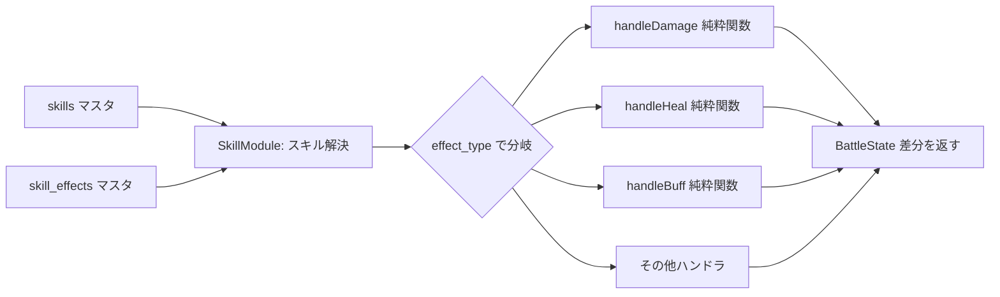

# 18. スキル・装備・レリック設計書（Skill Design）

- 対象プロダクト: Rogue Chronicle（ローグライトRPG）
- 目的: ラン中のビルド構築の核となるスキル・装備・レリックのデータ構造、MVPマスタデータ全件、取得・強化・所持ルールを定義する
- 前提: CORE_SPEC（設計共通仕様）§5.1〜5.4（ステータス・属性・状態異常・計算式）、§5.5（キャラ）、§5.8（スキル/レリック/装備方針）に完全準拠
- 関連文書: 05_Game_Design.md / 12_Database_Design.md / 13_API_Design.md / 17_Battle_Design.md / 19_Enemy_AI_Design.md

---

## 1. スキル分類とMVPでの扱い

| 分類 | 説明 | MVPでの扱い |
|---|---|---|
| アクティブ | 戦闘中にSPを消費して使用。damage/heal/buff等の効果行を持つ | ○ 導入（20種中14種がアクティブ系） |
| パッシブ | 所持しているだけで常時効果（stat_passive等） | ○ 導入（鷹の目、固有スキル等） |
| 固有スキル | キャラ専用（character_code指定）。固有能力もスキルマスタで表現 | ○ 導入。is_innate=trueは開始時から自動所持・所持8枠の枠外（仮決定 DEC-182） |
| 必殺技 | 専用ゲージ消費の大技 | △ MVPでは「SPコスト大（8以上）・高倍率（2.5以上）のepicアクティブスキル」として表現（仮決定 DEC-181）。専用ゲージ（必殺ゲージ）は将来。該当例: skill_assassinate |
| 状態異常付与 | poison/burn/paralysis/stun/weaken を付与（effect_type=status） | ○ 導入（毒針、毒霧等） |
| 回復 | HP回復（effect_type=heal）、状態異常解除（cleanse） | ○ 導入（応急手当） |
| バフ | atkUp/defUp/spdUp/critUp/regen を自身に付与 | ○ 導入（雄叫び、死点撃ち等） |
| デバフ | atkDown/defDown/spdDown を敵に付与 | ○ 導入（鎧砕き） |
| 属性スキル | element ≠ none のスキル。属性相性（火→風→水→火）が乗る | ○ 導入（キャラ初期スキル3種が各属性を担当） |
| 連携スキル | 複数スキルの組み合わせで追加効果 | × 将来。skills.combo_group（将来列）の枠組みのみ本書§6.5に定義 |
| 条件発動 | パッシブに条件（condition）を付け、特定状況でのみ発動 | ○ 導入（先手必勝=1ターン目のみ、反撃の構え=防御中被弾時のみ） |

---

## 2. データ駆動設計（最重要）

### 2.1 設計原則

スキルは **skills（基本情報） + skill_effects（効果行）** の2テーブルで完全にデータ駆動する。
戦闘エンジン（src/domain/battle/, src/domain/skill/）は effect_type ごとの**純粋関数ハンドラ**を持ち、
スキル使用時は skill_effects を order 昇順に走査して該当ハンドラへ params を渡すだけである。

**新スキルの追加はマスタデータ（シードスクリプト）への行追加のみで完結し、アプリケーションコードの変更を必要としない。**
コード変更が必要になるのは「新しい effect_type を追加する場合」のみ。



### 2.2 テーブル定義

#### skills（マスタ）

| 列 | 型 | 説明 |
|---|---|---|
| id | uuid PK | |
| code | text UNIQUE | 英小文字スネーク（例: skill_flame_slash） |
| name | text | 表示名（日本語） |
| description | text | 図鑑・3択画面用の説明文 |
| skill_type | text | active / passive / heal / buff / debuff / status（UI分類用） |
| rarity | text | common / rare / epic |
| sp_cost | int | SPコスト（パッシブは0） |
| target_type | text | self / enemy / all_enemies |
| element | text | none / fire / water / wind |
| max_level | int | 強化上限（通常3、固有スキルは1） |
| character_code | text NULL | 固有・専用スキルのキャラcode。NULL=全キャラ取得可 |
| is_innate | bool | true=固有スキル（開始時自動所持、3択プールから除外、8枠の枠外） |

#### skill_effects（マスタ、1スキル1〜3行）

| 列 | 型 | 説明 |
|---|---|---|
| id | uuid PK | |
| skill_id | uuid FK→skills | |
| order | int | 実行順（1から昇順。同一スキル内で連番） |
| effect_type | text | §2.3のenum |
| params | jsonb | effect_typeごとのスキーマ（§2.4）。**Lv1時点の値** |
| level_scaling | jsonb | レベルによる上書き（§2.5） |

### 2.3 effect_type enum（MVP 13種）

| effect_type | 効果 | 主な使用者 |
|---|---|---|
| damage | 単体ダメージ（CORE_SPEC §5.4の式で計算） | 強撃、火炎斬り |
| damage_aoe | 敵全体ダメージ | 毒霧、ボス「崩落の一撃」 |
| heal | HP回復（maxHp割合） | 応急手当、スライム |
| buff | バフ付与（atkUp/defUp/spdUp/critUp/regen） | 雄叫び、死点撃ち |
| debuff | デバフ付与（atkDown/defDown/spdDown） | 鎧砕き、敵シャーマン |
| status | 状態異常付与（poison/burn/paralysis/stun/weaken） | 毒針、火の小鬼 |
| sp_gain | SPを即時獲得 | 瞑想 |
| shield | シールド付与（被ダメをシールド値まで吸収） | ストーンスキン |
| lifesteal | 直前のdamage行の与ダメージの一定割合を回復 | 血吸いの刃、コウモリ |
| revive_guard | 致死ダメージをHP1で耐える（回数制限付き） | 不屈（レイン固有） |
| cleanse | 状態異常を指定数解除 | 応急手当Lv3 |
| stat_passive | 常時ステータス修正（条件付き可） | 鷹の目、魔力循環、先手必勝 |
| counter | 被弾時に反撃（条件付き可） | 反撃の構え、スケルトン |

敵の enemy_actions.effect も**同一のparamsスキーマ・同一ハンドラ**を共用する（19_Enemy_AI_Design.md §2.2）。

### 2.4 params JSONBスキーマ（TypeScript型定義）

```typescript
// src/domain/skill/effectParams.ts
export type Element = 'none' | 'fire' | 'water' | 'wind';
export type StatusCode = 'poison' | 'burn' | 'paralysis' | 'stun' | 'weaken';
export type BuffCode = 'atkUp' | 'defUp' | 'spdUp' | 'critUp' | 'regen';
export type DebuffCode = 'atkDown' | 'defDown' | 'spdDown';
export type ModStat =
  | 'atk' | 'def' | 'spd' | 'maxHp' | 'critRate' | 'critDmg'
  | 'eva' | 'acc' | 'statusRes' | 'spRegen'      // spRegen: 毎ターンSP回復量への加算
  | 'dmgDealtPct' | 'dmgTakenPct';               // 与ダメ/被ダメ％補正

export interface PassiveCondition {
  turnEq?: number;                 // 戦闘のNターン目のみ有効
  hpBelow?: number;                // 自HP割合がこの値未満のとき有効 (0.0-1.0)
  defending?: boolean;             // 防御コマンド選択中のみ有効
}

export interface DamageParams {
  mult: number;                    // skillMult (0.8-3.0)
  addCritRate?: number;            // この攻撃のみcritRateに加算(%)
  bonusVsStatus?: { status: StatusCode; mult: number }; // 対象が該当状態異常なら mult を差し替え
}
export interface DamageAoeParams { mult: number; }
export interface HealParams { hpPctOfMax: number; }               // maxHpの%回復
export interface BuffParams { buff: BuffCode; valuePct: number; turns: number; }
export interface DebuffParams { debuff: DebuffCode; valuePct: number; turns: number; }
export interface StatusParams { status: StatusCode; chancePct: number; turns?: number; } // turns省略時はCORE_SPEC §5.3の既定値
export interface SpGainParams { amount: number; }
export interface ShieldParams { hpPctOfMax: number; turns: number | null; } // null=戦闘終了まで
export interface LifestealParams { ratePct: number; }             // 直前damage行の与ダメ×%回復
export interface ReviveGuardParams { oncePerRun: boolean; surviveHp: number; }
export interface CleanseParams { count: number; }                 // 解除数（付与順の古いものから）
export interface StatPassiveParams { stats: Partial<Record<ModStat, number>>; condition?: PassiveCondition; }
export interface CounterParams { mult: number; onlyWhenDefending: boolean; chancePct: number; }

export type EffectParams =
  | DamageParams | DamageAoeParams | HealParams | BuffParams | DebuffParams
  | StatusParams | SpGainParams | ShieldParams | LifestealParams
  | ReviveGuardParams | CleanseParams | StatPassiveParams | CounterParams;
```

ハンドラのシグネチャ（純粋関数、src/domain/battle/effects/ に配置）:

```typescript
export type EffectHandler<P extends EffectParams> = (
  ctx: { state: BattleState; actor: Combatant; target: Combatant; rng: Rng; prevDamage?: number },
  params: P
) => BattleStateDelta;   // 状態の差分のみ返す。副作用・DB・乱数直接生成は禁止（rng経由）

export const effectHandlers: Record<EffectType, EffectHandler<any>> = {
  damage: handleDamage, damage_aoe: handleDamageAoe, heal: handleHeal, /* ...13種 */
};
```

### 2.5 level_scaling JSONB

強化Lv（1〜max_level）に応じてparamsを上書きする。形式は `byLevel`（レベル別の差分オブジェクト）と
`unlockAtLevel`（そのレベル以降のみ効果行が有効）の2キー。

```jsonc
// 例: skill_power_strike の damage行
{ "byLevel": { "2": { "mult": 1.7 }, "3": { "mult": 1.9 } } }

// 例: skill_first_aid の cleanse行（Lv3で解禁）
{ "unlockAtLevel": 3 }
```

解決関数: `resolveEffectParams(effect, level) = deepMerge(effect.params, effect.level_scaling.byLevel?.[level] ?? {})`
（level未満のbyLevelキーも低い順にマージする。Lv3 = params ← byLevel[2] ← byLevel[3]）。

---

## 3. MVPスキル 20種 完全マスタ

構成: **キャラ初期スキル3種（No.1〜3） + 固有スキル3種（No.4〜6） + 汎用14種（No.7〜20）**。
初期スキルは該当キャラのラン開始時に所持済み（8枠のうち1枠を使用）。固有スキルは枠外・強化不可（max_level=1）。

### 3.1 マスタ一覧表

| # | code | 名称 | タイプ | レア度 | SP | 対象 | 属性 | 効果（effect_type + Lv1 params） | Lv1→Lv2→Lv3 | 取得可能キャラ |
|---|---|---|---|---|---|---|---|---|---|---|
| 1 | skill_flame_slash | 火炎斬り | active | common | 3 | enemy | fire | damage {mult:1.6} | 倍率 1.6→1.8→2.0 | レイン専用（初期所持） |
| 2 | skill_aqua_bolt | アクアボルト | active | common | 3 | enemy | water | damage {mult:1.7} | 倍率 1.7→1.9→2.2 | リリア専用（初期所持） |
| 3 | skill_gale_slash | 疾風の刃 | active | common | 3 | enemy | wind | damage {mult:1.3, addCritRate:15} | 倍率 1.3→1.5→1.7 / addCrit 15→20→25 | ガルド専用（初期所持） |
| 4 | skill_indomitable | 不屈 | passive | epic | 0 | self | none | revive_guard {oncePerRun:true, surviveHp:1} | Lv1固定 | レイン固有（is_innate） |
| 5 | skill_mana_cycle | 魔力循環 | passive | epic | 0 | self | none | stat_passive {stats:{spRegen:1}} | Lv1固定 | リリア固有（is_innate） |
| 6 | skill_first_strike | 先手必勝 | passive | epic | 0 | self | none | stat_passive {stats:{dmgDealtPct:30}, condition:{turnEq:1}} | Lv1固定 | ガルド固有（is_innate） |
| 7 | skill_power_strike | 強撃 | active | common | 3 | enemy | none | damage {mult:1.5} | 倍率 1.5→1.7→1.9 | 全キャラ |
| 8 | skill_poison_stab | 毒針 | active(status) | common | 3 | enemy | none | damage {mult:1.0} + status {poison, 80%, 3T} | 倍率 1.0→1.1→1.2 / 成功率 80→90→100% | 全キャラ |
| 9 | skill_venom_burst | ベノムバースト | active | rare | 4 | enemy | none | damage {mult:1.3, bonusVsStatus:{poison, mult:1.8}} | 通常 1.3→1.5→1.7 / 対毒 1.8→2.1→2.4 | 全キャラ |
| 10 | skill_toxic_cloud | 毒霧 | active(status) | epic | 7 | all_enemies | none | damage_aoe {mult:0.9} + status {poison, 70%, 3T} | 倍率 0.9→1.0→1.2 / 成功率 70→80→90% | 全キャラ |
| 11 | skill_first_aid | 応急手当 | heal | common | 4 | self | none | heal {25%} + cleanse {count:1}（Lv3解禁） | 回復 25→30→35% / Lv3で状態異常1つ解除 | 全キャラ |
| 12 | skill_war_cry | 雄叫び | buff | common | 3 | self | none | buff {atkUp, 20%, 3T} | 20→25→30% | 全キャラ |
| 13 | skill_stone_skin | ストーンスキン | buff | common | 3 | self | none | shield {hpPctOfMax:20, turns:null} | 20→25→30% | 全キャラ |
| 14 | skill_counter_stance | 反撃の構え | passive(条件発動) | rare | 0 | self | none | counter {mult:0.6, onlyWhenDefending:true, chancePct:100} | 反撃倍率 0.6→0.8→1.0 | 全キャラ |
| 15 | skill_keen_eyes | 鷹の目 | passive | common | 0 | self | none | stat_passive {stats:{critRate:8}} | +8→+11→+14% | 全キャラ |
| 16 | skill_deadly_focus | 死点撃ち | buff | rare | 4 | self | none | buff {critUp, 25%, 2T}（critRate加算） | +25→+30→+35% | 全キャラ |
| 17 | skill_assassinate | 暗殺剣 | active（必殺技相当） | epic | 8 | enemy | none | damage {mult:2.6, addCritRate:30} | 倍率 2.6→2.9→3.0 | 全キャラ |
| 18 | skill_blood_edge | 血吸いの刃 | active | rare | 5 | enemy | none | damage {mult:1.4} + lifesteal {50%} | 倍率 1.4→1.6→1.8 / 吸収率50%固定 | 全キャラ |
| 19 | skill_meditate | 瞑想 | active | common | 0 | self | none | sp_gain {amount:4} | +4→+5→+6 | 全キャラ |
| 20 | skill_armor_break | 鎧砕き | debuff | common | 3 | enemy | none | damage {mult:0.8} + debuff {defDown, 25%, 3T} | defDown 25→30→35% | 全キャラ |

補足:
- 倍率はすべてCORE_SPEC §5.4の skillMult 範囲（0.8〜3.0）内。ダメージ式・命中・クリ判定は §5.4 をそのまま使用
- 状態異常の成功率は `基本成功率 × (100 - statusRes) / 100`（§5.4）。継続ターンは §5.3 の既定値
- 3択プール出現件数: common 11 / rare 4 / epic 2（固有3種はプール外）。キャラ専用初期スキル（#1〜3）は該当キャラのランでのみ「強化候補」として出現する

### 3.2 skill_effects 行の具体例（シードデータ抜粋）

```jsonc
// skill_toxic_cloud（2行構成）
{ "skill": "skill_toxic_cloud", "order": 1, "effect_type": "damage_aoe",
  "params": { "mult": 0.9 },
  "level_scaling": { "byLevel": { "2": { "mult": 1.0 }, "3": { "mult": 1.2 } } } }
{ "skill": "skill_toxic_cloud", "order": 2, "effect_type": "status",
  "params": { "status": "poison", "chancePct": 70 },
  "level_scaling": { "byLevel": { "2": { "chancePct": 80 }, "3": { "chancePct": 90 } } } }

// skill_first_aid（2行構成、cleanseはLv3解禁）
{ "skill": "skill_first_aid", "order": 1, "effect_type": "heal",
  "params": { "hpPctOfMax": 25 },
  "level_scaling": { "byLevel": { "2": { "hpPctOfMax": 30 }, "3": { "hpPctOfMax": 35 } } } }
{ "skill": "skill_first_aid", "order": 2, "effect_type": "cleanse",
  "params": { "count": 1 }, "level_scaling": { "unlockAtLevel": 3 } }
```

### 3.3 シナジー例（設計意図）

| シナジー | 構成スキル | 成立の流れ |
|---|---|---|
| 毒特化 | 毒針(#8) → ベノムバースト(#9) → 毒霧(#10) | 毒針で毒を付与し、対毒倍率のベノムバーストで大ダメージ。複数戦は毒霧で全体毒。レリック「毒蛇の指輪」（§8）でスリップダメージが伸びる |
| クリ特化 | 鷹の目(#15) + 死点撃ち(#16) + 暗殺剣(#17) | 常時クリ率+14%（Lv3）に死点撃ち+35%を重ね、暗殺剣（+30%）でクリ率ほぼ確定×critDmg150%超。ガルド（基礎クリ15%）と相性最良 |
| 防御反撃 | ストーンスキン(#13) + 反撃の構え(#14) + 応急手当(#11) | シールドで被弾を無効化しつつ、防御コマンド時に反撃（Lv3で等倍）。手数の多い敵（コウモリ等）に強い。レイン「不屈」で保険 |

---

## 4. スキル取得（3択）仕様

レベルアップ時（SCR-303 / API-501, API-502）に候補3件を提示する。

| 項目 | 仕様 |
|---|---|
| 候補生成 | 出現可能プール = is_innate=false かつ (character_code IS NULL または =使用キャラ) かつ 所持Lv<max_level のスキル |
| レア度重み | common 60 / rare 30 / epic 10（レア度を重みで先に抽選→該当レア度内は等確率。該当レア度に候補が無い場合は再抽選） |
| 重複制御 | 同一提示内に同じスキルは出さない |
| 所持済みスキル | 「強化候補」として出現（表示: スキル名+1、Lv2→Lv3の数値変化を明示）。Lv3（max）到達スキルはプールから除外 |
| 所持上限 | 8枠（固有スキルは枠外）。上限時に新規スキルを選んだ場合は「既存スキル1つと入替」or「見送り」を選択 |
| リロール | 1回/ラン（永続強化「スキルリロール+1回」で加算。CORE_SPEC §5.9） |
| スキップ | 可。代替報酬として **HP10%回復（maxHp比）**（仮決定 DEC-185） |
| 抽選の権威 | 候補生成・重み抽選はすべてサーバー側（DEC-007）。シード付きPRNG（DEC-019）を使用し、run_state.pendingReward に候補を保存して再提示の冪等性を担保 |

---

## 5. スキル強化・進化・削除・図鑑

| 項目 | 仕様 |
|---|---|
| 強化 | 同一スキルを3択で再取得するとLv+1（最大Lv3）。数値変化は§3.1の表の通り。休憩ノード（CORE_SPEC §5.6）の「スキル1つ強化」でもLv+1可 |
| 重複ルール | 同一スキルの複数所持は不可（取得=強化に変換）。同系統スキル（例: 毒針と毒霧）の併持は可 |
| 進化（将来） | 枠組みのみ定義: skills に将来列 `evolves_to_skill_id` / `evolve_condition jsonb` を追加し、「Lv3 + 特定条件（例: 該当属性レリック所持、特定実績）」で上位スキルへ変換する。MVPでは全スキル evolves_to=NULL、UI・ロジックとも未実装（仮決定 DEC-183） |
| 排他スキル（将来） | 枠組みのみ: skills に将来列 `exclusive_group text NULL`。同一グループは同時所持不可。MVPは全てNULL |
| 削除 | 休憩ノードの選択肢追加とランダムイベント（EVENT）の一部で「スキル1つ削除」を提供。削除しても図鑑登録は残る |
| 図鑑 | 初回取得時に player_codex（entry_type='skill', DEC-018）へ登録。SCR-108で閲覧。未取得はシルエット+「???」表示 |

---

## 6. 装備設計

### 6.1 equipment テーブル（DEC-017: weapons/armors/accessories統合）

| 列 | 型 | 説明 |
|---|---|---|
| id | uuid PK | |
| code | text UNIQUE | 例: iron_sword |
| name | text | 表示名 |
| description | text | |
| slot | text | weapon / armor / accessory（各1枠装備） |
| rarity | text | common / rare / epic |
| weapon_kind | text NULL | sword / rod / dagger / hammer。武器のみ。得意武器判定に使用 |
| base_stats | jsonb | 加算値: {atk, def, hp, spd, critRate, critDmg, eva} の部分集合 |
| passive_effect | jsonb NULL | skill_effectsと同一paramsスキーマの効果行配列（同一ハンドラで解決） |
| price | int | ショップ購入価格（ゴールド） |
| availability | text | starter_unlock（スタート装備=永続解放） / run_drop（ダンジョン内限定） / both |

- 得意武器: キャラの得意weapon_kind（レイン=sword / リリア=rod / ガルド=dagger）と一致する武器は **base_statsの全数値+10%（端数切り捨て、最低+1）**（仮決定 DEC-184）
- スタート装備（availability=starter_unlock/both）は player_equipment（永続解放）に登録され、出撃準備（SCR-205）で初期装備として選択可。run_drop はラン内ドロップ・ショップ限定でラン終了時に消滅
- 装備強化: **MVP除外・将来対応**（仮決定 DEC-186）。equipment に将来列 `upgrade_config jsonb` を予約
- 売却: ダンジョン内ショップ（SCR-306 / API-504）で **購入価格（price）の50%（切り捨て）** で売却可
- セット効果・ランダムオプション: 将来。装備インスタンスに `options jsonb` を持たせる枠組みのみ予約（CORE_SPEC §5.8: MVPは固定値のみ）

### 6.2 武器 10種 完全マスタ

| code | 名称 | 種類 | レア度 | base_stats | passive_effect | price | 区分 |
|---|---|---|---|---|---|---|---|
| iron_sword | 鉄の剣 | sword | common | atk+3 | なし | 50 | both（初期解放済） |
| knight_blade | 騎士の剣 | sword | rare | atk+6, def+1 | なし | 100 | run_drop |
| flame_brand | 焔の大剣 | sword | epic | atk+8 | 攻撃時20%で burn 付与 {status:{burn,20%}} | 200 | run_drop |
| oak_rod | 樫の杖 | rod | common | atk+2, hp+5 | なし | 45 | both（リリア解放時に付与） |
| tide_staff | 潮流の杖 | rod | rare | atk+5 | 水属性与ダメ+10% {stat_passive:{dmgDealtPct:10}※水属性攻撃のみ} | 100 | run_drop |
| sage_staff | 賢者の杖 | rod | epic | atk+7 | 毎ターンSP+1 {stat_passive:{spRegen:1}} | 210 | run_drop |
| bronze_dagger | 青銅の短剣 | dagger | common | atk+2, spd+1 | なし | 45 | both（ガルド解放時に付与） |
| gale_dagger | 疾風の短剣 | dagger | rare | atk+4, spd+2 | クリ率+5% {stat_passive:{critRate:5}} | 105 | run_drop |
| viper_fang | 毒蛇の牙 | dagger | epic | atk+5, spd+1 | 攻撃時30%で poison 付与 {status:{poison,30%}} | 200 | run_drop |
| warhammer | ウォーハンマー | hammer | rare | atk+7, spd-1 | なし | 95 | run_drop |

### 6.3 防具 3種 / アクセサリ 3種 完全マスタ

| code | 名称 | slot | レア度 | base_stats | passive_effect | price | 区分 |
|---|---|---|---|---|---|---|---|
| leather_armor | 革の鎧 | armor | common | def+3, hp+5 | なし | 50 | both（初期解放済） |
| chain_mail | 鎖帷子 | armor | rare | def+6, hp+10 | なし | 110 | run_drop |
| guardian_plate | 守護者の鎧 | armor | epic | def+9, hp+20, spd-1 | 戦闘開始時 shield {hpPctOfMax:10} | 220 | run_drop |
| power_ring | 力の指輪 | accessory | common | atk+2 | なし | 40 | both（初期解放済） |
| swift_boots | 疾風のブーツ | accessory | rare | spd+3, eva+3 | なし | 100 | run_drop |
| hawk_amulet | 鷹の護符 | accessory | epic | critRate+10, critDmg+20 | なし | 210 | run_drop |

- MVPのドロップは武器中心（CORE_SPEC §11: 装備は武器のみドロップが基本、防具・アクセはショップ/宝箱/ボス報酬で入手）
- 装備制限は「得意武器+10%」のみで、装備不可制限は設けない（誰でも全装備可）

---

## 7. レリック設計

### 7.1 relics テーブル

| 列 | 型 | 説明 |
|---|---|---|
| id | uuid PK | |
| code | text UNIQUE | |
| name | text | |
| description | text | |
| rarity | text | common / rare / epic |
| trigger | text | §7.2のトリガー |
| effect | jsonb | トリガー時に適用する効果（skill_effectsと同一paramsスキーマ+レリック専用キー） |
| is_cursed | bool | 呪い付き（デメリット併記）。取得時に警告表示 |
| synergy_tags | text[] | ビルド分類タグ（poison / crit / defense / gold / sustain / tempo / exploration） |

### 7.2 トリガー一覧（CORE_SPEC §5.8準拠）

| trigger | 発火タイミング |
|---|---|
| always | 常時（ステータス修正・獲得量補正等） |
| battle_start | 戦闘開始時に1回 |
| turn_start | 自ターン開始時 |
| turn_end | 自ターン終了時 |
| on_low_hp | HPが閾値（effect.thresholdPct）以下の間、常時効果 |
| on_kill | 敵1体撃破時 |
| node_enter | ノード進入時 |

### 7.3 MVPレリック 10種 完全マスタ（呪い付き2種含む）

| code | 名称 | レア度 | trigger | 効果（effect jsonb） | 呪い | synergy_tags |
|---|---|---|---|---|---|---|
| lucky_coin | 幸運のコイン | common | always | ゴールド獲得+20% {goldGainPct:20} | - | [gold] |
| explorer_compass | 探索者の羅針盤 | common | node_enter | ノード進入時HP2%回復 {heal:{hpPctOfMax:2}} | - | [exploration, sustain] |
| healing_herb | 癒しの薬草 | common | turn_end | ターン終了時HP2%回復 {heal:{hpPctOfMax:2}} | - | [sustain, defense] |
| venom_ring | 毒蛇の指輪 | rare | always | 毒のスリップダメージ+50%・毒の継続+1ターン {statusBoost:{status:"poison", dmgPct:50, extraTurns:1}} | - | [poison] |
| eagle_eye | 鷹の眼 | rare | always | クリティカル率+10% {stat_passive:{critRate:10}} | - | [crit] |
| iron_heart | 鉄の心臓 | rare | always | def+15%・シールド効果+30% {stat_passive:{def:15※%}, shieldBoostPct:30} | - | [defense] |
| blood_amulet | 血の護符 | rare | battle_start | 戦闘開始時 現HP-5%、代わりに atk+15%（戦闘中永続） | ○ | [tempo] |
| soul_eater | 魂喰らい | epic | on_kill | 敵撃破時 SP+2・HP3%回復 {sp_gain:{amount:2}, heal:{hpPctOfMax:3}} | - | [sustain, tempo] |
| berserker_mask | 狂戦士の仮面 | epic | always | atk+25%、ただし def-15% {stat_passive:{atk:25※%, def:-15※%}} | ○ | [crit, tempo] |
| last_stand | 執念の御守り | epic | on_low_hp | HP30%以下の間 atk+20%・被ダメ-20% {thresholdPct:30, stat_passive:{atk:20※%, dmgTakenPct:-20}} | - | [defense, sustain] |

（※%表記はstat_passiveの割合適用モード。effect内に `"mode":"pct"` を持たせる）

### 7.4 レリック共通ルール

- 所持数制限: **なし**。同一レリックの重複取得は**不可**（取得済みは抽選プールから除外）
- 入手経路: 宝箱（TREASURE）/ エリート・ボス撃破報酬 / ショップ / イベント / 永続強化「開始時レリック1個」
- 呪い付き（is_cursed=true）は取得画面（SCR-310）で赤枠+デメリット明記。取得は任意（見送り可）
- 図鑑: 初回取得時に player_codex（entry_type='relic'）へ登録。SCR-109で閲覧
- レリック効果の適用順: always → 装備passive → スキルpassive → バフ/デバフの順で合成（乗算系は最後にまとめて乗算）

---

## 8. ビルド構築の方針（アーキタイプ3例）

MVPの3択・ドロップ・ショップは完全ランダムではなく、**所持スキルのsynergy_tagsに一致するレリックの出現重みを1.5倍**する
（仮決定 DEC-187。ビルドの成立率を底上げしつつ確定にはしない）。

| アーキタイプ | スキル | レリック | 装備 | 成立過程 |
|---|---|---|---|---|
| 毒殺ビルド | 毒針 → ベノムバースト → 毒霧 | 毒蛇の指輪 / 魂喰らい | 毒蛇の牙（通常攻撃でも毒） / 疾風のブーツ | 序盤: 毒針でスリップ主体 → 中盤: ベノムバースト取得で対毒バーストが成立 → 終盤: 毒霧+毒蛇の指輪で全体スリップが完成。ボスの高HPを割合ダメージで削れるのが強み |
| クリティカルビルド | 鷹の目 → 死点撃ち → 暗殺剣 | 鷹の眼 / 狂戦士の仮面 | 疾風の短剣 / 鷹の護符 | ガルド（基礎クリ15%+先手必勝）で開始 → 鷹の目・鷹の眼で常時クリ率40%前後 → 死点撃ち+暗殺剣でクリ率ほぼ100%×3.0倍の一撃。SP8の重さは瞑想か賢者の杖で補う |
| 要塞ビルド | ストーンスキン → 反撃の構え → 応急手当 / 雄叫び | 鉄の心臓 / 執念の御守り / 癒しの薬草 | 守護者の鎧 / ウォーハンマー | レイン（不屈）で開始 → ストーンスキン+鉄の心臓でシールドを厚く → 防御コマンド主体で反撃の構えが実ダメージ源に。HP30%以下では執念の御守りで逆に硬く痛くなる |

---

## 未決事項

| ID | 内容 |
|---|---|
| ISSUE-181 | 必殺ゲージ導入時（将来）の暗殺剣の移行方法（SPコスト大スキルのまま残すか、ゲージ技へ変換するか） |
| ISSUE-182 | スキル進化（evolves_to）の解禁条件の具体化と進化先スキルのマスタ設計（将来バージョン） |
| ISSUE-183 | 装備ランダムオプション（options jsonb）導入時の3択・ショップUIの表示方法 |
| ISSUE-184 | synergy_tags重み補正（DEC-187）の係数1.5が体感に合うかのプレイテスト検証 |
| ISSUE-185 | tide_staffの「水属性与ダメのみ+10%」のstat_passive条件表現（elementCondition キーの追加要否） |

## 実装時の注意点

1. effect_typeハンドラは src/domain/ の純粋関数として実装し、乱数は必ず引数のRng（シード付きPRNG, DEC-019）経由で取得すること。Math.random直接使用は禁止
2. スキル3択の候補・リロール残数・スキップは run_state.pendingReward に保存し、API-502はIdempotency-Key+version楽観ロック必須（CORE_SPEC §7補足）
3. paramsとlevel_scalingはZodスキーマ（src/schemas/）でシード投入時に検証する。不正なeffect_type・params欠落はシードスクリプトを失敗させること
4. 与ダメ/被ダメ％補正（dmgDealtPct等）の重ね掛けは加算合成（+30%と+20%で+50%）とし、最後に1回だけ乗算する。乗算合成にすると先手必勝+装備でインフレする
5. lifestealはctx.prevDamage（直前damage行の確定ダメージ）を参照するため、skill_effectsのorderが damage→lifesteal の順であることをシード時に検証する
6. 固有スキル（is_innate）は3択プール・所持8枠・スキル削除の全てから除外するガードを共通関数化する
7. 図鑑登録（player_codex）は取得トランザクション内で upsert し、重複登録エラーを出さないこと

## 関連設計書

- CORE_SPEC（設計共通仕様）: ステータス・計算式・用語の単一情報源
- 05_Game_Design.md: ゲームサイクル・バランス方針・永続強化
- 12_Database_Design.md: skills / skill_effects / equipment / relics / player_codex の物理設計
- 13_API_Design.md: API-501/502（スキル3択）、API-503/504/507/508（宝箱・ショップ・装備・レリック）
- 17_Battle_Design.md: 戦闘フロー・効果適用順・バフデバフ合成
- 19_Enemy_AI_Design.md: 敵行動のeffect（本書のparamsスキーマを共用）
