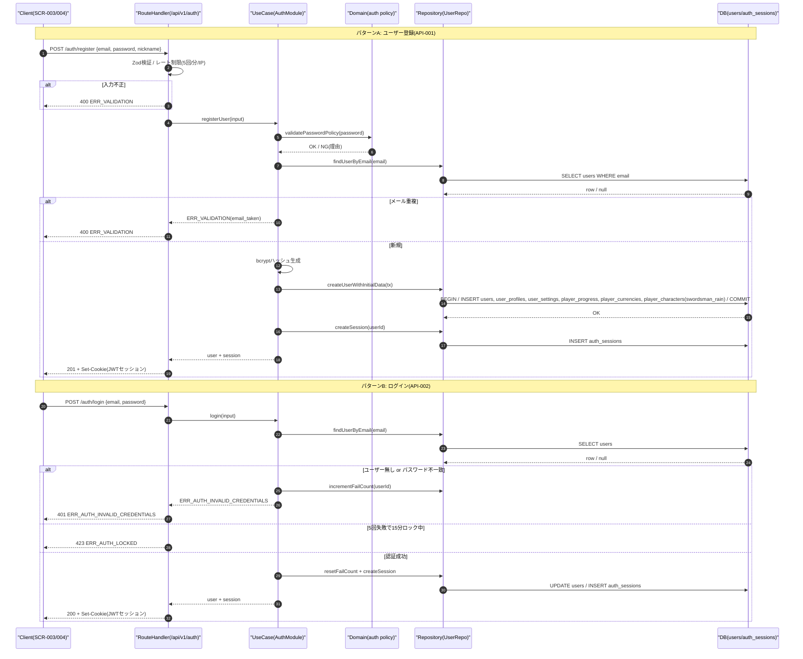
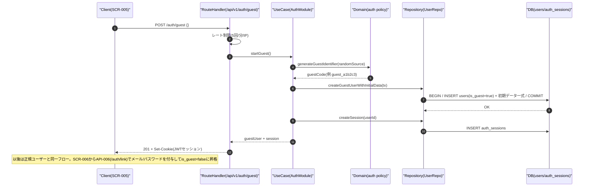
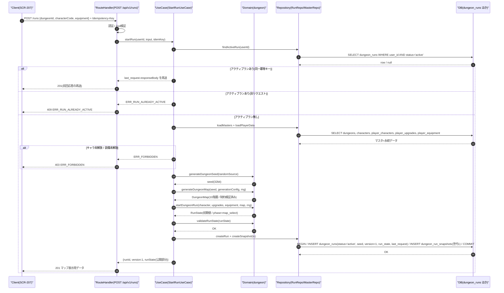
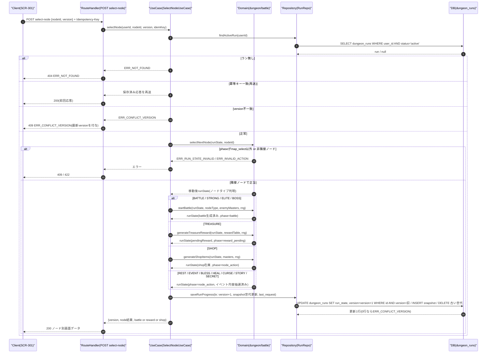
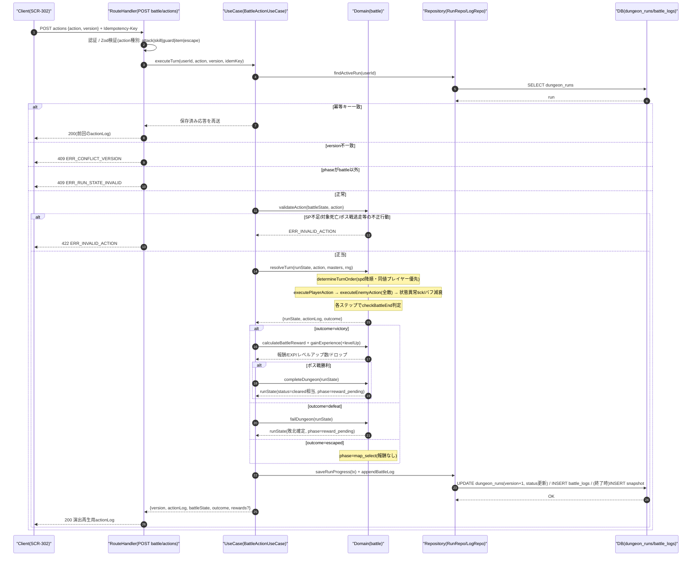
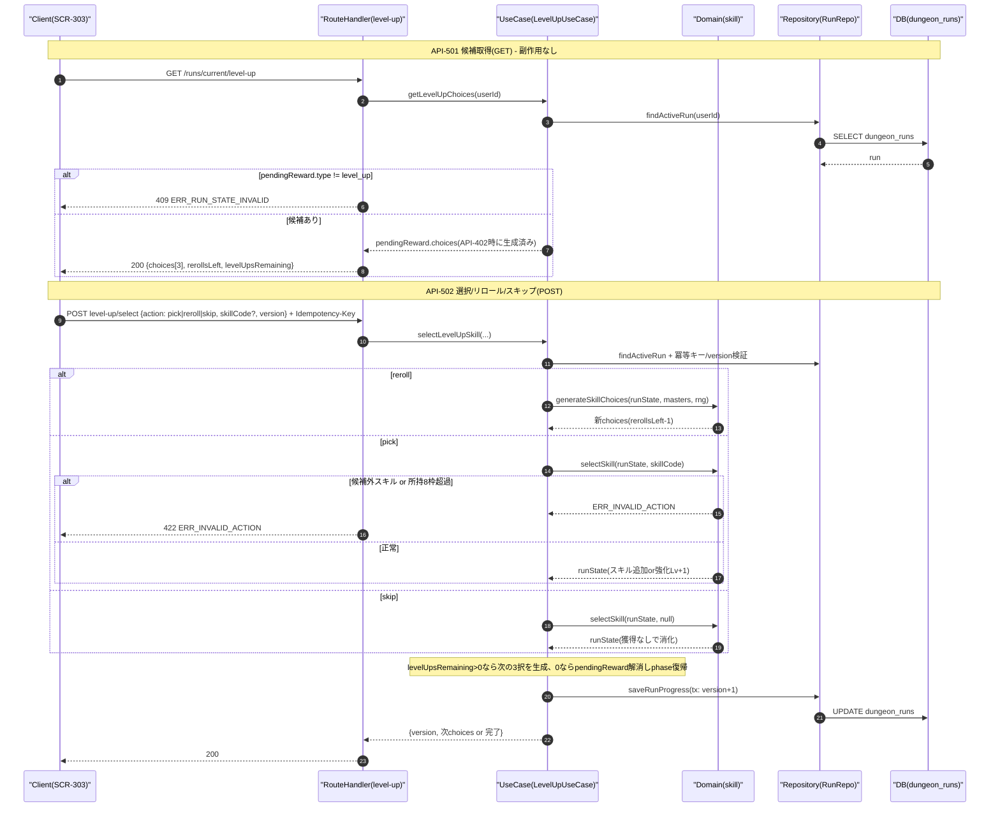
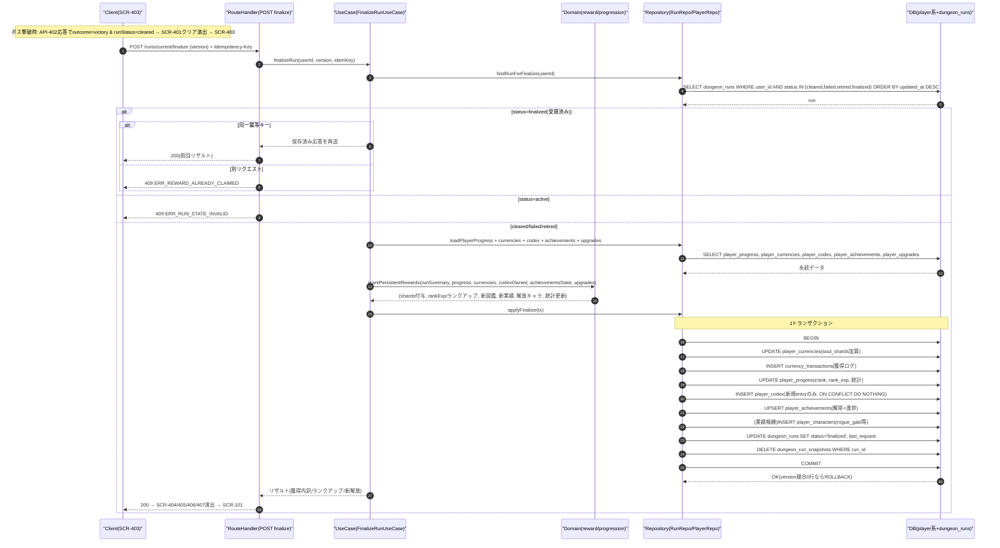
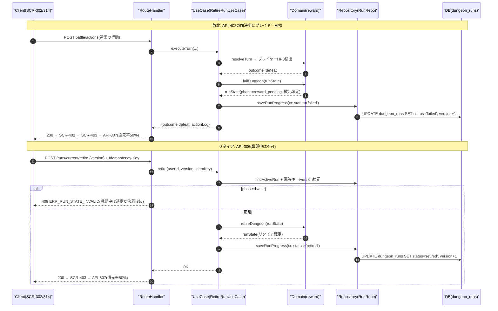
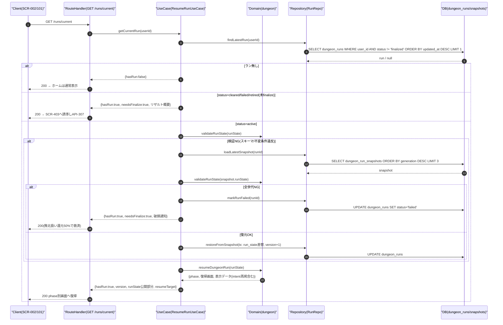

# 20_Detailed_Design.md — 詳細設計書（処理フロー・シーケンス・関数仕様）

## 目的

本書は「Rogue Chronicle」の主要処理について、レイヤ間のシーケンス・処理手順・エラー分岐を定義し（第1部）、
`src/domain/` 配下に実装する主要ゲームロジック31関数の仕様（引数・戻り値・処理手順・例外・トランザクション・冪等性・テスト観点・疑似コード）を定義する（第2部）。
API ID・テーブル名・計算式・run_state構造・エラーコードは CORE SPEC（設計共通仕様）と完全一致させる。

## 関連文書

- CORE SPEC（設計共通仕様 / 全設計書の単一情報源）
- 02_System_Requirements.md（システム要件）
- 05_Game_Design.md（ゲームバランス詳細）
- 09_Screen_Design.md（画面設計）
- 11_Module_Design.md（モジュール設計）
- 12_Database_Design.md（DB設計）
- 15_Save_Data_Design.md（セーブデータ設計）
- 13_API_Design.md（API設計）

## 前提となるレイヤ構成と責務

| レイヤ | 配置 | 責務 |
|---|---|---|
| Client | ブラウザ（React + TanStack Query + Zustand） | 画面表示・行動選択の送信のみ。ゲーム計算は行わない（DEC-007） |
| RouteHandler | `src/app/api/v1/**` | 認証確認・Zod入力検証・レート制限・エラー整形（`{ errorCode, message, details, traceId, timestamp }`） |
| UseCase | `src/server/usecases/` | APIごとのユースケース。**トランザクション境界**。冪等キー確認・楽観ロック検証・domain関数の編成 |
| Domain | `src/domain/` | **純粋関数のみ**。DBアクセス禁止・時刻/乱数は引数注入（Rng）。同一入力→同一出力 |
| Repository | `src/server/repositories/` | Prismaによる永続化。インターフェースはdomain/usecase側で定義 |
| DB | PostgreSQL (Neon) | dungeon_runs / dungeon_run_snapshots / battle_logs / player_* ほか |

---

# 第1部 主要処理の処理フロー・シーケンス

## 1.0 共通事項

- ラン系変更API（API-303, 305, 306, 307, 402, 502〜508）は `Idempotency-Key` ヘッダと `version`（run_state楽観ロック）を必須とする。
- 冪等キーの保存先は `dungeon_runs.last_request`（JSONB: `{ key, apiId, status, responseBody, savedAt }`）とし、**直近1件のみ**保持する（仮決定 → §1.15）。ラン系APIは1ユーザーにつき直列実行のため直近1件で十分。
- 乱数は run の `seed`（32bit）から mulberry32 で生成し、消費数 `rngCursor` を run_state に保存する（DEC-019）。UseCaseは処理開始時に `createRng(seed, rngCursor)` でRngを復元し、処理終了時に `rng.cursor` を run_state に書き戻す。
- 図中の participant は全図共通で Client / RouteHandler / UseCase / Domain / Repository / DB を用いる。

## 1.1 ユーザー登録〜ログイン（3パターン）

対象API: API-001（POST /auth/register）/ API-002（POST /auth/login）/ API-005（POST /auth/guest）
関連画面: SCR-003（ログイン）/ SCR-004（新規登録）/ SCR-005（ゲスト開始）

### 図1-1 ユーザー登録・ログイン



### 図1-2 ゲスト開始（API-005）



### 処理手順（番号付き）

1. Client が入力（email/password/なし）を送信する。
2. RouteHandler が Zod で入力検証し、IP単位のレート制限（5回/分）を確認する。違反時は 400 ERR_VALIDATION / 429 ERR_RATE_LIMITED。
3. UseCase がパスワードポリシー（8文字以上・英数含む。仮決定）を Domain で検証する。
4. 登録: email 一意性を確認（重複時 400）。ゲスト: is_guest=true の users 行を作成。
5. 1トランザクションで users / user_profiles / user_settings / player_progress / player_currencies / player_characters（初期キャラ swordsman_rain 解放）を作成する。
6. auth_sessions にセッションを作成し、JWTセッションCookie（有効期限: アクセス24h・最大30日）を発行する。
7. ログイン: bcrypt照合。失敗時は失敗回数を加算し、5回連続失敗で15分ロック（423 ERR_AUTH_LOCKED）。成功時は失敗回数リセット。
8. 応答後、Client はタイトル画面（SCR-002）→ホーム（SCR-101）へ遷移する。

### エラー分岐

| 条件 | エラー | HTTP |
|---|---|---|
| 入力不正・email重複 | ERR_VALIDATION | 400 |
| 認証情報不一致 | ERR_AUTH_INVALID_CREDENTIALS | 401 |
| ロック中 | ERR_AUTH_LOCKED | 423 |
| レート超過 | ERR_RATE_LIMITED | 429 |
| セッション期限切れ（以後の要認証API） | ERR_AUTH_SESSION_EXPIRED | 401 |

## 1.2 ダンジョン開始（API-303 POST /runs）

関連画面: SCR-204（キャラ選択）→ SCR-205（初期装備選択）→ SCR-207（出撃確認）→ SCR-301（マップ）
関連関数: generateDungeonSeed / generateDungeonMap / startDungeonRun / validateRunState / saveRunProgress



### 処理手順

1. 認証・入力検証（dungeonId 存在、characterCode 形式）。
2. アクティブラン検証: `status='active'` の dungeon_runs が存在するか確認する。存在し、かつ Idempotency-Key が保存済み `last_request.key` と一致すれば保存済み応答を再送（再送扱い）。不一致なら 409 ERR_RUN_ALREADY_ACTIVE（クライアントは API-304 で再開か API-306 でリタイアを選択）。
3. マスタ・永続データ取得: dungeons（generation_config）、characters、player_characters（解放確認）、player_upgrades（初期ステータス補正）、player_equipment（初期装備の所有確認）。未解放なら 403 ERR_FORBIDDEN。
4. `generateDungeonSeed` で 32bit seed を生成する（CSPRNG注入）。
5. `generateDungeonMap(seed, config, rng)` で10階層のノードマップを生成する（生成制御ルールは §2.2 参照）。
6. `startDungeonRun` で初期 RunState を構築する（キャラ初期値×永続強化補正、初期ゴールド、開始レリック、position={floor:1, nodeId:"f1n0", phase:"map_select"}、rngCursor）。
7. `validateRunState` でスキーマ・不変条件を検証する（失敗時 500 ERR_INTERNAL としてログ出力、DBには書かない）。
8. 1トランザクションで dungeon_runs（version=1）と dungeon_run_snapshots（世代1）を INSERT し、last_request に応答を保存する。
9. 201 で runId・version・公開用 run_state（マップ、キャラ状態）を返す。Client は SCR-301 を表示する。

### エラー分岐

- 未認証: 401 ERR_AUTH_UNAUTHORIZED / 入力不正: 400 ERR_VALIDATION / dungeonId不存在: 404 ERR_NOT_FOUND
- アクティブラン既存: 409 ERR_RUN_ALREADY_ACTIVE / キャラ・装備未解放: 403 ERR_FORBIDDEN
- DB書き込み失敗: 500 ERR_INTERNAL（トランザクションはロールバック、ランは未作成のままで安全）

## 1.3 次ノード選択（API-305 POST /runs/current/select-node）

関連画面: SCR-301 → 各ノード画面（SCR-302/305/306/307/308）
関連関数: selectNextNode / startBattle / generateTreasureReward / generateShopItems / saveRunProgress



### 処理手順

1. 認証後、アクティブランを取得（無ければ 404）。
2. 冪等キー確認: `last_request.key` と一致すれば保存済み応答を再送して終了。
3. version 検証: リクエストの version と DB の version が不一致なら 409 ERR_CONFLICT_VERSION（応答に最新 version と run_state を含め、クライアントは再取得）。
4. `selectNextNode` で検証: (a) `position.phase === "map_select"` であること（違反: 409 ERR_RUN_STATE_INVALID）、(b) 指定 nodeId が現在ノードから edges で接続された次階層ノードであること（違反: 422 ERR_INVALID_ACTION）。
5. 移動確定: position を更新し、ノードの visited=true。
6. ノードタイプ分岐:
   - BATTLE/STRONG/ELITE/BOSS → `startBattle` が敵編成（階層×タイプ別の重み抽選、敵ステータスは §5.4 敵式で算出）と行動予告を生成し phase=battle。
   - TREASURE → `generateTreasureReward` が報酬を抽選し pendingReward に格納、phase=reward_pending（受領は API-503）。
   - SHOP → `generateShopItems` が在庫を生成し run_state.shop に格納、phase=node_action。
   - REST → 二択（HP50%回復 / スキル1つ強化）の提示のみ、phase=node_action（実行は API-505）。
   - EVENT/BLESS/HEAL/CURSE/SECRET → random_events から抽選し選択肢を提示、phase=node_action（選択は API-506）。SECRETはEVENT扱いの上位報酬テーブル。
   - STORY → stories からテキスト取得、phase=node_action（閲覧後クライアントが確認を送りmap_selectへ）。
7. `saveRunProgress` で楽観ロック付き UPDATE（version+1）+ snapshot 世代更新 + last_request 保存を1トランザクションで行う。
8. 200 でノード別の画面データを返す。

### エラー分岐

- ラン無し: 404 / version不一致: 409 ERR_CONFLICT_VERSION / phase不正: 409 ERR_RUN_STATE_INVALID
- 非隣接・訪問済み階層への逆行: 422 ERR_INVALID_ACTION / 冪等キー重複（別ボディ）: 409 ERR_DUPLICATE_REQUEST

## 1.4 戦闘1ターンの行動実行（API-402 POST /runs/current/battle/actions）

関連画面: SCR-302 / 関連関数: determineTurnOrder / executePlayerAction / selectEnemyAction / executeEnemyAction / applyStatusEffect / checkBattleEnd / calculateBattleReward / gainExperience / levelUp / completeDungeon / failDungeon / saveRunProgress



### 処理手順

1. 認証・入力検証（action.type と対象・スキルコードの形式）。
2. 冪等キー確認: 一致すれば前回応答（actionLog含む）を再送。処理は一切実行しない。
3. version 検証: 不一致は 409 ERR_CONFLICT_VERSION。`position.phase !== "battle"` は 409 ERR_RUN_STATE_INVALID。
4. 行動正当性検証: スキル所持・SPコスト充足・対象生存・アイテム所持数・逃走可否（ボス/エリートは不可）。違反は 422 ERR_INVALID_ACTION。
5. ターン解決（Domain純粋関数、Rngはseed+rngCursorから復元）:
   1. `determineTurnOrder` で spd 降順に行動順を決定（同値はプレイヤー優先）。以下、代表ケース（プレイヤー先行）で記す。
   2. `executePlayerAction`: 麻痺30%/スタンの行動不能判定 → 行動種別ごとに解決（通常攻撃 / スキル効果行の順次適用 / 防御 / アイテム / 逃走判定）。命中→クリティカル→ダメージの順で判定し actionLog に記録。
   3. `checkBattleEnd`: 全滅・逃走成功なら以降スキップ。
   4. 各敵について `selectEnemyAction`（予告済みintentを実行し、次ターンのintentを再抽選）→ `executeEnemyAction`。プレイヤーHP0で即 defeat。
   5. ターン終了処理: 毒（maxHp8%）・火傷（maxHp5%）の状態異常tick → regen回復 → バフ/デバフ/状態異常の残りターン減算・期限切れ削除 → SP+2回復（リリアは+3）。tickダメージでもHP0判定を行う。
   6. `checkBattleEnd` で最終判定。継続なら turnNo+1、新intentを応答に含める。
6. 終了判定後の処理:
   - victory: `calculateBattleReward`（ゴールド・ソウルシャード・EXP・装備/レリックドロップ）→ `gainExperience`（レベルアップ発生時は `levelUp` を回数分適用し pendingReward.type="level_up" を設定、phase=reward_pending。ドロップのみなら同様に reward_pending、何も無ければ map_select）。
   - ボス戦victory: さらに `completeDungeon` で status=cleared・クリアボーナス加算・phase=reward_pending（リザルトへ）。
   - defeat: `failDungeon` で status=failed・phase=reward_pending（敗北リザルトへ）。
   - escaped: battle を破棄し phase=map_select（ノードは未訪問のまま再選択不可、別ノードを選ぶ。仮決定）。
7. `saveRunProgress`（version+1・battle_logs追記・戦闘終了時はsnapshot世代更新）を1トランザクションで実行。
8. 200 で actionLog（演出再生用の順序付きイベント列）・戦闘状態・outcome・報酬を返す。

### エラー分岐

- 401 / 404（ラン無し）/ 409 ERR_CONFLICT_VERSION / 409 ERR_RUN_STATE_INVALID / 409 ERR_DUPLICATE_REQUEST（同一キーで処理中: 二重タブ対策）/ 422 ERR_INVALID_ACTION / 500 ERR_INTERNAL（ロールバックし、クライアントはAPI-401で再取得）

## 1.5 スキル3択の生成と選択（API-501 GET / API-502 POST）

関連画面: SCR-303/SCR-304 / 関連関数: generateSkillChoices / selectSkill



### 処理手順

1. レベルアップ発生時（API-402内）に `generateSkillChoices` が3候補を生成し pendingReward に保存する（GETを何度呼んでも同じ候補が返る＝冪等）。
2. API-501 は pendingReward.choices をそのまま返す。type が level_up でなければ 409 ERR_RUN_STATE_INVALID。
3. API-502 pick: 候補内の skillCode か検証 → 未所持なら skills[] に追加（8枠超過時は 422、クライアントは削除対象を選び直す）。所持済みなら強化 Lv+1（上限3、上限到達候補はそもそも生成時に除外）。
4. API-502 reroll: rerollsLeft > 0 を検証（0なら 422）→ `generateSkillChoices` を再実行し rerollsLeft−1。
5. API-502 skip: 候補を破棄して1回分を消化する。
6. levelUpsRemaining を1減算。残があれば次の3候補を生成して応答に含める。0なら pendingReward を解消し、phase を戦闘後の遷移先（ボス撃破後なら reward_pending 維持、通常は map_select）へ戻す。
7. saveRunProgress（version+1）で保存し応答。

## 1.6 ダンジョンクリア〜リザルト確定〜永続報酬付与（API-307 POST /runs/current/finalize）

関連画面: SCR-401 → SCR-403 → SCR-404/405/406/407 → SCR-101
関連関数: completeDungeon / grantPersistentRewards



### 処理手順

1. ボス撃破は API-402 内で確定する: `checkBattleEnd`=victory かつ BOSS ノード → `completeDungeon` が earned にクリアボーナスを加算し、UseCase が `dungeon_runs.status='cleared'`・phase=reward_pending で保存する。クライアントは SCR-401 → SCR-403 を表示する。
2. API-307 で status を確認する: finalized なら冪等キー一致時のみ前回応答を再送、不一致なら 409 ERR_REWARD_ALREADY_CLAIMED。active なら 409 ERR_RUN_STATE_INVALID。
3. `grantPersistentRewards`（純粋関数）が付与内容を算出する: ソウルシャード = floor(earned.soulShards × 還元率 × (1 + 永続強化ボーナス))（クリア100%+クリアボーナス / リタイア80% / 敗北50%）、ランクEXP、ランクアップ判定（expToRank(R)=100×R^1.8、上限50）、図鑑新規（敵/スキル/レリック/装備/キャラ）、実績判定（累計ラン10回→ガルド解放 等）、統計更新。
4. **1トランザクション**で player_currencies / currency_transactions / player_progress / player_codex / player_achievements /（実績報酬の）player_characters / dungeon_runs(status='finalized') / dungeon_run_snapshots 削除 を実行する。途中失敗は全ロールバック（付与ゼロのまま再実行可能＝at-most-once + リトライで exactly-once 相当）。
5. 200 でリザルト内訳を返す。battle_logs は削除せず30日保持（検証用）。dungeon_runs 行も finalized のまま30日保持後にバッチ削除する（仮決定）。

## 1.7 敗北・リタイア処理（API-402敗北分岐 / API-306 POST /runs/current/retire）

関連画面: SCR-402（敗北）/ SCR-314（リタイア確認）→ SCR-403
関連関数: failDungeon / retireDungeon / grantPersistentRewards



### 処理手順

1. 敗北確定は API-402 内のみで発生する（サーバー権威）。`failDungeon` が run_state に敗北情報（到達階層・撃破数）を記録し status='failed' で保存する。
2. リタイアは SCR-313/314 から API-306 で実行する。phase=battle 中は 409（戦闘の決着または逃走後に可能。仮決定）。`retireDungeon` が status='retired' 相当を確定する。
3. いずれも**この時点では永続付与を行わない**。一時データ（run_state）は finalize まで保持し、獲得内訳の表示に使う。
4. クライアントは SCR-403 から API-307 を呼ぶ。§1.6 の同一トランザクションで部分付与（敗北50% / リタイア80%）が行われ、snapshot削除・status='finalized' で一時データの役目が終わる。
5. finalize を呼ばずに離脱した場合: 次回ログイン時の API-304 が status IN (cleared,failed,retired) のランを検出し、リザルト画面へ誘導する（付与漏れ防止）。

## 1.8 途中再開（再ログイン → API-304 GET /runs/current）

関連関数: resumeDungeonRun / validateRunState



### 処理手順

1. 再ログイン後、ホーム表示前に Client が API-304 を呼ぶ（ホームのAPI-101応答にも hasActiveRun フラグを含め、「冒険を再開」ボタンを出す）。
2. status != 'finalized' の最新ランを取得。無ければ通常ホーム。
3. cleared/failed/retired（finalize未実行）ならリザルト画面へ誘導する（§1.7手順5）。
4. active の場合 `validateRunState` で整合性検証。破損時は dungeon_run_snapshots の直近世代から順に復元を試み、全世代不能なら敗北扱いで救済する。
5. `resumeDungeonRun` が phase から復帰先を導出する:

| position.phase | 復帰画面 | 補足 |
|---|---|---|
| map_select | SCR-301 ダンジョンマップ | 現在階層・選択可能ノードをハイライト |
| battle | SCR-302 戦闘画面 | battle状態・敵intent・turnNoを再掲（API-401でも取得可） |
| node_action | ノード種別の画面（SCR-306/307/308等） | shop在庫・イベント選択肢はrun_stateから復元 |
| reward_pending | SCR-303（level_up）/ SCR-305（treasure）等 | pendingReward.typeで分岐 |

6. GET のため副作用なし（冪等）。version を返し、以後の変更APIに引き継ぐ。

## 1.9 簡潔フロー（番号付き手順+分岐条件）

### 1.9.1 ホーム表示（API-101 GET /home）

1. 認証確認（NG: 401）。
2. player_progress / player_currencies / player_characters / announcements / アクティブラン有無を並列取得（Promise.all、読み取りのみでトランザクション不要）。
3. 応答: ランク・EXPゲージ・ソウルシャード・選択中キャラ・お知らせ・hasActiveRun / needsFinalize フラグ。
4. 分岐: hasActiveRun=true → 「冒険を再開」導線 / needsFinalize=true → リザルト誘導 / いずれも無し → 「ダンジョンへ」導線。

### 1.9.2 宝箱報酬生成・受領（生成=API-305内、受領=API-503 POST /runs/current/treasure/open）

1. 生成（§1.3手順6）: `generateTreasureReward` が reward_tables から抽選（ゴールド40% / 装備30% / レリック20% / 消耗品10%。仮決定、階層で量スケール）。結果を pendingReward に保存＝開封前に確定済み（リロード再抽選チート防止）。
2. API-503 で冪等キー/version検証（§1.15共通フロー）。
3. 分岐: pendingReward.type != 'treasure' → 409 ERR_RUN_STATE_INVALID / claimed=true → 409 ERR_REWARD_ALREADY_CLAIMED。
4. 内容を run_state に反映（gold加算 / equipment取得（装備選択はAPI-507）/ relics追加（重複レリックはゴールド変換）/ items加算）。
5. pendingReward.claimed=true → phase=map_select。saveRunProgress（version+1）。

### 1.9.3 ショップ商品生成・購入（生成=API-305内、購入=API-504 POST /runs/current/shop/purchase）

1. 生成: `generateShopItems` が5枠を抽選（消耗品2 / 装備1〜2 / レリック0〜1。仮決定）。価格 = 基準価格 × (1 + 0.10×(floor−1)) × rand(0.9〜1.1)（仮決定）。run_state.shop に保存。
2. API-504 で冪等キー/version検証。入力: slotIndex。
3. 分岐: phase != node_action or 現在ノードがSHOPでない → 409 ERR_RUN_STATE_INVALID / slot売切れ → 422 ERR_INVALID_ACTION / gold < price → 422 ERR_INSUFFICIENT_GOLD。
4. `purchaseShopItem`: gold減算 → 商品を所持へ反映 → slot.soldOut=true。
5. saveRunProgress。退店はクライアント操作のみ（サーバーはphase=map_selectへ戻すleaveアクションをAPI-504のaction="leave"で受ける。仮決定）。

### 1.9.4 イベント選択（API-506 POST /runs/current/event/choose）

1. ノード進入時（API-305）に random_events から抽選し、選択肢（random_event_choices）を run_state.event に保存済み。
2. API-506 で冪等キー/version検証。入力: choiceId。
3. 分岐: phase != node_action or event未保持 → 409 ERR_RUN_STATE_INVALID / choiceId不正 → 422 ERR_INVALID_ACTION / 選択肢の要求コスト（gold等）不足 → 422 ERR_INSUFFICIENT_GOLD。
4. `executeRandomEvent`: 選択肢の成功率で成否抽選（Rng）→ 効果適用（HP増減 / gold増減 / レリック / スキル / 状態変化 / 戦闘発生）。戦闘発生時は `startBattle` に接続し phase=battle。
5. 結果テキストと差分を応答。phase=map_select（戦闘発生時を除く）。saveRunProgress。

### 1.9.5 休憩（API-505 POST /runs/current/rest）

1. RESTノード進入済み（phase=node_action、現在ノード=REST）を検証。違反: 409 ERR_RUN_STATE_INVALID。
2. 入力: choice = "heal" | "upgrade_skill"（+ skillCode）。
3. 分岐: heal → hp = min(maxHp, hp + floor(maxHp×0.5)) / upgrade_skill → 対象スキルLv+1（未所持・Lv3到達は 422 ERR_INVALID_ACTION）。
4. 実行済みフラグを現在ノードに記録（再実行は 409 ERR_RUN_STATE_INVALID）→ phase=map_select。
5. saveRunProgress（version+1）。

### 1.9.6 セーブ共通処理（saveRunProgress = 各変更API内の保存）

1. 呼び出し元UseCaseがトランザクションを開始する（Prisma `$transaction`）。
2. `validateRunState` で保存前検証（NG時は例外→ロールバック、ERR_INTERNAL）。
3. `UPDATE dungeon_runs SET run_state=$1, version=version+1, status=$2, rng_cursor同期, last_request=$3, updated_at=now() WHERE id=$4 AND version=$expected` — 更新0行なら ERR_CONFLICT_VERSION で全体ロールバック。
4. チェックポイント（ノード遷移確定時・戦闘終了時・ラン終了時）では dungeon_run_snapshots に世代INSERTし、古い世代をDELETEして直近3世代を維持する。
5. 戦闘APIでは battle_logs を同一トランザクションで追記する。
6. コミット後に新 version を応答へ含める（クライアントは常に最新versionを保持する）。

### 1.9.7 二重実行防止（冪等キー処理の共通フロー）

1. 対象: ラン系変更API（303, 305, 306, 307, 402, 502〜508）。ヘッダ `Idempotency-Key`（UUID v4、クライアントが操作ごとに生成）必須。欠落は 400 ERR_VALIDATION。
2. ラン取得時に `last_request` を確認する:
   - key一致 かつ status='completed' → 保存済み responseBody をそのまま再送（**処理は再実行しない**）。
   - key一致 かつ status='processing' → 409 ERR_DUPLICATE_REQUEST（前リクエスト処理中。二重タブ・二重クリック対策）。
   - key不一致 → 新規リクエストとして処理継続。
3. 処理開始時に `last_request={key, apiId, status:'processing'}` を version+1 と同時に書けない（本処理と同一Txで書くため）ので、実際には楽観ロックが一次防壁となる: 同時に来た2リクエストは同じ expected version を持ち、後勝ちの UPDATE が0行となり 409 ERR_CONFLICT_VERSION で弾かれる（仮決定: processing状態の事前マークは行わず、楽観ロック+完了後のlast_request保存の2段構えとする）。
4. 処理成功時、last_request を `{key, apiId, status:'completed', responseBody, savedAt}` で run_state 更新と同一トランザクション内に保存する。
5. ネットワーク断でクライアントが応答を受け取れなかった場合、同一キーで再送すれば手順2で前回応答が返り、状態は二重に進まない。

---

# 第2部 ゲームロジック関数仕様（src/domain/）

## 2.0 共通原則と共有型定義

**原則（全関数共通）**
1. domain層の関数は**純粋関数**とする。DBアクセス・`fetch`・`Date.now()`・`Math.random()` の直接使用を禁止する。
2. 乱数は必ず `Rng` インターフェースを引数注入する（DEC-019）。現在時刻が必要な場合は `now: Date` を引数で受け取る。
3. 引数の `RunState` / `BattleState` は**変更せず**、更新後の新しいオブジェクトを返す（イミュータブル）。
4. 業務エラーは `AppError(errorCode)` をthrowする。RouteHandlerが共通エラー形式へ変換する。
5. トランザクション・冪等性はUseCase層の責務。domain関数自体は副作用を持たないため常に再実行安全。

```typescript
// src/domain/shared/types.ts（全関数で共有）
export type Element = 'none' | 'fire' | 'water' | 'wind';
export type NodeType =
  | 'BATTLE' | 'STRONG' | 'ELITE' | 'BOSS' | 'TREASURE' | 'SHOP' | 'REST'
  | 'EVENT' | 'BLESS' | 'HEAL' | 'CURSE' | 'STORY' | 'SECRET';
export type RunPhase = 'map_select' | 'node_action' | 'battle' | 'reward_pending';
export type StatusCode = 'poison' | 'burn' | 'paralysis' | 'stun' | 'weaken';
export type BuffCode =
  | 'atkUp' | 'atkDown' | 'defUp' | 'defDown' | 'spdUp' | 'spdDown' | 'critUp' | 'regen';

export interface Rng {
  next(): number;                 // [0,1) 一様乱数（mulberry32）
  int(min: number, max: number): number;          // [min,max] 整数
  pick<T>(arr: readonly T[]): T;
  weighted<T>(items: readonly { item: T; weight: number }[]): T;
  readonly cursor: number;        // 消費数。処理後 run_state.rngCursor へ書き戻す
}
// createRng(seed: number, cursor: number): Rng — seedから復元し cursor 回空読みして再現

export interface Stats {
  maxHp: number; atk: number; def: number; spd: number;
  critRate: number; critDmg: number; eva: number; acc: number;
  statusRes: number; elemRes: Partial<Record<Element, number>>;
}
export interface StatusState { code: StatusCode; remainingTurns: number }
export interface BuffState { code: BuffCode; value: number; remainingTurns: number }

export interface ActorState {
  id: string;                     // 'player' | 'e1' | 'e2' | 'e3'
  side: 'player' | 'enemy';
  code: string;                   // キャラ/敵マスタcode
  element: Element;
  stats: Stats;                   // 装備・永続強化・レベル適用後の基礎値
  hp: number; sp: number; maxSp: number;   // 敵はsp未使用(0)
  statuses: StatusState[];
  buffs: BuffState[];
  guarding: boolean;              // 防御選択中（次の被弾まで/ターン終了まで）
  intent?: { actionCode: string; label: string; estimated?: number }; // 敵のみ
  alive: boolean;
}

export interface ActionLogEntry {
  turnNo: number; actorId: string;
  action: 'attack' | 'skill' | 'guard' | 'item' | 'flee' | 'enemy_action' | 'status_tick';
  detailCode?: string;            // スキル/アイテム/敵行動code
  targetId?: string;
  damage?: number; isCrit?: boolean; isMiss?: boolean; healed?: number;
  statusApplied?: StatusCode; buffApplied?: BuffCode;
  hpAfter: Record<string, number>;
  note?: string;                  // 'fled_success' | 'phase_change' 等
}

export interface BattleState {
  nodeId: string; turnNo: number;
  actors: ActorState[];
  order: string[];                // このターンの行動順（actorId）
  phase: 'player_input' | 'ended';
  result?: 'win' | 'lose' | 'fled';
  bossPhase?: 1 | 2 | 3;          // ボス戦のみ
}

export interface MapNode { id: string; floor: number; type: NodeType; next: string[] }
export interface DungeonMap { seed: number; floors: MapNode[][]; }

export interface PendingReward {
  type: 'skill_choice' | 'treasure' | 'relic' | 'equipment' | 'event_result' | 'levelup_queue';
  choices: unknown[];             // typeごとのZodスキーマで検証（15_Save_Data_Design.md）
  rerollRemaining?: number;
  claimed: boolean;
}

export interface RunState { /* CORE SPEC §8 の構造。schemaVersion/map/position/character/
  skills/equipment/relics/items/gold/battle?/pendingReward?/rngCursor/earned/lastRequest? */ }
```

以下、各関数を「目的 / 引数 / 戻り値 / 処理手順 / 例外 / トランザクション / 冪等性 / テスト観点 / 疑似コード」で定義する。
配置は `src/domain/` 配下（11_Module_Design.md のモジュール対応に従う）。

---

## 2.1 generateDungeonSeed（dungeon/）

- **目的**: ランのマップ生成・全抽選の起点となる32bitシードを生成する。
- **引数**: `entropy: number`（UseCaseが `crypto.getRandomValues` で取得した値を注入。domain内で乱数源を持たないため）
- **戻り値**: `number`（uint32、1以上）
- **処理手順**: 1) `entropy >>> 0` で32bit化 2) 0の場合は1へ補正（seed=0はPRNG退化のため）
- **例外**: なし
- **トランザクション**: 不要 / **冪等性**: 同一entropyに対し決定的
- **テスト観点**: (1)常に1〜2^32-1 (2)同一入力で同一出力 (3)0入力の補正
- **疑似コード**:
```typescript
export function generateDungeonSeed(entropy: number): number {
  const seed = entropy >>> 0;
  return seed === 0 ? 1 : seed;
}
```

## 2.2 generateDungeonMap（dungeon/）★詳細

- **目的**: シードからノード選択型マップ（10階層・列グラフ）を決定的に生成する（DEC-003, §CORE 5.6）。
- **引数**: `seed: number`, `config: DungeonGenerationConfig`（dungeons.generation_config: 階層数10、階層あたり2〜4ノード、ノードタイプ重み表、制約）, `rng: Rng`（seedから新規作成したもの）
- **戻り値**: `DungeonMap`
- **処理手順**:
  1. 階層1に `BATTLE` 1ノード、階層10に `BOSS` 1ノードを固定生成。
  2. 階層2〜9の各階層のノード数を `rng.int(2, 4)` で決定。
  3. エッジ生成: 各階層の各ノードから次階層のノードへ1〜3本接続。位置近傍（インデックス差±1）を優先し、(a)全ノードが少なくとも1本の入次数・出次数を持つ (b)階層10へ全パスが到達できる ことを保証する。
  4. タイプ割当: 制約充足方式。先に確定枠（階層5・9に REST を各1、マップ全体で SHOP 1〜2、STORY はストーリー進行に応じ0〜1）を配置し、残りを階層帯別重み表から `rng.weighted` で抽選。制約違反（ELITEが階層3未満 / 同一タイプが同一パス上に3連続）は再抽選（最大20回、超過時はBATTLEへフォールバック）。
  5. SECRET: 10%判定で任意の階層2〜8の1ノードを SECRET に置換。
  6. 検証: BOSSへの到達可能性をBFSで確認。失敗時は手順3からリトライ（最大5回。全滅は設計上ほぼ不可能だが、超過時は決定的フォールバック形状=各階層3ノード全接続を採用）。
- **例外**: `ERR_INTERNAL`（フォールバックも失敗した場合のみ。実質発生しない）
- **トランザクション**: 不要（純粋関数。保存はstartDungeonRunのUseCaseが行う）
- **冪等性**: 同一seed・同一configで完全同一のマップ（再現性テストの根幹）
- **テスト観点**: (1)同一seedで同一マップ (2)1000シードでBOSS到達可能率100% (3)階層5・9にREST存在率100% (4)SHOP数1〜2 (5)ELITEが階層1・2に出ない (6)同一パス3連続なし (7)ノード数が2〜4
- **疑似コード**:
```typescript
export function generateDungeonMap(seed: number, config: GenConfig, rng: Rng): DungeonMap {
  for (let attempt = 0; attempt < 5; attempt++) {
    const floors: MapNode[][] = [];
    floors[0] = [node('f1n0', 1, 'BATTLE')];
    for (let f = 2; f <= 9; f++) {
      const count = rng.int(2, 4);
      floors[f - 1] = range(count).map(i => node(`f${f}n${i}`, f, 'UNASSIGNED'));
    }
    floors[9] = [node('f10n0', 10, 'BOSS')];

    connectEdges(floors, rng);            // 手順3: 近傍優先・入出次数>=1を保証
    assignFixedTypes(floors, rng, config); // 手順4前段: REST(5,9), SHOP1〜2
    assignWeightedTypes(floors, rng, config); // 手順4後段: 重み抽選+制約チェック(最大20回)
    maybePlaceSecret(floors, rng);         // 手順5: 10%
    if (reachesBoss(floors)) return { seed, floors };
  }
  return deterministicFallback(seed);      // 各階層3ノード全接続
}
```

## 2.3 selectNextNode（dungeon/）

- **目的**: プレイヤーが選択したノードへの移動を検証し、ノード入場結果（戦闘生成・報酬抽選等）を含む新しいRunStateを返す（API-305の中核）。
- **引数**: `runState: RunState`, `nodeId: string`, `masters: MasterBundle`, `rng: Rng`
- **戻り値**: `{ runState: RunState; entered: NodeEnterResult }`（entered.type別に battle開始情報 / pendingReward / イベント定義等）
- **処理手順**:
  1. `position.phase === 'map_select'` を検証（不一致→`ERR_RUN_STATE_INVALID`）。
  2. `nodeId` が現在ノードの `next` に含まれるか検証（不一致→`ERR_INVALID_ACTION`。**隣接以外への移動はここで完全に遮断**）。
  3. `position` を更新し、ノードタイプで分岐:
     - BATTLE/STRONG/ELITE/BOSS → `startBattle` を呼び battle を設定、phase='battle'。
     - TREASURE → `generateTreasureReward` で pendingReward 設定、phase='reward_pending'。
     - SHOP → `generateShopItems` で商品を run_state.shop に設定、phase='node_action'。
     - REST/EVENT/BLESS/HEAL/CURSE/STORY/SECRET → イベント定義を提示、phase='node_action'。
  4. `rngCursor` を更新して返す。
- **例外**: `ERR_RUN_STATE_INVALID` / `ERR_INVALID_ACTION`
- **トランザクション**: UseCaseで楽観ロックUPDATE（1文）+ snapshot保存を同一Txで実行
- **冪等性**: UseCaseの冪等キーで担保（再送時は保存済み応答を返却）
- **テスト観点**: (1)隣接ノードのみ許可 (2)phase不一致拒否 (3)タイプ別に正しい状態遷移 (4)同一rngCursorから同一抽選結果

## 2.4 startDungeonRun（dungeon/）

- **目的**: 出撃条件を検証し、初期RunState（マップ・キャラ初期値・永続強化適用）を構築する（API-303の中核）。
- **引数**: `input: { characterCode, dungeonCode, difficulty, startEquipment[] }`, `playerData: { unlockedCharacters, unlockedEquipment, upgrades }`, `masters: MasterBundle`, `seed: number`
- **戻り値**: `RunState`（phase='map_select'、階層1ノードを踏破済み扱いにするかは「階層1=開始戦闘」のためBATTLE入場から開始（仮決定: 初期位置は階層1ノードで phase='battle'））
- **処理手順**: 1) キャラ・装備の解放済み検証（未解放→`ERR_INVALID_ACTION`） 2) `generateDungeonMap` 3) キャラ初期ステータスに永続強化（upgrade_nodes効果）と初期装備を適用 4) 初期スキル・初期アイテム（ポーション1）・初期ゴールド（0+永続強化分）を設定 5) `earned` をゼロ初期化
- **例外**: `ERR_INVALID_ACTION` / `ERR_VALIDATION`
- **トランザクション**: UseCaseで「アクティブラン不存在チェック→INSERT」。**同時開始はDBの部分UNIQUEインデックス（user_id WHERE status='active'）が最終防衛線**（違反→`ERR_RUN_ALREADY_ACTIVE`）
- **冪等性**: 冪等キー。同一キー再送は作成済みランを返す
- **テスト観点**: (1)未解放キャラ拒否 (2)アクティブラン重複拒否 (3)永続強化がステータスへ正しく反映 (4)同一seedで同一初期状態

## 2.5 resumeDungeonRun（dungeon/）

- **目的**: 保存済みRunStateから、クライアントが復帰すべき画面と表示用状態を導出する（API-304）。
- **引数**: `runState: RunState`
- **戻り値**: `{ resumeTo: 'map' | 'battle' | 'reward' | 'node_action' | 'result'; view: ClientRunView }`
- **処理手順**: 1) `validateRunState` 2) phase→復帰先のマッピング（map_select→map / battle→battle / reward_pending→reward / node_action→node_action、status≠active→result） 3) クライアント表示に不要な内部情報（seed・rngCursor・敵の未公開行動テーブル）を**除外**したViewを構築
- **例外**: `ERR_RUN_STATE_INVALID`（破損検知→スナップショット復旧フローへ）
- **トランザクション**: 読み取りのみ / **冪等性**: 参照系のため常に安全
- **テスト観点**: (1)各phaseの復帰先 (2)seed等の内部情報がViewに漏れない (3)破損データでERR_RUN_STATE_INVALID

## 2.6 startBattle（battle/）

- **目的**: ノードタイプと階層から敵編成を抽選し、BattleStateを生成する。
- **引数**: `runState: RunState`, `nodeType: NodeType`, `floor: number`, `masters: MasterBundle`, `rng: Rng`
- **戻り値**: `BattleState`
- **処理手順**: 1) 敵編成抽選（enemies.appear_floors と nodeType で候補を絞り、BATTLE=1〜2体 / STRONG=1体(強敵補正) / ELITE=1体+随伴0〜1 / BOSS=ruin_guardian固定） 2) 階層補正 `base × (1 + 0.12 × (floor-1)) × difficultyMod` と種別補正を適用 3) プレイヤーActorState構築（現在hp/sp引き継ぎ） 4) `determineTurnOrder` 5) 各敵の初回intentを `selectEnemyAction` で抽選し設定 6) turnNo=1, phase='player_input'
- **例外**: `ERR_INTERNAL`（該当敵なし=マスタ不備）
- **トランザクション**: 不要（selectNextNodeのTxに含まれる） / **冪等性**: 同上
- **テスト観点**: (1)階層・種別補正の数値一致 (2)BOSSノードで必ずボス (3)intentが必ず設定される (4)同一rngで同一編成

## 2.7 determineTurnOrder（battle/）

- **目的**: ターンの行動順を決定する。
- **引数**: `actors: ActorState[]`
- **戻り値**: `string[]`（actorId、行動順）
- **処理手順**: 1) alive のみ対象 2) 実効spd（buff/デバフ適用後）降順 3) 同値は player 優先 4) 敵同士の同値は actors 配列順（決定的）
- **例外**: なし / **トランザクション**: 不要 / **冪等性**: 決定的
- **テスト観点**: (1)spd降順 (2)同値でplayer先行 (3)死亡者除外 (4)spdUp/Downの反映
- **疑似コード**:
```typescript
export function determineTurnOrder(actors: ActorState[]): string[] {
  return actors
    .filter(a => a.alive)
    .sort((a, b) => {
      const d = effectiveSpd(b) - effectiveSpd(a);
      if (d !== 0) return d;
      if (a.side !== b.side) return a.side === 'player' ? -1 : 1;
      return 0; // Array.prototype.sortは安定ソート
    })
    .map(a => a.id);
}
```

## 2.8 calculateDamage（battle/）★詳細

- **目的**: CORE SPEC §5.4 のダメージ式を単一実装として提供する（**この関数以外でダメージ計算をしない**）。
- **引数**: `attacker: ActorState`, `defender: ActorState`, `skillMult: number`, `element: Element`, `rng: Rng`
- **戻り値**: `{ damage: number; isCrit: boolean; isMiss: boolean }`
- **処理手順**: 1) `calculateEvasion` で命中判定。外れたら damage=0, isMiss=true で終了 2) `calculateCritical` でクリ判定 3) 式 `max(1, floor(atk × skillMult × 100/(100+def) × elemMod × critMod × rand(0.90〜1.10)))` を適用 4) elemMod: 有利1.25/不利0.75/等倍1.0、さらに defender.elemRes[element]%（上限50）で軽減 5) defender.guarding なら最終値を50%（切り捨て）
- **例外**: なし / **トランザクション**: 不要 / **冪等性**: 同一rng状態で決定的
- **テスト観点**: (1)最低1ダメージ保証（isMiss除く） (2)乱数境界0.90/1.10 (3)属性3すくみ表の全組合せ (4)防御50%減 (5)クリ時critDmg反映 (6)def=0とdef極大値の逓減曲線
- **疑似コード**:
```typescript
const ADVANTAGE: Record<Element, Element | null> =
  { fire: 'wind', wind: 'water', water: 'fire', none: null };

export function calculateDamage(
  attacker: ActorState, defender: ActorState,
  skillMult: number, element: Element, rng: Rng,
): DamageResult {
  if (calculateEvasion(attacker, defender, rng)) {
    return { damage: 0, isCrit: false, isMiss: true };
  }
  const isCrit = calculateCritical(attacker, rng);

  let elemMod = 1.0;
  if (element !== 'none') {
    if (ADVANTAGE[element] === defender.element) elemMod = 1.25;
    else if (ADVANTAGE[defender.element] === element) elemMod = 0.75;
    const res = Math.min(defender.stats.elemRes[element] ?? 0, 50);
    elemMod *= (100 - res) / 100;
  }
  const critMod = isCrit ? effectiveCritDmg(attacker) / 100 : 1.0;
  const variance = 0.90 + rng.next() * 0.20;
  const atk = effectiveAtk(attacker);        // atkUp/atkDown/burn(-10%)適用後
  const def = effectiveDef(defender);        // defUp/defDown/weaken(-25%)適用後

  let dmg = Math.floor(atk * skillMult * (100 / (100 + def)) * elemMod * critMod * variance);
  if (defender.guarding) dmg = Math.floor(dmg * 0.5);
  return { damage: Math.max(1, dmg), isCrit, isMiss: false };
}
```

## 2.9 calculateCritical（battle/）

- **目的**: クリティカル発動判定。
- **引数**: `attacker: ActorState`, `rng: Rng` / **戻り値**: `boolean`
- **処理手順**: `rng.next() * 100 < clamp(critRate + critUpバフ, 0, 100)`
- **例外**: なし / **Tx**: 不要 / **冪等性**: 決定的
- **テスト観点**: (1)critRate=0で常にfalse (2)100で常にtrue (3)critUpバフ加算

## 2.10 calculateEvasion（battle/）

- **目的**: 命中判定（falseなら命中、trueなら回避された）。
- **引数**: `attacker: ActorState`, `defender: ActorState`, `rng: Rng` / **戻り値**: `boolean`（回避されたか）
- **処理手順**: `hit = clamp(95 + attacker.acc - defender.eva, 50, 100)`、`rng.next()*100 >= hit` で回避
- **例外**: なし / **Tx**: 不要 / **冪等性**: 決定的
- **テスト観点**: (1)下限50%・上限100%のクランプ (2)eva=0,acc=0で命中95% (3)高evaでも最低50%は命中

## 2.11 applyBuff / 2.12 applyDebuff（battle/）

- **目的**: バフ/デバフの付与。同種は「効果値が大きい方を採用し、持続ターンは長い方」で上書き（CORE SPEC §5.3、重ね掛けによる無限強化を防止）。
- **引数**: `actor: ActorState`, `buff: BuffState` / **戻り値**: `ActorState`（新オブジェクト）
- **処理手順**: 1) 同codeを検索 2) なければ追加 3) あれば value=max, remainingTurns=max で置換
- **例外**: なし / **Tx**: 不要 / **冪等性**: 同一入力で決定的（同じバフを2回適用しても結果同一＝関数自体が冪等）
- **テスト観点**: (1)新規付与 (2)弱い値で上書きされない (3)持続の延長 (4)applyDebuffはvalueが負方向である以外同一実装であること
- **疑似コード**:
```typescript
export function applyBuff(actor: ActorState, buff: BuffState): ActorState {
  const rest = actor.buffs.filter(b => b.code !== buff.code);
  const prev = actor.buffs.find(b => b.code === buff.code);
  const merged = prev
    ? { code: buff.code, value: Math.max(prev.value, buff.value),
        remainingTurns: Math.max(prev.remainingTurns, buff.remainingTurns) }
    : buff;
  return { ...actor, buffs: [...rest, merged] };
}
export const applyDebuff = applyBuff; // デバフはvalue符号/効果方向で表現（同一マージ規則）
```

## 2.13 applyStatusEffect（battle/）

- **目的**: 状態異常の付与判定と適用。
- **引数**: `target: ActorState`, `code: StatusCode`, `baseRate: number`, `rng: Rng`
- **戻り値**: `{ target: ActorState; applied: boolean }`
- **処理手順**: 1) 成功率 `baseRate × (100 - statusRes) / 100` 2) `rng` で判定 3) 成功時、既存同種があれば remainingTurns を規定値へリセット（重複延長のみ、効果は重複しない） 4) 継続ターンは §CORE 5.3 の表（poison3/burn2/paralysis2/stun1/weaken3）
- **例外**: なし / **Tx**: 不要 / **冪等性**: 決定的
- **テスト観点**: (1)statusRes=100で常に失敗 (2)重複時はターンリセットのみ (3)ボスへのstun無効化（enemies側のstatusRes=100で表現、特殊分岐を作らない）

## 2.14 executePlayerAction（battle/）★詳細

- **目的**: プレイヤーの1行動（攻撃/スキル/防御/アイテム/逃走）の正当性を検証し、行動を解決する（API-402の中核前半）。
- **引数**: `battle: BattleState`, `run: RunState`, `action: PlayerAction`, `masters: MasterBundle`, `rng: Rng`
  ```typescript
  type PlayerAction =
    | { type: 'attack'; targetId: string }
    | { type: 'skill'; skillCode: string; targetId?: string }
    | { type: 'guard' }
    | { type: 'item'; itemCode: string; targetId?: string }
    | { type: 'flee' };
  ```
- **戻り値**: `{ battle: BattleState; run: RunState; logs: ActionLogEntry[] }`
- **処理手順**:
  1. 検証: phase='player_input' / 麻痺30%・スタンは行動キャンセル（logへ記録し成立扱い） / skill→**所持スキルか**・**SP足りるか**・対象生存 / item→所持数>0 / flee→ボス・エリート戦は不可。違反は `ERR_INVALID_ACTION`。
  2. 行動解決:
     - attack: `calculateDamage(skillMult=1.0)` + SP+1回復。
     - skill: SP減算→skill_effectsの効果行を順に解決（effect_typeごとのハンドラ表: damage/damage_aoe/heal/buff/debuff/status/sp_gain/shield/lifesteal/revive_guard）。
     - guard: guarding=true、SP+2。
     - item: 効果適用し items から1減算。
     - flee: 成功率 `clamp(50 + (自spd - 敵最速spd) × 2, 20, 90)`。成功→result='fled'（報酬なしでマップへ戻る。ノードは未クリアのまま）。
  3. 撃破判定・logs生成。`checkBattleEnd` は呼び出し側（UseCase）が敵行動後にまとめて評価する。
- **例外**: `ERR_INVALID_ACTION` / `ERR_RUN_STATE_INVALID`
- **Tx**: API-402のUseCase Txに含まれる / **冪等性**: 冪等キー（UseCase）
- **テスト観点**: (1)未所持スキル拒否 (2)SP不足拒否 (3)死亡対象への攻撃拒否 (4)ボス戦flee拒否 (5)麻痺30%の乱数再現 (6)スキル効果行が定義順に解決される
- **疑似コード**:
```typescript
export function executePlayerAction(
  battle: BattleState, run: RunState, action: PlayerAction,
  masters: MasterBundle, rng: Rng,
): PlayerActionResult {
  const player = getActor(battle, 'player');
  assertPhase(battle, 'player_input');

  if (isIncapacitated(player, rng)) {           // stun / paralysis(30%)
    return withLog(battle, run, skipLog(player));
  }
  switch (action.type) {
    case 'attack': {
      const target = getAliveEnemy(battle, action.targetId);   // 不在→ERR_INVALID_ACTION
      const r = calculateDamage(player, target, 1.0, weaponElement(run), rng);
      return resolveHit(battle, run, player, target, r, { spGain: +1 });
    }
    case 'skill': {
      const skill = getOwnedSkill(run, action.skillCode);       // 未所持→ERR_INVALID_ACTION
      if (player.sp < skill.spCost) throw new AppError('ERR_INVALID_ACTION', 'SP不足');
      const leveled = scaleByLevel(skill, run);                 // スキル強化Lv反映
      return resolveSkillEffects(battle, run, player, leveled, action.targetId, rng);
    }
    case 'guard':
      return withLog(setGuard(battle, player, { spGain: +2 }), run, guardLog(player));
    case 'item':
      return resolveItem(battle, run, action.itemCode, rng);    // 所持0→ERR_INVALID_ACTION
    case 'flee': {
      assertFleeAllowed(battle);                                // BOSS/ELITE→ERR_INVALID_ACTION
      const p = clamp(50 + (effectiveSpd(player) - maxEnemySpd(battle)) * 2, 20, 90);
      return rng.next() * 100 < p
        ? endBattle(battle, run, 'fled')
        : withLog(battle, run, fleeFailLog(player));
    }
  }
}
```

## 2.15 executeEnemyAction（battle/enemy）

- **目的**: 敵1体の行動を解決する。**表示済みintentをそのまま実行**する（予告と実行の一致保証、仮決定）。
- **引数**: `battle: BattleState`, `actorId: string`, `masters: MasterBundle`, `rng: Rng`
- **戻り値**: `{ battle: BattleState; logs: ActionLogEntry[] }`
- **処理手順**: 1) 行動不能判定（stun/paralysis） 2) `actor.intent.actionCode` の enemy_actions 定義を解決（damage系は `calculateDamage`、召喚は空きスロット（最大3体）へ、バフ/デバフ/状態異常は各apply関数） 3) 行動後、次ターンのintentを `selectEnemyAction` で抽選して設定 4) ボスはHP閾値でbossPhase更新・怒り付与（`applyBuff(atkUp+30%)`）
- **例外**: `ERR_INTERNAL`（intent未設定=状態不整合）
- **Tx**: API-402のTx内 / **冪等性**: UseCaseの冪等キー
- **テスト観点**: (1)intentどおりの行動 (2)召喚上限3体 (3)フェーズ移行の閾値（70%/40%） (4)怒りの一回性

## 2.16 selectEnemyAction（enemy/）★詳細

- **目的**: 敵AIの行動決定。「条件ルール優先評価 → 重み付き抽選」の2段構成（完全ランダム禁止）。
- **引数**: `enemy: ActorState`, `battle: BattleState`, `aiRules: EnemyAiRule[]`, `actions: EnemyAction[]`, `rng: Rng`
- **戻り値**: `{ actionCode: string; intentLabel: string }`
- **処理手順**:
  1. `aiRules` を priority 昇順に評価。condition（JSONB）をevaluator表で判定: `hpBelow`（自HP割合）/ `turnMod`（nターン周期）/ `selfBuffMissing` / `allyCount` / `targetStatusMissing` / `phaseIs`。
  2. 最初に合致した priority グループ内の候補から weight で抽選。
  3. どのルールも合致しなければ、`priority = null`（基本テーブル）の行動から weight 抽選。
  4. 同一行動の連続回数制限（同一actionCode 3連続禁止。3連続目は候補から除外、候補が空なら許容）。
- **例外**: `ERR_INTERNAL`（基本テーブルが空=マスタ不備）
- **Tx**: 不要 / **冪等性**: 同一rng状態で決定的
- **テスト観点**: (1)条件合致時に必ずそのグループから選ぶ (2)priority順の先勝ち (3)重みの分布（1000回抽選の統計） (4)3連続制限 (5)未知のcondition keyはfalse扱い（前方互換）
- **疑似コード**:
```typescript
const EVALUATORS: Record<string, (c: any, e: ActorState, b: BattleState) => boolean> = {
  hpBelow: (v, e) => e.hp / e.stats.maxHp < v,
  turnMod: (v, _e, b) => b.turnNo % v.n === v.eq,
  selfBuffMissing: (v, e) => !e.buffs.some(x => x.code === v),
  allyCount: (v, _e, b) => compare(aliveEnemies(b).length, v),
  phaseIs: (v, _e, b) => b.bossPhase === v,
};

export function selectEnemyAction(
  enemy: ActorState, battle: BattleState,
  aiRules: EnemyAiRule[], actions: EnemyAction[], rng: Rng,
): EnemyIntent {
  const matched = groupByPriority(aiRules)
    .find(group => group.rules.every(r => evaluate(r.condition, enemy, battle)));
  let candidates = (matched?.rules ?? baseTable(aiRules))
    .filter(r => notThreeInARow(battle, enemy, r.actionCode));
  if (candidates.length === 0) candidates = matched?.rules ?? baseTable(aiRules);
  const rule = rng.weighted(candidates.map(r => ({ item: r, weight: r.weight })));
  return toIntent(rule, actions);
}
```

## 2.17 checkBattleEnd（battle/）

- **目的**: 戦闘終了判定。
- **引数**: `battle: BattleState` / **戻り値**: `'win' | 'lose' | null`
- **処理手順**: プレイヤー hp<=0 → 'lose'（**敗北が優先**: 同時全滅=相打ちは敗北とする、仮決定） / 敵全滅 → 'win' / それ以外 null
- **例外**: なし / **Tx**: 不要 / **冪等性**: 決定的
- **テスト観点**: (1)相打ちで敗北 (2)召喚残存中はwinにならない (3)fled時は本関数を経由しない

## 2.18 calculateBattleReward（reward/）

- **目的**: 勝利時のゴールド・EXP・ドロップを算定する。
- **引数**: `defeated: EnemyMaster[]`, `floor: number`, `difficulty: Difficulty`, `rewardTables: RewardTable[]`, `rng: Rng`
- **戻り値**: `{ gold: number; exp: number; drops: DropItem[] }`
- **処理手順**: 1) `exp = Σ baseExp × (1 + 0.10 × (floor - 1)) × difficultyExpMod` 2) gold = Σ rng.int(baseGold×0.8, baseGold×1.2) × 階層係数 3) ドロップ: 敵種別率（通常10%/エリート50%/ボス100%）→ reward_tables のレア度重みで抽選
- **例外**: なし / **Tx**: API-402のTx内 / **冪等性**: rng決定的+冪等キー
- **テスト観点**: (1)EXP式の一致 (2)ドロップ率の統計検証 (3)ボス100%ドロップ

## 2.19 gainExperience（progression/）

- **目的**: EXP加算とレベルアップ回数の算定（**複数レベル一括対応**）。
- **引数**: `character: RunCharacter`, `exp: number` / **戻り値**: `{ character: RunCharacter; levelUps: number }`
- **処理手順**: 1) exp加算 2) `expToNext(L) = floor(20 × L^1.5)` を超える限りレベルアップ（上限20） 3) 各レベルで `levelUp` を適用 4) levelUps回数を返し、呼び出し側がスキル3択を**levelUps回ぶんキュー**に積む（pendingReward.type='levelup_queue'）
- **例外**: なし / **Tx**: API-402のTx内 / **冪等性**: 決定的
- **テスト観点**: (1)複数レベル一括 (2)上限20で停止しEXPは切り捨てず保持 (3)必要EXP式の境界値

## 2.20 levelUp（progression/）

- **目的**: 1レベル分の成長適用。
- **引数**: `character: RunCharacter`, `growth: GrowthRates`（キャラ成長係数0.8〜1.2）
- **戻り値**: `RunCharacter`
- **処理手順**: maxHp+8%・atk+5%・def+5%・spd+2%（各×成長係数、切り捨て・最低+1）。**現在HPは割合維持**（全回復しない）。SPは変化なし
- **例外**: なし / **Tx**: 同上 / **冪等性**: 決定的
- **テスト観点**: (1)成長式 (2)HP割合維持の丸め (3)最低+1保証

## 2.21 generateSkillChoices（skill/）

- **目的**: レベルアップ時のスキル3択候補を抽選する。
- **引数**: `run: RunState`, `skills: SkillMaster[]`, `rng: Rng`
- **戻り値**: `SkillChoice[]`（3件: `{ skillCode, isUpgrade, rarity }`）
- **処理手順**: 1) 候補プール = キャラが取得可能な汎用+固有スキルのうち「未所持」または「所持済みでLv<3（強化候補）」 2) レア度重み common60/rare30/epic10 で3件を**重複なし**抽選 3) 所持8枠が満杯なら強化候補と入替提案のみで構成 4) プールが3未満なら不足分は「HP10%回復」カードで埋める
- **例外**: なし / **Tx**: API-402/501のTx内 / **冪等性**: 抽選結果はpendingRewardに保存され、再取得（API-501）は保存済みを返す＝**再抽選されない**
- **テスト観点**: (1)重複なし3件 (2)レア度分布 (3)Lv3スキルが候補に出ない (4)保存済み候補の不変性

## 2.22 selectSkill（skill/）

- **目的**: 3択からの選択・リロール・スキップを検証適用する（API-502）。
- **引数**: `run: RunState`, `input: { action: 'pick' | 'reroll' | 'skip'; choiceIndex?: 0|1|2 }`, `rng: Rng`
- **戻り値**: `RunState`
- **処理手順**: 1) `pendingReward.type='skill_choice' && !claimed` 検証 2) pick→**choices[choiceIndex]のみ**適用（候補外コード指定は不可能な入力形式にする）。新規は所持へ、強化はLv+1 3) reroll→rerollRemaining>0検証、再抽選し回数減 4) skip→HP10%回復 5) claimed=true、キューに残があれば次の3択を生成、なければphase復帰
- **例外**: `ERR_RUN_STATE_INVALID` / `ERR_INVALID_ACTION`（index範囲外・リロール残0）/ `ERR_REWARD_ALREADY_CLAIMED`
- **Tx**: UseCase Tx / **冪等性**: 冪等キー
- **テスト観点**: (1)候補外選択が構造上不可能 (2)二重選択拒否 (3)リロール残管理 (4)8枠満杯時の入替

## 2.23 generateTreasureReward（reward/）

- **目的**: 宝箱の内容抽選（TREASURE/SECRETノード）。
- **引数**: `floor: number`, `isSecret: boolean`, `rewardTables: RewardTable[]`, `rng: Rng`
- **戻り値**: `PendingReward`（type='treasure'）
- **処理手順**: 1) 区分抽選: 装備60%/ゴールド25%/消耗品15% 2) レア度: 階層帯で重み変動（7-9階層はrare以上+10%）、SECRETは1段階レア度アップ 3) 内容をpendingRewardに保存（**開封API-503時に再抽選しない**）
- **例外**: なし / **Tx**: selectNextNodeのTx内 / **冪等性**: 保存済み内容を返すのみ
- **テスト観点**: (1)区分確率 (2)SECRET格上げ (3)開封の冪等性

## 2.24 generateShopItems（shop/）

- **目的**: ショップ品揃えの生成（SHOPノード入場時）。
- **引数**: `floor: number`, `masters: MasterBundle`, `rng: Rng`
- **戻り値**: `ShopState`（5枠: 装備2/消耗品2/レリック1、各 `{ itemRef, price, soldOut: false }`）
- **処理手順**: 1) 枠ごとに候補抽選 2) `price = floor(基準価格 × (1 + 0.1 × floor))` 3) run_state.shop に保存
- **例外**: なし / **Tx**: selectNextNodeのTx内 / **冪等性**: 保存済み品揃えは再入場でも不変
- **テスト観点**: (1)枠構成 (2)価格式 (3)品揃えの不変性

## 2.25 purchaseShopItem（shop/）

- **目的**: 購入の検証・適用（API-504）。
- **引数**: `run: RunState`, `slotIndex: number` / **戻り値**: `RunState`
- **処理手順**: 1) 現在ノードがSHOPでshopが存在 2) `soldOut=false` 検証（→`ERR_REWARD_ALREADY_CLAIMED`） 3) `gold >= price` 検証（→`ERR_INSUFFICIENT_GOLD`） 4) gold減算・アイテム付与・soldOut=true
- **例外**: `ERR_RUN_STATE_INVALID` / `ERR_INSUFFICIENT_GOLD` / `ERR_REWARD_ALREADY_CLAIMED`
- **Tx**: UseCase Tx / **冪等性**: 冪等キー+soldOutフラグの二重防御
- **テスト観点**: (1)所持金不足拒否 (2)二重購入拒否 (3)減算と付与の原子性

## 2.26 executeRandomEvent（event/）

- **目的**: イベント選択肢の結果解決（API-506。EVENT/BLESS/HEAL/CURSE/STORY/SECRETノード）。
- **引数**: `run: RunState`, `eventCode: string`, `choiceIndex: number`, `masters: MasterBundle`, `rng: Rng`
- **戻り値**: `{ run: RunState; outcome: EventOutcome }`
- **処理手順**: 1) 現在ノードのイベントとeventCode一致検証 2) choiceIndexが random_event_choices の範囲内か検証 3) 選択肢の結果テーブル（確率付き複数結果）から抽選 4) 効果適用（HP増減・gold増減・レリック/スキル/装備付与・呪い付与）。結果はoutcomeとしてログ返却 5) ノードcleared化、phase='map_select'（付与系はreward_pending経由）
- **例外**: `ERR_INVALID_ACTION` / `ERR_RUN_STATE_INVALID`
- **Tx**: UseCase Tx / **冪等性**: 冪等キー+ノードcleared検証
- **テスト観点**: (1)選択肢範囲検証 (2)確率分岐の再現性 (3)HP0になる犠牲系イベントでも死亡しない（最低HP1、仮決定）

## 2.27 completeDungeon / 2.28 failDungeon / 2.29 retireDungeon（dungeon/）

- **目的**: ラン終了状態への遷移と `earned`（持ち帰り資産）の確定。
- **引数**: `run: RunState`（retireのみ現在phase検証: 戦闘中リタイアは敗北扱い）
- **戻り値**: `RunState`（status遷移: active→cleared/failed/retired。**この時点では永続付与しない**）
- **処理手順（共通）**: 1) 状態検証（completeはBOSS撃破直後のみ/failはhp<=0のみ） 2) ソウルシャード係数適用: クリア100%+クリアボーナス50 / 敗北50% / リタイア80%（切り捨て） 3) rankExp確定（到達階層×10 + 撃破数×2 + クリアボーナス100） 4) battle/pendingRewardをクリア
- **例外**: `ERR_RUN_STATE_INVALID`
- **Tx**: それぞれのUseCase Tx（API-402内の敗北分岐 / API-306） / **冪等性**: status遷移の一方向性で二重実行を拒否
- **テスト観点**: (1)係数100/80/50% (2)status一方向遷移 (3)一時データ（skills/relics/gold）が持ち帰り対象に含まれない

## 2.30 grantPersistentRewards（progression/）★詳細

- **目的**: finalize（API-307）時の永続報酬差分を**計算**する（DB書き込みはUseCase）。
- **引数**: `run: RunState`, `player: PlayerPersistentData`（progress/currencies/codex/achievements/characters）, `masters: MasterBundle`
- **戻り値**: `PersistentGrant`（適用差分の完全な記述。UseCaseはこれを機械的にDBへ反映する）
- **処理手順**: 1) ソウルシャード加算額 2) rankExp加算→`expToRank(R) = 100 × R^1.8` でランクアップ判定（上限50、複数段一括） 3) 図鑑差分（遭遇敵・取得スキル/レリック/装備のうち未登録分） 4) 実績判定（累計統計を仮更新して条件評価、解除分と連動キャラ解放） 5) ストーリー進行
- **例外**: なし（検証はUseCaseのstatus遷移が担う）
- **Tx**: **UseCaseが1トランザクションで**: runs条件付きUPDATE（status IN cleared/failed/retired→finalized、0行なら中断）→通貨UPDATE+currency_transactions INSERT→progress UPDATE→codex/achievements INSERT（ON CONFLICT DO NOTHING）
- **冪等性**: 冪等キー+status条件付きUPDATEの二重防御（第1部1.6参照）
- **テスト観点**: (1)二重finalizeで報酬不変 (2)複数ランクアップ (3)図鑑の差分抽出 (4)実績連動キャラ解放 (5)grant内容とDB反映の一致
- **疑似コード**:
```typescript
export function grantPersistentRewards(
  run: RunState, player: PlayerPersistentData, masters: MasterBundle,
): PersistentGrant {
  const shards = run.earned.soulShards;                  // complete/fail/retireで係数適用済み
  const progress = addRankExp(player.progress, run.earned.rankExp);   // 複数段ランクアップ対応
  const codexDiff = diffCodex(player.codex, collectEncountered(run)); // 未登録のみ
  const stats = accumulateStats(player.progress, run);   // 総ラン数/クリア数/撃破数...
  const achievements = masters.achievements
    .filter(a => !player.achievements.has(a.code) && evaluateCondition(a.condition, stats));
  const unlockedCharacters = achievements
    .flatMap(a => characterUnlocksBy(a, masters))
    .filter(c => !player.characters.has(c));
  return { soulShards: shards, progress, codexDiff,
           achievements: achievements.map(a => a.code), unlockedCharacters,
           transactions: [{ currency: 'soul_shards', amount: shards,
                            reason: 'run_finalize', refId: run.id }] };
}
```

## 2.31 saveRunProgress（save/ ※UseCase共通処理）

- **目的**: 変更後RunStateの永続化（楽観ロック・スナップショット・冪等応答保存の共通実装）。domain純粋関数ではなく `src/server/usecases/shared/` に置く（例外として本書に含める）。
- **引数**: `tx: PrismaTx`, `runId: string`, `expectedVersion: number`, `next: RunState`, `response: unknown`, `options: { snapshot?: boolean }`
- **戻り値**: `{ version: number }`
- **処理手順**: 1) `next.lastRequest` に冪等応答を格納 2) `UPDATE dungeon_runs SET run_state=$1, version=version+1 WHERE id=$2 AND version=$3` 3) 0行→`ERR_CONFLICT_VERSION` 4) options.snapshot（ノード開始時のみtrue）なら dungeon_run_snapshots へINSERTし、直近3世代を超える分をDELETE
- **例外**: `ERR_CONFLICT_VERSION`
- **Tx**: 呼び出し元Txに参加（必須） / **冪等性**: 楽観ロックが多重実行を構造的に排除
- **テスト観点**: (1)version不一致で0行→409 (2)スナップショット3世代ローテーション (3)lastRequest保存

## 2.32 validateRunState（save/）

- **目的**: run_state（JSONB）の構造・不変条件を検証し、破損・改ざん・スキーマ不整合を検知する。
- **引数**: `raw: unknown` / **戻り値**: `RunState`（検証済み・型付き）
- **処理手順**: 1) `schemaVersion` 確認（未知の将来バージョン→`ERR_RUN_STATE_INVALID`、旧バージョン→マイグレーション関数適用） 2) Zodスキーマ検証 3) 不変条件: hp∈[0,maxHp] / sp∈[0,maxSp] / gold>=0 / positionのnodeIdがmapに存在 / skills<=8枠 / relics重複なし / battleはphase='battle'のときのみ存在 / rngCursor>=0
- **例外**: `ERR_RUN_STATE_INVALID`（→スナップショット復旧フロー、15_Save_Data_Design.md）
- **Tx**: 読み取り時に毎回実行 / **冪等性**: 決定的
- **テスト観点**: (1)全不変条件の違反検知 (2)旧schemaVersionの移行 (3)正常データの素通し（性能: 1ms以内目標）

---

## 未決事項

- 相打ち（プレイヤーと敵が同時にHP0）の扱いは「敗北優先」を仮決定（2.17）。プレイテストで理不尽感が強ければ「勝利優先」へ変更する（ISSUE-013候補）。
- 麻痺の行動不能判定（30%）をプレイヤー行動送信の前後どちらで見せるか（現設計: 送信後にログで通知）はUX検証待ち。
- generateSkillChoicesの「プール枯渇時のHP回復カード埋め」は暫定仕様。スキル種追加（20→40種）で自然解消する見込み。
- saveRunProgressのスナップショット頻度（ノード開始時のみ）はストレージ実測後に見直す。

## 実装時の注意点

- 疑似コード中のヘルパ（effectiveAtk等）はバフ/デバフ/状態異常補正の**唯一の実装**として `src/domain/battle/modifiers.ts` に集約し、重複実装を禁止する。
- Rngの消費順序が変わると再現性が壊れる。**抽選の呼び出し順を変更する修正はschemaVersionを上げる**こと。
- domain層のテストは本書の「テスト観点」を最低ラインとし、21_Test_Design.md のTC群と対応付ける。
- 第1部と第2部で処理手順が重複する箇所は、第1部（API視点）が正。矛盾を見つけたら本書を修正しDecision Logへ記録する。

## 関連設計書

- [13_API_Design.md](./13_API_Design.md) — 各関数を呼び出すAPIの仕様
- [12_Database_Design.md](./12_Database_Design.md) — run_state・楽観ロック・冪等キーのDB定義
- [15_Save_Data_Design.md](./15_Save_Data_Design.md) — run_stateスキーマとスナップショット復旧
- [16_Battle_Design.md](./16_Battle_Design.md) / [17_Dungeon_Design.md](./17_Dungeon_Design.md) / [18_Skill_Design.md](./18_Skill_Design.md) / [19_Enemy_AI_Design.md](./19_Enemy_AI_Design.md) — 数値・マスタ仕様の出典
- [21_Test_Design.md](./21_Test_Design.md) — テストケース対応
