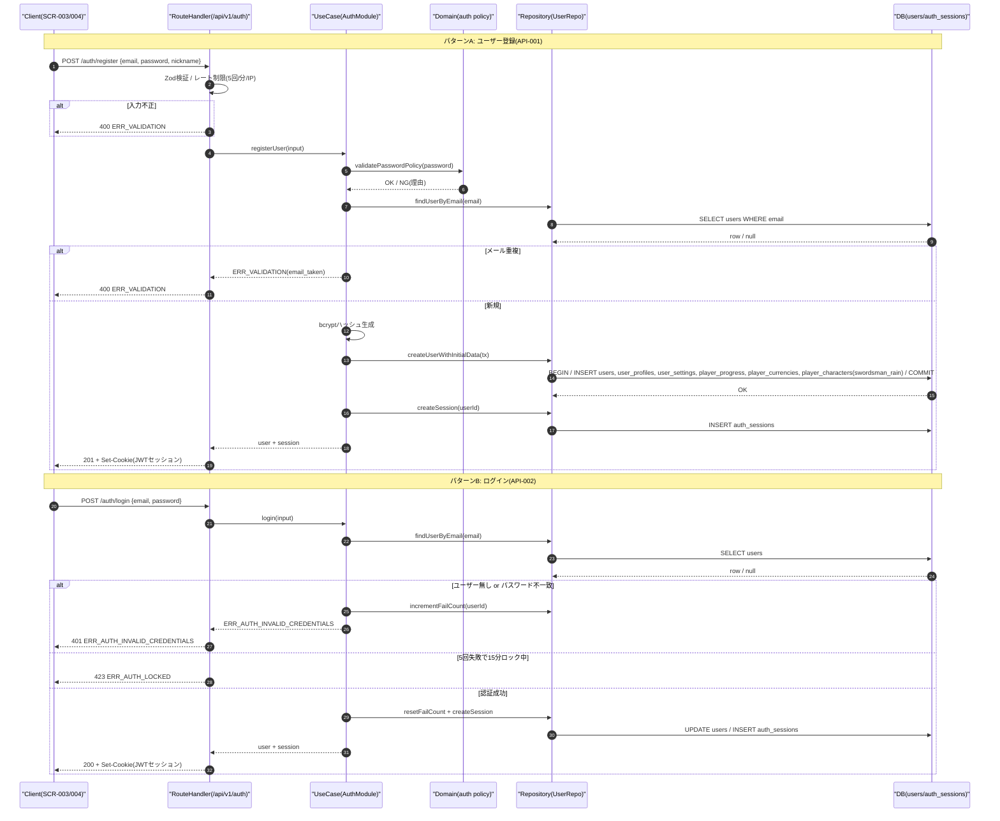
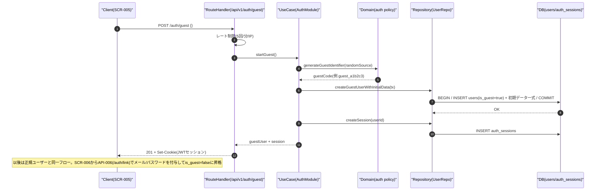
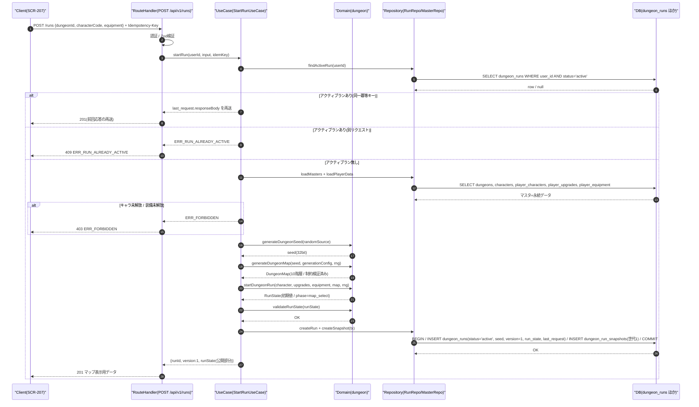
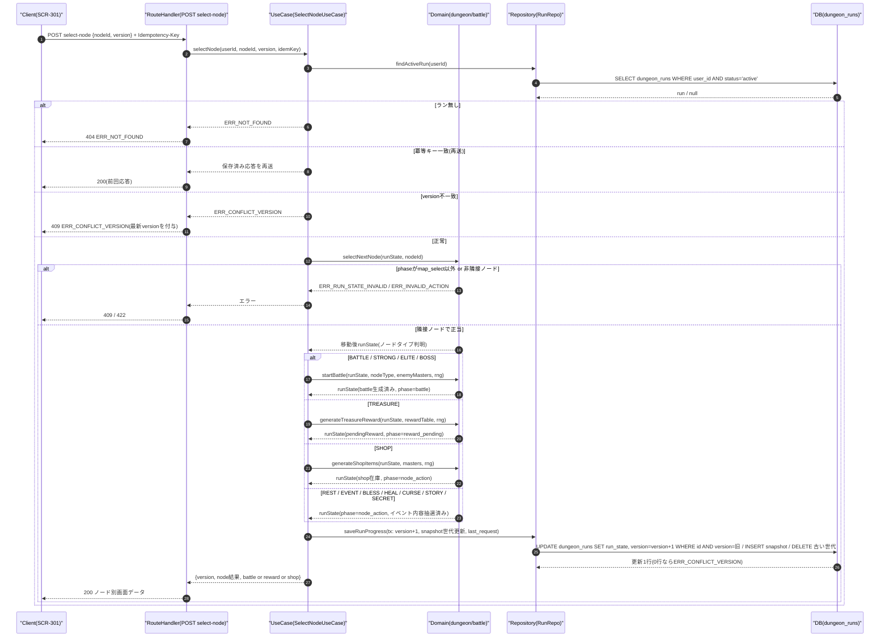
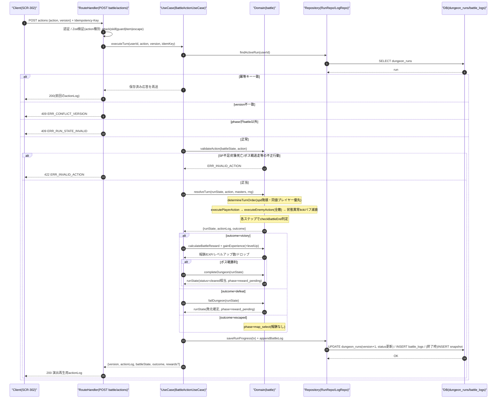
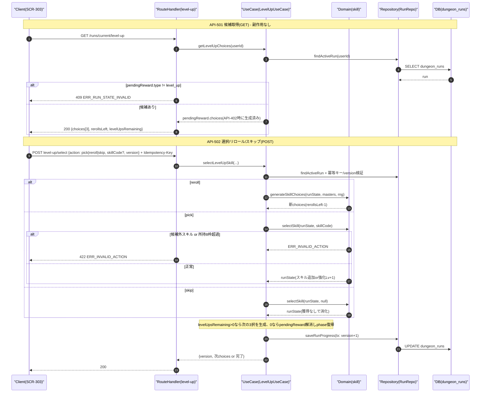
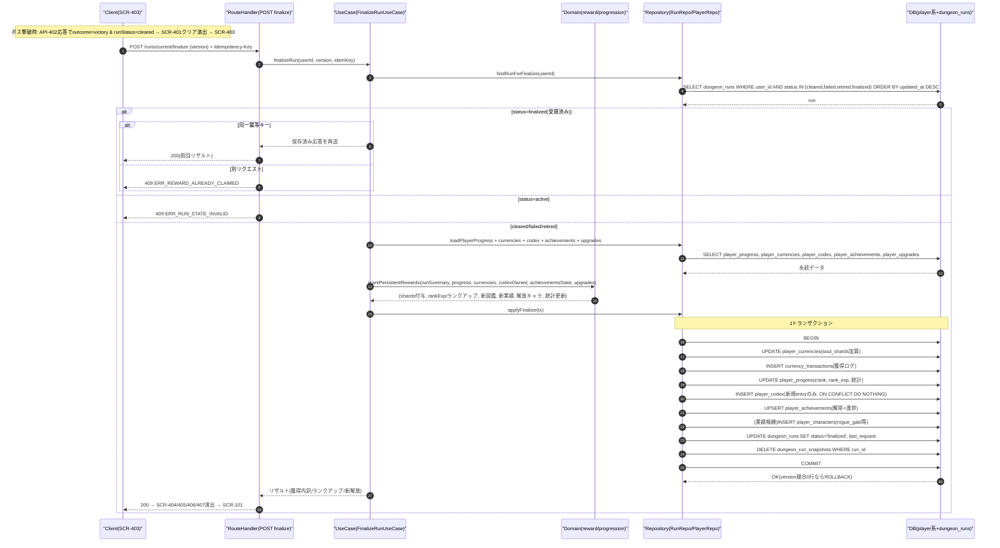
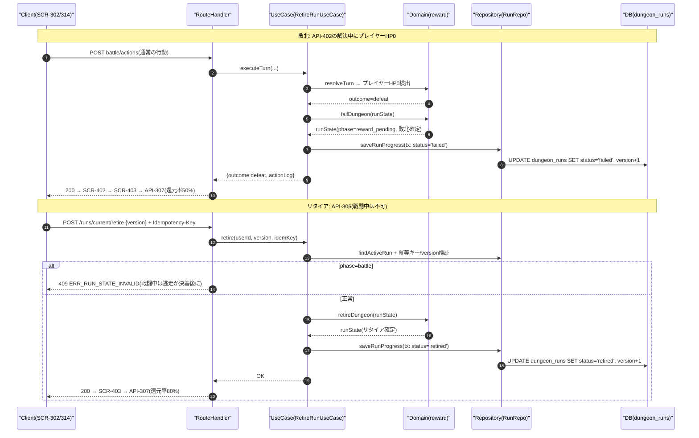
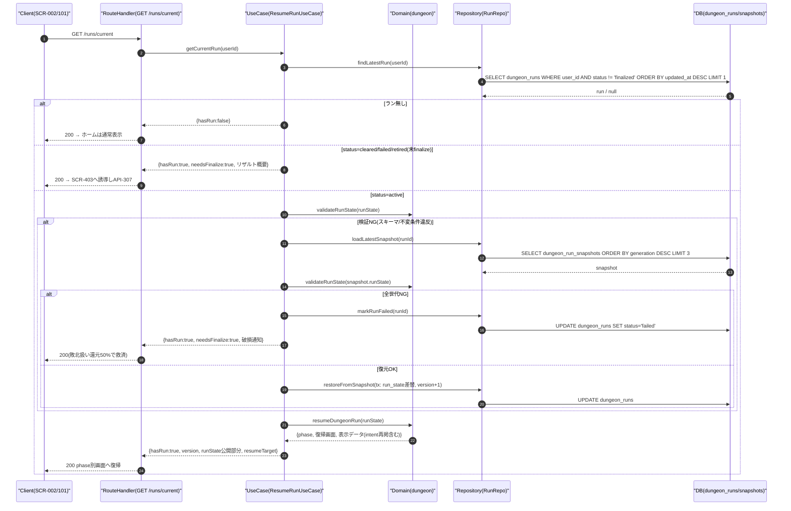

# 20_Detailed_Design.md — 詳細設計書（処理フロー・シーケンス・関数仕様）

## 目的

本書は「Rogue Chronicle」の主要処理について、レイヤ間のシーケンス・処理手順・エラー分岐を定義し（第1部）、
`src/domain/` 配下に実装する主要ゲームロジック31関数の仕様（引数・戻り値・処理手順・例外・トランザクション・冪等性・テスト観点・疑似コード）を定義する（第2部）。
API ID・テーブル名・計算式・run_state構造・エラーコードは CORE SPEC（設計共通仕様）と完全一致させる。

## 関連文書

- CORE SPEC（設計共通仕様 / 全設計書の単一情報源）
- 02_System_Requirements.md（システム要件）
- 05_Game_Design.md（ゲームバランス詳細）
- 09_Screen_Design.md（画面設計）
- 11_Module_Design.md（モジュール設計）
- 12_Database_Design.md（DB設計）
- 15_Save_Data_Design.md（セーブデータ設計）
- 21_API_Design.md（API設計）

## 前提となるレイヤ構成と責務

| レイヤ | 配置 | 責務 |
|---|---|---|
| Client | ブラウザ（React + TanStack Query + Zustand） | 画面表示・行動選択の送信のみ。ゲーム計算は行わない（DEC-007） |
| RouteHandler | `src/app/api/v1/**` | 認証確認・Zod入力検証・レート制限・エラー整形（`{ errorCode, message, details, traceId, timestamp }`） |
| UseCase | `src/server/usecases/` | APIごとのユースケース。**トランザクション境界**。冪等キー確認・楽観ロック検証・domain関数の編成 |
| Domain | `src/domain/` | **純粋関数のみ**。DBアクセス禁止・時刻/乱数は引数注入（Rng）。同一入力→同一出力 |
| Repository | `src/server/repositories/` | Prismaによる永続化。インターフェースはdomain/usecase側で定義 |
| DB | PostgreSQL (Neon) | dungeon_runs / dungeon_run_snapshots / battle_logs / player_* ほか |

---

# 第1部 主要処理の処理フロー・シーケンス

## 1.0 共通事項

- ラン系変更API（API-303, 305, 306, 307, 402, 502〜508）は `Idempotency-Key` ヘッダと `version`（run_state楽観ロック）を必須とする。
- 冪等キーの保存先は `dungeon_runs.last_request`（JSONB: `{ key, apiId, status, responseBody, savedAt }`）とし、**直近1件のみ**保持する（仮決定 → §1.15）。ラン系APIは1ユーザーにつき直列実行のため直近1件で十分。
- 乱数は run の `seed`（32bit）から mulberry32 で生成し、消費数 `rngCursor` を run_state に保存する（DEC-019）。UseCaseは処理開始時に `createRng(seed, rngCursor)` でRngを復元し、処理終了時に `rng.cursor` を run_state に書き戻す。
- 図中の participant は全図共通で Client / RouteHandler / UseCase / Domain / Repository / DB を用いる。

## 1.1 ユーザー登録〜ログイン（3パターン）

対象API: API-001（POST /auth/register）/ API-002（POST /auth/login）/ API-005（POST /auth/guest）
関連画面: SCR-003（ログイン）/ SCR-004（新規登録）/ SCR-005（ゲスト開始）

### 図1-1 ユーザー登録・ログイン

### 図1-2 ゲスト開始（API-005）

### 処理手順（番号付き）

1. Client が入力（email/password/なし）を送信する。
2. RouteHandler が Zod で入力検証し、IP単位のレート制限（5回/分）を確認する。違反時は 400 ERR_VALIDATION / 429 ERR_RATE_LIMITED。
3. UseCase がパスワードポリシー（8文字以上・英数含む。仮決定）を Domain で検証する。
4. 登録: email 一意性を確認（重複時 400）。ゲスト: is_guest=true の users 行を作成。
5. 1トランザクションで users / user_profiles / user_settings / player_progress / player_currencies / player_characters（初期キャラ swordsman_rain 解放）を作成する。
6. auth_sessions にセッションを作成し、JWTセッションCookie（有効期限: アクセス24h・最大30日）を発行する。
7. ログイン: bcrypt照合。失敗時は失敗回数を加算し、5回連続失敗で15分ロック（423 ERR_AUTH_LOCKED）。成功時は失敗回数リセット。
8. 応答後、Client はタイトル画面（SCR-002）→ホーム（SCR-101）へ遷移する。

### エラー分岐

| 条件 | エラー | HTTP |
|---|---|---|
| 入力不正・email重複 | ERR_VALIDATION | 400 |
| 認証情報不一致 | ERR_AUTH_INVALID_CREDENTIALS | 401 |
| ロック中 | ERR_AUTH_LOCKED | 423 |
| レート超過 | ERR_RATE_LIMITED | 429 |
| セッション期限切れ（以後の要認証API） | ERR_AUTH_SESSION_EXPIRED | 401 |

## 1.2 ダンジョン開始（API-303 POST /runs）

関連画面: SCR-204（キャラ選択）→ SCR-205（初期装備選択）→ SCR-207（出撃確認）→ SCR-301（マップ）
関連関数: generateDungeonSeed / generateDungeonMap / startDungeonRun / validateRunState / saveRunProgress

### 処理手順

1. 認証・入力検証（dungeonId 存在、characterCode 形式）。
2. アクティブラン検証: `status='active'` の dungeon_runs が存在するか確認する。存在し、かつ Idempotency-Key が保存済み `last_request.key` と一致すれば保存済み応答を再送（再送扱い）。不一致なら 409 ERR_RUN_ALREADY_ACTIVE（クライアントは API-304 で再開か API-306 でリタイアを選択）。
3. マスタ・永続データ取得: dungeons（generation_config）、characters、player_characters（解放確認）、player_upgrades（初期ステータス補正）、player_equipment（初期装備の所有確認）。未解放なら 403 ERR_FORBIDDEN。
4. `generateDungeonSeed` で 32bit seed を生成する（CSPRNG注入）。
5. `generateDungeonMap(seed, config, rng)` で10階層のノードマップを生成する（生成制御ルールは §2.2 参照）。
6. `startDungeonRun` で初期 RunState を構築する（キャラ初期値×永続強化補正、初期ゴールド、開始レリック、position={floor:1, nodeId:"f1n0", phase:"map_select"}、rngCursor）。
7. `validateRunState` でスキーマ・不変条件を検証する（失敗時 500 ERR_INTERNAL としてログ出力、DBには書かない）。
8. 1トランザクションで dungeon_runs（version=1）と dungeon_run_snapshots（世代1）を INSERT し、last_request に応答を保存する。
9. 201 で runId・version・公開用 run_state（マップ、キャラ状態）を返す。Client は SCR-301 を表示する。

### エラー分岐

- 未認証: 401 ERR_AUTH_UNAUTHORIZED / 入力不正: 400 ERR_VALIDATION / dungeonId不存在: 404 ERR_NOT_FOUND
- アクティブラン既存: 409 ERR_RUN_ALREADY_ACTIVE / キャラ・装備未解放: 403 ERR_FORBIDDEN
- DB書き込み失敗: 500 ERR_INTERNAL（トランザクションはロールバック、ランは未作成のままで安全）

## 1.3 次ノード選択（API-305 POST /runs/current/select-node）

関連画面: SCR-301 → 各ノード画面（SCR-302/305/306/307/308）
関連関数: selectNextNode / startBattle / generateTreasureReward / generateShopItems / saveRunProgress

### 処理手順

1. 認証後、アクティブランを取得（無ければ 404）。
2. 冪等キー確認: `last_request.key` と一致すれば保存済み応答を再送して終了。
3. version 検証: リクエストの version と DB の version が不一致なら 409 ERR_CONFLICT_VERSION（応答に最新 version と run_state を含め、クライアントは再取得）。
4. `selectNextNode` で検証: (a) `position.phase === "map_select"` であること（違反: 409 ERR_RUN_STATE_INVALID）、(b) 指定 nodeId が現在ノードから edges で接続された次階層ノードであること（違反: 422 ERR_INVALID_ACTION）。
5. 移動確定: position を更新し、ノードの visited=true。
6. ノードタイプ分岐:
   - BATTLE/STRONG/ELITE/BOSS → `startBattle` が敵編成（階層×タイプ別の重み抽選、敵ステータスは §5.4 敵式で算出）と行動予告を生成し phase=battle。
   - TREASURE → `generateTreasureReward` が報酬を抽選し pendingReward に格納、phase=reward_pending（受領は API-503）。
   - SHOP → `generateShopItems` が在庫を生成し run_state.shop に格納、phase=node_action。
   - REST → 二択（HP50%回復 / スキル1つ強化）の提示のみ、phase=node_action（実行は API-505）。
   - EVENT/BLESS/HEAL/CURSE/SECRET → random_events から抽選し選択肢を提示、phase=node_action（選択は API-506）。SECRETはEVENT扱いの上位報酬テーブル。
   - STORY → stories からテキスト取得、phase=node_action（閲覧後クライアントが確認を送りmap_selectへ）。
7. `saveRunProgress` で楽観ロック付き UPDATE（version+1）+ snapshot 世代更新 + last_request 保存を1トランザクションで行う。
8. 200 でノード別の画面データを返す。

### エラー分岐

- ラン無し: 404 / version不一致: 409 ERR_CONFLICT_VERSION / phase不正: 409 ERR_RUN_STATE_INVALID
- 非隣接・訪問済み階層への逆行: 422 ERR_INVALID_ACTION / 冪等キー重複（別ボディ）: 409 ERR_DUPLICATE_REQUEST

## 1.4 戦闘1ターンの行動実行（API-402 POST /runs/current/battle/actions）

関連画面: SCR-302 / 関連関数: determineTurnOrder / executePlayerAction / selectEnemyAction / executeEnemyAction / applyStatusEffect / checkBattleEnd / calculateBattleReward / gainExperience / levelUp / completeDungeon / failDungeon / saveRunProgress

### 処理手順

1. 認証・入力検証（action.type と対象・スキルコードの形式）。
2. 冪等キー確認: 一致すれば前回応答（actionLog含む）を再送。処理は一切実行しない。
3. version 検証: 不一致は 409 ERR_CONFLICT_VERSION。`position.phase !== "battle"` は 409 ERR_RUN_STATE_INVALID。
4. 行動正当性検証: スキル所持・SPコスト充足・対象生存・アイテム所持数・逃走可否（ボス/エリートは不可）。違反は 422 ERR_INVALID_ACTION。
5. ターン解決（Domain純粋関数、Rngはseed+rngCursorから復元）:
   1. `determineTurnOrder` で spd 降順に行動順を決定（同値はプレイヤー優先）。以下、代表ケース（プレイヤー先行）で記す。
   2. `executePlayerAction`: 麻痺30%/スタンの行動不能判定 → 行動種別ごとに解決（通常攻撃 / スキル効果行の順次適用 / 防御 / アイテム / 逃走判定）。命中→クリティカル→ダメージの順で判定し actionLog に記録。
   3. `checkBattleEnd`: 全滅・逃走成功なら以降スキップ。
   4. 各敵について `selectEnemyAction`（予告済みintentを実行し、次ターンのintentを再抽選）→ `executeEnemyAction`。プレイヤーHP0で即 defeat。
   5. ターン終了処理: 毒（maxHp8%）・火傷（maxHp5%）の状態異常tick → regen回復 → バフ/デバフ/状態異常の残りターン減算・期限切れ削除 → SP+2回復（リリアは+3）。tickダメージでもHP0判定を行う。
   6. `checkBattleEnd` で最終判定。継続なら turnNo+1、新intentを応答に含める。
6. 終了判定後の処理:
   - victory: `calculateBattleReward`（ゴールド・ソウルシャード・EXP・装備/レリックドロップ）→ `gainExperience`（レベルアップ発生時は `levelUp` を回数分適用し pendingReward.type="level_up" を設定、phase=reward_pending。ドロップのみなら同様に reward_pending、何も無ければ map_select）。
   - ボス戦victory: さらに `completeDungeon` で status=cleared・クリアボーナス加算・phase=reward_pending（リザルトへ）。
   - defeat: `failDungeon` で status=failed・phase=reward_pending（敗北リザルトへ）。
   - escaped: battle を破棄し phase=map_select（ノードは未訪問のまま再選択不可、別ノードを選ぶ。仮決定）。
7. `saveRunProgress`（version+1・battle_logs追記・戦闘終了時はsnapshot世代更新）を1トランザクションで実行。
8. 200 で actionLog（演出再生用の順序付きイベント列）・戦闘状態・outcome・報酬を返す。

### エラー分岐

- 401 / 404（ラン無し）/ 409 ERR_CONFLICT_VERSION / 409 ERR_RUN_STATE_INVALID / 409 ERR_DUPLICATE_REQUEST（同一キーで処理中: 二重タブ対策）/ 422 ERR_INVALID_ACTION / 500 ERR_INTERNAL（ロールバックし、クライアントはAPI-401で再取得）

## 1.5 スキル3択の生成と選択（API-501 GET / API-502 POST）

関連画面: SCR-303/SCR-304 / 関連関数: generateSkillChoices / selectSkill

### 処理手順

1. レベルアップ発生時（API-402内）に `generateSkillChoices` が3候補を生成し pendingReward に保存する（GETを何度呼んでも同じ候補が返る＝冪等）。
2. API-501 は pendingReward.choices をそのまま返す。type が level_up でなければ 409 ERR_RUN_STATE_INVALID。
3. API-502 pick: 候補内の skillCode か検証 → 未所持なら skills[] に追加（8枠超過時は 422、クライアントは削除対象を選び直す）。所持済みなら強化 Lv+1（上限3、上限到達候補はそもそも生成時に除外）。
4. API-502 reroll: rerollsLeft > 0 を検証（0なら 422）→ `generateSkillChoices` を再実行し rerollsLeft−1。
5. API-502 skip: 候補を破棄して1回分を消化する。
6. levelUpsRemaining を1減算。残があれば次の3候補を生成して応答に含める。0なら pendingReward を解消し、phase を戦闘後の遷移先（ボス撃破後なら reward_pending 維持、通常は map_select）へ戻す。
7. saveRunProgress（version+1）で保存し応答。

## 1.6 ダンジョンクリア〜リザルト確定〜永続報酬付与（API-307 POST /runs/current/finalize）

関連画面: SCR-401 → SCR-403 → SCR-404/405/406/407 → SCR-101
関連関数: completeDungeon / grantPersistentRewards

### 処理手順

1. ボス撃破は API-402 内で確定する: `checkBattleEnd`=victory かつ BOSS ノード → `completeDungeon` が earned にクリアボーナスを加算し、UseCase が `dungeon_runs.status='cleared'`・phase=reward_pending で保存する。クライアントは SCR-401 → SCR-403 を表示する。
2. API-307 で status を確認する: finalized なら冪等キー一致時のみ前回応答を再送、不一致なら 409 ERR_REWARD_ALREADY_CLAIMED。active なら 409 ERR_RUN_STATE_INVALID。
3. `grantPersistentRewards`（純粋関数）が付与内容を算出する: ソウルシャード = floor(earned.soulShards × 還元率 × (1 + 永続強化ボーナス))（クリア100%+クリアボーナス / リタイア80% / 敗北50%）、ランクEXP、ランクアップ判定（expToRank(R)=100×R^1.8、上限50）、図鑑新規（敵/スキル/レリック/装備/キャラ）、実績判定（累計ラン10回→ガルド解放 等）、統計更新。
4. **1トランザクション**で player_currencies / currency_transactions / player_progress / player_codex / player_achievements /（実績報酬の）player_characters / dungeon_runs(status='finalized') / dungeon_run_snapshots 削除 を実行する。途中失敗は全ロールバック（付与ゼロのまま再実行可能＝at-most-once + リトライで exactly-once 相当）。
5. 200 でリザルト内訳を返す。battle_logs は削除せず30日保持（検証用）。dungeon_runs 行も finalized のまま30日保持後にバッチ削除する（仮決定）。

## 1.7 敗北・リタイア処理（API-402敗北分岐 / API-306 POST /runs/current/retire）

関連画面: SCR-402（敗北）/ SCR-314（リタイア確認）→ SCR-403
関連関数: failDungeon / retireDungeon / grantPersistentRewards

### 処理手順

1. 敗北確定は API-402 内のみで発生する（サーバー権威）。`failDungeon` が run_state に敗北情報（到達階層・撃破数）を記録し status='failed' で保存する。
2. リタイアは SCR-313/314 から API-306 で実行する。phase=battle 中は 409（戦闘の決着または逃走後に可能。仮決定）。`retireDungeon` が status='retired' 相当を確定する。
3. いずれも**この時点では永続付与を行わない**。一時データ（run_state）は finalize まで保持し、獲得内訳の表示に使う。
4. クライアントは SCR-403 から API-307 を呼ぶ。§1.6 の同一トランザクションで部分付与（敗北50% / リタイア80%）が行われ、snapshot削除・status='finalized' で一時データの役目が終わる。
5. finalize を呼ばずに離脱した場合: 次回ログイン時の API-304 が status IN (cleared,failed,retired) のランを検出し、リザルト画面へ誘導する（付与漏れ防止）。

## 1.8 途中再開（再ログイン → API-304 GET /runs/current）

関連関数: resumeDungeonRun / validateRunState

### 処理手順

1. 再ログイン後、ホーム表示前に Client が API-304 を呼ぶ（ホームのAPI-101応答にも hasActiveRun フラグを含め、「冒険を再開」ボタンを出す）。
2. status != 'finalized' の最新ランを取得。無ければ通常ホーム。
3. cleared/failed/retired（finalize未実行）ならリザルト画面へ誘導する（§1.7手順5）。
4. active の場合 `validateRunState` で整合性検証。破損時は dungeon_run_snapshots の直近世代から順に復元を試み、全世代不能なら敗北扱いで救済する。
5. `resumeDungeonRun` が phase から復帰先を導出する:

| position.phase | 復帰画面 | 補足 |
|---|---|---|
| map_select | SCR-301 ダンジョンマップ | 現在階層・選択可能ノードをハイライト |
| battle | SCR-302 戦闘画面 | battle状態・敵intent・turnNoを再掲（API-401でも取得可） |
| node_action | ノード種別の画面（SCR-306/307/308等） | shop在庫・イベント選択肢はrun_stateから復元 |
| reward_pending | SCR-303（level_up）/ SCR-305（treasure）等 | pendingReward.typeで分岐 |

6. GET のため副作用なし（冪等）。version を返し、以後の変更APIに引き継ぐ。

## 1.9 簡潔フロー（番号付き手順+分岐条件）

### 1.9.1 ホーム表示（API-101 GET /home）

1. 認証確認（NG: 401）。
2. player_progress / player_currencies / player_characters / announcements / アクティブラン有無を並列取得（Promise.all、読み取りのみでトランザクション不要）。
3. 応答: ランク・EXPゲージ・ソウルシャード・選択中キャラ・お知らせ・hasActiveRun / needsFinalize フラグ。
4. 分岐: hasActiveRun=true → 「冒険を再開」導線 / needsFinalize=true → リザルト誘導 / いずれも無し → 「ダンジョンへ」導線。

### 1.9.2 宝箱報酬生成・受領（生成=API-305内、受領=API-503 POST /runs/current/treasure/open）

1. 生成（§1.3手順6）: `generateTreasureReward` が reward_tables から抽選（ゴールド40% / 装備30% / レリック20% / 消耗品10%。仮決定、階層で量スケール）。結果を pendingReward に保存＝開封前に確定済み（リロード再抽選チート防止）。
2. API-503 で冪等キー/version検証（§1.15共通フロー）。
3. 分岐: pendingReward.type != 'treasure' → 409 ERR_RUN_STATE_INVALID / claimed=true → 409 ERR_REWARD_ALREADY_CLAIMED。
4. 内容を run_state に反映（gold加算 / equipment取得（装備選択はAPI-507）/ relics追加（重複レリックはゴールド変換）/ items加算）。
5. pendingReward.claimed=true → phase=map_select。saveRunProgress（version+1）。

### 1.9.3 ショップ商品生成・購入（生成=API-305内、購入=API-504 POST /runs/current/shop/purchase）

1. 生成: `generateShopItems` が5枠を抽選（消耗品2 / 装備1〜2 / レリック0〜1。仮決定）。価格 = 基準価格 × (1 + 0.10×(floor−1)) × rand(0.9〜1.1)（仮決定）。run_state.shop に保存。
2. API-504 で冪等キー/version検証。入力: slotIndex。
3. 分岐: phase != node_action or 現在ノードがSHOPでない → 409 ERR_RUN_STATE_INVALID / slot売切れ → 422 ERR_INVALID_ACTION / gold < price → 422 ERR_INSUFFICIENT_GOLD。
4. `purchaseShopItem`: gold減算 → 商品を所持へ反映 → slot.soldOut=true。
5. saveRunProgress。退店はクライアント操作のみ（サーバーはphase=map_selectへ戻すleaveアクションをAPI-504のaction="leave"で受ける。仮決定）。

### 1.9.4 イベント選択（API-506 POST /runs/current/event/choose）

1. ノード進入時（API-305）に random_events から抽選し、選択肢（random_event_choices）を run_state.event に保存済み。
2. API-506 で冪等キー/version検証。入力: choiceId。
3. 分岐: phase != node_action or event未保持 → 409 ERR_RUN_STATE_INVALID / choiceId不正 → 422 ERR_INVALID_ACTION / 選択肢の要求コスト（gold等）不足 → 422 ERR_INSUFFICIENT_GOLD。
4. `executeRandomEvent`: 選択肢の成功率で成否抽選（Rng）→ 効果適用（HP増減 / gold増減 / レリック / スキル / 状態変化 / 戦闘発生）。戦闘発生時は `startBattle` に接続し phase=battle。
5. 結果テキストと差分を応答。phase=map_select（戦闘発生時を除く）。saveRunProgress。

### 1.9.5 休憩（API-505 POST /runs/current/rest）

1. RESTノード進入済み（phase=node_action、現在ノード=REST）を検証。違反: 409 ERR_RUN_STATE_INVALID。
2. 入力: choice = "heal" | "upgrade_skill"（+ skillCode）。
3. 分岐: heal → hp = min(maxHp, hp + floor(maxHp×0.5)) / upgrade_skill → 対象スキルLv+1（未所持・Lv3到達は 422 ERR_INVALID_ACTION）。
4. 実行済みフラグを現在ノードに記録（再実行は 409 ERR_RUN_STATE_INVALID）→ phase=map_select。
5. saveRunProgress（version+1）。

### 1.9.6 セーブ共通処理（saveRunProgress = 各変更API内の保存）

1. 呼び出し元UseCaseがトランザクションを開始する（Prisma `$transaction`）。
2. `validateRunState` で保存前検証（NG時は例外→ロールバック、ERR_INTERNAL）。
3. `UPDATE dungeon_runs SET run_state=$1, version=version+1, status=$2, rng_cursor同期, last_request=$3, updated_at=now() WHERE id=$4 AND version=$expected` — 更新0行なら ERR_CONFLICT_VERSION で全体ロールバック。
4. チェックポイント（ノード遷移確定時・戦闘終了時・ラン終了時）では dungeon_run_snapshots に世代INSERTし、古い世代をDELETEして直近3世代を維持する。
5. 戦闘APIでは battle_logs を同一トランザクションで追記する。
6. コミット後に新 version を応答へ含める（クライアントは常に最新versionを保持する）。

### 1.9.7 二重実行防止（冪等キー処理の共通フロー）

1. 対象: ラン系変更API（303, 305, 306, 307, 402, 502〜508）。ヘッダ `Idempotency-Key`（UUID v4、クライアントが操作ごとに生成）必須。欠落は 400 ERR_VALIDATION。
2. ラン取得時に `last_request` を確認する:
   - key一致 かつ status='completed' → 保存済み responseBody をそのまま再送（**処理は再実行しない**）。
   - key一致 かつ status='processing' → 409 ERR_DUPLICATE_REQUEST（前リクエスト処理中。二重タブ・二重クリック対策）。
   - key不一致 → 新規リクエストとして処理継続。
3. 処理開始時に `last_request={key, apiId, status:'processing'}` を version+1 と同時に書けない（本処理と同一Txで書くため）ので、実際には楽観ロックが一次防壁となる: 同時に来た2リクエストは同じ expected version を持ち、後勝ちの UPDATE が0行となり 409 ERR_CONFLICT_VERSION で弾かれる（仮決定: processing状態の事前マークは行わず、楽観ロック+完了後のlast_request保存の2段構えとする）。
4. 処理成功時、last_request を `{key, apiId, status:'completed', responseBody, savedAt}` で run_state 更新と同一トランザクション内に保存する。
5. ネットワーク断でクライアントが応答を受け取れなかった場合、同一キーで再送すれば手順2で前回応答が返り、状態は二重に進まない。

---
<!-- CHUNK2 -->
