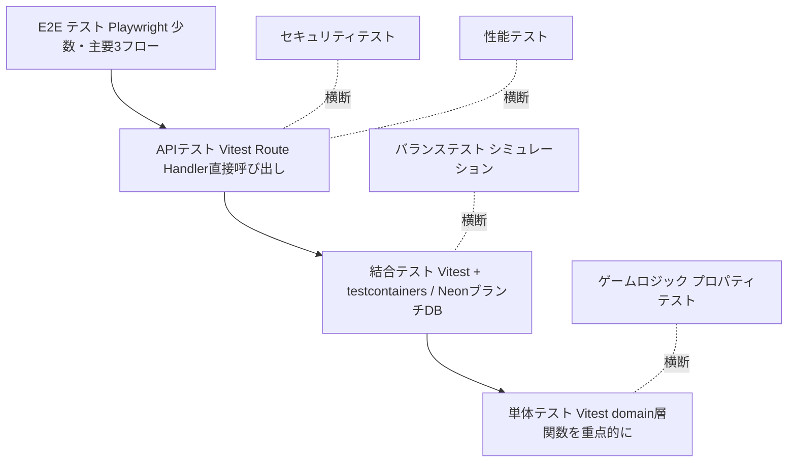

# 21. テスト設計書（Test Design）

## 1. 目的と位置づけ

本書は「Rogue Chronicle」（ローグライトRPG / Next.js + TypeScript + Neon PostgreSQL + Vercel）のテスト戦略・テストレベル・必須テストケース・CI組み込み・テストデータ戦略を定義する。

- 対象範囲: MVP（35章の範囲）に含まれる全機能。将来機能（PvP・ミッション等）はテスト対象外とし、追加時に本書を改訂する
- 品質ゴール:
  - サーバー権威（DEC-007）が破れないこと（クライアント改ざんで戦闘結果・報酬を操作できない）
  - ラン中データ（dungeon_runs.run_state + version、DEC-011）の整合性が常に保たれること
  - シード付きPRNG（DEC-019）による再現性が保証されること
  - 非機能目標値（API p95 500ms以内、戦闘系800ms以内）を満たすこと

### 関連文書
- CORE_SPEC（共通仕様）/ 02_System_Requirements.md / 10_System_Architecture.md / 12_Database_Design.md / 13_API_Design.md / 15_Save_Data_Design.md / 22_Security_Design.md / 23_Logging_Monitoring.md / 24_CI_CD_Design.md

---

## 2. テスト戦略（テストピラミッド）

domain層（`src/domain/`、Next.js/Prisma非依存の純粋関数）を最も厚くテストし、上位レイヤに行くほど件数を絞る。加えてゲーム固有の「プロパティテスト」「バランステスト」を横串で実施する。



### 2.1 テストレベル一覧

| レベル | ツール | 対象 | 実行環境 | 実行タイミング |
|---|---|---|---|---|
| 単体テスト | Vitest | `src/domain/` の純粋関数（calculateDamage, generateDungeonMap, checkBattleEnd 等30関数）、`src/schemas/` のZodスキーマ、ユーティリティ | Node（DB不要） | 毎push |
| 結合テスト | Vitest + testcontainers（ローカル）/ NeonブランチDB（CI、仮決定） | `src/server/usecases/` + `src/server/repositories/`（トランザクション・楽観ロック・冪等性を実DBで検証） | PostgreSQL実DB | 毎push |
| APIテスト | Vitest + supertest相当（Next.js Route Handlerを`Request`オブジェクトで直接呼び出し） | /api/v1 全エンドポイント（API-001〜API-604）の認証・バリデーション・エラー形式 | 実DB + モック認証 | 毎push |
| E2Eテスト | Playwright | 主要3フロー（後述）＋クリティカルパス | Vercel Preview環境 or ローカル `next start` | PR時 + main merge時 |
| UIテスト | Playwrightコンポーネントテスト + スクリーンショット比較 | 主要13画面（ワイヤーフレーム必須画面: SCR-002, SCR-101, SCR-204, SCR-201, SCR-207, SCR-301, SCR-302, SCR-303, SCR-308, SCR-403, SCR-106, SCR-105, SCR-116） | ブラウザ（chromium + webkit） | PR時 |
| ゲームロジックテスト | Vitest + fast-check（プロパティテスト、仮決定） | シード固定の再現性・マップ生成制約・計算式の不変条件 | Node | 毎push（縮小版）+ 夜間（フル版） |
| バランステスト | シミュレーションスクリプト（`scripts/simulate-balance.ts`） | オートプレイ1000回による勝率・平均到達階層計測 | Node | 週次 + バランス変更PR時に手動 |
| セキュリティテスト | Vitest（APIテストの一部として不正リクエスト網羅）+ 依存監査 | 認可・改ざん・冪等性・レート制限 | 実DB | 毎push |
| 性能テスト | k6（仮決定、代替: autocannon） | 主要API p95測定 | Vercel Preview + NeonブランチDB | リリース前 + 週次 |
| 回帰テスト | 上記全スイート | 全体 | CI | main merge時に全実行 |

### 2.2 E2E 主要3フロー（Playwright）

| フロー | 内容 |
|---|---|
| E2E-1 登録→クリア | 新規登録（SCR-004 / API-001）→ ログイン → ダンジョン開始（API-303）→ ノード選択（API-305）→ 戦闘（API-401/402）→ ボス撃破 → リザルト確定（API-307）→ ソウルシャード反映確認 |
| E2E-2 ゲスト→敗北 | ゲスト開始（API-005）→ ラン開始 → 戦闘でHP0 → 敗北画面（SCR-402）→ ソウルシャード50%獲得確認 → 一時データ破棄確認 |
| E2E-3 再開 | ラン中（戦闘途中）でブラウザリロード → API-304で復元 → 戦闘画面（SCR-302）に同一状態で復帰 → 継続してクリアまたはリタイア |

※E2Eのボス撃破はテスト用シード（後述 7.2）で最短経路・弱体化敵構成を固定し、実行時間を1フロー3分以内に抑える。

### 2.3 ゲームロジックテスト（プロパティテスト）の不変条件

fast-check等で乱数入力を大量生成し、以下の性質を検証する。

| ID | 性質 | 実行回数 |
|---|---|---|
| PROP-01 | 同一seedで `generateDungeonMap` は常に同一マップを返す（決定性） | 1000 seed |
| PROP-02 | 1000回ラン生成でボス到達可能パスが100%存在する（階層1→階層10の連結性） | 1000 seed |
| PROP-03 | 階層5と階層9にRESTが必ず1個以上存在する | 1000 seed |
| PROP-04 | SHOPはマップ全体で1〜2個 / ELITEは階層3以降のみ / 同一タイプが同一パス上に3連続しない | 1000 seed |
| PROP-05 | `calculateDamage` の結果は常に1以上の整数（`max(1, floor(...))`） | 10000 ケース |
| PROP-06 | 命中率は clamp(95 + acc - eva, 50, 100) の範囲内（50未満・100超にならない） | 10000 ケース |
| PROP-07 | 状態異常成功率は statusRes=100 で0%、statusRes=0 で基本成功率と一致 | 全異常5種×境界値 |
| PROP-08 | `expToNext(L) = floor(20 × L^1.5)` がL=1〜20で単調増加 | 全レベル |
| PROP-09 | 同一seed + 同一行動列で戦闘結果（executePlayerAction/executeEnemyActionの連鎖）が完全一致（リプレイ再現性） | 100 戦闘 |
| PROP-10 | `generateSkillChoices` の候補3件は所持上限・レア度重み（common60/rare30/epic10）に従い、常にプレイヤーが選択可能な候補を含む | 1000 ケース |
| PROP-11 | run_state を `validateRunState` に通した結果、生成直後・各操作後の状態が常にスキーマ妥当（schemaVersion=1） | 各usecase後 |
| PROP-12 | 属性相性は火→風/風→水/水→火のみ1.25倍、逆방向0.75倍、無は常に1.0倍 | 全16組合せ |

### 2.4 バランステスト（シミュレーション）

- スクリプト: `scripts/simulate-balance.ts`。domain層関数のみを使用（DB不要）し、オートプレイAI 2種で1000ラン実行
  - 初見AI: 通常攻撃中心・回復軽視・ノードランダム選択
  - 熟練AI: SP効率最適・REST/SHOP優先・属性相性考慮
- 計測指標: 勝率 / 平均到達階層 / 平均ターン数 / 平均獲得ソウルシャード / キャラ別勝率差
- 目標値: 初見勝率10〜20% / 熟練勝率40〜60% / キャラ間勝率差±10ポイント以内（仮決定）
- 目標逸脱時はCIを失敗させず警告レポート出力（バランスは設計判断のため人間がレビュー）

### 2.5 カバレッジ目標

| 対象 | 行カバレッジ | 備考 |
|---|---|---|
| `src/domain/` | 90%以上 | ブランチカバレッジも85%以上（仮決定）。CIで閾値未達は失敗 |
| `src/server/usecases/` | 80%以上 | 結合テストで計測 |
| プロジェクト全体 | 70%以上 | UIコンポーネントの単純表示は除外可（`/* v8 ignore */` は理由コメント必須） |

計測: Vitest `--coverage`（v8 provider）。CIでlcovレポートをアーティファクト保存。

---

## 3. 必須テストケース表

自動化レベル: **A**=CI自動（毎push）/ **A2**=CI自動（PR/夜間）/ **M**=手動（リリース前チェックリスト）。

### 3.1 コア15件（ユーザー指定・必須）

| TC | 分類 | 前提 | 手順 | 期待結果 | 自動化 |
|---|---|---|---|---|---|
| TC-001 | ラン開始・正常 | 認証済みユーザー、アクティブなランなし、swordsman_rain解放済み | API-303 POST /runs（dungeonCode=forgotten_ruins, characterCode=swordsman_rain, Idempotency-Key付与） | 201。dungeon_runs作成（status=active, seed保存, version=1）。run_state.position.floor=1、階層1は開始戦闘ノード1個。応答にrunId・マップ・初期ステータス | A |
| TC-002 | ラン開始・重複禁止 | TC-001実施後（status=activeのランが存在） | 再度 API-303 POST /runs（別のIdempotency-Key） | 409 ERR_RUN_ALREADY_ACTIVE。新規ランは作成されない（dungeon_runsのactive行が1件のまま） | A |
| TC-003 | ノード選択・不正拒否 | ラン中、現在位置=f3n2（phase=map_select） | API-305で現在ノードとedgesで接続していないnodeId（例: f5n1、f3n1、存在しないID）を送信 | 422 ERR_INVALID_ACTION。run_state.positionは不変、versionも不変 | A |
| TC-004 | 戦闘・敗北 | 戦闘中（phase=battle）、プレイヤーHPが敵の次攻撃で0になる状態 | API-402で行動実行し敵ターンでHP0 | 応答に battleResult=defeat。dungeon_runs.status=failed。以降のラン系API（305/402等）は409 ERR_RUN_STATE_INVALID。API-307でリザルト確定可能 | A |
| TC-005 | 戦闘・勝利 | 戦闘中、敵残り1体HP僅少 | API-402で攻撃し敵全滅 | 応答に battleResult=victory、獲得EXP・ドロップ・ゴールドを含む（サーバー計算）。phase=reward_pending または map_select に遷移 | A |
| TC-006 | 報酬・二重取得禁止 | phase=reward_pending（pendingReward未受領） | API-503（宝箱開封）等で報酬受領 → 同一報酬に対し再度受領リクエスト（別Idempotency-Key） | 1回目200・報酬付与。2回目409 ERR_REWARD_ALREADY_CLAIMED。ゴールド/アイテムは1回分のみ加算 | A |
| TC-007 | ショップ・所持金不足 | SHOPノード滞在中、gold=10、商品価格50 | API-504 POST /runs/current/shop/purchase（itemIndex指定） | 422 ERR_INSUFFICIENT_GOLD。goldは10のまま、所持品不変 | A |
| TC-008 | スキル3択・候補外拒否 | レベルアップ直後（API-501で候補3件取得済み） | API-502で候補3件に含まれないskillCodeを送信 | 422 ERR_INVALID_ACTION。スキル未追加、レベルアップ選択状態は維持（再選択可能） | A |
| TC-009 | 改ざん・ダメージ値非受理 | 戦闘中 | (1) API-402のリクエストスキーマに damage/hp/reward 等の結果系フィールドが存在しないことをZodスキーマテストで検証 (2) `{actionType:"attack", targetIndex:0, damage:99999, enemyHp:0}` のような余剰フィールド付きリクエストを送信 | (1) スキーマは actionType/targetIndex/skillCode/itemCode 等の「選択」のみ許可 (2) 余剰フィールドはZod `strict()` で400 ERR_VALIDATION（仮決定: strip でなく strict で明示拒否）。ダメージはサーバー計算値のみ | A |
| TC-010 | 再開・戦闘途中 | 戦闘3ターン目まで進行後、セッションのみ維持しクライアント状態破棄（リロード相当） | API-304 GET /runs/current → API-401 GET /runs/current/battle | run_state.battle（enemies, turnNo=3, rngCursor, effects）が保存時と完全一致で復元。以降の行動が継続可能で、PRNGカーソルにより乱数列も継続 | A + E2E-3 |
| TC-011 | 楽観ロック・旧version拒否 | ラン中、現在 version=5 | version=4 を指定してラン系変更API（API-402等）を送信 | 409 ERR_CONFLICT_VERSION。run_state不変。応答に現在versionを含み、クライアントはAPI-304で再取得して復帰 | A |
| TC-012 | 冪等リトライ安全 | ラン中 | API-402を Idempotency-Key=K1 で送信 → 応答受信前の通信失敗を想定し、同一K1・同一ボディで再送 | 2回目は初回と同一応答（記録済みレスポンス返却）。戦闘状態は1回分のみ進行。同一K1で異なるボディの場合は409 ERR_DUPLICATE_REQUEST | A |
| TC-013 | ボス撃破・クリア報酬 | 階層10ボス（ruin_guardian）戦、撃破直前 | API-402でボス撃破 → API-307 POST /runs/current/finalize | status=cleared→finalized。ソウルシャード100%+クリアボーナス付与、ランクEXP付与、currency_transactionsに増加記録、実績・図鑑（player_codex）更新。finalize再送は冪等（二重付与なし） | A |
| TC-014 | 敗北・一時データ破棄 | status=failed のラン | API-307でリザルト確定後、API-304 GET /runs/current | ソウルシャード50%付与後、アクティブなランなし（404 ERR_NOT_FOUND または `run: null`）。run_state内のゴールド・一時スキル・ラン内装備は消滅。dungeon_runs行はstatus=finalizedで履歴保持 | A |
| TC-015 | 敗北・永続データ保持 | TC-014と同一（敗北前にソウルシャード残高・ランク・図鑑・永続強化を記録） | 敗北→finalize後にAPI-102/103/601等で永続データ取得 | player_currencies（既存残高+敗北時50%分）、player_progress（ランク/EXP加算）、player_codex（ラン中に遭遇した敵の図鑑登録維持）、player_upgrades が全て保持・正しく加算 | A |

### 3.2 追加テストケース（16件）

| TC | 分類 | 前提 | 手順 | 期待結果 | 自動化 |
|---|---|---|---|---|---|
| TC-016 | 認証・登録バリデーション | 未認証 | API-001に (a)既存メール (b)パスワード7文字 (c)メール形式不正 を送信 | (a)409（重複。ユーザー列挙対策として汎用メッセージ、詳細は22_Security_Design.md） (b)(c)400 ERR_VALIDATION。usersに行は増えない | A |
| TC-017 | 認証・ログイン失敗ロック | 登録済みユーザー | API-002へ誤パスワードを5回連続送信 → 6回目に正パスワード | 1〜5回目401 ERR_AUTH_INVALID_CREDENTIALS。6回目423 ERR_AUTH_LOCKED（15分ロック）。正パスワードでも期間中は拒否 | A |
| TC-018 | 認証・未認証アクセス | セッションCookieなし | 認証必須API（API-101, API-303等）へアクセス | 401 ERR_AUTH_UNAUTHORIZED。エラー共通形式 `{errorCode, message, details, traceId, timestamp}` | A |
| TC-019 | 認証・他人のラン操作不可 | ユーザーA/Bが各自ラン保有 | AのセッションでAPI-305/402等を実行（/runs/currentは自分のランのみ解決） | Aのランのみ操作される。runIdを直接指定するAPIが将来追加された場合は403 ERR_FORBIDDEN。Bのrun_stateに変化なし | A |
| TC-020 | 認証・ゲスト引き継ぎ | ゲストユーザー（is_guest=true）でランク・通貨・図鑑あり | API-006 POST /auth/link（メール+パスワード） | is_guest=false化しメール/パスワード設定。player_progress/player_currencies/player_codex等が全て維持。同一メール既存時は409 | A |
| TC-021 | 認証・レート制限 | 未認証 | API-002へ同一IPから1分間に6回リクエスト | 6回目429 ERR_RATE_LIMITED。Retry-After ヘッダ付与（仮決定） | A2 |
| TC-022 | 境界値・ダメージ下限 | atk=1, 敵def=999 | calculateDamage実行（単体） | 結果は必ず1（max(1, ...)の下限保証） | A |
| TC-023 | 境界値・クリティカル | critRate=0 / 100 / 150 | calculateCritical判定を各1000回（seed固定） | 0%で発生0回、100%以上で全回発生（上限100として扱う） | A |
| TC-024 | 境界値・SP不足 | 戦闘中、sp=2、消費SP5のスキル | API-402でそのスキルを指定 | 422 ERR_INVALID_ACTION。ターン消費なし、sp不変 | A |
| TC-025 | 境界値・レベル上限 | ラン内レベル20（上限）、EXPが閾値超過 | 戦闘勝利でEXP獲得 | レベル20のまま（levelUpが発生しない）。EXP切り捨てまたは保持は15_Save_Data_Design.mdの定義に一致（超過分切り捨て、仮決定） | A |
| TC-026 | 状態異常・毒/火傷計算 | maxHp=100の対象にpoison(3T)とburn(2T)付与 | ターン終了処理を4ターン分実行（単体） | 毒: 各ターン8ダメージ×3ターン、火傷: 5ダメージ+atk-10%×2ターン、期限切れで自動解除。重複付与は残りターン更新（同種上書き） | A |
| TC-027 | 状態異常・麻痺/スタン | paralysis付与済みの行動者 | seed固定で行動判定を1000回 | 行動不能率が30%±3ポイント。stunは1回行動不能後に必ず解除 | A |
| TC-028 | 状態異常・耐性 | statusRes=50の敵に基本成功率80%の毒付与 | seed固定で1000回試行 | 成功率が40%±3ポイント（80×(100-50)/100） | A |
| TC-029 | マップ生成・ノード数制約 | seed 1000件 | generateDungeonMap実行 | 全seedで: 階層数=10、階層1=1ノード（開始戦闘）、階層10=1ノード（BOSS）、階層2〜9は2〜4ノード、各ノードは次階層1〜3ノードへ接続 | A |
| TC-030 | 逃走 | 通常戦闘/エリート戦/ボス戦それぞれ | API-402 actionType=flee | 通常戦: 成功率 clamp(50+(自spd-敵最速spd)×2, 20, 90) に統計的一致。エリート・ボス戦: 422 ERR_INVALID_ACTION（逃走不可） | A |
| TC-031 | 休憩・二択排他 | RESTノード滞在中 | API-505で「HP50%回復」実行後、同ノードで再度API-505 | 1回目: HP回復（maxHp超えない）。2回目: 422 ERR_INVALID_ACTION（1ノード1回）。「スキル強化」選択時はスキルLv+1（最大3） | A |
| TC-032 | 永続強化・シャード不足 | soul_shards=100、コスト300のupgrade_node | API-204 POST /player/upgrades | 422 ERR_INSUFFICIENT_SHARDS。残高不変。前提ノード未取得の場合は422 ERR_INVALID_ACTION | A |
| TC-033 | リタイア・80%持ち帰り | ラン中、earned.soulShards=100 | API-306 POST /runs/current/retire → API-307 | status=retired→finalized。ソウルシャード80（端数floor、仮決定）付与。currency_transactionsに記録 | A |
| TC-034 | 図鑑・初遭遇登録 | fire_impと初遭遇するプレイヤー | 戦闘開始（API-305で戦闘ノード進入） | player_codexにentry_type=enemy, code=fire_impが登録。2回目以降は重複登録なし（一意制約） | A |
| TC-035 | 性能・p95 | Preview環境+NeonブランチDB、テストデータ100ユーザー | k6でAPI-304/402/101に対し10VU×3分の負荷 | p95: 一般API 500ms以内、戦闘系（API-402）800ms以内。5xxゼロ | A2 |
| TC-036 | UI・レスポンシブ回帰 | 主要13画面 | Playwrightで viewport 375×667（スマホ）/ 1280×800（PC）のスクリーンショット比較 | 前回承認済みベースラインとの差分なし（差分時はレビューで承認更新） | A2 |

※TC-016〜036のうちセキュリティ観点（TC-009, 011, 012, 016〜021, 024, 032）は22_Security_Design.mdの脅威一覧と相互参照し、不正リクエスト網羅表を結合テストコード（`tests/security/`）で管理する。

---

## 4. テストコード構成

```
tests/
  unit/            # domain層単体（tests/unit/domain/battle/calculateDamage.test.ts 等）
  integration/     # usecase+repository結合（実DB）
  api/             # Route Handler直接呼び出し
  security/        # 不正リクエスト網羅（TC-009等）
  property/        # プロパティテスト（PROP-01〜12）
  e2e/             # Playwright（E2E-1〜3）
  ui/              # Playwrightコンポーネント+スクリーンショット
  fixtures/        # テストデータ・シード定義
scripts/
  simulate-balance.ts   # バランステスト
  seed-test-data.ts     # テストDB投入
```

命名規約: テストファイルは対象と1:1（`calculateDamage.ts` → `calculateDamage.test.ts`）。テストケースIDをテスト名に含める（`it("TC-002: 同時に複数ラン開始不可", ...)`）。

---

## 5. CI組み込み（GitHub Actions）

24_CI_CD_Design.mdのパイプラインと一致させる。実行タイミング:

| トリガ | 実行内容 | 所要目安 |
|---|---|---|
| 毎push（全ブランチ） | lint / typecheck / 単体テスト / プロパティテスト縮小版（各PROP 100ケース） | 〜3分 |
| PR作成・更新 | 上記 + 結合テスト（NeonブランチDB） + APIテスト + セキュリティテスト + カバレッジ閾値チェック + E2E（Vercel Preview） + UIスクリーンショット | 〜15分 |
| main merge | 全スイート（回帰テスト） + カバレッジレポート保存 | 〜20分 |
| 夜間（cron 03:00 JST） | プロパティテストフル版（PROP各1000〜10000ケース） | 〜30分 |
| 週次（日曜） | バランステスト（1000ラン×2AI、レポートをアーティファクト出力） + 性能テスト（k6） | 〜40分 |
| リリース前（手動 workflow_dispatch） | 全スイート + 性能テスト + 手動チェックリスト（M項目）消化 | — |

- PRは「lint / typecheck / 単体 / 結合 / API / カバレッジ」全パスをマージ必須チェックとする
- flaky対策: E2Eのみretry 2回許容。単体・結合はretry禁止（flakyは即修正）

---

## 6. テスト用DB戦略（Neonブランチの活用）

| 用途 | 方式 |
|---|---|
| ローカル開発 | testcontainers（PostgreSQL 16コンテナ、Neonと同メジャーバージョン）を各テストプロセスで起動。`prisma migrate deploy` + シード投入 |
| CI結合/API/セキュリティ | Neonブランチ: CIジョブ開始時に `neonctl branches create --parent main-test`（マスタシード投入済みの親ブランチ）でPRごとの使い捨てブランチを作成、ジョブ終了時に削除。コピーオンライトのため作成は数秒 |
| E2E/性能 | Vercel Preview デプロイに紐づくNeonブランチ（Vercel-Neon統合の自動ブランチ）を使用 |
| 本番 | テスト実行禁止。ヘルスチェック（API /api/v1/health）のみ |

- テスト間分離: 結合テストはテストごとにトランザクションロールバック方式は使わず（複数接続・冪等性テーブルの検証があるため）、**テストごとに一意のユーザーを作成**して行レベルで分離する（仮決定）
- Neon無料枠のブランチ数上限に注意し、7日超の残存ブランチを削除するcleanupジョブを週次で実行

---

## 7. テストデータ・シード戦略

### 7.1 マスタデータ
- `prisma/seed.ts`（本番と同一のシードスクリプト）をテストでもそのまま使用し、マスタデータ（characters 3 / enemies 8 / skills 20 / relics 10 / equipment（武器10等）/ dungeons=forgotten_ruins / upgrade_nodes 12 / achievements 10）の実データでテストする。テスト専用マスタは原則作らない
- 例外: バランス無関係のロジック検証には `tests/fixtures/` の最小マスタ（敵1体・スキル2種）を使用可

### 7.2 ゲームシード（PRNG）の固定
- DEC-019のシード付きPRNG（mulberry32相当）を利用し、テストではAPI-303にテスト環境限定の `debugSeed` パラメータ（`NODE_ENV=test` かつ `TEST_SEED_ENABLED=true` のときのみ受理、本番では400）を許可する（仮決定）
- 既知シードカタログを `tests/fixtures/seeds.ts` に管理:
  - `SEED_SHORT_PATH = 42`: 最短経路・E2E用
  - `SEED_SHOP_FIRST = 1337`: 階層2にSHOP
  - `SEED_ELITE_HEAVY = 7777`: エリート多め
- シード再現性テスト（PROP-01, PROP-09）がこのカタログの前提を守る

### 7.3 ユーザーデータ
- ファクトリ関数（`tests/fixtures/factories.ts`）: `createTestUser()`, `createActiveRun({phase, floor, hp, gold, version})`, `createBattleState({enemies, turnNo})` 等でrun_stateを直接構築し、任意の状態からテスト開始できるようにする
- run_stateファクトリは `validateRunState` を必ず通し、不正フィクスチャの混入を防ぐ

---

## 未決事項

| ID | 内容 | 期限目安 |
|---|---|---|
| ISSUE-210 | CI結合テストのDBをNeonブランチとtestcontainersのどちらに寄せるか（現案: ローカル=testcontainers、CI=Neonブランチの併用。無料枠消費を計測して判断） | 実装開始2週間後 |
| ISSUE-211 | 性能テストツールのk6 / autocannon最終選定（k6仮決定。Vercelのコールドスタートをp95から除外するかも要決定） | 性能テスト初回実施時 |
| ISSUE-212 | プロパティテストライブラリ（fast-check仮決定）の採否と夜間フル版のケース数上限 | 実装開始時 |
| ISSUE-213 | バランステスト目標（初見10-20%/熟練40-60%）の逸脱時運用（警告のみか、リリースブロッカーか） | クローズドテスト前 |
| ISSUE-214 | UIスクリーンショットのベースライン管理方法（リポジトリ内コミット vs 外部ストレージ） | UIテスト導入時 |
| ISSUE-215 | debugSeedパラメータの本番ビルドからの完全除去方法（ビルド時デッドコード除去 vs 実行時ガードのみ） | 実装時 |

## 実装時の注意点

- ダメージ・報酬など結果系の値をAPIリクエストで一切受け取らない設計（DEC-007）が最重要のテスト対象。TC-009はZodスキーマの `strict()` 検証を含め、スキーマ変更時に必ず落ちるように書く
- domain層はPrisma・Next.jsに依存させない（依存した瞬間に単体テストが結合テスト化しピラミッドが崩れる）。PRNGは引数注入（`rng: () => number`）にしてテスト容易性を確保する
- 冪等性テスト（TC-012）は「応答記録の保存とレスポンス返却が同一トランザクション内」であることを確認する。別トランザクションだとクラッシュ時に二重実行が起きる
- 楽観ロック（TC-011）は同時リクエスト2本を実際に並行実行するテスト（Promise.all）も追加し、どちらか一方のみ成功することを確認する
- E2Eでの時間依存（ロック15分等）は実時間待機せず、テスト環境ではロック時間を環境変数で短縮する
- battle_logs・audit_logsへの書き込みは結合テストでアサートする（23_Logging_Monitoring.mdのログ種別と整合）。ログ欠落は本番調査を不可能にする
- カバレッジ数値の達成自体を目的化しない。分岐の意味（クリ発動/回避/状態異常耐性）を検証しない行カバレッジは不合格としてレビューで弾く

## 関連設計書

- CORE_SPEC（共通仕様: ID体系・計算式・エラーコード）
- 04_Non_Functional_Requirements.md（性能目標値）
- 12_Database_Design.md（dungeon_runs / battle_logs / currency_transactions）
- 13_API_Design.md（API-001〜604のI/F・エラー形式・Idempotency-Key）
- 15_Save_Data_Design.md（run_state構造・version・スナップショット）
- 22_Security_Design.md（脅威一覧と不正リクエスト網羅の相互参照）
- 23_Logging_Monitoring.md（ログ検証・traceId）
- 24_CI_CD_Design.md（GitHub Actionsパイプライン定義）
