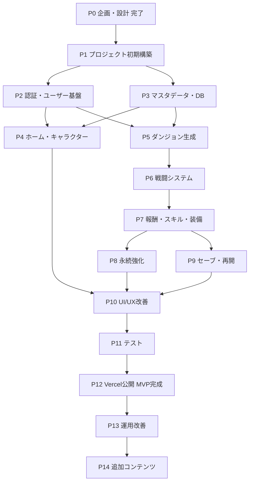

# 27. 開発ロードマップ・リスク管理 — Rogue Chronicle

## 目的

本書は Rogue Chronicle の開発フェーズ（Phase 0〜14）の内容・依存関係・完了条件・工数目安と、プロジェクトリスク（RISK-001〜016）の管理表を定義する。個人開発・週末稼働を前提に「MVP完成 = Phase 12 終了（Vercel正式公開）」をゴールとし、各フェーズ終了時点で必ず「動くもの」が残る計画とする。

## 関連文書

- CORE_SPEC（設計共通仕様。MVP範囲 §11・技術スタック §10 に完全準拠）
- 26_Release_Plan.md（Phase 12 の実施手順）
- 25_GitHub_Operation.md（ブランチ戦略・CI。Phase 1 で構築）
- 21_Test_Design.md（Phase 11 のテスト内容）
- 28_Open_Issues.md（ISSUE管理）

---

## 1. フェーズ一覧

工数の単位は「週末」= 土日合計 約10〜12時間。

| Phase | 名称 | 目的の要約 | 優先度 | 目安工数 | 主な依存 |
|---|---|---|---|---|---|
| P0 | 企画・設計 | docs/00〜29 の設計書一式（**完了扱い**） | 高 | 完了 | — |
| P1 | プロジェクト初期構築 | リポジトリ・CI・雛形・CD疎通 | 高 | 1週末 | P0 |
| P2 | 認証・ユーザー基盤 | ゲスト/登録/ログイン/セッション | 高 | 3週末 | P1 |
| P3 | マスタデータ・DB | 全テーブル・シード・マスタ投入 | 高 | 2週末 | P1 |
| P4 | ホーム・キャラクター | ホーム/キャラ一覧・詳細/解放 | 高 | 2週末 | P2, P3 |
| P5 | ダンジョン生成 | ノードマップ生成・ラン開始・ノード選択 | 高 | 3週末 | P3 |
| P6 | 戦闘システム | ターン制戦闘・敵AI・状態異常 | 高 | 4週末 | P5 |
| P7 | 報酬・スキル・装備 | 報酬抽選・スキル3択・装備・レリック・イベント | 高 | 3週末 | P6 |
| P8 | 永続強化 | ソウルシャード・強化ツリー・実績・図鑑 | 高 | 1週末 | P7 |
| P9 | セーブ・再開 | 途中保存・再開・スナップショット・冪等性 | 高 | 2週末 | P7 |
| P10 | UI/UX改善 | レスポンシブ調整・演出・エラー画面 | 中 | 2週末 | P4〜P9 |
| P11 | テスト | 単体/結合/E2E整備・バランス調整 | 高 | 3週末 | P10 |
| P12 | Vercel公開 | 本番構築・α→β→正式公開（**MVP完成**） | 高 | 2週末 | P11 |
| P13 | 運用改善 | 監視・コスト・フィードバック反映 | 中 | 継続 | P12 |
| P14 | 追加コンテンツ | 将来機能（新ダンジョン・キャラ等） | 低 | 継続 | P13 |

## 2. フェーズ依存関係図

- P2 と P3 は並行可能（P1完了後）。P4 と P5 も並行可能。直列クリティカルパスは P1→P3→P5→P6→P7→P9→P10→P11→P12。

## 3. 合計期間の見積もり

- 合計工数: P1〜P12 で **28週末**（§1 の合計）。
- 稼働前提: 月4週末のうち実稼働3〜4週末（家庭・仕事都合で月1週末は潰れる想定）。平日夜は設計読み返し・小修正のみで工数に算入しない。
- 標準ケース: 28週末 ÷ 3.5週末/月 = **8ヶ月**。
- 楽観ケース（月4週末＋P2/P3・P4/P5の並行が効く）: **6ヶ月**。
- 悲観ケース（RISK-003 戦闘バランス長期化等で+30%）: **9〜10ヶ月**。
- 結論: **MVP完成（Phase 12 終了）まで 6〜9ヶ月** を計画値とし、9ヶ月超過が見えた時点で MVP範囲の再削減（RISK-002 の発生時対応）を発動する（仮決定 DEC-270）。

---

## 4. フェーズ詳細

### Phase 0: 企画・設計（完了扱い）

- **目的**: 実装前に仕様の単一情報源（CORE_SPEC + docs/00〜29）を確立する。
- **実装内容**:
  - 企画・要件定義（00〜04）
  - ゲーム仕様（05, 16〜19: 戦闘式・敵AI・ダンジョン生成・スキル20/レリック10/武器10）
  - 画面設計（06〜09: SCR-001〜407）
  - システム/DB/API設計（10〜15: テーブル一覧・API-001〜604・run_state JSONB）
  - 運用設計（20〜29: テスト・セキュリティ・ログ・GitHub運用・リリース計画）
- **成果物**: docs/ 配下の設計書一式、CORE_SPEC
- **前提条件**: なし
- **完了条件**: 全設計書がCORE_SPECと矛盾なく揃っている（**達成済み**）
- **テスト内容**: 設計書間のID整合レビュー（SCR/API/テーブル名）
- **リスク**: RISK-001（設計に安住し実装が始まらない）
- **優先度**: 高 / **依存関係**: なし / **目安工数**: 完了

### Phase 1: プロジェクト初期構築

- **目的**: 「git push すれば Preview に出る」開発ループを最初に確立する。
- **実装内容**:
  - リポジトリ作成・ブランチ保護・develop作成（25章 §1, §11）
  - Next.js (App Router) + TypeScript strict + Tailwind + shadcn/ui の雛形作成（CORE_SPEC §10）
  - ESLint / Prettier / Vitest / Playwright の設定と `ci.yml`（lint→typecheck→test→build）
  - Prisma 導入と空スキーマ・`DATABASE_URL`/`DIRECT_URL` の設定
  - Neonプロジェクト作成・main/developブランチ（26章 §2）
  - Vercelプロジェクト作成・Git連携・環境変数登録（26章 §3）
  - src/ レイヤ構成の骨組み（app / domain / server / features、CORE_SPEC §9）
  - ヘルスチェックAPIとプレースホルダのタイトル画面（SCR-002 仮）
- **成果物**: CIが回るリポジトリ、Preview/Production 双方に「Hello Rogue Chronicle」がデプロイされた状態
- **前提条件**: P0完了、GitHub/Vercel/Neonアカウント
- **完了条件**: feature→develop のPRでCI green + Preview URL表示、main マージで本番URL表示、Neon疎通（Prisma接続）確認
- **テスト内容**: CIパイプラインの空テスト1件通過、curl でヘルスチェック200
- **リスク**: RISK-011（Vercel設定ミス）、環境変数スコープ誤設定
- **優先度**: 高 / **依存関係**: P0 / **目安工数**: 1週末

### Phase 2: 認証・ユーザー基盤

- **目的**: ゲスト開始と登録/ログインを完成させ、以降の全機能の前提となる「ユーザー」を成立させる。
- **実装内容**:
  - users / user_profiles / user_settings / auth_sessions テーブルのマイグレーション
  - Auth.js (NextAuth v5) 設定: JWTセッションCookie、アクセストークン24h・最大30日（CORE_SPEC §12）
  - API-001 登録 / API-002 ログイン / API-003 ログアウト / API-004 自分の情報取得
  - API-005 ゲスト開始（users.is_guest）/ API-006 ゲスト引き継ぎ / API-008 退会
  - SCR-002 タイトル / SCR-003 ログイン / SCR-004 新規登録 / SCR-005 ゲスト開始 / SCR-006 引き継ぎ
  - レート制限（認証系 5回/分/IP）と ログイン5回失敗→15分ロック（ERR_AUTH_LOCKED）
  - Zodスキーマ（schemas/）とエラー共通形式 `{ errorCode, message, details, traceId, timestamp }`
  - SCR-007 利用規約 / SCR-008 プライバシーポリシー（静的ページ・文面ドラフト）
- **成果物**: ゲスト開始→ホーム仮画面到達、登録→ログイン→ログアウトの一連動作
- **前提条件**: P1（DB疎通・デプロイ）
- **完了条件**: E2Eで「ゲスト開始」「登録→ログイン」「ゲスト→正式引き継ぎ」が Preview で通る。レート制限とロックが実際に429/423を返す
- **テスト内容**: 認証ユースケースの単体テスト、不正入力のZod検証テスト、セッション期限切れの401テスト
- **リスク**: RISK-006（認証周りの脆弱性）、Auth.js v5仕様変更
- **優先度**: 高 / **依存関係**: P1 / **目安工数**: 3週末

### Phase 3: マスタデータ・DB

- **目的**: 全マスタテーブルとシードを整備し、ゲームロジックが参照するデータ基盤を完成させる。
- **実装内容**:
  - マスタ17テーブルのマイグレーション: characters, equipment, skills, skill_effects, relics, enemies, enemy_actions, enemy_ai_rules, dungeons, dungeon_difficulties, dungeon_node_types, random_events, random_event_choices, reward_tables, upgrade_nodes, achievements, stories, master_data_versions
  - ユーザー永続テーブル: player_progress, player_currencies, player_characters, player_equipment, player_upgrades, player_codex, player_achievements, player_story_progress, currency_transactions
  - ラン系: dungeon_runs（run_state JSONB + version + seed + status）, dungeon_run_snapshots, battle_logs
  - 運用系: announcements, maintenance_settings, audit_logs
  - シードスクリプト: キャラ3体（swordsman_rain / mage_lilia / rogue_gald）、敵8体（slime〜ruin_guardian）、スキル20・レリック10・武器10、ダンジョン `forgotten_ruins`、永続強化12ノード、実績10個、イベント10件
  - master_data_versions によるマスタ版管理と `pnpm db:seed` の冪等化（upsert）
  - シード値のZod検証スクリプト（型・参照整合をCIでチェック）
- **成果物**: `prisma migrate dev` + `db:seed` で全マスタ投入済みDB
- **前提条件**: P1
- **完了条件**: シードが冪等に再実行でき、CIでシード検証green。Prisma Studio で全マスタ件数が設計書（18章等）と一致
- **テスト内容**: シード整合テスト（skills⇔skill_effects の参照、enemiesのcode重複なし）、マイグレーションの up→リセット→up 再現性
- **リスク**: RISK-004（DB構造複雑化）、RISK-009（マスタ管理困難化）
- **優先度**: 高 / **依存関係**: P1 / **目安工数**: 2週末

### Phase 4: ホーム・キャラクター

- **目的**: ログイン後の拠点体験（ホーム→キャラ確認→解放）を完成させる。
- **実装内容**:
  - API-101 ホーム情報 / API-102 プレイヤー情報 / API-103 所持通貨 / API-104 お知らせ
  - API-201 キャラ一覧 / API-202 キャラ詳細 / API-203 キャラ解放（ソウルシャード消費・currency_transactions記録）
  - SCR-101 ホーム / SCR-102 プロフィール / SCR-104 キャラ一覧 / SCR-105 キャラ詳細
  - SCR-115 お知らせ / SCR-116 設定（API-602/603, user_settings）/ SCR-117 ヘルプ / SCR-118 クレジット
  - TanStack Query のクエリ設計（キャッシュキー規約）と Zustand ストア初期化
  - ダークファンタジーテーマ（DEC-015）の基本トークン（色・タイポ）適用
- **成果物**: ゲスト開始→ホーム→キャラ解放（リリア）まで実データで動く
- **前提条件**: P2（認証）、P3（characters / player_currencies）
- **完了条件**: キャラ解放でソウルシャードが減り currency_transactions に記録される。未所持キャラの解放条件表示がマスタ駆動
- **テスト内容**: 解放API の残高不足（ERR_INSUFFICIENT_SHARDS 422）・二重解放（409）テスト、ホームAPIのN+1確認
- **リスク**: RISK-007（スマホUI視認性）
- **優先度**: 高 / **依存関係**: P2, P3 / **目安工数**: 2週末

### Phase 5: ダンジョン生成

- **目的**: シード付きPRNGによるノードマップ生成とラン開始・ノード移動を完成させる。
- **実装内容**:
  - domain/dungeon: generateDungeonSeed / generateDungeonMap / selectNextNode（mulberry32相当PRNG、DEC-019）
  - 生成制御の実装: 階層1〜10・ノード数2〜4・階層5と9にREST必須・SHOP1〜2・ELITE階層3以降・同一タイプ3連続禁止・SECRET10%（CORE_SPEC §5.6）
  - API-301 ダンジョン一覧 / API-302 ダンジョン詳細 / API-303 ラン開始（run_state初期化・ERR_RUN_ALREADY_ACTIVE）
  - API-304 現在ラン取得 / API-305 次ノード選択（phase遷移: map_select→node_action）
  - SCR-201 ダンジョン一覧 / SCR-202 詳細 / SCR-204 キャラ選択 / SCR-205 初期装備選択 / SCR-207 出撃確認
  - SCR-301 ダンジョンマップ（列グラフ描画・到達可能ノードのハイライト）
  - Idempotency-Key + run_state.version 楽観ロックの共通ミドルウェア（ラン系変更API全体の土台）
  - 非戦闘ノードの仮実装（TREASURE等は「通過のみ」のスタブ）
- **成果物**: ラン開始→マップ表示→ノード選択で階層10まで移動できる（戦闘はスタブ勝利）
- **前提条件**: P3（dungeons, dungeon_runs）、P2（認証必須API）
- **完了条件**: 同一seedで同一マップが再生成される（再現性テスト）。生成1,000回で制約違反0件。二重リクエストが ERR_DUPLICATE_REQUEST で弾かれる
- **テスト内容**: 生成制約のプロパティテスト（全パスがボス到達可能）、楽観ロック競合（ERR_CONFLICT_VERSION 409）テスト
- **リスク**: RISK-004、生成アルゴリズムの複雑化
- **優先度**: 高 / **依存関係**: P3（P2） / **目安工数**: 3週末

### Phase 6: 戦闘システム

- **目的**: サーバー権威のターン制戦闘（DEC-007）をゲームの核として完成させる。
- **実装内容**:
  - domain/battle: startBattle / determineTurnOrder / calculateDamage / calculateCritical / calculateEvasion / checkBattleEnd（CORE_SPEC §5.4 の式をそのまま実装）
  - 属性相性（火→風→水→火、1.25/0.75）・状態異常5種（poison/burn/paralysis/stun/weaken）・バフデバフ（同種上書き）
  - domain/enemy: selectEnemyAction / executeEnemyAction（重み付き行動テーブル+条件ルール、行動予告intent）
  - 敵8体の行動テーブル・AIルール実装（orc_championの2ターン強撃、dark_shamanの召喚、ruin_guardianの3フェーズ）
  - API-401 戦闘状態取得 / API-402 行動実行（攻撃/スキル/防御/アイテム/逃走。応答に戦闘終了・報酬・獲得EXPを含める）
  - API-305 経由の戦闘開始（戦闘ノード進入でサーバーが battle 状態を run_state に生成。独立した戦闘開始APIは作らない）
  - SCR-302 戦闘画面（行動選択UI・HP/SPバー・intent表示・ログ）/ SCR-311 ステータス確認
  - battle_logs への戦闘ログ書き込み（保持30日）と rngCursor の永続化
  - 獲得EXP・レベルアップ（expToNext(L) = floor(20 × L^1.5)、上限20、成長率係数）
- **成果物**: 通常戦闘〜ボス戦まで実データで勝敗がつく。敗北でランがfailedになる
- **前提条件**: P5（ノード進入・run_state）
- **完了条件**: 計算式の単体テストが設計値と一致（境界: def逓減・クリ上限・命中clamp 50〜100・逃走clamp 20〜90）。同一seed+同一行動列で戦闘結果が再現。ボス3フェーズ遷移が仕様どおり
- **テスト内容**: ダメージ式のテーブル駆動テスト、敵AI選択の分布テスト、逃走不可（ボス/エリート）テスト、API-402 の不正行動（ERR_INVALID_ACTION 422）
- **リスク**: RISK-003（バランス調整長期化）、RISK-008（演出との切り分け）
- **優先度**: 高 / **依存関係**: P5 / **目安工数**: 4週末

### Phase 7: 報酬・スキル・装備

- **目的**: 戦闘の外周ループ（報酬・成長・買い物・イベント）を完成させ、1ランの体験を成立させる。
- **実装内容**:
  - domain/reward: calculateBattleReward / generateTreasureReward / generateShopItems（reward_tables駆動）
  - スキル3択: API-501 候補取得 / API-502 選択（レア度重み common60/rare30/epic10、リロール1回、強化Lv最大3、所持上限8）→ SCR-303 / SCR-304
  - 宝箱: API-503 → SCR-305 / ショップ: API-504（ERR_INSUFFICIENT_GOLD）→ SCR-306
  - 休憩: API-505（HP50%回復 or スキル強化の二択）→ SCR-307
  - イベント: API-506（random_events / random_event_choices 10件、BLESS/HEAL/CURSE/STORY/SECRET含む）→ SCR-308
  - 装備: API-507（weapon/armor/accessory 各1枠）→ SCR-309 / レリック: API-508（重複不可・呪い2種）→ SCR-310 / SCR-312 所持品確認
  - pendingReward の受領管理（ERR_REWARD_ALREADY_CLAIMED、リロード復帰対応）
  - リザルト: API-306 リタイア / API-307 finalize（クリア100%/リタイア80%/敗北50%、ランクEXP付与）→ SCR-401/402/403/404 / SCR-314 リタイア確認
- **成果物**: ラン開始→10階層→ボス撃破→リザルト→ソウルシャード獲得の**フルゲームループ**
- **前提条件**: P6
- **完了条件**: 1ランをクリア・敗北・リタイアの3パターンで完走でき、player_currencies / player_progress / currency_transactions が正しく更新される。finalize の二重実行が409
- **テスト内容**: 報酬抽選の分布テスト（seed固定）、スキル3択の重み・重複規則テスト、finalize冪等性テスト
- **リスク**: RISK-001（イベント・レリックの仕様肥大）
- **優先度**: 高 / **依存関係**: P6 / **目安工数**: 3週末

### Phase 8: 永続強化

- **目的**: ラン間のメタ進行（永続強化・実績・図鑑）でリプレイ動機を完成させる。
- **実装内容**:
  - API-204 永続強化実行（upgrade_nodes 12ノード、前提ノード検証、総和+30%以内のバランス制約）→ SCR-106
  - 永続強化のラン開始時適用（API-303 の初期ステータス計算に反映）
  - API-106 実績取得 / 実績判定（累計ラン10回でガルド解放等、10個）→ SCR-111 / SCR-407 トースト
  - API-601 図鑑取得（player_codex, entry_type 統合 DEC-018）→ SCR-108/109/110 図鑑・SCR-107 武器一覧
  - プレイヤーランク: expToRank(R) = 100 × R^1.8、上限50 → SCR-406 ランクアップ演出 / SCR-405 新規解放
  - 図鑑の自動登録（初遭遇・初取得時に run 中で記録し finalize で確定）
- **成果物**: 敗北しても強くなって再挑戦するローグライトのコアループ完成
- **前提条件**: P7（ソウルシャード獲得）
- **完了条件**: 永続強化purchase→次ランの初期値に反映をE2Eで確認。実績10個が全て解除可能。図鑑がラン結果から自動更新される
- **テスト内容**: 強化ツリー前提条件・残高テスト、実績判定の境界テスト（10回目のランで解放）
- **リスク**: RISK-003（メタ進行を含めたバランス）
- **優先度**: 高 / **依存関係**: P7 / **目安工数**: 1週末

### Phase 9: セーブ・再開

- **目的**: 「いつ切断しても続きから遊べる」を保証する（スマホブラウザ前提の生命線）。
- **実装内容**:
  - saveRunProgress / resumeDungeonRun / validateRunState の本実装（各変更APIでの run_state 保存を体系化）
  - dungeon_run_snapshots のチェックポイント世代管理（直近3世代、階層開始時に作成）
  - API-304 / API-604 の再開フロー: phase（map_select / node_action / battle / reward_pending）ごとの正しい画面復帰
  - 戦闘途中再開（battle.rngCursor / actionQueue からの復元）
  - run_state の schemaVersion 検証と破損時のスナップショット復旧（validateRunState 失敗→1世代前へ）
  - SCR-313 一時停止画面、ホームの「冒険を再開する」導線（SCR-101）
  - 楽観ロック（version）と Idempotency-Key の全ラン系APIへの適用漏れ監査
- **成果物**: 任意のタイミングでブラウザを閉じても同一状態に復帰できるラン
- **前提条件**: P7（全ノードタイプの状態が出揃う）
- **完了条件**: 全phase（マップ/戦闘中/報酬未受領/レベルアップ3択中）で中断→再開が成功。破損run_stateがスナップショットから復旧する
- **テスト内容**: phase網羅の再開E2E、snapshot世代ローテーションテスト、二重タブ操作での version 競合テスト
- **リスク**: RISK-005（セーブデータ破損）
- **優先度**: 高 / **依存関係**: P7 / **目安工数**: 2週末

### Phase 10: UI/UX改善

- **目的**: 「動く」を「遊べる・気持ちいい」に引き上げる（機能追加はしない）。
- **実装内容**:
  - スマホ実機（iOS Safari / Android Chrome）での全MVP画面のレイアウト調整（タップ領域44px・セーフエリア）
  - Framer Motion + CSS Animation による戦闘演出（ダメージ数字・被弾シェイク・状態異常アイコン。DEC-009 の範囲厳守）
  - 画面遷移アニメーション・ローディングスケルトン（TanStack Query の pending 状態）
  - SCR-001 スプラッシュ / SCR-009 メンテナンス / SCR-010 通信エラー（リトライ導線）の仕上げ
  - エラーハンドリングの統一（ERR_CONFLICT_VERSION→再取得、ERR_RATE_LIMITED→待機表示）
  - Lighthouse Mobile 計測と改善（画像最適化・フォントサブセット・バンドル分割で 80+）
  - チュートリアル最小実装（初回ラン時のコーチマーク。LocalStorage フラグ）
- **成果物**: 詳細ワイヤーフレーム13画面（CORE_SPEC §6）が実機で快適に操作できる状態
- **前提条件**: P4〜P9（全機能が揃っている）
- **完了条件**: Lighthouse Mobile 80+（SCR-002/101/302）、実機2機種で横スクロール・文字潰れなし、主要操作の応答1秒以内
- **テスト内容**: ビジュアルリグレッション（Playwright スクリーンショット比較）、低速回線（4Gスロットリング）での初期表示3秒以内
- **リスク**: RISK-007、RISK-008（演出に時間を溶かす）
- **優先度**: 中 / **依存関係**: P4〜P9 / **目安工数**: 2週末

### Phase 11: テスト

- **目的**: リリース判定基準（26章 §4）を満たすテスト網を完成させ、バランスを出荷品質にする。
- **実装内容**:
  - 21_Test_Design.md の TC-NNN を実装に落とす（domain層の単体テスト網羅を最優先）
  - E2E主要3フローの安定化（26章 §4 #2 と同一定義）と e2e-nightly.yml の有効化（25章 §6.4）
  - 戦闘バランス調整: シミュレータスクリプト（1,000ラン自動プレイ）で階層別勝率・クリア率を計測し、目標帯（初見クリア率5〜15%、10ラン後30〜50%）へマスタ調整
  - セキュリティテスト: 22章チェックリスト（ヘッダ・レート制限・Zod網羅・IDOR・サーバー権威バイパス試行）
  - 負荷の簡易確認: 戦闘API p95 800ms以内・他API p95 500ms以内（CORE_SPEC §12）を Preview で計測
  - 既知バグのトリアージ・修正（クリティカル/メジャー0件化）
- **成果物**: CI green の全TC、バランスレポート、セキュリティチェック記録
- **前提条件**: P10
- **完了条件**: 26章 §4 チェックリストの #1〜#4 を満たす。シミュレータのクリア率が目標帯に収束
- **テスト内容**: 本フェーズ自体がテスト。テストコードのフレーク率（3回連続実行で不安定テスト0）も確認
- **リスク**: RISK-016（テスト不足のまま公開）、RISK-003
- **優先度**: 高 / **依存関係**: P10 / **目安工数**: 3週末

### Phase 12: Vercel公開（MVP完成）

- **目的**: 26_Release_Plan.md に従い本番公開し、MVPを完成させる。
- **実装内容**:
  - リリース判定チェックリスト全項目の最終確認（26章 §4。規約掲載・バックアップリストア訓練含む）
  - メンテナンスモード（maintenance_settings→503+SCR-009）と運用スクリプト（maintenance.ts / force-retire.ts）の動作確認
  - UptimeRobot 監視設定・障害対応手順書（26章 §8）の机上演習1回
  - α公開（自分のみ、2〜4週間、10ラン完走）→ 判定 → β公開（知人5〜10名、フィードバックフォーム設置）
  - βフィードバックの Issue 化と修正リリース（develop→main を週次）
  - 正式公開: noindex解除・SNS告知・`v1.0.0` タグ・README整備
- **成果物**: 一般公開された Rogue Chronicle v1.0.0（**MVP完成**）
- **前提条件**: P11（判定基準 #1〜#4 達成）
- **完了条件**: 26章 §7 の段階判定を全て通過し正式公開済み。スモークテスト5項目が本番で通過
- **テスト内容**: 本番スモークテスト5項目（ゲスト開始/ラン開始/戦闘1ターン/保存再開/リザルト）、ロールバック演習1回（Instant Rollback を実際に実行して戻す）
- **リスク**: RISK-010（公開後の変更が既存データを壊す）、RISK-012〜014（本番負荷系）
- **優先度**: 高 / **依存関係**: P11 / **目安工数**: 2週末（+α/β経過期間4〜12週間はカレンダー時間として並行）

### Phase 13: 運用改善

- **目的**: 公開後の安定運用と改善サイクルの確立。
- **実装内容**:
  - Vercel/Neon Usage の週次確認ルーティン（26章 §9.2 の閾値監視）
  - battle_logs 30日削除・snapshot世代削除の定期ジョブ（Vercel Cron）
  - βで先送りした不具合・UX改善のバックログ消化（週次 develop→main）
  - Sentry 導入検討（DEC-020 の「将来」条件: エラー調査がVercelログで回らなくなった時）
  - Neon Vercel Integration（PRごとDBブランチ、ISSUE-261）の導入判断
  - プレイデータ分析（クリア率・離脱階層）に基づくバランスパッチ
- **成果物**: 運用ダッシュボード的な週次記録、月次バランスパッチ
- **前提条件**: P12
- **完了条件**: （継続フェーズ）月間稼働率99.5%（CORE_SPEC §12）を3ヶ月維持、コスト0円維持または計画的有料化
- **テスト内容**: 定期ジョブの実行結果監視、リストア訓練の四半期実施
- **リスク**: RISK-014（DBコスト増）、RISK-015（ログ肥大化）
- **優先度**: 中 / **依存関係**: P12 / **目安工数**: 継続（月0.5週末程度）

### Phase 14: 追加コンテンツ

- **目的**: MVP除外機能（CORE_SPEC §11「除外」）から需要の高いものを段階投入する。
- **実装内容**（優先順の候補。着手前に個別に企画Issue化）:
  - 難易度 Hard 1.3 / Nightmare 1.6（dungeon_difficulties は実装済み土台を活用）
  - ダンジョン2種目・敵追加・スキル/レリック拡充
  - パスワード再設定（API-007、メール基盤導入とセット）
  - Google/GitHubログイン（DEC-006 の将来分）
  - ミッション（missions / player_missions, SCR-112）・デイリー要素
  - 光/闇属性・パーティ制（DEC-012 解除）の検討
  - PWA対応（オフライン表示・ホーム追加）
- **成果物**: 四半期ごとのコンテンツアップデート
- **前提条件**: P13（運用が安定していること）
- **完了条件**: （継続フェーズ）機能ごとに個別定義
- **テスト内容**: 追加ごとに P11 相当の回帰テスト＋既存セーブ互換テスト（RISK-010 対策）
- **リスク**: RISK-001（肥大化の再発）、RISK-010
- **優先度**: 低 / **依存関係**: P13 / **目安工数**: 継続

---

## 5. リスク管理表（RISK-001〜016）

| ID | リスク | 発生確率 | 影響度 | 対策（予防） | 対策（発生時） | 検知方法 |
|---|---|---|---|---|---|---|
| RISK-001 | 仕様肥大化（実装中に機能を足し続ける） | 高 | 高 | CORE_SPEC §11 のMVP範囲を凍結。新アイデアは即 Issue 化して Phase 14 バックログへ送り、現フェーズには入れない | 追加分を Issue に切り出して除去し、フェーズ完了条件を元に戻す | フェーズ工数が見積の1.5倍超過 / PRに設計書にない画面・APIが出現 |
| RISK-002 | 個人開発で完成しない（中断・挫折） | 高 | 高 | (1)フェーズ分割: 各Phaseを1〜4週末で完了する粒度に固定し、**Phase終了ごとに必ずPreviewで動くもの**を残す（P1で先にデプロイループを作るのはこのため）。(2)MVP厳守: DEC-016等の除外決定を再交渉しない。(3)動くものを維持: developは常にデプロイ可能に保ち、週末の最後は必ずgreenで終える。(4)クリティカルパス（P5→P6→P7）を最優先し、P10の演出等は後回し可能と割り切る | 9ヶ月超過が見えた時点でMVP再削減（候補: 実績・図鑑の簡略化、イベント10→5件、装備の防具/アクセ削減）。2ヶ月完全停止したら「最小再開タスク（1時間で終わるもの）」から復帰する | 月次で消化週末数を記録し、2ヶ月連続で計画の50%未満 |
| RISK-003 | 戦闘バランス調整が長期化 | 高 | 中 | 計算式・係数をマスタデータ駆動にしコード変更なしで調整可能にする。P11で1,000ラン自動シミュレータを先に作り、手動プレイだけに頼らない | 調整範囲を「クリア率目標帯」の1指標に絞り、細部（スキル個別の強弱）はβフィードバックと Phase 13 のパッチへ先送り | シミュレータのクリア率が2週末調整しても目標帯（5〜15%）に入らない |
| RISK-004 | DB構造の複雑化・手戻り | 中 | 高 | CORE_SPEC §8 の統合方針（run_state JSONB集約、equipment統合等）を厳守しテーブルを増やさない。マイグレーションは3段階後方互換ルール（26章 §5.2） | スキーマ変更はマイグレーション+シード+テストを1PRで完結させ、影響APIを全回帰 | migrate の diff レビューで設計書にないテーブル・列を検出 |
| RISK-005 | セーブデータ（run_state）破損 | 中 | 高 | schemaVersion + validateRunState を全書き込み経路に適用。dungeon_run_snapshots 直近3世代。楽観ロックで二重書き込み防止 | validateRunState 失敗時は1世代前スナップショットへ自動復旧。復旧不能なら §6.3（26章）の補償付き強制リタイア | validateRunState 失敗ログ（traceId付き）の発生、ユーザーからの「再開できない」報告 |
| RISK-006 | 不正操作（改竄・チート） | 中 | 中 | サーバー権威（DEC-007）: 計算・抽選・乱数は全てサーバー。Idempotency-Key・楽観ロック・Zod全入力検証・レート制限。クライアントは行動選択のみ送信 | 該当アカウントの currency_transactions / battle_logs / audit_logs を突合し不正値を巻き戻し。悪質ならアカウント凍結 | 統計外れ値（1ランのソウルシャード獲得が理論最大超え）、ERR_INVALID_ACTION の多発ユーザー |
| RISK-007 | スマホUIの視認性・操作性不良 | 中 | 中 | モバイルファーストで実装（PCは後から拡張）。タップ領域44px・文字14px以上をコンポーネント規約化。P4以降、毎フェーズ実機確認 | 問題画面をワイヤーフレーム13画面（CORE_SPEC §6）優先で個別改修。情報量を削る方向で解決（詰め込まない） | 実機スモーク時の横スクロール発生、βフィードバックの操作性指摘 |
| RISK-008 | 演出実装の長期化 | 中 | 中 | DEC-009 厳守: CSS Animation + Framer Motion のみ。Canvas系導入禁止。演出はP10に隔離し、P6〜P9では最小表示（テキストログ+数値）で先へ進む | 演出タスクをβ後（Phase 13）へ先送り。1演出あたり上限2時間のタイムボックス | P10 の工数が2週末を超過 |
| RISK-009 | マスタデータ管理の困難化 | 中 | 中 | シード一元管理+upsert冪等化+CIでのZod整合検証（P3）。master_data_versions で版管理。手動SQL投入禁止 | マスタ全体をシードから再投入（冪等なので安全）。差分が追えなくなったらシードをTS型付きデータに再編 | シード検証CIの失敗、本番と設計書のマスタ件数不一致 |
| RISK-010 | リリース後の変更が既存ユーザーデータを破壊 | 中 | 高 | DBは3段階後方互換ルール（26章 §5.2）。run_state は schemaVersion + 読み込み時変換関数。リリース前に本番相当データ（Neon developへ本番コピー）で回帰 | Instant Rollback（アプリ）+ 変換関数の修正リリース。復旧不能ランは補償付き強制リタイア（26章 §6.3） | デプロイ直後の ERR_RUN_STATE_INVALID / validateRunState エラー率上昇 |
| RISK-011 | Vercel制約（関数実行時間・コールドスタート） | 中 | 中 | APIタイムアウト10s以内設計（CORE_SPEC §12）。重い処理（マップ生成・戦闘解決）はO(1)リクエストで完結させ、バッチ処理を持たない。バンドル削減でコールドスタート短縮 | 遅いAPIを分割（例: finalize の図鑑更新を非同期化）。恒常的ならリージョン・ランタイム設定見直し、最終手段でPro移行 | Vercel Logs の実行時間 p95、504（ERR_TIMEOUT）発生率 |
| RISK-012 | サーバーレス制約（DBコネクション枯渇） | 中 | 高 | 必ず Neon pooler（DATABASE_URL）経由で接続。Prisma のコネクション数を関数あたり1に制限。DIRECT_URL はmigrate専用 | 接続エラー多発時は pooler 設定（pool size）調整、TanStack Queryのキャッシュでリクエスト自体を削減 | Prisma の "too many connections" エラーログ、Neon ダッシュボードの接続数グラフ |
| RISK-013 | API呼び出し回数の増加（設計より多い） | 中 | 中 | 画面単位の集約API（API-101 ホーム情報等）を守り、細粒度APIの連打を避ける。TanStack Query の staleTime 設定でポーリング・再取得を抑制 | 呼び出し上位APIを特定し集約・キャッシュ化。レート制限（60回/分/ユーザー）を下回る通常操作か確認 | Vercel の Function 呼び出し数 Usage、1画面あたりのリクエスト数計測（開発時） |
| RISK-014 | DBコスト増（Neon無料枠超過） | 低 | 中 | battle_logs 30日削除・snapshot直近3世代・run_state のスリム化（不要な履歴を持たない）。26章 §9.2 の閾値監視 | 26章 §9.2 の対応（削減→有料化判断）。緊急時は古い battle_logs の即時削除 | Neon Usage の週次確認（ストレージ0.4GB / compute 150h 警戒ライン） |
| RISK-015 | ログ肥大化（構造化ログの出しすぎ） | 低 | 低 | ログレベル規約（error/warn は必ず、info はAPI境界のみ、debug は本番無効。23章）。battle_logs はDB側で30日TTL | ログレベルを本番で引き上げ、冗長ログの出力箇所を削除 | Vercel Logs の流量目視、battle_logs 行数の週次確認 |
| RISK-016 | テスト不足（リグレッション多発・公開品質未達） | 中 | 高 | domain/ 層をNext.js/Prisma非依存の純関数に保ち単体テストを書きやすくする（CORE_SPEC §9）。CI required check でテストなしマージを物理的に禁止。P11 を独立フェーズとして確保 | 公開延期（26章 §4 は全項目必達で妥協しない）。頻出リグレッション箇所から優先的にTC追加 | CIカバレッジ（domain層80%目標）低下、β期間のクリティカル不具合再発 |

---

## 未決事項

| ID | 内容 | 期限目安 |
|---|---|---|
| ISSUE-271 | 戦闘バランスの目標帯（初見クリア率5〜15%、10ラン後30〜50%）は仮置き（仮決定 DEC-271）。βの実測で見直す | Phase 12（β） |
| ISSUE-272 | P11 の自動プレイシミュレータの行動方針（ランダム/貪欲/固定ビルド）の設計 | Phase 11 着手時 |
| ISSUE-273 | Phase 14 の着手優先順（難易度追加 vs ダンジョン2種目 vs ソーシャルログイン）。β・正式公開のフィードバックで決定 | Phase 13 |
| ISSUE-274 | 週次リリース（Phase 12 β期間）のリリース判定を毎回フル実施するか簡略版（スモーク+差分TC）にするか | Phase 12（β開始時） |
| ISSUE-275 | 効果音（MVP範囲で△）を P10 に含めるか Phase 14 送りにするか。工数超過時は自動的に送る | Phase 10 着手時 |

## 実装時の注意点

- 各Phaseの完了条件は「検証可能な形」で書いてある。曖昧に「だいたい動く」で次へ進まない。完了条件未達のまま次Phaseに進むと後続の完了条件が判定不能になる。
- P1 で必ず先にデプロイパイプラインを作ること。「ローカルで全部作ってから最後にデプロイ」は RISK-002 と RISK-011 を同時に踏む典型パターン。
- domain/ 層（純粋ロジック）と server/ 層（Prisma・認証）の分離を最初から守る。P6 の計算式テスト・P11 のシミュレータは domain 層が純関数であることに依存している。
- 楽観ロックと Idempotency-Key は P5 で共通ミドルウェアとして作り、以降のラン系APIは必ずそれに乗せる。API個別実装にすると適用漏れ（P9 で監査する対象）が生まれる。
- マスタ調整（バランス）とコード修正を同一PRに混ぜない。バランスパッチを「シード変更のみのPR」にできれば Phase 13 の運用が軽くなる。
- 工数見積は「週末=10〜12時間」の純作業時間。調査・環境トラブルは含まれるが、設計書の再執筆は含まない（P0成果物を信頼して実装する。矛盾を見つけたら設計書側を最小修正して Decision Log に記録）。
- Mermaid の依存図（§2）はフェーズ着手前に必ず見る。P2/P3、P4/P5 の並行は「片方が詰まったらもう片方を進める」ためのスイッチ先として使う。

## 関連設計書

- CORE_SPEC — MVP範囲（§11）・技術スタック（§10）・非機能目標（§12）・ID体系（§3）・モジュール構成（§9）
- 26_Release_Plan.md — Phase 12 の環境構築・リリース判定・段階公開・障害対応
- 25_GitHub_Operation.md — Phase 1 のリポジトリ/CI構築・Issue/PR運用・タグ
- 21_Test_Design.md — Phase 11 の TC 定義・E2Eフロー
- 22_Security_Design.md — Phase 2/11 のセキュリティ実装・チェックリスト
- 12_Database_Design.md — Phase 3 のテーブル定義・マイグレーション方針
- 15_Save_Data_Design.md — Phase 9 の run_state / スナップショット仕様
- 16_Battle_Design.md / 19_Enemy_AI_Design.md — Phase 6 の詳細仕様
- 17_Dungeon_Design.md — Phase 5 の生成仕様
- 18_Skill_Design.md — Phase 7 のスキル/レリック/装備マスタ
- 29_Decision_Log.md / 28_Open_Issues.md — DEC-270/271・ISSUE-271〜275 の登録先
